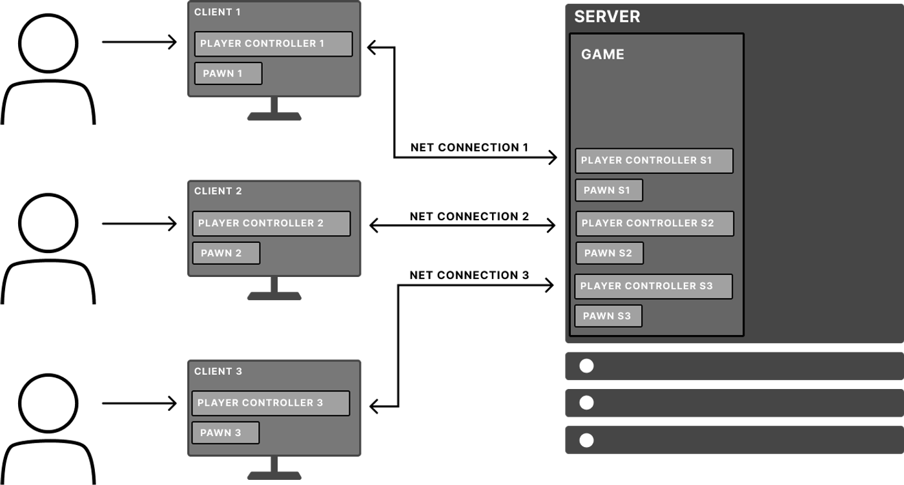

# Actor Owner and Owning Connection

> 路径：虚幻引擎5.7文档 / Gameplay系统 / 联网和多人游戏 / 编写多人游戏 / Actor Owner and Owning Connection

> 原始页面：https://dev.epicgames.com/documentation/unreal-engine/actor-owner-and-owning-connection-in-unreal-engine

该页面没有可用的官方中文版本；以下内容保留原文，并按本项目人工译文规则逐步回译。

Unreal Engine 中的对象存在多种父子关系。对于网络复制而言，两个重要关系是 Actor 的所有者，以及该所有者关联的拥有连接。

## 概述

Unreal Engine 的多人游戏采用服务器权威的客户端-服务器模型。在该模型中，客户端连接到集中式服务器。客户端连接到服务器时，服务器会创建一个与该客户端关联的 Player Controller（连接到服务器的客户端称为 *连接*）。当该客户端在服务器上开始游戏时，这个 Player Controller 会占有客户端在游戏中控制的 Pawn。Player Controller 是该 Pawn 的 *所有者* 。Actor 的 *拥有连接* 是与该 Actor 的拥有者 Player Controller 关联的连接。所有者和拥有连接会决定哪个已连接客户端有权限发起更改并调用远程函数。

每个 `AActor` 派生对象都会存储指向其所有者的指针。并不是每个 `AActor` 派生对象都有所有者。Actor 的所有者可以为空；在这种情况下，该 Actor 没有所有者。

### 拥有连接的用途

连接所有权对以下内容很重要：

- Actor 复制
- 属性复制
- RPC

Actor 复制期间会使用 Actor 的拥有连接来确定哪些连接会收到该 Actor 的更新，这称为 [Actor 相关性](../actor-relevancy/index.md)。对于将 [bOnlyRelevantToOwner](https://dev.epicgames.com/documentation/unreal-engine/API/Runtime/Engine/GameFramework/AActor/bOnlyRelevantToOwner?application_version=5.5) 设置为 true 的 Actor，只有拥有该 Actor 的连接会收到该 Actor 的属性更新。默认情况下，所有 Player Controller 都只与其所有者相关。这就是每个客户端只会收到自身 Player Controller 更新的原因。

当属性复制涉及使用所有者的条件时，也会用到 Actor 的拥有连接。关于 Actor 所有者如何影响属性复制的更多信息，请参阅 [条件复制](../replicate-actor-properties/index.md)。

Actor 的拥有连接对于 RPC 也很重要。当服务器在某个 Actor 上调用客户端 RPC 函数时，除非该 RPC 被标记为 `NetMulticast`，否则 RPC 需要知道应该在哪些连接上执行。Actor 的拥有连接决定 RPC 会发送到并执行于哪些连接。

## 确定所有者与拥有连接

连接到中心服务器的客户端示意图，显示 Pawn、拥有它们的 Player Controller 以及拥有连接。

假设你正在作为客户端连接到服务器并游玩多人游戏。你本机上的 Player Controller 是你作为玩家的抽象表示。在上方示例中：

- 如果你在 Client 1 上游玩，你的输入会由 Player Controller 1 处理，并传递给 Pawn 1。
- 如前所述，当你的客户端机器连接到服务器时，会建立 Net Connection 1，并在服务器上创建与你的连接关联的 Player Controller S1。
- 服务器上的 Pawn Actor，即 Pawn S1，会被 Player Controller S1 占有。这意味着 Player Controller S1 拥有 Pawn S1。Pawn S1 的拥有连接是 Net Connection 1，也就是 Player Controller S1 的拥有连接。
- 只有在 Pawn S1 同时被 Player Controller S1 拥有或占有期间，它才由该连接拥有。一旦 Player Controller S1 不再占有 Pawn S1，Net Connection 1 就不再是 Pawn S1 的拥有连接。

同样的逻辑也适用于可能属于游戏内角色 Pawn 的物品栏物品。物品栏物品由可能拥有该 Pawn 的同一个连接拥有。

Actor 组件以类似方式确定所有权，但需要额外步骤。对于 Actor 组件，必须先沿着组件的 outer 链向外查找，直到找到拥有该组件的 Actor。然后可以按照上面的流程，确定该组件所属 Actor 的拥有连接。

### 所有者

要确定 Actor 的所有者，需要查询该 Actor 最外层的所有者。如果最外层所有者是 Player Controller，那么原始 Actor 的拥有连接就与该 Player Controller 的拥有连接相同。

要获取 Actor 的所有者，请调用 [AActor::GetOwner](https://dev.epicgames.com/documentation/unreal-engine/API/Runtime/Engine/GameFramework/AActor/GetOwner?application_version=5.5)。

要获取 Actor 组件所属的 Actor，请调用 [UActorComponent::GetOwner](https://dev.epicgames.com/documentation/unreal-engine/API/Runtime/Engine/Components/UActorComponent/GetOwner?application_version=5.5)。

### 拥有连接

要获取 Actor 的拥有连接，请调用 [AActor::GetNetConnection](https://dev.epicgames.com/documentation/unreal-engine/API/Runtime/Engine/GameFramework/AActor/GetNetConnection?application_version=5.5)。
