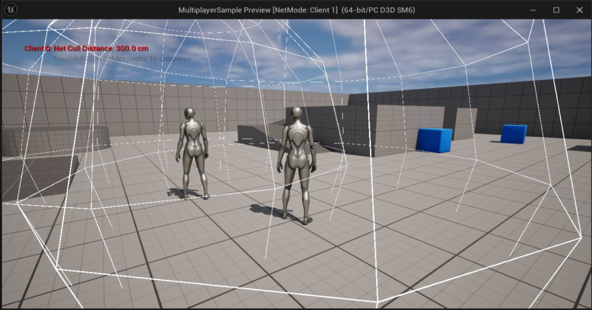
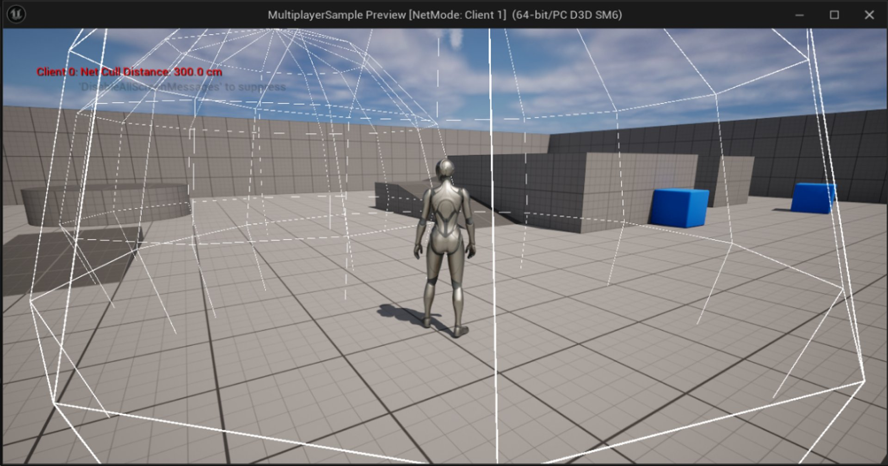
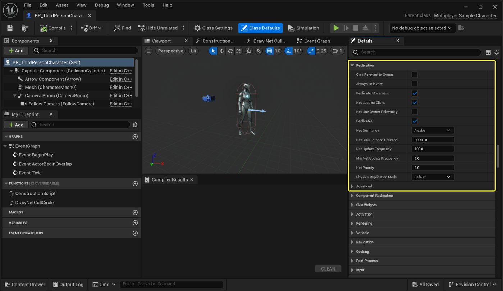

# Actor Relevancy

> 路径：虚幻引擎5.7文档 / Gameplay系统 / 联网和多人游戏 / 编写多人游戏 / Actor Relevancy

> 原始页面：https://dev.epicgames.com/documentation/unreal-engine/actor-relevancy-in-unreal-engine

该页面没有可用的官方中文版本；以下内容保留原文，并按本项目人工译文规则逐步回译。

Unreal Engine 关卡可能非常大。在任意时刻，玩家可能只看到关卡中全部 Actor 的一小部分。大多数 Actor 对当前玩家既不可见也不可听，并且不会产生显著影响。服务器判断为能够以显著方式影响某个客户端的一组 Actor，会被视为与该客户端 **相关** 。相关 Actor 集合会按客户端确定，按网络术语来说就是按连接确定。Unreal Engine 只会将与某个客户端相关的 Actor 复制给该客户端。

下面的图片对比展示了一个使用 *基于距离* 相关性的构造示例。主 Actor（画面中央）被设置为：复制 Actor 只要位于 300 厘米（3 米）以内就保持相关。在前一张图中，次要 Actor 位于 300 厘米以内，因此是相关的。这意味着次要 Actor 会复制到主 Actor 的连接并且可见。在后一张图中，次要 Actor 已经移动到距离主 Actor 超过 300 厘米的位置，因此它不再与主 Actor 相关，不会复制到主 Actor 的连接，也不可见。

Actor 相关

Actor 不相关

> [!NOTE]
> 动态生成并复制的 Actor 在不再相关时会在客户端上销毁。这就是该示例中次要 Actor 不再对主 Actor 可见的原因。

## 获取 Actor 的相关性

网络驱动通过调用以下函数，确定 Actor 是否与特定连接相关： [AActor::IsNetRelevantFor](https://dev.epicgames.com/documentation/unreal-engine/API/Runtime/Engine/GameFramework/AActor/IsNetRelevantFor?application_version=5.5)。这会由网络驱动自动处理。

### 使 Actor 变为相关

可以通过调用以下函数强制任意 Actor 变为相关： [AActor::ForceNetRelevant](https://dev.epicgames.com/documentation/unreal-engine/API/Runtime/Engine/GameFramework/AActor/ForceNetRelevant?application_version=5.5) 在你的 `AActor` 派生类中调用。

### 覆写 Actor 相关性

可以通过覆写以下虚函数来自定义 Actor 相关性： `AActor::IsNetRelevantFor` 在你的 `AActor` 派生类中调用。

> [!WARNING]
> 覆写以下函数时需要谨慎： `AActor::IsNetRelevantFor`。如果不熟悉 Unreal Engine 的复制系统，这可能产生非预期后果。

## 相关性如何确定

虚函数 `AActor::IsNetRelevantFor` 会执行多项测试，用于确定与某个连接相关的一组 Actor。

### 参数

`AActor::IsNetRelevantFor` 使用三个参数来确定调用该函数的 Actor 对象是否相关：

| 参数 | 说明 |
| --- | --- |
| `RealViewer` | 控制当前 Actor 的客户端网络对象，当前 Actor 正在检查相关性。该对象通常是 Player Controller。 |
| `ViewTarget` | 当前由以下对象查看或控制的 Actor： `RealViewer`。这通常是 Pawn。 |
| `SrcLocation` | 控制网络对象的源位置。启用基于距离的相关性时会使用该位置。 |

### 相关性逻辑

对于给定 Actor 和连接，会执行以下测试：

- 如果以下任一条件成立，当前 Actor 与该连接相关：

  - 当前 Actor 始终相关。
  - 当前 Actor 由当前连接的 Pawn 拥有。
  - 当前 Actor 由当前连接的 Player Controller 拥有。
  - 当前 Actor 是当前连接的 Pawn。
  - 当前连接的 Pawn 是某个动作的发起者，例如噪声或伤害。
- 如果以下条件成立，复制系统会使用当前 Actor 所有者的相关性，来判断该 Actor 是否与此连接相关：

  - 当前 Actor 有所有者。
  - 当前 Actor 被设置为使用其所有者的网络相关性。
- 如果以下条件成立，当前 Actor 与此连接不相关：

  - 当前 Actor 只与其所有者相关。
  - 当前 Actor 没有所有者。
  - 当前 Actor 的所有者不相关。
- 如果以下条件成立，系统会使用当前 Actor 的基础相关性来判断它是否与此连接相关：

  - 当前 Actor 附加到另一个 Actor 的骨架上。
- 如果以下条件成立，当前 Actor 与此连接不相关：

  - 当前 Actor 被隐藏。
  - 当前 Actor 没有根组件，或根组件未启用碰撞。

    > [!NOTE]
    > 如果当前 Actor 没有根组件，则 `AActor::IsNetRelevantFor` 会记录警告，并询问该 Actor 是否应始终相关。
- 如果以下条件成立，当前 Actor 与此连接相关：

  - Game Network Manager（[AGameNetworkManager](https://dev.epicgames.com/documentation/unreal-engine/API/Runtime/Engine/GameFramework/AGameNetworkManager?application_version=5.5)）被设置为使用基于距离的相关性。
  - 当前 Actor 位于相关性距离以内。

> [!NOTE]
> 此相关性逻辑适用于基础 `AActor` 类。其他 `AActor` 派生类可能包含不同的网络相关性逻辑。例如， `APawn` 和 `APlayerController` 类会覆写 `AActor::IsNetRelevantFor`。因此，它们具有不同的相关性条件。更多信息请参阅 `Pawn.cpp` 和 `PlayerController.cpp` 。

## 自定义相关性设置

可以为你的 `AActor` 派生类，在 Unreal Editor 细节面板的 Replication 区域或在 C++ 中自定义网络相关性设置。

## 相关性参考

下列表格提供可在 `AActor` 类中找到的、与 Actor 相关性有关的函数和属性：

### 函数

| 名称 | 说明 |
| --- | --- |
| [ForceNetRelevant](https://dev.epicgames.com/documentation/unreal-engine/API/Runtime/Engine/GameFramework/AActor/ForceNetRelevant?application_version=5.5) | 如果该 Actor 默认尚未网络相关，则强制它变为网络相关。 |
| [IsNetRelevantFor](https://dev.epicgames.com/documentation/unreal-engine/API/Runtime/Engine/GameFramework/AActor/IsNetRelevantFor?application_version=5.5) | 检查该 Actor 是否与特定网络连接相关。 |
| [IsRelevancyOwnerFor](https://dev.epicgames.com/documentation/unreal-engine/API/Runtime/Engine/GameFramework/AActor/IsRelevancyOwnerFor?application_version=5.5) | 对标记为以下属性的 Actor 执行网络相关性检查时，检查该 Actor 是否为所有者： `bOnlyRelevantToOwner`。 |
| [IsReplayRelevantFor](https://dev.epicgames.com/documentation/unreal-engine/API/Runtime/Engine/GameFramework/AActor/IsRelevancyOwnerFor?application_version=5.5) | 检查该 Actor 是否与录制的回放相关。 |
| [IsWithinNetRelevancyDistance](https://dev.epicgames.com/documentation/unreal-engine/API/Runtime/Engine/GameFramework/AActor/IsWithinNetRelevancyDistance?application_version=5.5) | 检查给定源位置与该 Actor 位置之间的距离平方是否位于以下值以内： `NetCullDistanceSquared`。 |

### 属性

| 名称 | 说明 |
| --- | --- |
| [bAlwaysRelevant](https://dev.epicgames.com/documentation/unreal-engine/API/Runtime/Engine/GameFramework/AActor?application_version=5.5) | 始终与网络复制相关。会覆盖 `bOnlyRelevantToOwner`。 |
| [bNetUseOwnerRelevancy](https://dev.epicgames.com/documentation/unreal-engine/API/Runtime/Engine/GameFramework/AActor?application_version=5.5) | 如果该 Actor 有有效所有者，则调用所有者的 `IsNetRelevantFor` 和 `GetNetPriority`。 |
| [bOnlyRelevantToOwner](https://dev.epicgames.com/documentation/unreal-engine/API/Runtime/Engine/GameFramework/AActor/bOnlyRelevantToOwner?application_version=5.5) | 如果为 true，该 Actor 只与其所有者相关。 |
| [bRelevantForNetworkReplays](https://dev.epicgames.com/documentation/unreal-engine/API/Runtime/Engine/GameFramework/AActor?application_version=5.5) | 如果为 true，该 Actor 会复制到网络回放。默认为 true。 |
| [NetCullDistanceSquared](https://dev.epicgames.com/documentation/unreal-engine/API/Runtime/Engine/GameFramework/AActor?application_version=5.5) | 该 Actor 与客户端视口保持相关并复制的最大距离平方。 |
| [Owner](https://dev.epicgames.com/documentation/unreal-engine/API/Runtime/Engine/GameFramework/AActor?application_version=5.5) | 该 Actor 的所有者。用于复制时配合 `bNetUseOwnerRelevancy` 和 `bOnlyRelevantToOwner`。 |
