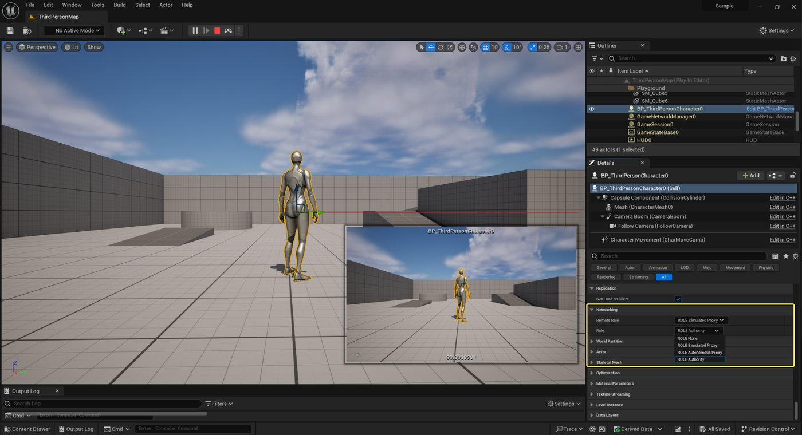

# Actor 角色和远程角色

> 路径：虚幻引擎5.7文档 / Gameplay系统 / 联网和多人游戏 / 编写多人游戏 / Actor 角色和远程角色

> 原始页面：https://dev.epicgames.com/documentation/unreal-engine/actor-role-and-remote-role-in-unreal-engine

在联网Gameplay中，Actor的**角色**和**远程角色**决定哪台机器有权限更改Actor的状态并执行远程过程调用。 这些属性可帮助你回答关于多人游戏中的Actor的以下问题：

- 此Actor是否复制？
- 谁对该Actor拥有权限？
- 此Actor的复制角色是什么？

> [!WARNING]
> Actor角色和远程角色不等同于所有权！ 如需更多信息，请参阅[Actor及其所属连接](../actor-owner-and-owning-connection/index.md)。

## 查看Actor的角色和远程角色

你可以在虚幻编辑器的细节面板中看到Actor的当前角色和远程角色：



示例角色和远程角色

Actor的角色和远程角色也可以在C++或蓝图中获取。

### 获取Actor的角色

要确定本地机器对该Actor的控制程度，请调用 [AActor::GetLocalRole](https://dev.epicgames.com/documentation/unreal-engine/API/Runtime/Engine/GameFramework/AActor/GetLocalRole?application_version=5.5)：

C++

```
AMyActor* MyActor;...// Once you have a valid Actor pointer...const ENetRole LocalRole = MyActor->GetLocalRole();// LocalRole contains the Actor's Role...
```

### 获取Actor的远程角色

要确定远程机器对该Actor的控制程度，请调用 [AActor::GetRemoteRole](https://dev.epicgames.com/documentation/unreal-engine/API/Runtime/Engine/GameFramework/AActor/GetRemoteRole?application_version=5.5)：

C++

```
AMyActor* MyActor;...// Once you have a valid Actor pointer...const ENetRole RemoteRole = MyActor->GetRemoteRole();// RemoteRole contains the Actor's RemoteRole...
```

## Actor 角色状态

Actor 角色和远程角色属性由 `ENetRole` 枚举类的一个状态表示（在 `EngineTypes.h` 中定义）。 下表列出并描述了这些状态：

| 网络角色状态 | 说明 |
| --- | --- |
| `ROLE_None` | 无角色。 此Actor未复制。 |
| `ROLE_SimulatedProxy` | 此Actor的模拟代理。 该actor模拟真实状态，但无权更改状态或调用远程函数。 |
| `ROLE_AutonomousProxy` | 该Actor的自主代理。 该Actor模拟真实状态，并拥有更改状态和调用远程函数的权限。 |
| `ROLE_Authority` | 对该Actor的权威控制。 此Actor存储网络的真实状态，并有权更改状态和调用函数。 该Actor还负责跟踪属性更改并将其复制到连接的客户端。 |

## 客户端-服务器角色矩阵

虚幻引擎使用客户端-服务器模型进行联网。 因此，服务器始终对复制的Actor拥有权限。 这意味着只有服务器才能看到复制Actor的`ROLE_Authority`。 不可复制的Actor在客户端上可以具有 `ROLE_Authority` 的本地角色，远程角色为 `ROLE_None`。

下表提供了本地角色和远程角色的矩阵，其中包含服务器或客户端是否正在见证这种角色组合，并说明了这种组合的含义：

| 本地角色 | 远程角色 | 服务器或客户端 | 说明 |
| --- | --- | --- | --- |
| `ROLE_Authority` | `ROLE_AutonomousProxy` | 服务器 | 这个角色Pawn由已连接客户端之一控制。 |
| `ROLE_AutonomousProxy` | `ROLE_Authority` | 客户端 | 这个Actor Pawn由这个已连接的客户端控制。 |
| `ROLE_SimulatedProxy` | `ROLE_Authority` | 客户端 | 此Actor Pawn由其他已连接的客户端之一控制。不受任何客户端控制的已复制Actor也可以拥有这种角色组合。 |
| `ROLE_Authority` | `ROLE_None` | 客户端 | 这是一个非复制的Actor。 |

## Actor复制模拟

服务器不会在每次更新时复制所有Actor。 这会消耗太多的带宽和CPU资源。 实际上，服务器会按照[AActor::NetUpdateFrequency](https://dev.epicgames.com/documentation/unreal-engine/API/Runtime/Engine/GameFramework/AActor?application_version=5.5)属性指定的频率复制Actor。 因此在Actor更新的间歇，会有一些时间数据被传递到客户端。 这会导致Actor呈现出断续、不连贯的移动。 为了弥补这个缺陷，客户端将在更新的间歇中模拟 actor。

如需详细了解复制模拟和角色移动，请参阅[角色移动组件中的网络移动](../../network-programming-tutorials-and-examples/understanding-networked-movement-in-the-charact-8ca16fab/index.md)文档。

## Role 和 Remote Role 参考

### 函数

| 名称 | 说明 |
| --- | --- |
| [CopyRemoteRoleFrom](https://dev.epicgames.com/documentation/unreal-engine/API/Runtime/Engine/GameFramework/AActor/CopyRemoteRoleFrom?application_version=5.5) | 从另一个Actor复制远程角色，并在必要时将此Actor添加到网络Actor列表中。 |
| [ExchangeNetRoles](https://dev.epicgames.com/documentation/unreal-engine/API/Runtime/Engine/GameFramework/AActor/ExchangeNetRoles?application_version=5.5) | 如果在客户端上，则交换角色和远程角色。 |
| [GetLocalRole](https://dev.epicgames.com/documentation/unreal-engine/API/Runtime/Engine/GameFramework/AActor/GetLocalRole?application_version=5.5) | 返回本地设备对该Actor的控制程度。 |
| [GetRemoteRole](https://dev.epicgames.com/documentation/unreal-engine/API/Runtime/Engine/GameFramework/AActor/GetRemoteRole?application_version=5.5) | 返回远程机器对该Actor的控制程度。 |
| [GetRolePropertyName](https://dev.epicgames.com/documentation/unreal-engine/API/Runtime/Engine/GameFramework/AActor/GetRolePropertyName?application_version=5.5) | 获取角色的属性名称。 |
| [GetTearOff](https://dev.epicgames.com/documentation/unreal-engine/API/Runtime/Engine/GameFramework/AActor/GetTearOff?application_version=5.5) | 如果为true，此Actor不再复制到新客户端，并在它被复制到的客户端上被“撕离”（变为`ENetRole::ROLE_Authority`）。 |
| [PostNetReceiveRole](https://dev.epicgames.com/documentation/unreal-engine/API/Runtime/Engine/GameFramework/AActor/PostNetReceiveRole?application_version=5.5) | 从远程机器收到新角色后立即调用。 |
| [SetRemoteRoleForBackwardsCompat](https://dev.epicgames.com/documentation/unreal-engine/API/Runtime/Engine/GameFramework/AActor/SetRemoteRoleForBackwardsCompat?application_version=5.5) | 用于必须设置远程角色以实现向后兼容性的类构造函数中。 |
| [SetRole](https://dev.epicgames.com/documentation/unreal-engine/API/Runtime/Engine/GameFramework/AActor/SetRole?application_version=5.5) | 设置角色的值，而不会对此实例造成其他副作用。 |
| [SwapRoles](https://dev.epicgames.com/documentation/unreal-engine/API/Runtime/Engine/GameFramework/AActor/SwapRoles?application_version=5.5) | 交换此Actor的角色和远程角色。请谨慎操作，仅在你了解副作用时才调用此函数。 |

### 属性

| 名称 | 说明 |
| --- | --- |
| [bExchangedRoles](https://dev.epicgames.com/documentation/unreal-engine/API/Runtime/Engine/GameFramework/AActor/bExchangedRoles?application_version=5.5) | 角色和远程角色是否已在客户端上交换。 |
