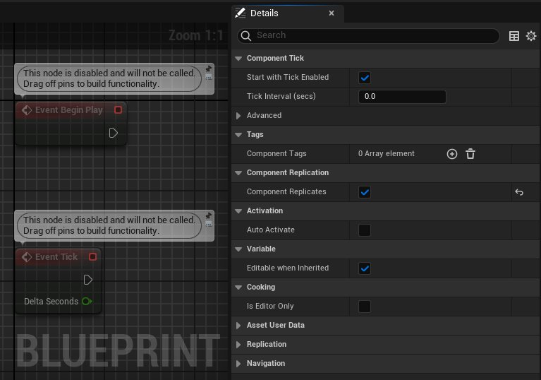

# Actor组件复制

> 路径：虚幻引擎5.7文档 / Gameplay系统 / 联网和多人游戏 / 编写多人游戏 / Actor组件复制

> 原始页面：https://dev.epicgames.com/documentation/unreal-engine/replicating-actor-components-in-unreal-engine

Actor组件可以扩展Actor的行为。Actor组件是一类特殊的对象，可以作为子对象附加到Actor上。Actor组件默认不会复制，但你可以配置任意Actor组件，使其作为其所属Actor的一部分进行复制。Actor组件可以复制自身属性和子对象，也可以像Actor那样调用由Actor组件类定义的远程过程调用（RPC）。

要将Actor组件作为Actor的一部分复制，必须确保：

- 将拥有该Actor组件的Actor设置为可复制。
- 将Actor组件设置为可复制。

## Actor组件类型

### 静态Actor组件

*静态Actor组件* 在其所属Actor生成时生成。静态组件在Actor的C++结构函数中创建的默认子对象，或是在蓝图编辑器的[组件模式](../../../../blueprints-visual-scripting/specialized-blueprint-visual-scripting-node-groups/components-window/index.md)中创建。

#### 复制静态Actor组件

复制在Actor结构函数中创建的Actor组件，请按以下步骤操作：

1. 在Actor结构函数中：

   - 使用

     bReplicates = true;

     将Actor设置为可复制。
   - 使用 `CreateDefaultSubobject<T>` 在Actor结构函数中创建Actor组件：

     ```
               AMyActor::AMyActor()          {              bReplicates = true;              MyActorComponent = CreateDefaultSubobject<UMyActorComponent>(TEXT("MyActorComponent"));          }
     ```
2. 在Actor组件结构函数中：

   - 使用 `UActorComponent::SetIsReplicatedByDefault` 将Actor组件设置为可复制：

     ```
               UMyActorComponent::UMyActorComponent()          {              SetIsReplicatedByDefault(true);          }
     ```

### 动态Actor组件

*动态Actor组件* 实在运行时在服务器上生成的Actor组件。动态Actor组件的创建或删除都会被复制到相连的客户端上。动态Actor组件的工作方式类似Actor。

> [!NOTE]
> 客户端可以生成自有的、本地的、不可复制的动态Actor组件。

#### 复制动态Actor组件

要复制在运行时动态创建的Actor组件，请按以下步骤操作：

1. 在Actor结构函数中：

   - 使用

     bReplicates = true;

     将Actor设置为可复制。
   - 使用 `NewObject<T>` 在Gameplay代码中创建Actor组件：

     ```
               MyActorComponent = NewObject<UMyActorComponent>();
     ```
2. 在想要复制新Actor组件时：

   - 使用 `UActorComponent::SetIsReplicated` 将Actor组件设置为可复制：

     ```
               if (MyActorComponent)          {              MyActorComponent->SetIsReplicated(true);          }
     ```

### 蓝图Actor组件

你可以在蓝图中生成静态和动态Actor组件。

#### 复制静态蓝图Actor组件

要在蓝图中复制静态Actor组件，需在Actor组件的 **细节面板** 中开启 **复制（Replicates）** 布尔字段。只有当组件具有你想要复制的属性或事件，你才需要复制该Actor组件。



你可以在 细节面板 的 组件可复制性（Component Replication） 分段中奖一个Actor组件设置为默认可复制。

> [!NOTE]
> **组件可复制性（Component Replication）** 仅出现在支持某种形式复制功能的组件上。

#### 复制动态蓝图Actor组件

要在蓝图中复制动态Actor组件，需要在开启 **应复制（Should Replicate）** 字段的前提下调用 **Set Is Replicated** 函数。

## 复制Actor组件属性

你可以用复制Actor属性的方法来复制Actor组件属性。关于复制Actor属性的详情，请参阅[复制Actor属性](../replicate-actor-properties/index.md)一文。

## Actor组件远程过程调用

你可以在Actor组件类中定义远程过程调用（RPC），并用调用ActorRPC的方式来调用它。关于定义、实现和调用RPC的详情，请参阅[远程过程调用](https://dev.epicgames.com/documentation/404)一文。

## 复制Actor组件子对象

Actor组件可以像Actor拥有自己的复制子对象列表。它们使用和Actor想通的API接口来注册和注销其子对象。Actor组件内的子对象也可以拥有复制条件。

在检查复制子对象的条件前，其所属组件必须先被复制到连接上。例如，如果子对象具有一个 `COND_OwnerOnly` 条件，但被注册到了一个使用 `COND_SkipOwner` 条件的组件上，那么该子对象将永远不会被复制，因为其所属组件会被跳过。

关于复制子对象的详情，请参阅[复制Actor子对象](../replicating-uobjects/index.md)一文。

## 带宽开销

Actor内每个被复制的Actor组件都会增加：

- 一个由4个字节组成的网络全局唯一标识符（NetGUID）标头。
- 所有复制的属性和空间需求。
- 一个约1字节长的脚标。

在考虑带宽开销时，需要注意三个地方：

- 复制

  ：相比复制整个Actor，复制一个Actor组件上的一个属性的影响相对较小。
- 调用RPC

  ：从Actor组件调用RPC的开销高于直接从Actor调用RPC。为了缓解这一情况，建议考虑通过Actor发送Actor组件RPC。具体示例请参阅

  角色移动组件

  一文。
- Actor组件数量

  ：Actor组件相对较小。但如果你使用了大量组件和组件子对象，可能会降低性能。
