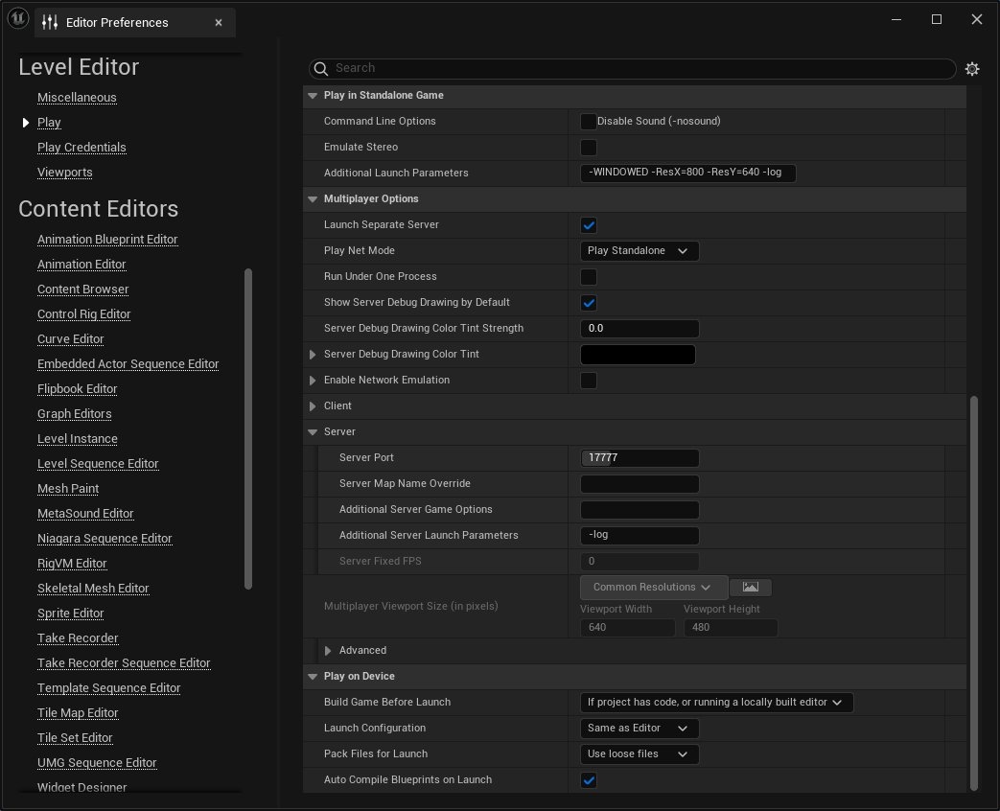

# 在线信标

> 路径：虚幻引擎5.7文档 / Gameplay系统 / 联网和多人游戏 / 编写多人游戏 / 在线信标

> 原始页面：https://dev.epicgames.com/documentation/unreal-engine/using-online-beacons-in-unreal-engine

**在线信标** 为客户端与服务器之间的通信提供了一种轻量级机制，避免了使用普通虚幻引擎（UE）网络游戏连接的必要。在线信标由Actor类派生而来，提供了一种基础框架。你可以在派生类中扩展该框架，从而让这些类执行特定于项目的交互和信息请求。在线信标的常见用例包括：

- 计算连接ping。
- 预订游戏会话的位置。
- 在加入游戏前查询游戏会话或大厅的信息。

通常情况下，Actor的复制和生成由权威服务器发起。由于服务器通常具有权威性，客户端必须先连接到服务器，才能获得由服务器管理的Actor副本。在线信标的工作方式与此不同，它为客户端提供了创建Actor的系统，让Actor与服务器建立联系，然后发起委托，从而让服务器信标在客户端连接后立即发起[远程程序调用](https://dev.epicgames.com/documentation/404)（RPC）。

## 类结构

在线信标框架含有以下结构：

- AActor

  - AOnlineBeacon

    - AOnlineBeaconHost
    - AOnlineBeaconClient
  - AOnlineBeaconHostObject

### 在线信标

在线信标是 `AOnlineBeaconClient` 和 `AOnlineBeaconHost` 的基类。通常不需要重载在线信标本身，因为你可以单独重载在线信标客户端和在线信标主机。

### 在线信标客户端

在线信标客户端是客户端实现据以派生的基类。它也是在线信标系统的主要工作类。

该类自带 `UNetDriver` ，用于发起与服务器的连接。一旦客户端和服务器的在线信标客户端对象副本之间建立了连接，对象的复制体的行为就将和同普通的UE复制体一致。服务器和客户端都可以调用RPC，并且服务器的在线信标客户端对象对属性复制体具有更大权限。

通常你应该在客户端Gameplay代码中生成一个在线信标客户端，然后使用 `AnlineBeaconClient::InitClient` 函数连接到位于服务器的在线信标主机。你需要为在线信标主机对象构造函数指定你所用的在线信标客户端类，这样服务器才能知道要生成哪个客户端类与客户端设备通信。你可以重载 `AOnlineBeaconClient::OnConnected` 函数，以便在服务器和客户端建立连接后立即调用RPC。你还可以重载 `AOnlineBeaconClient::OnFailure` 函数来执行自定义的故障处理机制。

### 在线信标主机

在线信标主机是主机用来管理客户端所有信标连接的基类。在线信标主机将管理在线信标主机对象的注册表，从而根据当前正在请求连接并与在线信标主机通信的在线信标客户端类型引导流量。

该类自带UNetDriver，用于监听来自客户端的连接。当在线信标主机收到来自远程设备在线信标客户端的连接时，主机会扫描它的在线信标主机对象实例注册表，以确定与呼入客户端相匹配的对象，然后将连接的管理权移交给该在线信标主机对象。

通常你应该在服务器Gameplay代码中生成在线信标主机，例如在游戏模式类中。

### 在线信标主机对象

在线信标主机对象是所有负责处理来自在线信标客户端流量的主机类的基类。

该类会在服务器上生成相应的在线信标客户端，以匹配发起连接的客户设备上的在线信标客户端。在线信标主机对象使用 `ClientBeaconActorClass` 成员变量来确定要生成何种在线信标客户端类的Actor。

当你生成在线信标主机后，你通常应该在服务器Gameplay代码中生成一个在线信标主机对象，然后将该在线信标主机对象注册到在线信标主机上。一旦在线信标客户端连接到委托发起的在线信标主机对象，就会调用 `AOnlineBeaconHostObject::OnClientConnected` 函数。然后你就可以在此函数内调用RPC来发起客户端与主机之间的通信。

## 引擎示例

虚幻引擎在头文件 `TestBeaconClient.h` 和 `TestBeaconHost.h` 中提供了小型的在线信标实现，其目录如下：

- ..\Engine\Plugins\Online\OnlineSubsystemUtils\Source\OnlineSubsystemUtils\Classes\

该实现被包含在相关的 `.cpp` 文件中，文件目录如下：

- ..\Engine\Plugins\Online\OnlineSubsystemUtils\Source\OnlineSubsystemUtils\Private\

测试信标实现会在服务器和客户端之间来回反复调用RPC，并每次打印一条简短的日志信息。下方小节将介绍如何在Gameplay代码中生成测试信标。

### 生成测试信标

要在项目中使用 `TestBeaconClient` 和 `TestBeaconHost` 类，请执行以下步骤：

1. 在你的服务器Gameplay代码中生成一个 `ATestBeaconHost` 。
2. 在你的客户端Gameplay代码中生成一个 `ATestBeaconClient` 。
3. 在客户端Gameplay代码中调用 `ATestBeaconClient::InitClient(url)` ，将客户端连接到服务器，其中 `url` 是包含服务器地址和端口的 `FURL` 对象。

一旦点击 **开始游戏（Begin Play）** ，你的Gameplay代码就会在服务器上生成一个测试信标主机，并在每个客户端上生成一个测试信标客户端。下文小节将介绍因此在测试信标之间自动产生的进程流。

### 测试信标进程流

本节介绍游戏开始时生成测试信标后的进程流：

- 首先 `ATestBeaconHost` 构造函数会将成员变量 `ClientBeaconActorClass` 设置为类 `ATestBeaconClient`，并将成员变量 `BeaconTypeName` 设置为 `ClientBeaconActorClass->GetName()` 。这将确保在线信标系统将测试信标主机和测试信标客户端的类配对在一起，从而让服务器生成正确的客户端类，与发起连接的客户端类相匹配。
- 当客户端设备的 `ATestBeaconClient` 对象与服务器联系时，服务器的 `AOnlineBeaconHost` 实例将指示已注册的 `ATestBeaconHost` 生成自身的 `ATestBeaconClient`，并将其与客户端设备上的 `ATestBeaconClient` 关联。如此一来，客户端设备上就有一个测试信标客户端，服务器设备上也有一个测试信标客户端。此外，网络连接还有助于客户端和服务器RPC在两个 `ATestBeaconClient` 实例之间传递信息。
- 接下来，服务器的 `ATestBeaconHost` 会调用 `ATestBeaconHost::OnClientConnected` 。在函数 `ATestBeaconHost::OnClientConnected` 中，服务器的测试信标客户端实例通过调用客户端RPC `ClientPing` 发起ping。
- 当客户端设备的 `ATestBeaconClient` 实例接收到RPC并执行 `ATestBeaconClient::ClientPing_Implementation` 时，客户端的测试信标客户端会首先在客户端日志中打印 `LogBeacon: Ping` ，然后调用服务器RPC `ServerPong` 。
- 最后，当服务器设备的 `ATestBeaconClient` 实例接收到RPC并执行 `ATestBeaconClient::ServerPong_Validate` 函数时，服务器会验证程序是否在发布配置中运行。如果验证成功，则执行 `ATestBeaconClient::ServerPong_Implementation` 。在函数 `ATestBeaconClient::ServerPong_Implementation` 中，服务器的信标客户端会首先在服务器日志中打印 `LogBeacon: Pong` ，然后调用客户端RPC `ClientPing` 。这样调用 `ClientPing` 会导致上一句点和这一句点发生重复。

这一过程会无限延续，并提供一个在线信标实现的示例，供你根据项目需求在此基础上进行扩展。

> [!TIP]
> 如果要在一次来回后停止这一流程，可以删除 `ATestBeaconClient::ServerPong_Implementation` 中对 `ClientPing` 的调用。

除本引擎示例外，本文档还在下文的[实现在线信标](#%E5%AE%9E%E7%8E%B0%E5%9C%A8%E7%BA%BF%E4%BF%A1%E6%A0%87)小节列出了在线信标的逐步实现指南。

## 引擎配置

要在你的项目中使用在线信标，你首先必须对其进行配置。有几种引擎配置选项可供选择。

要配置在线信标，请将以下内容添加到项目的DefaultEngine.ini文件中：

```
	[/Script/Engine.Engine]	+NetDriverDefinitions=(DefName="BeaconNetDriver",DriverClassName="/Script/OnlineSubsystemUtils.IpNetDriver",DriverClassNameFallback="/Script/OnlineSubsystemUtils.IpNetDriver") 	[/Script/OnlineSubsystemUtils.OnlineBeacon]	BeaconConnectionInitialTimeout=30.0	BeaconConnectionTimeout=45.0 	;[/Script/OnlineSubsystemUtils.OnlineBeaconClient]	;BeaconConnectionInitialTimeout=	;BeaconConnectionTimeout= 	[/Script/OnlineSubsystemUtils.OnlineBeaconHost]	ListenPort=8888	bReuseAddressAndPort=false	bAuthRequired=false	MaxAuthTokenSize=1024
```

### 配置参考

本节将解释上述各个配置选项的用途，以及如何为你的项目配置这些选项。

#### 引擎

以下内容将配置信标网络驱动程序，以驱动在线信标的网络流量：

```
	[/Script/Engine.Engine]	+NetDriverDefinitions=(DefName="BeaconNetDriver",DriverClassName="/Script/OnlineSubsystemUtils.IpNetDriver",DriverClassNameFallback="/Script/OnlineSubsystemUtils.IpNetDriver")
```

本例使用 `IpNetDriver` 作为网络驱动程序的类。要使用不同的网络驱动程序类，请在 `DriverClassName` 字段中指定要使用的类。

#### 在线信标

| **字段** | **说明** |
| --- | --- |
| 信标连接初始超时时间（Beacon Connection Initial Timeout） | 信标将等待与信标主机建立连接的时间。 |
| 信标连接超时时间（Beacon Connection Timeout） | 建立连接后，信标将等待数据包的时间，时间一到将放弃。 |

#### 在线信标客户端

| **字段** | **说明** |
| --- | --- |
| 信标连接初始超时时间（Beacon Connection Initial Timeout） | 信标将等待与信标主机建立连接的时间。 |
| 信标连接超时时间（Beacon Connection Timeout） | 建立连接后，信标将等待数据包的时间，时间一到将放弃。 |

#### 在线信标主机

| **字段** | **说明** | **默认值** |
| --- | --- | --- |
| 监听端口（Listen Port） | 为该信标主机配置的监听端口。 |  |
| 复用地址和端口（Reuse Address and Port） | 是否配置监听套接字以允许重复使用地址和端口。 如果为true，请确保没有其他服务器在同一端口运行，否则可能出现位定义的行为，因为数据包将被发送到两个服务器。 | false |
| 需要验证（Auth Required） | 如果要求客户端在加入信标前进行验证，请将此项设置为true。 | false |
| 最大验证令牌大小（Max Auth Token Size） | 最大验证令牌的大小。仅在"需要验证（Auth Required）"的值为true时使用。 | 1024 |

> [!TIP]
> 请确保在线信标主机所配置的监听端口（Listen Port）与在 `FURL` 对象中传递给在线信标客户端 `InitClient` 函数的端口一致。

## 实现在线信标

本节包含一个在线信标的示例实现，用于计算服务器-客户端ping的往返时间（RTT）。往返时间是指数据包从客户端发送到服务器，再返回客户端所需的时间。本示例只是一个小型实现，仅仅简单介绍了在线信标的功能，但其目的是提供一个可用的示例，帮助你上手测试信标以外功能的实现，并解释如何在Gameplay代码中设置在线信标。

> [!NOTE]
> 本在线信标示例由C++和蓝图共同实现，利用UE的反射系统[函数元数据说明符](../../../../cpp-programming/reflection-system/metadata-specifiers/index.md#%E5%87%BD%E6%95%B0%E5%85%83%E6%95%B0%E6%8D%AE%E8%AF%B4%E6%98%8E%E7%AC%A6)和[类元数据说明符](../../../../cpp-programming/reflection-system/metadata-specifiers/index.md#%E7%B1%BB%E5%85%83%E6%95%B0%E6%8D%AE%E8%AF%B4%E6%98%8E%E7%AC%A6)进行[远程程序调用](https://dev.epicgames.com/documentation/404)，并将特定函数公开给[蓝图可视化脚本](../../../../blueprints-visual-scripting/index.md)。

要使用虚幻引擎的在线信标执行ping程序，请执行以下步骤：

1. 创建或打开虚幻引擎C++项目。
2. 使用C++类向导创建三个新的C++ 类：

   - 从 `OnlineBeaconClient` 派生的名为 `PingClient` 的类。
   - 从 `OnlineBeaconHost` 派生的名为 `PingHost` 的类。
   - 从 `OnlineBeaconHostObject` 派生的名为 `PingHostObject` 的类。
3. 将[Ping信标代码](#ping%E4%BF%A1%E6%A0%87%E4%BB%A3%E7%A0%81)小节的代码添加到相应的头文件和源文件中：

   - [Ping客户端代码](#ping%E5%AE%A2%E6%88%B7%E7%AB%AF)
   - [Ping主机代码](#ping%E4%B8%BB%E6%9C%BA)
   - [Ping主机对象代码](#ping%E4%B8%BB%E6%9C%BA%E5%AF%B9%E8%B1%A1)
4. 将以下函数添加到你项目的游戏模式文件：

Header

```
	public:			bool InitPingBeacon();
```

Source

```
	bool ABeaconsGameMode::InitPingBeacon()	{		ENetMode Mode = GetNetMode();		if (Mode == NM_DedicatedServer || Mode == NM_ListenServer)		{			APingHost* Host = GetWorld()->SpawnActor<APingHost>(APingHost::StaticClass());			if (Host && Host->InitializeHost())			{				APingHostObject* HostObject = GetWorld()->SpawnActor<APingHostObject>(APingHostObject::StaticClass());				if (HostObject)				{					Host->RegisterHostObject(HostObject);					return true;				}			}		}		return false;	}
```

1. 在你游戏模式的 `BeginPlay` 函数中调用 `InitPingBeacon` 。
2. 在你项目的 `DefaultEngine.ini` 文件中添加[引擎配置](#%E5%BC%95%E6%93%8E%E9%85%8D%E7%BD%AE)小节中的配置，由此确保已将项目配置为使用在线信标。
3. 将以下内容添加到只在客户端游戏实例内运行的蓝图中。本示例使用[第三人称模板](https://dev.epicgames.com/documentation/404)，因此本代码被添加到 **BP_ThirdPersonCharacter** 中：

## 测试你的在线信标实现

要测试你的在线信标实现，你必须使用专用服务器或监听服务器以及至少一个单机客户端来运行项目。无需使用 `open` 控制台命令将客户端连接到服务器。这是在线信标的主要功能，客户可以发起与服务器的联系，然后通过快速操作断开连接。

要测试你的在线信标实现，请执行以下操作：

1. 确保已成功编译项目。
2. 在虚幻编辑器中打开你的项目。
3. 找到 **编辑器偏好设置（Editor Preferences）** ，将 **关卡编辑器（Level Editor） > 运行（Play）** 设置如下：

   - 找到 **按单机游戏运行（Play in Standalone Game）** ：

     - 将

       额外启动参数（Additional Launch Parameters）

       设置为

       -WINDOWED -ResX=800 -ResY=640 -log

       。
   - 找到 **多人游戏选项（Multiplayer Options）** ：

     - 启用 **启动单独服务器（Launch Separate Server）** 。
     - 将 **联网运行（Play Net Mode）** 设置为 **单机运行（Play Standalone）** 。
     - 禁用 **在一个进程下运行（Run Under One Process）** 。
     - 将 **额外服务器启动参数（Additional Server Launch Parameters）** 设置为 `-log` 。

   

   点击查看大图。
4. 点击 **运行（Play）** 。你应该看到三个新窗口出现：服务器日志窗口、客户端日志窗口和客户端游戏实例。
5. 如果在客户端日志窗口中看到以下行，则表示ping信标成功：

   ```
            LogPingClient: Ping Complete: 29 ms
   ```

   > [!NOTE]
   > 实际的毫秒数可能有所不同。

### 调试

如果在客户端日志窗口中未看到以上行，则表示ping信标很可能不成功。如果ping信标不成功，请检查以下内容。

#### 端口

确保客户端在线信标指定的端口与引擎配置中的服务器在线信标指定的端口一致。

```
	[/Script/OnlineSubsystemUtils.OnlineBeaconHost]	ListenPort=8888
```

#### 网络驱动程序

确保服务器创建了网络驱动程序，以监听此指定端口。

```
	LogNet: IpNetDriver_1 IpNetDriver_1 IpNetDriver listening on port 8888
```

如果在日志中没有看到像上方那样指定端口的行，请参阅上文的[引擎配置](#%E5%BC%95%E6%93%8E%E9%85%8D%E7%BD%AE)小节。

## 日志记录

在线信标使用 `LogBeacon` 日志类别记录所有在线信标的网络流量。`LogNet` 和 `LogHandshake` 这类额外日志类别也可用于调试在线信标。

## 资源

### Ping信标代码

#### Ping客户端

PingClient.h

```
	#pragma once 	#include "CoreMinimal.h"	#include "OnlineBeaconClient.h"	#include "PingClient.generated.h" 	DECLARE_LOG_CATEGORY_EXTERN(LogPingClient, Log, All); 	/**	* 	*/	UCLASS(Blueprintable, BlueprintType, Transient, NotPlaceable, Config = Engine)	class BEACONS_API APingClient : public AOnlineBeaconClient 	{		GENERATED_BODY() 	public:		APingClient(const FObjectInitializer& ObjectInitializer); 		virtual void OnFailure() override; 		UFUNCTION(Client, Reliable)		void ClientPingBegin(); 		UFUNCTION(Server, Reliable, WithValidation)		void ServerPong(); 		UFUNCTION(Client, Reliable)		void ClientPingEnd(); 		UFUNCTION(BlueprintCallable, Category=Ping)		bool ConnectToHost(FString Address, int32 Port, const bool bPortOverride); 		UFUNCTION(BlueprintCallable, Category=Ping)		void Disconnect(); 	protected:		int64 PingBeginTime;		int32 PingMS;	};
```

PingClient.cpp

```
	//在项目设置（Project Settings）的描述（Description）页面中填写版权声明。 	#include "PingClient.h" 	DEFINE_LOG_CATEGORY(LogPingClient) 	APingClient::APingClient(const FObjectInitializer& ObjectInitializer) : Super(ObjectInitializer)	{ 	} 	void APingClient::OnFailure()	{		Super::OnFailure();		UE_LOG(LogPingClient, Log, TEXT("APingClient connection failed"))	} 	void APingClient::ClientPingBegin_Implementation()	{		UE_LOG(LogPingClient, Log, TEXT("APingClient::ClientPingBegin_Implementation"));		PingBeginTime = FDateTime::Now().GetTicks();		ServerPong();	} 	bool APingClient::ServerPong_Validate()	{		return true;	} 	void APingClient::ServerPong_Implementation()	{		UE_LOG(LogPingClient, Log, TEXT("APingClient::ServerPong_Implementation"));		ClientPingEnd();	} 	void APingClient::ClientPingEnd_Implementation()	{		UE_LOG(LogPingClient, Log, TEXT("APingClient::ClientPingEnd_Implementation"));		int64 PingTime = FDateTime::Now().GetTicks() - PingBeginTime;		PingMS = (int32)(PingTime / 10000);		UE_LOG(LogPingClient, Log, TEXT("Ping Complete: %d ms"), PingMS);	} 	bool APingClient::ConnectToHost(FString Address, int32 Port, const bool bPortOverride)	{		FURL url(nullptr, *Address, ETravelType::TRAVEL_Absolute);		if (bPortOverride)		{			url.Port = Port;		}		else		{			int32 ListenPort;			if (GConfig->GetInt(TEXT("/Script/OnlineSubsystemUtils.OnlineBeaconHost"), TEXT("ListenPort"), ListenPort, GEngineIni))			{				url.Port = ListenPort;			}			else			{				url.Port = 8888;			}		}		return InitClient(url);	} 	void APingClient::Disconnect()	{		DestroyBeacon();	}
```

#### Ping主机

PingHost.h

```
	#pragma once 	#include "CoreMinimal.h"	#include "OnlineBeaconHost.h"	#include "PingHost.generated.h" 	DECLARE_LOG_CATEGORY_EXTERN(LogPingHost, Log, All); 	/**	* 	*/	UCLASS(Blueprintable, BlueprintType, Transient, NotPlaceable, Config=Engine)	class BEACONS_API APingHost : public AOnlineBeaconHost	{		GENERATED_BODY()	 	public:		APingHost(const FObjectInitializer& ObjectInitializer); 		UFUNCTION(BlueprintCallable, Category=Ping)		bool InitializeHost(); 		UFUNCTION(BlueprintCallable, Category=Ping)		void RegisterHostObject(AOnlineBeaconHostObject* HostObject); 	protected:		bool bInitSuccess;	};
```

PingHost.cpp

```
	#include "PingHost.h" 	DEFINE_LOG_CATEGORY(LogPingHost) 	APingHost::APingHost(const FObjectInitializer& ObjectInitializer) : Super(ObjectInitializer)	{		BeaconState = EBeaconState::AllowRequests;	} 	bool APingHost::InitializeHost()	{		bInitSuccess = InitHost();		return bInitSuccess;	} 	void APingHost::RegisterHostObject(AOnlineBeaconHostObject* HostObject)	{		if (bInitSuccess)		{			RegisterHost(HostObject);		}	}
```

#### Ping主机对象

PingHostObject.h

```
	#pragma once 	#include "CoreMinimal.h"	#include "OnlineBeaconHostObject.h"	#include "PingHostObject.generated.h" 	DECLARE_LOG_CATEGORY_EXTERN(LogPingHostObject, Log, All); 	/**	* 	*/	UCLASS(Blueprintable, BlueprintType, Transient, NotPlaceable, Config = Engine)	class BEACONS_API APingHostObject : public AOnlineBeaconHostObject	{		GENERATED_BODY() 	public:		APingHostObject(const FObjectInitializer& ObjectInitializer); 		virtual AOnlineBeaconClient* SpawnBeaconActor(class UNetConnection* ClientConnection) override; 		virtual void OnClientConnected(class AOnlineBeaconClient* ClientActor, class UNetConnection* ClientConnection) override; 		virtual bool Init();	};
```

PingHostObject.cpp

```
	#include "PingHostObject.h"	#include "PingClient.h" 	DEFINE_LOG_CATEGORY(LogPingHostObject) 	APingHostObject::APingHostObject(const FObjectInitializer& ObjectInitializer) : Super(ObjectInitializer)	{		ClientBeaconActorClass = APingClient::StaticClass();		BeaconTypeName = ClientBeaconActorClass->GetName(); 		PrimaryActorTick.bCanEverTick = true;		PrimaryActorTick.bAllowTickOnDedicatedServer = true;		PrimaryActorTick.bStartWithTickEnabled = true;	} 	AOnlineBeaconClient* APingHostObject::SpawnBeaconActor(UNetConnection* ClientConnection)	{		return Super::SpawnBeaconActor(ClientConnection);	} 	void APingHostObject::OnClientConnected(AOnlineBeaconClient* ClientActor, UNetConnection* ClientConnection)	{		Super::OnClientConnected(ClientActor, ClientConnection);		APingClient* BeaconClient = Cast<APingClient>(ClientActor);		if (BeaconClient != nullptr)		{			BeaconClient->ClientPingBegin();		}	} 	bool APingHostObject::Init()	{		return true;	}
```

### 游戏模式代码

BeaconsGameMode.h

```
	#pragma once 	#include "CoreMinimal.h"	#include "GameFramework/GameModeBase.h"	#include "BeaconsGameMode.generated.h" 	UCLASS(minimalapi)	class ABeaconsGameMode : public AGameModeBase	{ 		GENERATED_BODY() 	public:		ABeaconsGameMode(); 		bool InitPingBeacon(); 	protected:		virtual void BeginPlay();	};
```

BeaconsGameMode.cpp

```
	// 版权所有Epic Games, Inc.保留所有权利。 	#include "BeaconsGameMode.h"	#include "BeaconsCharacter.h"	#include "UObject/ConstructorHelpers.h"	#include "PingBeacon/PingHost.h"	#include "PingBeacon/PingHostObject.h" 	ABeaconsGameMode::ABeaconsGameMode()	{		//将默认Pawn类设置为已绘制蓝图的角色		static ConstructorHelpers::FClassFinder<APawn> PlayerPawnBPClass(TEXT("/Game/ThirdPerson/Blueprints/BP_ThirdPersonCharacter"));		if (PlayerPawnBPClass.Class != NULL)		{			DefaultPawnClass = PlayerPawnBPClass.Class;		}	} 	bool ABeaconsGameMode::InitPingBeacon()	{		ENetMode Mode = GetNetMode();		if (Mode == NM_DedicatedServer || Mode == NM_ListenServer)		{			APingHost* Host = GetWorld()->SpawnActor<APingHost>(APingHost::StaticClass());			if (Host && Host->InitializeHost())			{				APingHostObject* HostObject = GetWorld()->SpawnActor<APingHostObject>(APingHostObject::StaticClass());				if (HostObject)				{					Host->RegisterHostObject(HostObject);					return true;				}			}		}		return false;	} 	void ABeaconsGameMode::BeginPlay()	{		bool bSuccess = InitPingBeacon();		if (bSuccess)		{			UE_LOG(LogTemp, Log, TEXT("PingBeacon Init Success"))		}		else		{			UE_LOG(LogTemp, Log, TEXT("PingBeacon Init Failure"))		}	}
```

### 角色蓝图
