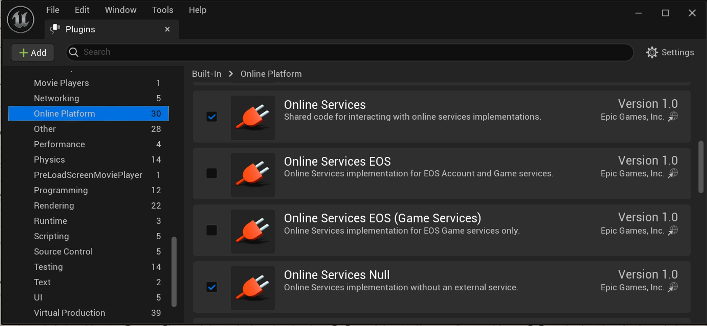

# 设置和配置在线服务插件

> 路径：虚幻引擎5.7文档 / Gameplay系统 / 在线子系统和服务 / 在线服务 / 使用在线服务插件 / 设置和配置在线服务插件

> 原始页面：https://dev.epicgames.com/documentation/unreal-engine/setup-and-configure-the-online-services-plugins-in-unreal-engine

**在线服务（Online Services）**插件可帮助你将各种后端在线服务（如Epic、Steam、Xbox Live、PSN、NLPN等）连接到你的**虚幻引擎（UE）**项目。 本指南介绍了如何：

- [启用在线服务插件。](index.md#enable-the-online-services-plugins)
- [将在线服务插件添加为项目依赖项。](index.md#add-the-online-services-plugins-to-project-dependencies)
- [配置项目的默认服务。](index.md#configure-default-platform-services)

## 设置在线服务插件

本说明使用在线服务Null实现进行演示。 此实现不连接到后端在线服务，只用于测试目的。 这是很好的起始点，因为在线服务Null插件不需要外部注册或配置即可用于虚幻引擎。 如需查看在线服务插件所支持服务的完整列表，请参阅[在线服务概述](../../overview-of-online-services/index.md)文档。

### 启用在线服务插件

你可以在项目中使用各种在线服务插件。 在线服务基础插件是默认启用的。

要启用其他必需功能，请执行以下步骤：

1. 创建或打开虚幻引擎C++项目。
2. 转到菜单栏，找到**编辑（Edit） > 插件（Plugins）**。 这会打开名为**插件（Plugins）**的新窗口或选项卡。

   1. 在此新窗口中，搜索"Online Services"或从左侧的导航栏选择**在线平台（Online Platform）**类别。
   2. 界面上应该会显示若干插件。 其中一个插件应该名为**在线服务Null（Online Services Null）**。 勾选其复选框以启用**在线服务Null**插件。

      

      > [!TIP]
      > 如果你想将Epic在线服务用于你的后端在线服务，请选择**在线服务EOS（Online Services EOS）**，而不是**在线服务Null（Online Services Null）**。 这样做可能需要你向Epic在线服务注册你的产品， 并相应配置后端，以便在线服务 插件能够按预期运行。
   3. 界面上将显示如下消息：“你必须重启虚幻编辑器才能使更改生效。（You must restart Unreal Editor for changes to take effect.）”点击**立即重启（Restart Now）**以重启**虚幻编辑器**。
3. 现在你已经在项目中启用了在线服务Null插件。

### 将在线服务插件添加为项目依赖项

要在你的项目的C++代码中使用在线服务插件，你必须将插件作为公共依赖项添加到你的项目模块。

要将插件添加到你的项目模块的公共依赖项，请执行以下步骤：

1. 在**虚幻编辑器**中打开你的虚幻引擎C++项目。
2. 选择**工具（Tools） > 打开Visual Studio（Open Visual Studio）**以打开Visual Studio。 这会在Visual Studio中打开你的项目的C++源文件。
3. 要使用在线服务插件所提供的C++代码，你必须将`OnlineServicesInterface`模块作为公共依赖项添加到项目的**.Build.cs**文件中。
4. 从**解决方案浏览器（Solution Explorer）**中找到**游戏（Games）> [YOUR_GAME] > 源（Source）> [YOUR_GAME] > [YOUR_GAME].Build.cs**，打开项目的**.Build.cs**文件。
5. 将`OnlineServicesInterface`和`CoreOnline`添加为`Build.cs`的公共依赖项。 你的`Build.cs`文件应该如下所示：

   C++

   ```
   // Copyright Epic Games, Inc. All Rights Reserved.

        using UnrealBuildTool;

        public class MyProject : ModuleRules
        {
            public MyProject(ReadOnlyTargetRules Target) : base(Target)
            {
                PCHUsage = PCHUsageMode.UseExplicitOrSharedPCHs;
                PublicDependencyModuleNames.AddRange(new string[] { 
   ```
6. 在Visual Studio中保存你的更改。

### 生成项目文件

由于你更改了项目的**.Build.cs**文件，你需要刷新你的Visual Studio项目文件。 这可确保你所做的更改反映在Visual Studio Intellisense中，并允许你在刚才添加的插件中使用该功能。

要生成项目文件，请执行以下步骤：

1. 关闭Visual Studio。
2. 在虚幻编辑器中浏览回你打开的项目。
3. 选择**工具（Tools） > 刷新Visual Studio项目（Refresh Visual Studio Project）**，重新生成你的Visual Studio项目文件。

界面上将显示进度条，显示你的代码项目的更新状态，进度条会在该过程完成后消失。

## 配置默认平台服务

最后一步是为在线服务插件指定你的默认平台服务。 默认平台服务指定调用`UE::Online::GetServices`时返回哪些后端平台服务。 [在线服务概述](../../overview-of-online-services/index.md)文档给出了可用平台标识符的列表。

要将在线服务Null指定为默认平台服务，请执行以下步骤：

1. 在Visual Studio中打开你的项目。 为此，你可以在虚幻编辑器中找到**工具（Tools） > 打开Visual Studio（Open Visual Studio）**。
2. 在Visual Studio解决方案浏览器中找到**游戏（Games） > [YOUR_GAME] > 配置（Config）> DefaultEngine.ini**，即可打开项目的**DefaultEngine.ini**文件。
3. 将以下内容添加到项目的**DefaultEngine.ini**文件中：

   C++

   ```
   [OnlineServices]     DefaultServices=Null
   ```

> [!TIP]
> 在线服务Null是不使用后端在线服务的在线服务实现。 这用于在没有后端服务的情况下测试和调试你的在线服务实现。 如果你想使用不同的后端在线服务作为项目的默认在线服务，可以从[在线服务概述](../../overview-of-online-services/index.md)的[配置](../../overview-of-online-services/index.md)小节提供的列表中选择一项服务。

## 在你的项目中访问在线服务

在线服务插件现在已启用并配置完毕，可以在你的项目中使用了。 要访问在线服务插件及其各种接口，请执行以下步骤：

1. 将`#include "Online/OnlineServices.h"`添加到你想在其中访问在线服务插件的文件。
2. 使用`IOnlineServicesPtr OnlineServicesPtr = UE::Online::GetServices();`获取默认平台服务的指针。

现在你可以访问不同的在线服务插件接口功能。 例如，要访问[身份验证接口](../../online-services-interfaces/auth-interface/index.md)，请执行以下步骤：

1. 确保你首先获取了默认平台服务的指针。
2. 将`#include "Online/Auth.h"`添加到你想在其中访问身份验证接口的文件。
3. 使用`IAuthPtr AuthPtr = OnlineServicesPtr->GetAuthInterface();`获取身份验证接口的指针。

现在你可以通过身份验证接口指针访问身份验证接口的功能。 相同逻辑适用于其他所有在线服务接口。
