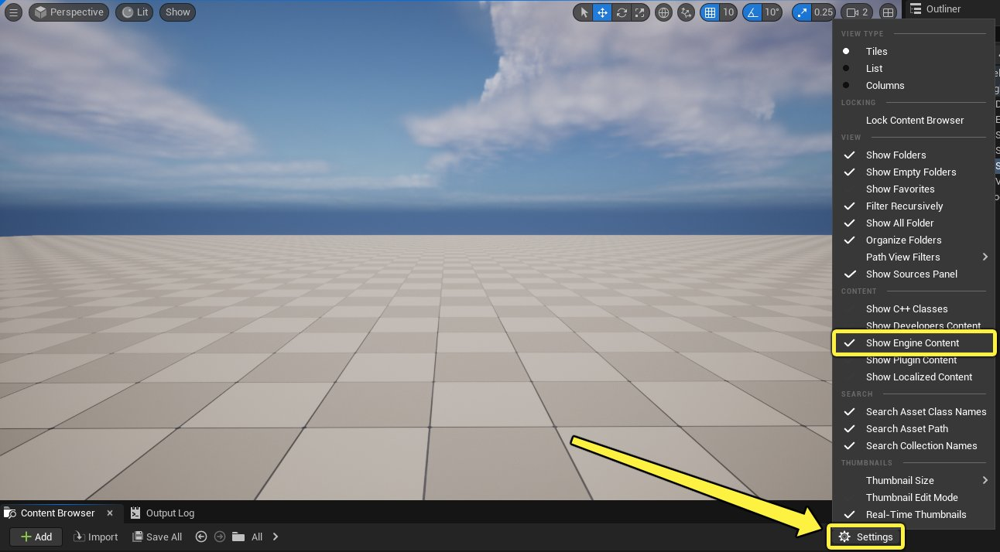
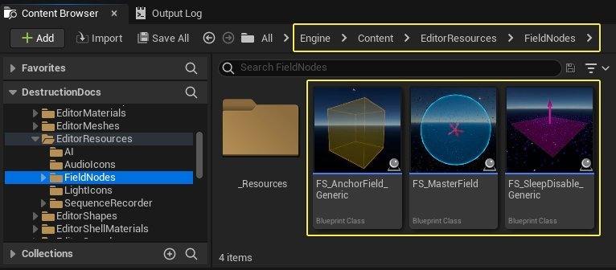
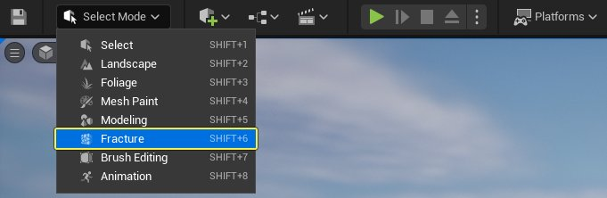
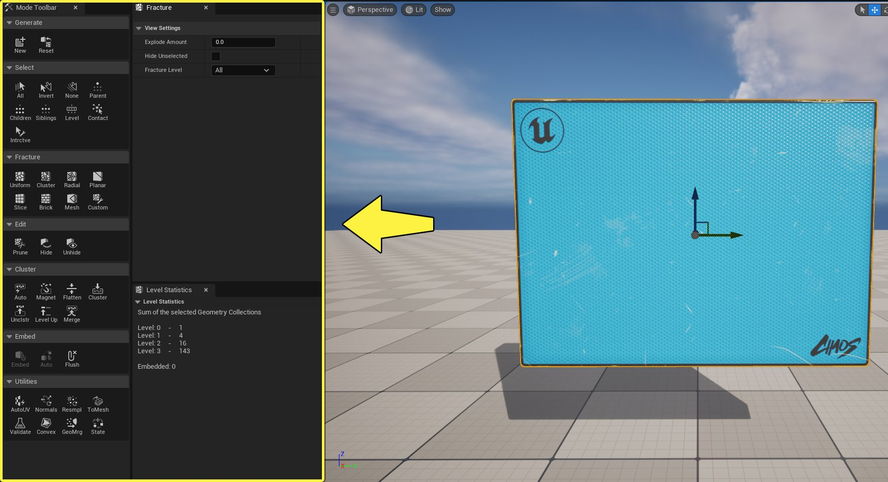
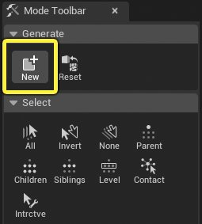
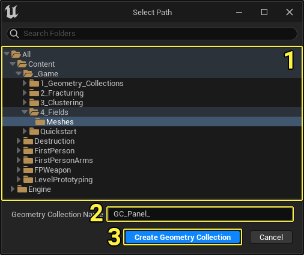
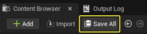
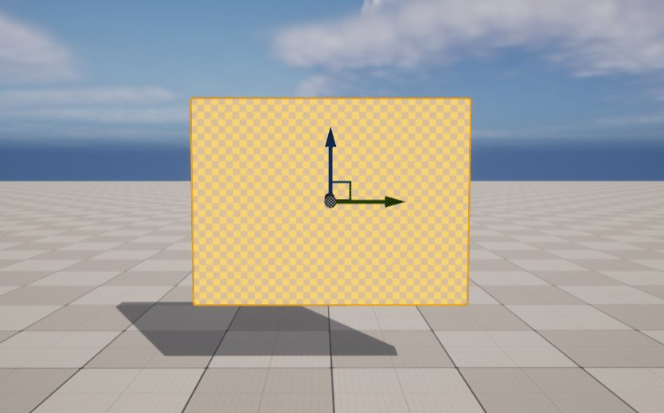

# Chaos场用户指南

> 路径：虚幻引擎5.7文档 / Gameplay系统 / 物理 / Chaos破坏系统 / Chaos破坏系统核心概念 / Chaos场用户指南

> 原始页面：https://dev.epicgames.com/documentation/unreal-engine/chaos-fields-user-guide-in-unreal-engine

> [!NOTE]
> 你可以在开发者社区网站上观看[Chaos破坏系统 - 场](https://dev.epicgames.com/community/learning/tutorials/xdYp/chaos-destruction-fields)教程，找到视频格式的类似信息。

**Chaos场** 通过一片3D空间中的区域来控制物理模拟的属性。主要有三种类型的场："锚点场（Anchor Fields）"、"张力/力场（Strain/Force Fields）"和"睡眠/禁用场（Sleep/Disable Fields）"。

**锚点** 场是在模拟期间将 **几何体集合（Geometry Collection）** 的一部分约束到原位的构造蓝图。可以使用锚点场来确保无论模拟中发生什么情况，几何体集合的某个部分都固定在原位。

**睡眠/禁用** 场在骨骼（破裂的碎块）速度低于指定阈值时使几何体集合静止。在模拟过程中，如果睡眠的骨骼与激活的对象接触，则可以重新唤醒这些骨骼。禁用的骨骼无法被重新唤醒。

**张力/力** 场在模拟过程中将张力或线速度应用于几何体集合。

虚幻引擎附带了预先构建的Chaos场，可以直接按原样使用，也可以在 **蓝图编辑器** 中将它们打开进行修改。

要找到它们，请在 **内容浏览器（Content Browser）** 中单击 **设置（Settings）> 显示引擎内容（Show Engine Content）**。

前往 **引擎（Engine）> 内容（Content）> EditorResources > FieldNodes** 找到可用的Chaos场。

## 创建几何体集合

在本小节中，你将创建一个几何体集合，以便学习在破裂模拟期间使用Chaos场。

1. 在场景中选择一个 **静态网格体Actor（Static Mesh Actor）**，单击 **模式（Mode）** 下拉框，然后选择 **破裂（Fracture）**。

   

   这样将打开 **破裂模式（Fracture Mode）** 面板，其中包含用于使网格体破裂的所有工具。

   
2. 在 **生成（Generate）** 分段中，单击 **新建（New）** 以创建新的 **几何体集合（Geometry Collection）**。

   

   此资产类型将保存在 **内容浏览器（Content Browser）** 中，并将用于创建破裂的网格体。

   

   1. (1) 选择要保存几何体集合的 **目录位置**。
   2. (2) 输入几何体集合资产的名称。
   3. (3) 单击 **创建几何体集合（Create Geometry Collection）**。

   

   1. 在

      内容浏览器（Content Browser）

      中单击

      全部保存（Save All）

      以保存新的几何体集合资产。
3. 在场景中选择的Actor将替换为关卡中的几何体集合。

   

   请参阅[几何体集合用户指南](../geometry-collections-user-guide/index.md)以了解有关创建几何体集合的更多信息。
4. 使用破裂工具对几何体集合进行破裂。在以下示例中，我们使用 **切片（Slice）** 和 **均匀Voronoi（Uniform Voronoi）** 工具在 **破裂层级（Fracture Hierarchy）** 中创建了4个关卡。

   > 图片已省略：undefined

   请参阅[破裂几何体集合用户指南](../fracturing-geometry-collections-user-guide/index.md)以了解有关破裂几何体集合的更多信息。

## 锚点场

锚点场在模拟期间将落在其体积内的任何几何体集合骨骼设置为 **静态（Static）**。

将 `FS_AnchorField_Generic` 拖到关卡，并使其与几何体集合的一角重叠。

> 图片已省略：undefined

选择几何体集合并前往 **细节（Details）** 面板。向下滚动到 **Chaos物理系统** 分段，然后展开 **初始化场（Initialization Fields）** 数组。单击 **索引[0]（Index [0]）** 下拉框并从列表中选择`FS_AnchorField_Generic`。

> 图片已省略：Click the Index 0 dropdown and select FS_AnchorField_Generic** **from the list

前往 **群集（Clustering）** 分段并禁用 **启用群集（Enable Clustering）** 复选框。这样做是为了演示目的，因为它可以更好地显示几何体集合的破裂。

> 图片已省略：Go to the Clustering section and disable the Enable Clustering checkbox

单击 **运行模式（Play Mode）** 菜单按钮，然后选择 **选定视口（Selected Viewport）** 或 **模拟（Simulate）** 以查看结果。

> 图片已省略：undefined

> 动图已省略：The bones on the corner stay anchored in place during the simulation

可以按照上述步骤添加任意数量的锚点场。在以下示例中，我们在右上角添加了锚点场。

> 动图已省略：Simulation with two Anchor Fields

还可以一次性对多个几何体集合使用相同的锚点场。在以下示例中，我们对两个几何体集合使用了一个锚点场。

> 动图已省略：One Anchor Field used on two Geometry Collections

锚点场带有三种 **衰减形状（Falloff Shape）**："盒体（Box）"、"球体（Sphere）"和"平面（Plane）"。这些形状会影响设置为"静态（Static）"的骨骼数量以及效果的实现方式。

要更改衰减形状，请选择锚点场并前往 **细节（Details）** 面板。向下滚动到 **默认（Default）** 分段，然后单击 **锚点衰减形状（Anchor Falloff Shape）** 下拉框。选择所需的衰减形状。

> 图片已省略：Click the Anchor Falloff Shape dropdown

在以下示例中，我们对锚点场使用了 **球体（Sphere）** 形状。

> 动图已省略：Example of a sphere shape Anchor Field

在以下示例中，我们对锚点场使用了 **平面（Plane）** 形状。

> 动图已省略：Example of a plane shape Anchor Field

## 睡眠和禁用场

**睡眠（Sleep）** 和 **禁用（Disable）** 场使刚体在速度低于给定 **阈值（Threshold）** 值时静止。更高的阈值将使对象更激进地停止。

这些场用于提高模拟性能，并防止几何体集合的各个碎块在相互碰撞时出现过度抖动。这些场还可用于更好地控制模拟中包含的刚体数量。

睡眠的刚体与激活的对象碰撞时可被重新唤醒。 禁用的刚体在进入静止状态后，会从模拟中将其完全移除。禁用的刚体无法被重新唤醒。

除了"睡眠（Sleep）"和"禁用（Disable）"之外，此类型的场还具有 **终止（Kill）** 选项。此选项会忽略阈值，会立即停止刚体模拟，并在刚体与场的体积重叠时将刚体从模拟中移除。

将 **FS_SleepDisable_Generic** 拖入关卡并按如下所示进行放置。

> 图片已省略：undefined

前往 **细节（Details）** 面板，向下滚动到 **默认（Default）** 分段。在此处可以指定由场用于应用其效果的 **阈值（Threshold）** 值。还可以指定 **场行为（Field Behavior）、衰减形状（Falloff Shape）** 以及是否要显示 **调试（Debug）** 信息。

> 图片已省略：The options available for the Sleep and Disable fields

在以下示例中，我们启用了 **调试（Debug）** 选项，并使用了两个几何体集合来展示睡眠场的效果。左图的 **阈值（Threshold）** 值设置为 **2**，右图的该值设置为 **50**。

> 动图已省略：Example of Sleep fields with thresholds of 2 and 50

可以看到，第一个对象在通过体积时会进入睡眠状态。但是，它与第二个对象碰撞时会被唤醒。阈值越高，刚体设置为睡眠的程度就越高。

在以下示例中，我们切换到了 **禁用（Disable）** 场。左侧场的 **阈值（Threshold）** 值设置为 **2**，右侧场的该值设置为 **200**。

> 动图已省略：Example of Disable fields with thresholds of 2 and 200

请注意右侧的几何体集合在禁用后不会相互碰撞。阈值越高，效果越明显。

最后，我们可以使用 **终止（Kill）** 场立即停止任何刚体进行模拟。请注意，右侧显示的是模拟物理系统的静态网格体，而左侧使用了几何体集合。

> 动图已省略：Example of Kill fields stopping a Geometry Collection and a Static Mesh

## 主场

### 介绍

`FS_MasterField`是虚幻引擎附带的预构建Chaos场。前往 **引擎（Engine）> 内容（Content）> EditorResources > FieldNodes** 可以找到该场。

该场附带许多自定义选项，主要用于：

- 通过施加断开骨骼之间连接的外部张力来激活刚体。
- 为刚体应用速度，使其以逼真的方式移动和旋转。

在以下示例中，我们放置的一个默认 `FS_MasterField` 与几何体集合发生重叠。

在其默认配置中，该场会施加大量外部张力，使几何体集合破裂。然后，该场将径向和角速度添加到破碎的碎片，使这些碎片旋转。最后，该场应用噪点来给效果增加随机性。

结果如下：

> 动图已省略：The FS_MasterField applies strain to the Geometry Collection causing a fracture

可以通过单击 **场衰减形状（Field Falloff Shape）** 下拉框并选择一个选项来配置场的形状。

> 图片已省略：Select the Field Falloff Shape from the dropdown

还可以通过单击 **激活类型（Activation Type）** 下拉框并选择一个选项来配置场的应用方式。

> 图片已省略：Select the Activation Type from the dropdown

| **激活类型** | **描述** |
| --- | --- |
| **延迟（Delay）** | 该场在经过 **延迟量（Delay Amount）** 之后激活。 |
| **更新时@@@（OnTick）** | 该场在每次更新时激活。 |
| **更新时但有延迟（OnTickWithDelay）** | 该场在每次更新时经过初始的 **延迟量（Delay Amount）** 之后激活。 |
| **触发（Trigger）** | 该场由蓝图直接激活。 |

在 **细节（Details）** 面板中前往 **高级场设置（Advanced Field Settings）> 时间和生命周期（Timing and Lifespan）** 分段，即可设置场的 **生命周期（Lifespan）**。创建需要在短时间内应用其效果的场时，此设置很有用。

以下几个小节将介绍有关这些设置的详细信息以及其他信息。

### 外部张力

**外部张力（External Strain）** 可以在破裂的几何体集合中断开骨骼之间的连接。可以前往 **细节（Details）** 面板中的 **应用外部张力以断开节点连接（Apply External Strain to Break Node Connections）** 分段来修改场的外部张力选项。

> 图片已省略：You can modify the external strain options of the field by going to the Apply External Strain to Break Node Connections section in the Details panel

| **选项** | **描述** |
| --- | --- |
| **使用外部张力（Use External Strain）** | 如果启用此选项，该场会将外部张力施加到指定的几何体集合。 |
| **张力大小（Strain Magnitude）** | 施加的张力的大小。默认情况下，为确保施加的张力会破坏骨骼，此值非常高。如果张力低于几何体集合的"损坏阈值（Damage Threshold）"，则张力不会导致破裂。 |
| **张力衰减类型（Strain Falloff Type）** | 对体积内的张力应用衰减。可供选择的衰减类型包括 **线性（Linear）**、**反函数（Inverse）**、**平方型（Square）** 和 **对数（Logarithmic）**。 |
| **张力衰减最小和最大值（Strain** **Falloff** **Min Max）** | 设置从体积中心（最小值）到体积边缘（最大值）的衰减值。值0表示无衰减，值1表示100%衰减。 |
| **张力命中次数（Num Strain Hits）** | 设置场的应用次数。每次命中时激活一次场，因此多次命中便可让用户在施加任何力之前破坏多个群集级别。 |

#### 张力大小

在以下示例中，由场施加的张力大于几何体集合的"损坏阈值（Damage Threshold）"，从而使骨骼破坏。

> 动图已省略：The Geometry Collection breaks due to the strain applied by the Field

在以下示例中，我们有两个不同的几何体集合。蓝色几何体集合的"损坏阈值（Damage Threshold）"为200000，而橙色几何体集合的"损坏阈值（Damage Threshold）"为500000。由场施加的内部张力大小为400000。这样会导致蓝色几何体集合破坏，而橙色几何体集合保持不变。

> 动图已省略：The field is applying strain to two different Geometry Collections. The blue Geometry Collections have a Damage Threshold below the applied internal strain from the field, which results in fracturing

#### 张力衰减类型以及最小和最大值

可以通过单击 **张力衰减类型（Strain Falloff Type）** 下拉框并选择一个选项来调整 **张力衰减（Strain Falloff）**。还可以调整最小和最大衰减值以获得所需的结果。

在以下示例中，场未应用衰减：

> 动图已省略：This Field has no falloff applied

在以下示例中，我们应用了 **线性衰减（Linear falloff）**，并将 **最大（Max）** 值设置为 **2**：

> 图片已省略：This Field has a Linear falloff with a Max value of 2

> 动图已省略：This Field has a falloff with a Max value of 2

> [!NOTE]
> 出于性能原因，我们建议避免对外部张力使用衰减。然而，当与内部张力结合使用来实现特定效果时，外部张力衰减可能很有用。

### 内部张力

内部张力或衰减会改变几何体集合的内部"损坏阈值（Damage Threshold）"值。激活时，衰减的场将使体积内骨骼的"损坏阈值（Damage Threshold）"降低"衰减量（Decay Amount）"。

这可用于逐渐削弱几何体集合，直至其因外部张力而破坏。

在以下示例中，我们将 **激活类型（Activation Type）** 设置为 **更新时（OnTick）**，**延迟量（Delay Amount）** 设置为 **1秒**。此外，我们启用了 **使用衰减（Use Decay）** 复选框，并将 **衰减量（Decay Amount）** 设置为 **100000**，**衰减延迟（Decay Delay）** 设置为 **1秒**。

几何体集合的 **损坏阈值（Damage Threshold）** 为 **500000**。

这些选项将使体积内骨骼的"损坏阈值（Damage Threshold）"每秒降低100000，并向边缘衰减。结果如下：

> 图片已省略：We enabled Use Decay and set the Decay Amount to 100,000 with a Decay Delay of 1 second

> 动图已省略：The Field weakens the Geometry Collection until it fractures from external strain

### 激活刚体

有时可能希望在不使用张力的情况下激活运动学刚体。

要执行此操作，可以前往 **场设置（Field Settings）** 下的 **高级场设置（Advanced Field Settings）> 强制动态切换（Force Dynamic Switching）** 分段，然后启用 **强制动态切换（Force Dynamic Switch）** 复选框。

> 图片已省略：Activate Kinematic bodies by going to the Advanced Field Settings - Force Dynamic Switching section and enabling the **Force Dynamic Switch** checkbox

在以下示例中，几何体集合设置为 **运动学（Kinematic）**，场将在不施加任何张力或速度的情况下激活几何体集合。

> 动图已省略：IThe field is activating the Geometry Collection without applying any strain or velocity

还可以通过启用 **激活标记的静态和骨骼网格体（Activate Tagged Static and Skeletal）** 复选框来激活 **静态** 和 **骨骼网格体**。

> 图片已省略：You can activate Static and Skeletal Meshes

对于要激活的每个网格体，请将其 **移动性（Mobility）** 设置为 **可移动（Movable）**，并添加 **Actor标签** '**SM_Rigids**'。此外，请确保网格体有碰撞，以便其可以正确模拟。

> 图片已省略：Set the Mobility setting to Movable

> 图片已省略：Add the Actor Tag 'SM_Rigids'

> 动图已省略：Both kinematic rigid bodies are activated by the fields

### 速度

#### 径向速度

径向速度按给定的大小将对象推离空间内的某个点。默认情况下，这个点位于体积的中心，但用户可以更改。

以下示例在球体体积的中心应用了径向速度。

> 动图已省略：The radial velocity is applied at the center of the sphere volume

要更改速度的原点，请前往 **高级场设置（Advanced Field Settings）> 速度控制（Velocity Controls）** 分段，然后更改 **径向位置偏移（Radial Position Offset）**。在以下示例中，我们将Y轴的原点偏移了100个单位。这样就会从球体体积的边缘应用速度，如下所示。

> 图片已省略：You can change the Radial Position Offset here

> 动图已省略：The velocity is applied from the edge of the sphere volume

还可以通过前往 **应用线性和角速度（Apply Linear and Angular Velocities）** 分段并启用 **使用定向向量（Use Directional Vector）** 复选框来应用特定方向的速度。

> 图片已省略：You can also apply velocity in a specific direction by going to the Apply Linear and Angular Velocities section and enabling the Use Directional Vector checkbox

在以下示例中，我们在场的向上向量中应用了800的"定向大小（Directional Magnitude）"。

> 动图已省略：This Field is applying a Directional Magnitude of 800 in the up vector

可以通过对场进行旋转来更改速度方向。在以下示例中，我们对场进行了旋转以更改速度方向。

> 动图已省略：The Field is rotated to change the velocity direction

可以通过前往 **高级场设置（Advanced Field Settings）> 速度控制（Velocity Controls）** 分段并启用 **覆盖定向向量（Override Directional Vector）** 复选框来手动输入方向向量。然后，输入 **定向向量覆盖（Directional Vector Override）** 值。

> 图片已省略：You can manually enter the direction vector

> 动图已省略：The Field is applying velocity by using the Directional Vector Override value

#### 角速度

可以通过前往 **应用线性和角速度（Apply Linear and Angular Velocities）** 分段并启用 **使用扭矩（Use Torque）** 复选框来应用角速度。可以通过设置 **扭矩乘数（Torque Multiplier）** 值来控制应用速度的大小。

在以下示例中，我们将 **扭矩乘数（Torque Multiplier）** 设置为 **64**。

> 图片已省略：Enable the Use Torque checkbox and enter the Torque Multiplier

> 动图已省略：This Field is applying Torque with a multiplier of 64

### 力与速度

`FS_MasterField` 带有在其体积内施加力或速度的选项。默认情况下，场在应用速度时会将对象的速度显式设置为给定值，不会考虑其质量或体积。

施加力会更逼真，因为它在模拟过程中考虑了每个对象的质量。要调整几何体集合的质量，请从 **内容浏览器（Content Browser）** 中打开 **几何体集合资产（Geometry Collection Asset）**，然后前往 **碰撞（Collision）** 分段。在 **质量（Mass）** 字段中输入所需的值。

> 图片已省略：Open the Geometry Collection asset, go to the Collision section and enter the desired amount for Mass

> [!NOTE]
> 请注意，对于几何体集合，场不会使用 **物理系统（Physics）** 分段下的 **质量（Mass）** 值， 而只会考虑几何体集合资产本身中的设置。

如果要对静态网格体或骨骼网格体施加力，请前往 **细节（Details）** 面板并向下滚动到 **物理系统（Physics）** 分段来设置对象的质量。启用 **模拟物理系统（Simulate Physics）** 并输入 **质量（Mass）** 值。

> 图片已省略：Go to the Details panel and scroll down to the Physics section. Enable Simulate Physics and enter the Mass value

在以下示例中，可以看到左侧的场正在应用速度，而右侧的场正在施加力。在每个场内，有两个质量分别为500千克和1000千克的对象。

可以看到，场内应用速度的两个对象即使质量不同，也会以相同的方式移动。但是，在施加力的场内，当施加相同大小的力时，这些对象受到的影响会有所不同。

> 动图已省略：The field applying velocity does not take into account the object's mass

### 衰减

`FS_MasterField` 有多种选项可控制其体积内应用的速度的衰减。可以通过前往 **应用线性和角速度（Apply Linear and Angular Velocities）** 分段并单击 **速度场衰减类型（Velocity Field Falloff Type）** 下拉框来更改衰减类型。

> 图片已省略：You can change the falloff type by going to the Apply Linear and Angular Velocities section and clicking the Velocity Field Falloff Type dropdown

**速度场衰减类型**

| **衰减类型** | **描述** |
| --- | --- |
| **无（None）** | 不会对场应用衰减函数。 |
| **线性（Linear）** | 衰减函数将与X成正比，其中X表示体积中心与其边缘之间的距离。 |
| **反函数（Inverse）** | 衰减函数将与1/X成正比，其中X表示体积中心与其边缘之间的距离。 |
| **平方型（Squared）** | 衰减函数将与X*X成正比，其中X表示体积中心与其边缘之间的距离。 |
| **对数（Logarithmic）** | 衰减函数将与Log(X)成正比，其中X表示体积中心与其边缘之间的距离。 |

使用线性衰减类型时，场将在场中心应用最大速度，并在到达场边缘时消退到最小值。

在以下示例中，场的 **最小速度衰减（Minimum Velocity Falloff）** 为 **0**，**最大速度衰减（Maximum Velocity Falloff）** 为 **1**。

> 动图已省略：In this Field the Minimum Velocity Falloff is 0, and the Maximum Velocity Falloff is 1

可以调整最小和最大衰减值以创建不同的效果。例如，以下场使用的 **最小衰减（Minimum Falloff）** 值为 **-1**，**最大衰减（Maximum Falloff）** 值为 **0**。负值会将对象拉向中心，而不是推开它们。这将产生以下效果：

> 动图已省略：In this Field the Minimum Velocity Falloff is -1, and the Maximum Velocity Falloff is 0

还可以将"最小衰减（Minimum Falloff）"和"最大衰减（Maximum Falloff）"值设置为更大的整数以在体积内创建环形效果。在以下示例中，**最小衰减（Minimum** **Falloff）** 值设置为 **-1**，**最大衰减（Maximum** **Falloff）** 值设置为 **1**。

> 动图已省略：In this Field the Minimum Velocity Falloff is -1, and the Maximum Velocity Falloff is 1

### 噪点

`FS_MasterField` 支持将噪点添加到其体积内应用的速度和力。噪点为应用于场内对象的可预测速度增加了随机性。

要为场添加噪点，请前往 **细节（Details）** 面板中的 **噪点（Noise）** 分段，然后启用 **使用噪点（Use Noise）** 复选框。可以设置与场内速度相乘的最小和最大噪点值。还可以设置 **噪点比例乘数（Noise Scale Multiplier）** 以缩放用于产生随机性的柏林噪点。

> 图片已省略：To add noise to the Field, go to the Noise section in the Details panel, and enable the Use Noise checkbox

在以下示例中，盒体场在更新时应用速度，但没有任何噪点。

> 动图已省略：The box Field is applying velocity on Tick without any noise

在以下示例中，盒体场在更新时应用速度，并且 **最小噪点（Minimum Noise）** 设置为 **0.8**，**最大噪点（Maximum Noise）** 值设置为 **1**。**噪点比例乘数（Noise Scale Multiplier）** 设置为 **30**。

> 动图已省略：The box Field is applying velocity on Tick with a Minimum Noise value of 0.8 and a Maximum Noise value of 1
