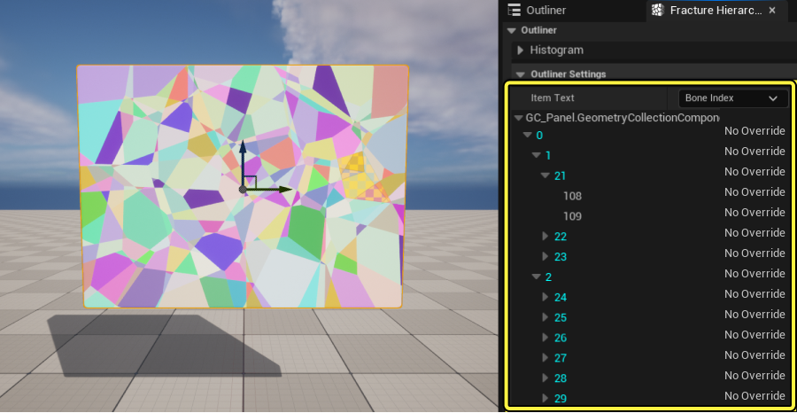
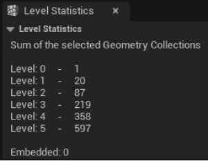
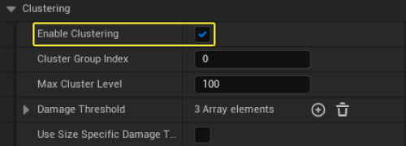
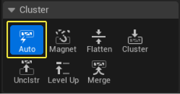
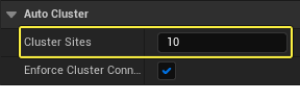
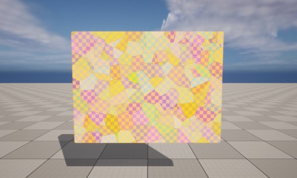
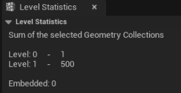
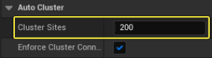

# 群集几何体集合用户指南

> 路径：虚幻引擎5.7文档 / Gameplay系统 / 物理 / Chaos破坏系统 / Chaos破坏系统核心概念 / 群集几何体集合用户指南

> 原始页面：https://dev.epicgames.com/documentation/unreal-engine/cluster-geometry-collections-user-guide-in-unreal-engine

> [!NOTE]
> 你可以观看[破裂和群集](https://dev.epicgames.com/community/learning/tutorials/k84m/chaos-destruction-fracture-and-clustering)教程，在开发人员社区站点找到视频格式的类似信息。

**破裂模式（Fracture Mode）** 是一种[关卡编辑器模式](../../../../../building-virtual-worlds/level-editor/level-editor-modes/index.md)，其中包含各种工具，包括 **Chaos破坏系统（Chaos Destruction System）** 用于创建、破裂和操控 **几何体集合（Geometry Collections）** 的工具，几何体集合是用于在虚幻引擎中模拟实时破裂的资产类型。

几何体集合破裂时，将创建新的 **破裂级别** 。这会在几何体集合的 **破裂层级（Fracture Hierarchy）** 窗口中反映出来。

你还可以在 **级别统计数据（Level Statistics）** 面板中查看破裂级别的摘要。

层级中的每个破裂级别表示几何体集合的一个 **骨骼群集**（破裂的片段）。换句话说，就破裂模拟而言，分组在相同级别的所有骨骼都将视为一个组。

群集有助于减轻模拟对性能的影响，因为系统需要同时计算的碰撞更少。在模拟期间，高级别群集将先折断，低级别群集后折断。在上面的例子中，级别1（20个片段）将先折断，然后是级别2（87个），以此类推。

群集可以实现更逼真的破坏模拟，因为现实世界的大部分物体在首次受到压力时，会破裂为较大的片段。你还可以使用群集向你的几何体集合应用不同的破裂模式，让你的可破坏对象呈现不同的艺术效果。

你可以在模拟期间选择你的几何体集合并参考 **细节（Details）** 面板，从而启用或禁用群集。向下滚动到 **群集（Clustering）** 分段并切换 **启用群集（Enable Clustering）** 复选框。

> 动图已省略：群集已启用

> 动图已省略：群集已禁用

破裂模式有各种工具可用于在几何体集合中调整骨骼群集。这样你可以更好地控制模拟的性能和美观情况。

在本指南中，你将学习可用的群集工具的用法。

> [!NOTE]
> 学习群集工具的前提是，你知道如何创建几何体集合并使其破裂。如果你不熟悉该过程，请参阅[几何体集合用户指南](../geometry-collections-user-guide/index.md)和[破裂用户指南](../fracturing-geometry-collections-user-guide/index.md)。

## 群集工具

在本小节中，你将学习如何使用破裂模式下可用的群集工具。

### 自动群集

**自动（Auto）** 群集工具使用指定数量的 **群集站点（Cluster Sites）** 创建骨骼群集。这样你可以精准地控制在将群集操作应用于几何体集合时创建的群集数量。你还可以启用 **强制群集连接（Enforce Cluster Connectivity）** 复选框，指定归为一组的骨骼是否应该连接起来。

该工具基于分支，这意味着它会基于 **破裂层级（Fracture Hierarchy）** 中选择的当前骨骼数量创建群集。

下方示例使用 **均匀Voronoi（Uniform Voronoi）** 破裂工具创建了 **500** 个站点。

你可以在级别统计数据面板或破裂层级窗口中查看层级。

选择 **自动（Auto）** 群集工具并输入 **200个群集站点** 。

点击 **自动群集（Auto Cluster）** 按钮查看结果。

> 图片已省略：点击

现在你可以看到结果。

> 图片已省略：级别1现在有200个骨骼

重复该过程，添加额外的100、50和15个群集站点。

> 图片已省略：新层级反映了你创建的群集

如你所见，你可以创建所需任意数量的破裂级别（群集）来实现所需效果。

### 磁性群集

> 图片已省略：磁性群集工具已选择

**磁性群集（Magnet Cluster）** 工具通过将当前选择内容的所有连接骨骼归为一组来创建骨骼群集。你可以指定 **迭代（Iterations）** 次数，从而控制使用该操作分组的骨骼数量。

> 图片已省略：磁性群集工具中的迭代次数

下方示例使用了 **1** 个迭代来群集所选内容的外环上的所有骨骼。

| 群集之前 | 群集之后 |
| --- | --- |
| 群集之前 | 群集之后 |
| *点击查看大图。* | *点击查看大图。* |

在此例子中，使用了 **2** 个迭代来群集所选内容中的两个外环。

| 群集之前 | 群集之后 |
| --- | --- |
| 群集之前 | 群集之后 |
| *点击查看大图。* | *点击查看大图。* |

磁性群集工具还可以同时处理多个所选内容。在下方示例中，该工具用于同时为1个迭代选择的3个骨骼。你可以看到，每次我们应用该操作时，每个所选内容的连接骨骼是单独群集的。

> 动图已省略：每次你应用该操作时，每个所选内容的连接骨骼是单独群集的

### 扁平化群集

> 图片已省略：扁平化群集工具

**扁平化（Flatten）** 群集工具会将骨骼层级扁平化，删除 **破坏层级（Destruction Hierarchy）** 的中间级别。这可用于删除中间破裂步骤，直达最终破裂模式。

在下方示例中，几何体集合在第一个级别破裂为光束（级别1），然后进一步破裂为区块（级别2）。

| 级别1 | 级别2 |
| --- | --- |
| 级别1 | 级别2 |
| *点击查看大图。* | *点击查看大图。* |

我们可以使用扁平化群集工具将层级扁平化，并完全删除光束配置。选择层级中的根骨骼，然后点击 **扁平化（Flatten）**。

| 使用扁平化之前 | 使用扁平化之后 |
| --- | --- |
| 使用扁平化之前 | 使用扁平化之后 |
| *点击查看大图。* | *点击查看大图。* |

### 群集和取消群集

> 图片已省略：群集和取消群集工具

**群集（Cluster）** 工具会根据当前骨骼所选内容创建骨骼群集。**取消群集（Uncluster）** 工具会从当前所选内容删除骨骼群集。这样你可以完全控制几何体集合中群集的创建。

在下方示例中，我们将几何体集合破裂为区块，层级中有两个级别。

> 图片已省略：几何体集合在破裂级别中有两个级别

选择一组骨骼，点击 **群集（Cluster）** 为所选骨骼创建新群集。

| 使用群集之前 | 使用群集之后 |
| --- | --- |
| 使用群集之前 | 使用群集之后 |
| *点击查看大图。* | *点击查看大图。* |

重复该过程，再创建两个群集。

> 图片已省略：重复该过程，再创建两个群集

> 图片已省略：群集之后的新层级

你可以使用 **取消群集（Uncluster）** 工具删除群集，方法是在层级中选择骨骼，然后点击 **UnClstr**。

| 使用取消群集之前 | 使用取消群集之后 |
| --- | --- |
| 使用取消群集之前 | 使用取消群集之后 |
| *点击查看大图。* | *点击查看大图。* |

### 合并群集

> 图片已省略：合并工具

**合并（Merge）** 群集工具会将多个群集合并为单个群集，并保持层级中的相同结构。

这可用于在你的模拟的层级中保持特定数量的骨骼。

在下方示例中，级别1有三个群集的几何体集合。如果我们选择两个群集并点击 **群集（Cluster）** ，这两个群集会合并为一个群集。但是，层级现在如下所示：

| 使用群集之前 | 使用群集之后 |
| --- | --- |
| 使用群集之前 | 使用群集之后 |
| *点击查看大图。* | *点击查看大图。* |

如你所见，层级在该操作之后发生变化。相反，如果我们使用 **合并（Merge）** 群集工具，层级将保持不变：

| 使用合并之前 | 使用合并之后 |
| --- | --- |
| 使用合并之前 | 使用合并之后 |
| *点击查看大图。* | *点击查看大图。* |

### 级别上移群集

**级别上移（Level Up）** 群集工具可将所选骨骼移至层级中的更高级别。在 **破裂层级（Fracture Hierarchy）** 窗口中选择所需的节点，然后点击 **级别上移（Level Up）** 查看结果。

你还可以选择根骨骼并点击 **级别上移（Level Up）**，从而对整个层级执行此操作。

> 图片已省略：使用级别上移工具之前

> 图片已省略：使用级别上移工具之后

使用级别上移工具之前

使用级别上移工具之后

### 拖放群集

你可以手动创建骨骼群集，直接在 **破裂层级（Fracture Hierarchy）** 窗口中拖放骨骼即可。你可以将群集或叶节点拖入其他群集中。

在下方示例中，几何体集合在层级的 **级别1（Level 1）** 中有 **2** 个骨骼，在 **级别2（Level 2）** 中有 **25** 个骨骼。

| 级别1 | 级别2 |
| --- | --- |
| 级别1 | 级别2 |
| *点击查看大图。* | *点击查看大图。* |

你可以选择层级中的任意骨骼并移动它，从而改变上述级别中的群集。

## 嵌入式几何体工具

破裂模式随附了一些工具，可用于将其他几何体嵌入破裂模拟中。嵌入式几何体的主要用途是进一步提升视觉效果的复杂性，增强模拟。为此，嵌入式几何体没有碰撞，也不被视为模拟的一部分。

常见例子就是使用嵌入式几何体创建建筑物的内部结构。这可以是墙内的钢筋、电缆或水泥浆。

在下方示例中，我们有一个沿对角线分割的几何体集合。将 **静态网格体（Static Mesh）** 拖入几何体集合中，并确保它与几何体集合相交。

复制静态网格体，并将其移至几何体集合另一侧。

同时选择静态网格体和几何体集合，转至 **嵌入（Embed）** 分段，点击 **自动（Auto）** 。

现在你可以从该级别中删除静态网格体。你会注意到，静态网格体看起来仍与几何体集合相交。

转至 **内容浏览器（Content Browser）** ，打开 **几何体集合（Geometry Collection）** 资产。向下滚动到 **嵌入式几何体范例（Embedded Geometry Exemplar）** 分段并将其展开。注意，静态网格体已添加到列表中，并有 **实例数量（Instance Count）** ，表示我们正在使用几何体集合中的2个网格体实例。

你可以继续将静态网格体添加到几何体集合，方法是点击 **自动（Auto）** ，将其嵌入几何体集合中。

如果你想嵌入不与几何体集合重叠的静态网格体，请选择几何体集合中的骨骼和静态网格体，然后点击 **嵌入（Embed）** 。

点击 **清空（Flush）** 从几何体集合删除所有嵌入的几何体。
