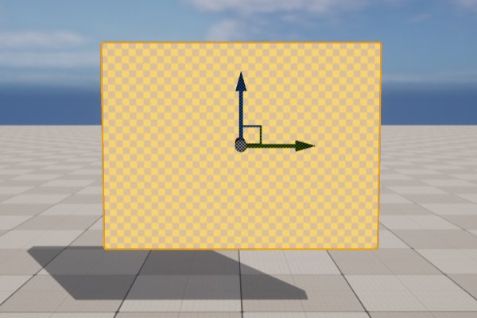
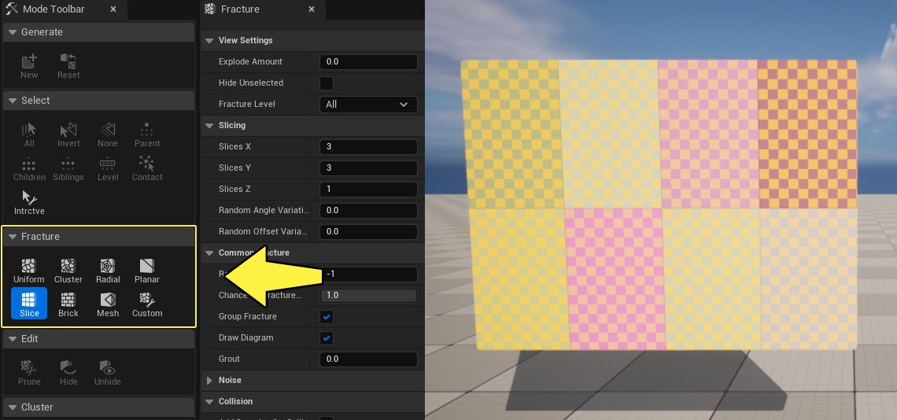
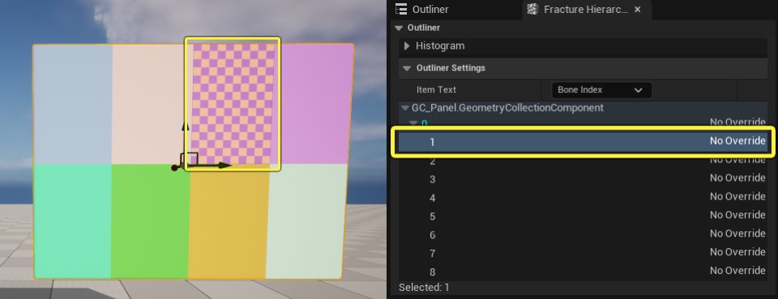
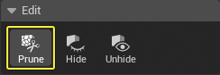
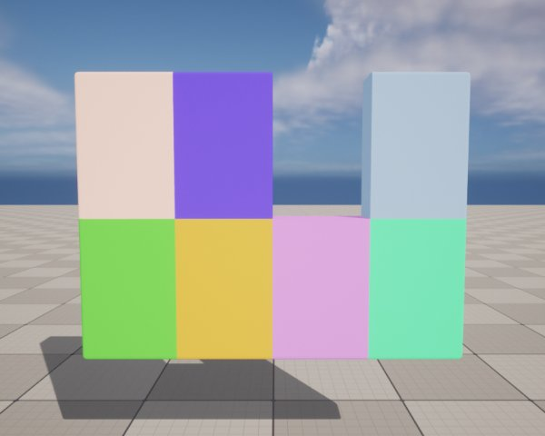
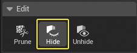
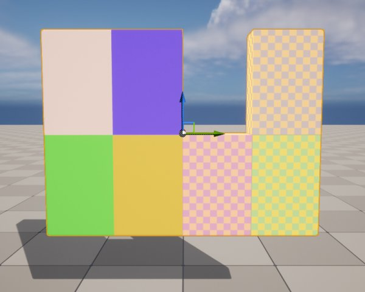
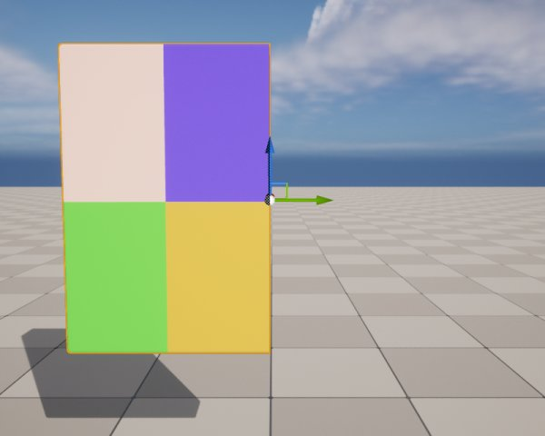

# 编辑工具用户指南

> 路径：虚幻引擎5.7文档 / Gameplay系统 / 物理 / Chaos破坏系统 / Chaos破坏系统核心概念 / 编辑工具用户指南

> 原始页面：https://dev.epicgames.com/documentation/unreal-engine/edit-tools-user-guide-in-unreal-engine

> [!NOTE]
> 你可以在Epic开发者社区中找到类似信息的视频，可以观看[破碎和集束](https://dev.epicgames.com/community/learning/tutorials/k84m/chaos-destruction-fracture-and-clustering)视频教程。

**破碎模式（Fracture Mode）** 包含的编辑工具可以从几何体集合层级移除不想要的骨骼（破碎的碎片），也可以隐藏或者取消隐藏特定的骨骼。这些工具可以在创建复杂的几何体集合破碎效果时提供高效的工作流程。

在该指南中，你将会学习如何使用 **编辑（Edit）** 面板中的工具。

> [!NOTE]
> 在了解编辑工具之前，你应该熟悉如何创建几何体集合并使其破碎。如果你还不了解这些操作，请参考[几何体集合用户指南](../index.md)和[破碎用户指南](../fracturing-geometry-collections-user-guide/index.md)。

## 几何体集合破碎

在该小节中，你将要创建一个几何体集合并使其破碎，从而了解 **破碎模式（Fracture Mode）** 中的编辑工具。

1. 在关卡中从静态网格体Actor创建一个几何体集合。

   
2. 选择以下方式之一，使几何体集合破碎。在下面的示例中，我们使用 **切片（Slice）** 工具来将几何体集合切成8块。

   

   点击查看大图。

## 使用编辑工具

### 削减工具

**削减（Prune）** 工具用于从破碎层级中移除任何选中的骨骼（破碎的碎片）。

在视口或者层级中选择一个或多个骨骼。

点击查看大图。

点击 **削减（Prune）** 来移除选中的骨骼。

该工具通常用于移除几何体集合破碎之后重叠的几何体或者不想要的骨骼。

## 可视性工具

**可视性（Visibility）** 工具用于在视口中临时隐藏选中的骨骼。如果想要重点处理层级中特定的一些骨骼，可以使用该功能。

单击 **编辑（Edit）** 类目中的 **隐藏（Hide）** 以隐藏所有选定的骨骼。

显示所有骨骼

隐藏选定的骨骼

要显示被隐藏的骨骼，在 **破碎层级（Fracture Hierarchy）** 中将它们选中，然后点击 **取消隐藏（Unhide）**。

> 图片已省略：Select the Bones in the Fracture Hierarchy

> 图片已省略：Click Unhide to show the Bones in the viewport
