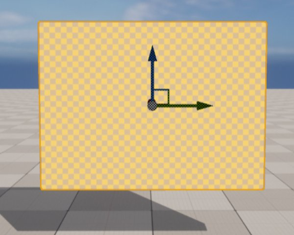
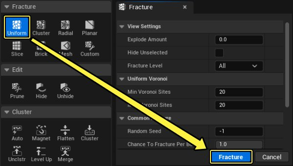
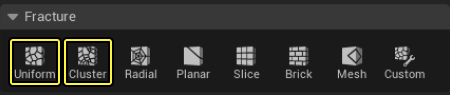
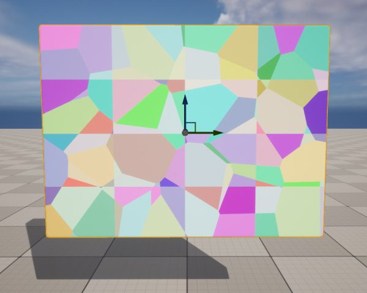
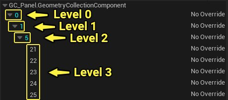
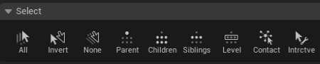
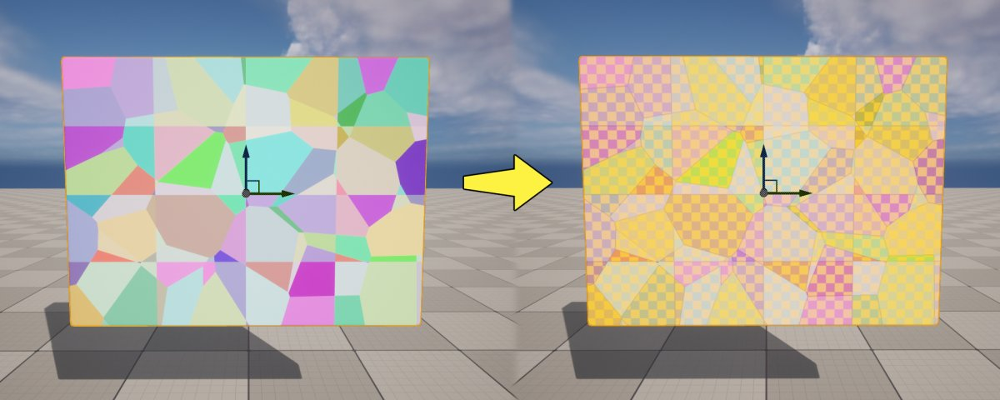
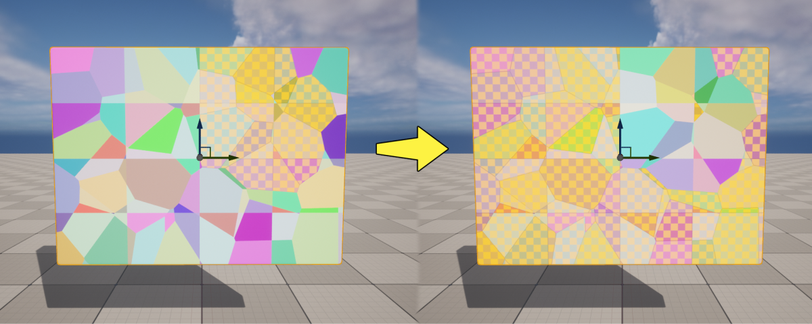

# 破裂模式选择工具用户指南

> 路径：虚幻引擎5.7文档 / Gameplay系统 / 物理 / Chaos破坏系统 / Chaos破坏系统核心概念 / 破裂模式选择工具用户指南

> 原始页面：https://dev.epicgames.com/documentation/unreal-engine/fracture-mode-selection-tools-user-guide

> [!NOTE]
> 你可以在Epic开发者社区站点上观看[使用选择工具](https://dev.epicgames.com/community/learning/tutorials/k84m/chaos-destruction-fracture-and-clustering)教程，找到视频格式的类似信息。

**破裂模式（Fracture Mode）** 是一种[关卡编辑器模式](../../../../../building-virtual-worlds/level-editor/level-editor-modes/index.md)，其中包含各种工具，包括Chaos破坏系统（Chaos Destruction System）用于创建、破裂和操控 **几何体集合（Geometry Collection）** 的工具，几何体集合是用于虚幻引擎中模拟实时破裂的资产类型。

在本指南中，你将学习如何使用破裂模式中的各种选择工具。这些工具提供了有用的方法，可以在几何体集合中选择可进一步破裂或群集的特定破裂片段（也称骨骼）。

> [!NOTE]
> 学习破裂模式的前提是，你知道如何基于关卡中的Actor创建几何体集合。如果你不熟悉该流程，请参阅[几何体集合用户指南](../geometry-collections-user-guide/index.md)。

## 破裂几何体集合

在本小节中，你将创建几何体集合并使其破裂，在此过程中了解 **破裂模式（Fracture Mode）** 随附的选择工具。

1. 利用关卡中的静态网格体Actor创建几何体集合。

   
2. 选择几何体集合后，转至 **破裂（Fracture）** 分段，选择其中一个可用的破裂工具。转至 **破裂（Fracture）** 面板，并点击 **破裂（Fracture）**。你可以多次使用同一破裂工具来破裂几何体集合，也可以在每次点击破裂（Fracture）时都选择不同的工具。

   
3. 下例使用了 **切片（Slice）** 和 **均匀Voronoi（Uniform Voronoi）** 破裂工具来破裂几何体集合。

   

   

> [!NOTE]
> 请参阅[破裂几何体集合用户指南](../fracturing-geometry-collections-user-guide/index.md)，详细了解如何破裂几何体集合。

## 使用选择工具

几何体集合的破裂层级类似于树状结构。它包含一个根骨骼（级别0）以及一个或多个子骨骼（级别1）。而每个子骨骼又包含自己的子项（级别2和3）。

在 **破裂模式（Fracture Mode）** 下，你可以直接使用 **选择工具** 选择几何体集合的骨骼。

你可以在 **选择（Select）** 分段找到选择工具，其中包含以下选项：

| 名称 | 说明 |
| --- | --- |
| **全部（All）** | 选择几何体集合中的所有骨骼。 |
| **反转（Invert）** | 对几何体集合中当前选择的骨骼进行反向选择。 |
| **无（None）** | 取消选择几何体集合中的所有骨骼。 |
| **父节点（Parent）** | 选择当前选定的骨骼的父骨骼。 |
| **子节点（Children）** | 选择当前选定的骨骼的所有子骨骼。 |
| **兄弟节点（Siblings）** | 选择所有与当前选定的骨骼具有相同父骨骼的骨骼。 |
| **级别（Level）** | 选择层级中同一级别的所有骨骼。 |
| **接触节点（Contact）** | 选择所有与任何当前选定骨骼相邻的骨骼。 |
| **交互式（Interactive）** | 启用交互式选择模式，在该模式下，你可以使用选框和筛选在几何体集合中选择所需数量的骨骼。 |

> [!NOTE]
> 你可以在视口中按住 **CTRL** 并直接点选几何体集合中的多个骨骼（破裂片段）。

### 选择所有节点

点击 **全部（All）** 按钮可选择几何体集合中的所有骨骼。这包括层级中每个级别的所有骨骼。

### 反转你的选择

使用选择工具，或按住CTRL+点击，可以选择破裂网格体的个体骨骼。然后，点击 **反转（Invert）** 按钮反向选择。

## 取消选择所有骨骼

点击 **无（None）** 按钮可取消选择几何体集合中的所有骨骼。

> 图片已省略：点击无按钮可取消选择所有骨骼

### 选择父骨骼

选择作为几何体集合中另一骨骼子项的骨骼。点击 **父节点（Parent）** 可选择层级中选定子骨骼的直接父骨骼。

> 图片已省略：点击父节点按钮可选择该骨骼的父骨骼

在下例中，选择子骨骼87，然后点击父节点（Parent），就会选择它的父骨骼，即骨骼12。

> 图片已省略：层级中的父骨骼已选定

### 选择子骨骼

选择父骨骼并点击 **子节点（Children）**，可选择选定父骨骼的所有子骨骼。

在下例中，骨骼12的所有子项都已选定。

> 图片已省略：层级中的所有子骨骼都已选定

### 选择兄弟骨骼

选择几何体集合中的骨骼。点击 **兄弟节点（Siblings）** 可选择所有与选定骨骼具有相同父项的骨骼。

> 图片已省略：点击兄弟节点按钮可选择所有父节点相同的骨骼

在下例中，骨骼87已选定。点击兄弟节点（Sibling）时，系统会选定骨骼12的所有子项，因为它们共有同一父骨骼。

> 图片已省略：层级中所有父节点相同的骨骼都已选定

### 选择所有处于同一层级级别的骨骼

选择几何体集合中的骨骼。点击 **级别（Level）** 可选择所有在层级中处于同一级别的骨骼。

> 图片已省略：点击级别可选择所有在层级中处于同一级别的骨骼

在下例中，几何体集合包含的若干骨骼在它们的破裂树中处于同一层级级别。在选择了骨骼5的情况下，点击选择工具中的级别（Level）时，系统将选择所有其他处于同一层级级别的骨骼，例如骨骼6、7和8。

> 图片已省略：层级中所有级别相同的骨骼都已选定

## 骨骼的接触选择

点击 **接触节点（Contact）** 可选择几何体集合中所有与当前选定骨骼相邻的骨骼。

> 图片已省略：点击接触节点按钮可选择所有与当前选定骨骼相邻的骨骼

## 骨骼的交互式选择

点击 **交互式（Interactive）** 可进入选框模式。在视口中左键点击并拖动鼠标可选择多个骨骼。你可以按住CTRL键拖动鼠标来取消对骨骼的选择。

交互式选择模式具有以下选项：

> 图片已省略：交互式选择模式选项

| 选项 | 说明 |
| --- | --- |
| **鼠标选择方法（Mouse Selection Method）** | 决定骨骼选择方法。**矩形选择（Rect Select）** 使用一个矩形区域来选择所有重叠骨骼。**标准选择（Standard Select）** 允许通过直接在每个骨骼上点击鼠标左键的方式来选择骨骼。 |
| **体积选择方法（Volume Selection Method）** | 决定在计算由筛选操作选择的骨骼时所使用的方法。 |
| **选择操作（Selection Operation）** | 决定是否从当前选择中 **替换（replace）**、**添加（add）** 或 **删除（remove）** 筛选操作。 |
| **最小体积破裂（Min Volume Fracture）** | 决定为选择考虑的最小骨骼体积。 |
| **最大体积破裂（Max Volume Fracture）** | 决定为选择考虑的最大骨骼体积。 |

你可以使用 **筛选器设置（Filter Settings）**，按骨骼大小筛选你的选择。如果将 **最大体积破裂（Max Volume Fracture）** 增加到 **1**，将在筛选器操作中包括所有骨骼大小。

> 图片已省略：undefined

点击查看大图。

使用 **最小体积破裂（Min Volume Fracture）** 可筛选掉最小的骨骼。执行此操作，直至选择满足你的需要。一个常见示例是，将最小骨骼排除在选择范围之外，以便为最大的骨骼额外增加一个破裂级别。

> 动图已省略：你可以开始通过增加最小体积破裂，筛选掉最小的骨骼
