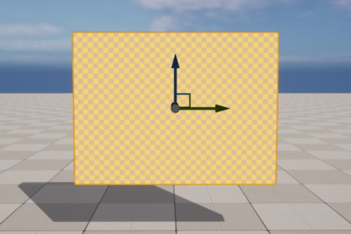
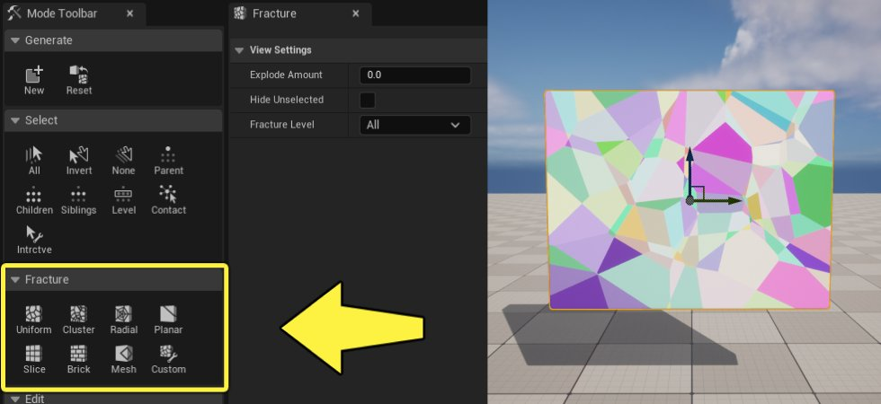
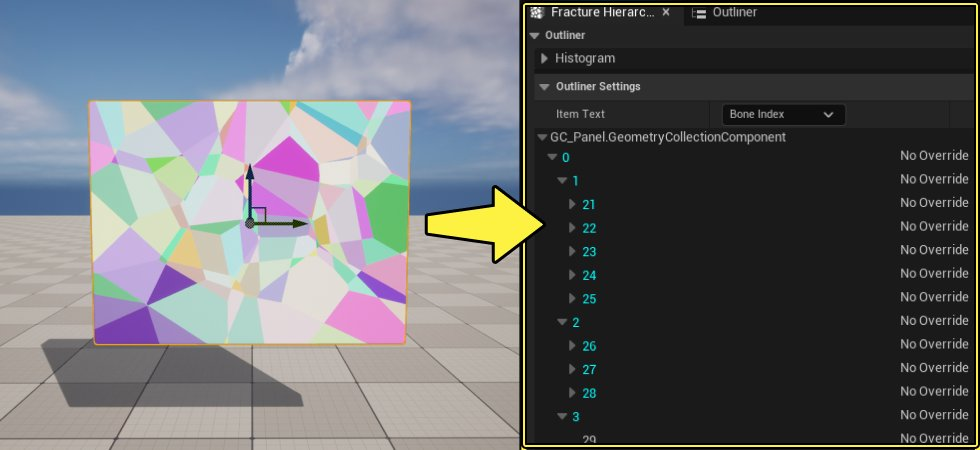
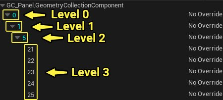
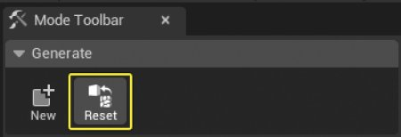
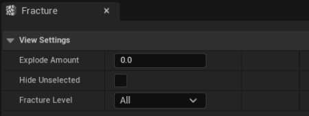
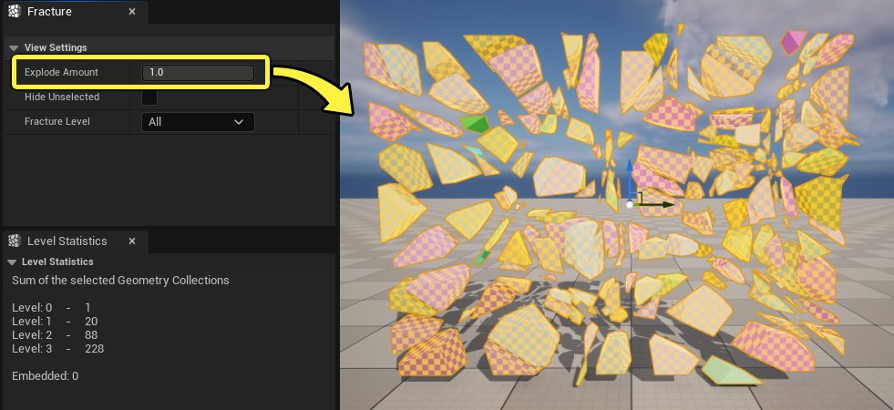
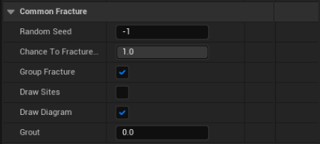

# 破裂几何体集合用户指南

> 路径：虚幻引擎5.7文档 / Gameplay系统 / 物理 / Chaos破坏系统 / Chaos破坏系统核心概念 / 破裂几何体集合用户指南

> 原始页面：https://dev.epicgames.com/documentation/unreal-engine/fracturing-geometry-collections-user-guide

> [!NOTE]
> 你可以在Epic开发者社区站点上观看[破裂和群集](https://dev.epicgames.com/community/learning/tutorials/k84m/chaos-destruction-fracture-and-clustering)教程，找到视频格式的类似信息。

**破裂模式（Fracture Mode）** 是一种编辑器模式，包含各种各样的工具，用于创建、破裂和操控 **几何体集合（Geometry Collections）** 。几何体集合是由Chaos破坏系统用于在虚幻引擎中模拟实时破裂的资产类型。

利用可用的破裂工具，用户可以对几何体集合的破裂方式进行诸多控制。这包括破裂的片段数量，以及它们如何彼此相关（破裂层级）。

每个破裂工具使用不同的方法或算法来生成不同的破裂模式。每种方法随附各种选项，用于进一步自定义生成的模式，包括增加随机性。

在本指南中，你将学习如何使用破裂模式下可用的各种破裂工具。

> [!NOTE]
> 学习破裂模式的前提是，你知道如何基于关卡中的Actor创建几何体集合。如果你不熟悉该过程，请参阅[几何体集合用户指南](../index.md)。

## 破裂几何体集合

使用破裂工具之前，利用关卡中的静态网格体Actor创建几何体集合，并将其选中。

现在你可以在 **破裂模式（Fracture Mode）** 面板的 **破裂（Fracture）** 分段下访问可用的破裂工具。每个工具可以应用于几何体集合整体，或应用于破裂后的所选破裂片段（单独的骨骼）。

点击查看大图。

将破裂方法应用于几何体集合时，将创建新的破裂级别。这会在几何体集合的 **破裂层级（Fracture Hierarchy）** 窗口中反映出来。

点击查看大图。

几何体集合的破裂层级类似于树状结构。它包含一个根骨骼，并带有构成破裂片段的一个或多个子骨骼。每个子骨骼进而可以包含自己的子骨骼。

破裂层级中的级别表示树的结构，其中四个级别表示带三个分支级别子骨骼的树状结构。

每次破裂几何体集合时，你可以使用不同的破裂工具，在破裂层级中的每个级别创建不同的破裂模式。

你可以在几何体集合中选择多个骨骼（破裂的片段），方法是直接在视口中按住 **CTRL** 键并进行选择。你还可以使用提供的[选择工具](../fracture-mode-selection-tools-user-guide/index.md)，直接快速选择一组骨骼。

### 重置几何体集合

破裂几何体集合后，你可以点击 **生成（Generate）** 分段下的 **重置（Reset）** 按钮，将其重置为原始状态。这会将几何体集合设置为创建时未应用破裂的原始状态。这很适合用于尝试不同的破裂方法，直至你找到可带来所需效果的配置。

> 动图已省略：你可以点击

### 视图设置

**视图设置（View Settings）** 有助于直观地呈现几何体集合在应用破裂操作后的外观。

| 选项 | 说明 |
| --- | --- |
| **爆炸数量（Explode Amount）** | 显示几何体集合在Gameplay期间破裂时的外观。值为1时，将分离所有骨骼，并显示完全破裂的几何体集合的外观。 |
| **隐藏未选择项（Hide UnSelected）** | 隐藏几何体集合中当前未选择的骨骼。这有助于你在应用破裂方法时专注于特定骨骼。 |
| **破裂级别（Fracture Level）** | 定义要直观呈现的破裂级别。选择"全部（All）"将显示所有破裂级别的骨骼。 |

点击查看大图。

> 动图已省略：将爆炸值从0更改为1

### 大部分破裂方法随附的通用选项

所有破裂工具都有这些 **通用破裂（Common Fracture）** 选项：

| 选项 | 说明 |
| --- | --- |
| **随机种子（Random Seed）** | 该值用于对几何体集合生成随机破裂模式。若值为-1，每次应用新的破裂操作时，将使用随机种子值。指定值会生成绑定到该种子数字的破裂模式，进入时会总是生成相同的破裂模式。 |
| **破裂几率（Chance to Fracture）** | 设置骨骼在破裂操作期间可能破裂的几率，1等于100%，表示所有骨骼都将破裂。0表示任何骨骼破裂的几率都为0%。 |
| **群组破裂（Group Fracture）** | 在所有选中网格体中生成破裂模式。 |
| **绘制站点（Draw Sites）** | 在骨骼中心绘制要由破裂模式切割的点。 |
| **绘制图（Draw Diagram）** | 在几何体集合上绘制破裂模式图。 |
| **水泥浆（Grout）** | 定义切割片段之间留下的空间。 |

> 图片已省略：带有水泥浆的破裂几何体集合

大部分破裂方法都有以下 **噪点（Noise）** 选项：

- **振幅（Amplitude）** ：定义Perlin噪点置换的大小，以厘米为单位。值为0时，表示在生成破裂模式时不会使用噪点。

  > 图片已省略：振幅： 0

  > 图片已省略：振幅： 30

  振幅： 0

  振幅： 30
- **频率（Frequency）** ：定义Perlin噪点的周期。值越小，生成的噪点模式越平滑，值越大，生成的噪点模式越粗糙。

  > 图片已省略：振幅：5，频率：0

  > 图片已省略：振幅：5，频率： 200

  振幅：5，频率：0

  振幅：5，频率： 200
- **持久性（Persistence）** ：定义Perlin噪点层的持久性。对于第一个层之后的每个层（倍频），Perlin噪点的 **振幅（amplitude）** 将按此因子缩放。

  > 图片已省略：振幅：5，持久性：0.5

  > 图片已省略：振幅：5，持久性： 1

  振幅：5，持久性：0.5

  振幅：5，持久性： 1
- **间隙度（Lacunarity）** ：定义Perlin噪点层的间隙度。对于第一个层之后的每个层（倍频），Perlin噪点的 **频率（frequency）** 将按此因子缩放。

  > 图片已省略：振幅：5，间隙度：2

  > 图片已省略：振幅：5，间隙度： 4

  振幅：5，间隙度：2

  振幅：5，间隙度： 4
- **倍频数（Octave Number）** ：定义将应用于破裂模式的Perlin噪点分形层（倍频）数量。每个层是叠加的，振幅和频率分别按持久性和间隙度缩放。使用更小的值（1-2）将生成平滑模式，值越大，生成的模式越崎岖。

  > 图片已省略：振幅：5，倍频数：1

  > 图片已省略：振幅：5，倍频数： 8

  振幅：5，倍频数：1

  振幅：5，倍频数： 8
- **点间距（Point Spacing）** ：切割表面上添加噪点的顶点之间的距离（以厘米为单位）。顶点之间的间距越大，产生的网格体越高效，三角形越少。但是，这也会产生更低的总体分辨率来显示添加的噪点的形状。

## 使用破裂工具

每个破裂工具都有自己的设置，可提供相关选项来实现所需结果。

### 均匀破裂

**均匀（Uniform）** 工具使用Voronoi算法生成破裂模式。输入Voronoi站点的最小和最大数量（或破裂的片段数量），该算法将选择该范围内的随机值。

> 图片已省略：你可以输入Voronoi站点的最小和最大数量

在下面的破裂几何体集合中，左侧的集合将 **最小（Min）** 和 **最大Voronoi站点数量（Max Voronoi Sites）** 设置为 **20** 。这意味着，破裂几何体集合将有20个破裂片段。右侧的示例将 **最小（Min）** 和 **最大Voronoi站点数量（Max Voronoi Sites）** 设置为 **100** 。

| 最小/最大Voronoi站点数量：20 | 最小/最大Voronoi站点数量： 100 |
| --- | --- |
| 20个Voronoi站点 | 100个Voronoi站点 |
| *点击查看大图。* | *点击查看大图。* |

### 群集破裂

**群集（Cluster）** 破裂工具是均匀破裂方法的扩展，两者在生成其破裂模式时都使用Voronoi算法。均匀Voronoi方法会生成相对均匀分布的站点，而群集方法则会将其站点汇集为彼此靠得很近的孤岛，创造出相较于均匀方法更多样化的破裂模式。

> 图片已省略：群集破裂工具选项

| 选项 | 说明 |
| --- | --- |
| **最小群集数量（Min Num Clusters）** | 定义将创建的Voronoi群集的最小数量。 |
| **最大群集数量（Max Num Clusters）** | 定义将创建的Voronoi群集的最大数量。 |
| **每个群集的最小站点数量（Min Sites per Cluster）** | 定义每个群集的Voronoi站点的最小数量。 |
| **每个群集的最大站点数量（Max Sites per Cluster）** | 定义每个群集的Voronoi站点的最大数量。 |
| **与中心的最小距离（Min Dist from Center）** | 定义最小群集半径。群集半径偏移将添加到该值。 |
| **与中心的最大距离（Max Dist from Center）** | 定义最大群集半径（以厘米为单位）。群集半径偏移将添加到该值。 |
| **群集半径偏移（Cluster Radius Offset）** | 定义添加到与中心的最小和最大距离的群集半径偏移（以厘米为单位）。 |

下面的例子使用以下群集设置作为起始点：

| 设置 | 值 |
| --- | --- |
| **最小群集数量（Min Num Clusters）** | 2 |
| **最大群集数量（Max Num Clusters）** | 2 |
| **每个群集的最小站点数量（Min Sites per Cluster）** | 5 |
| **每个群集的最大站点数量（Max Sites per Cluster）** | 5 |
| **与中心的最小距离（Min Dist from Center）** | 0.1 |
| **与中心的最大距离（Max Dist from Center）** | 0.1 |
| **群集半径偏移（Cluster Radius Offset）** | 0 |

通用破裂设置下还设置了以下内容：

- 绘制站点（Draw Sites）

  ：启用
- 绘制图（Draw Diagram）

  ：禁用

在下方示例中，你可以看到将 **最小（Min）** / **最大群集数量（Max Number of Clusters）** 从 **2** 设置为 **5** 之间的差异。

> 图片已省略：最小/最大群集数量：2

> 图片已省略：最小/最大群集数量： 5

最小/最大群集数量：2

最小/最大群集数量： 5

在下方示例中，你可以看到将 **每个群集的最小/最大站点数量（Min / Max Sites per Cluster）** 从 **5** 设置为 **10** 之间的差异。

> 图片已省略：每个群集的最小/最大站点数量：5

> 图片已省略：每个群集的最小/最大站点数量： 10

每个群集的最小/最大站点数量：5

每个群集的最小/最大站点数量： 10

在下方示例中，你可以看到将 **与中心的最小/最大距离（（Min / Max Distance from Center）** 从 **0.1** 设置为 **0.2** 之间的差异。

> 图片已省略：与中心的最小/最大距离：0.1

> 图片已省略：与中心的最小/最大距离： 0.2

与中心的最小/最大距离：0.1

与中心的最小/最大距离： 0.2

在下方示例中，你可以看到将 **群集半径偏移（Cluster Radius Offset*）** 从 **0** 设置为 **10** 之间的差异。

> 图片已省略：群集半径偏移：0

> 图片已省略：群集半径偏移： 10

群集半径偏移：0

群集半径偏移： 10

### 辐射破裂

**辐射（Radial）** 破裂工具会创建从中心点运行并向外辐射的Voronoi站点分布。中心位置通过操控视口中的小工具来控制。

> 图片已省略：辐射破裂工具小工具

如果你想将其放在特定位置，可以直接在 **辐射Voronoi（Radial Voronoi）** 选项中输入中心点的 **中心（Center）** 和 **法线（Normal）** 旋转(1)。要激活这些字段，请在 **放置功能按钮（Placement Controls）** 中 **禁用** **使用小工具（Use Gizmo）** 复选框(2)。

> 图片已省略：辐射Voronoi选项

辐射破裂工具随附以下选项：

- **中心（Center）** ：定义生成的破裂模式的中心位置。此选项仅在你禁用 **使用小工具（Use Gizmo）** 复选框时可用。
- **法线（Normal）** ：定义用于生成破裂模式的平面的法线旋转。此选项仅在你禁用 **使用小工具（Use Gizmo）** 复选框时可用。
- **半径** ：定义模式从中心位置起的半径。

  > 图片已省略：半径：50

  > 图片已省略：半径： 100

  半径：50

  半径： 100
- **角度步进（Angular Steps）** ：定义用于生成破裂模式的角度步进数量。这些步进对图的周长进行再分割。

  > 图片已省略：角度步进：5

  > 图片已省略：角度步进： 20

  角度步进：5

  角度步进： 20
- **辐射步进（Radial Steps）** ：定义用于生成破裂模式的辐射步进数量。这会影响模式从中心向外分割的次数。

  > 图片已省略：辐射步进：5

  > 图片已省略：辐射步进： 20

  辐射步进：5

  辐射步进： 20
- **角度偏移（Angle Offset）** ：定义用于每个辐射步进的角度偏移（以度为单位）。

  > 图片已省略：角度偏移：0

  > 图片已省略：角度偏移： 35

  角度偏移：0

  角度偏移： 35
- **可变性（Variability）** ：定义每个生成的Voronoi站点之间随机间隔的数量（以厘米为单位）。

  > 图片已省略：可变性：0

  > 图片已省略：可变性： 5

  可变性：0

  可变性： 5

### 平面破裂

**平面（Planar）** 破裂工具用于在几何体集合中创建平面切割。随着在几何体集合中创建切割，小工具会重置为当前选择内容的质心。如果你试图在视口中选择不同骨骼时做出刻意切割，该功能很有用。

> [!TIP]
> 你可以通过在 **放置功能按钮（Placement Controls）** 分段下禁用 **选择时居中（Center on Selection）** ，禁止小工具重置到当前选择内容的中心。

> 图片已省略：在

请务必注意，用于每个切割的平面会无限延伸，这意味着即使小工具按特定大小显示平面，切割仍会沿平面的方向延伸，切割整个几何体集合。

你还可以通过在 **放置功能按钮（Placement Controls）** 分段下禁用 **使用小工具（Use Gizmo）** ，放弃使用小工具。

> 图片已省略：在

禁用小工具后，你可以在 **平面切割（Plane Cut）** 分段下设置 **切割次数（Number of Cuts）** 。这会导致向几何体集合切割随机次数。

> 图片已省略：现在你可以在

在下方示例中，你可以看到将 **切割次数（Number of Cuts）** 从 **1** 设置为 **10** 之间的差异。

> 图片已省略：切割次数：1

> 图片已省略：切割次数： 10

切割次数：1

切割次数： 10

你可以通过在 **通用破裂（Common Fracture）** 分段下更改 **随机种子（Random Seed）** 值，更改这些切割的放置。

> 图片已省略：随机种子：20

> 图片已省略：随机种子： 40

随机种子：20

随机种子： 40

### 切片破裂

**切片（Slice）** 破裂工具是 **平面（Planar）** 破裂工具的扩展，增加了沿每个轴设置切割次数的能力。这样就可以使初始切割对齐到列和行。切片还可以应用随机角度和偏移变体。

| 选项 | 说明 |
| --- | --- |
| **切片X（Slices X）** | 定义X轴上的切片数量。 |
| **切片Y（Slices Y）** | 定义Y轴上的切片数量。 |
| **切片Z（Slices Z）** | 定义Z轴上的切片数量。 |
| **随机角度变体（Random Angle Variation）** | 定义随机旋转每个切片平面的最大角度（以度为单位）。 |
| **随机偏移变体（Random Offset Variation）** | 定义随机移位每个切片平面的最大距离（以厘米为单位）。 |

在下方示例中，你可以看到将 **随机角度变体（Random Angle Variation）** 从 **0** 设置为 **35** 之间的差异。

> 图片已省略：随机角度变体：0

> 图片已省略：随机角度变体： 35

随机角度变体：0

随机角度变体： 35

在下方示例中，你可以看到将 **随机偏移变体（Random Offset Variation）** 从 **0** 设置为 **50** 之间的差异。

> 图片已省略：随机偏移变体：0

> 图片已省略：随机偏移变体： 50

随机偏移变体：0

随机偏移变体： 50

### 砖块破裂

> [!NOTE]
> 砖块破裂工具被视为试验性功能，可能会在引擎的未来版本中发生重大更改。

**砖块（Brick）** 破裂工具会生成可自定义的砖块模式。你可以指定在模式应用于几何体集合时排列砖块的方式及其大小。

| 选项 | 说明 |
| --- | --- |
| **砌合（Bond）** | 设置砖块砌合模式，用于确定砖块在破裂模式中的排列方式。你可以选择以下任一项：顺砖（Stretcher）、堆叠（Stack）、英式（English）、丁砖（Header）和佛兰德式（Flemish）。 |
| **砖块长度（Brick Length）** | 定义砖块长度，以厘米为单位。 |
| **砖块高度（Brick Height）** | 定义砖块高度，以厘米为单位。 |
| **砖块厚度（Brick Depth）** | 定义砖块厚度，以厘米为单位。 |

下面的例子显示了应用于几何体集合的 **顺砖（Stretcher）** 砌合方法。

> 图片已省略：顺砖砌合方法的例子

### 网格体破裂

**网格体（Mesh）** 破裂工具使用静态网格体的形状生成破裂模式。如果你想创建非常具体的模式形状，这很有用。

将 **静态网格体（Static Mesh）** 拖入关卡中，并调整位置，使其与几何体集合相交。

> 图片已省略：将静态网格体拖入关卡中

点击 **网格体（Mesh）** 并转至 **破裂（Fracture）** 面板中的 **网格体切割（Mesh Cut）** 分段。

> 图片已省略：转至

点击 **切割Actor（Cutting Actor）** 下拉菜单。选择你拖入关卡中的静态网格体Actor。你也可以点击"滴管"按钮，然后点击视口中的静态网格体。

> 图片已省略：从列表选择静态网格体Actor

点击 **破裂（Fracture）** ，以切割Actor的形状切割几何体集合。要查看结果，请在 **视口（Viewport）** 中选择 **切割Actor（Cutting Actor）** 并移动它。

> 动图已省略：将切割Actor移出几何体集合以查看结果

以下 **切割分布（Cut Distributions）** 可用于该工具：

> 图片已省略：可用切割分布选项

| 选项 | 说明 |
| --- | --- |
| **单次切割（Single Cut）** | 在切割Actor的当前位置生成单次切割。 |
| **均匀随机（Uniform Random）** | 围绕几何体集合的边界框在均匀随机分布中分散切割Actor。 |
| **网格（Grid）** | 在几何体集合中的规则网格模式中排列切割Actor。 |

以下选项可用于 **均匀随机（Uniform Random）** 切割分布：

> 图片已省略：均匀随机切割分布选项

| 选项 | 说明 |
| --- | --- |
| **分散数量（Number to Scatter）** | 定义要随机分散的Actor数量。 |
| **最小比例因子（Min Scale Factor）** | 定义要应用于切割网格体的最小比例因子。将在最小值和最大值之间选择随机比例。 |
| **最大比例因子（Max Scale Factor）** | 定义要应用于切割网格体的最大比例因子。将在最小值和最大值之间选择随机比例。 |
| **随机方向（Random Orientation）** | 是否随机变化切割Actor的方向。 |
| **+/-滚动范围（+/- Roll Range）** | 定义将用于选取切割Actor的随机滚动（X轴的旋转）的范围。 |
| **+/-俯仰范围（+/- Pitch Range）** | 定义将用于选取切割Actor的随机俯仰（Y轴的旋转）的范围。 |
| **+/-偏转范围（+/- Yaw Range）** | 定义将用于选取切割Actor的随机偏转（Z轴的旋转）的范围。 |

在下方示例中，你可以看到将 **分散次数（Number to Scatter）** 从 **5** 设置为 **10** 之间的差异。

> 图片已省略：分散次数：5

> 图片已省略：分散次数： 10

分散次数：5

分散次数： 10

在下方示例中，你可以看到 **启用** 和 **禁用** **随机方向（Random Orientation）**之间的差异。

> 图片已省略：随机方向：启用

> 图片已省略：随机方向：禁用

随机方向：启用

随机方向：禁用

以下选项可用于网格切割分布：

> 图片已省略：网格分布选项

| 选项 | 说明 |
| --- | --- |
| **网格宽度（Grid Width）** | 定义要添加到网格X轴的切割网格体数量。 |
| **网格深度（Grid Depth）** | 定义要添加到网格Y轴的切割网格体数量。 |
| **网格高度（Grid Height）** | 定义要添加到网格Z轴的切割网格体数量。 |
| **可变性（Variability）** | 定义切割Actor的随机置换的大小。 |
| **最小比例因子（Min Scale Factor）** | 定义要应用于切割Actor的最小比例因子。 |
| **最大比例因子（Max Scale Factor）** | 定义要应用于切割Actor的最大比例因子。 |
| **随机方向（Random Orientation）** | 是否随机变化切割Actor的方向。 |

在下方示例中，你可以看到 **启用** 和 **禁用** **随机方向（Random Orientation）**之间的差异。

> 图片已省略：随机方向：启用

> 图片已省略：随机方向：禁用

随机方向：启用

随机方向：禁用

### 自定义破裂

**自定义（Custom）** 破裂工具是破裂模式随附的最广泛的破裂工具。

> 图片已省略：自定义破裂工具选项

| 选项 | 说明 |
| --- | --- |
| **模式（Pattern）** | 定义用于生成Voronoi站点的模式。 |
| **法线偏移（Normal Offset）** | 定义用于每个顶点的法线方向的偏移值。 |
| **可变性（Variability）** | 定义每个Voronoi站点随机偏移的数量，以厘米为单位。 |
| **要添加的站点数（Sites to Add）** | 定义要添加到模式的Voronoi站点数量。 |
| **跳过部分（Skip Fraction）** | 定义不会破裂（跳过）的点的部分。 |
| **跳过模式（Skip Mode）** | 定义用于跳过不会破裂的点的方法。 |

使用此工具时，**破裂图（Fracture Diagram）** 被视为可以相对于几何体集合移动的独立实体。如果你想创建自定义程度更高的破裂模式，这很有用。

| 小工具居中 | 小工具移至边角 |
| --- | --- |
| 小工具居中 | 小工具移至边角 |
| *点击查看大图。* | *点击查看大图。* |

要更好地可视化破裂图，你可以冻结破裂站点的位置数据。在 **通用破裂（Common Fracture）** 分段下，启用 **绘制站点（Draw Sites）** 并禁用 **绘制图（Draw Diagram）** 。

> 图片已省略：启用

此外，在 **实时Voronoi站点（Live Voronoi Sites）** 分段下，将 **模式（Pattern）** 设置为 **居中（Centered）** ，并将 **可变性（Variability）** 设置为 **40** 。

> 图片已省略：选择居中模式并将可变性设置为40

这样做，你可以将小工具移至几何体集合上的所需位置。在"破裂模式（Fracture Mode）"面板的 **自定义Voronoi（Custom Voronoi）** 分段下，点击 **冻结实时站点（Freeze Live Sites）** 。

> 图片已省略：点击

| 小工具位于左上角 | 小工具移动以显示冻结站点 |
| --- | --- |
| 小工具位于左上角 | 小工具移动以显示冻结站点 |
| *点击查看大图。* | *点击查看大图。* |

你可以继续此过程，有意将站点放在几何体集合上。准备就绪后，点击 **破裂（Fracture）** 可查看几何体集合上放置的所有站点的结果。

> 图片已省略：破裂的几何体集合

由于破裂图独立于几何体集合，你可以更改几何体集合，而不会影响破裂本身。

例如，如果你将 **要添加的站点数（Sites to Add）** 设置为 **2000** ，将几何体集合缩减为柱子的形状，并点击 **破裂（Fracture）** ，就可以将破裂模式应用于几何体集合的当前形状。

> 图片已省略：将

> 图片已省略：缩放几何体集合

将几何体集合重新缩放为原始大小，注意破裂模式现在会拉伸，类似于碎木片。

> 图片已省略：将几何体集合重新缩放为原始大小

由于破裂图并不直接绑定到几何体集合，当你重新缩放几何体集合时，破裂图保持不变。这意味着，你可以根据项目所选的风格创建独特的破裂模式，比如这个有细长破裂的模式。
