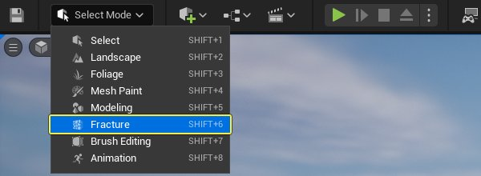
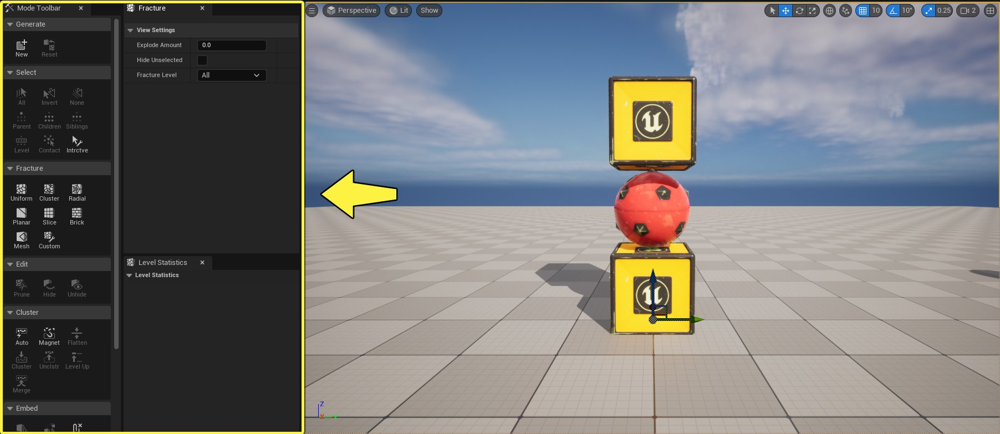
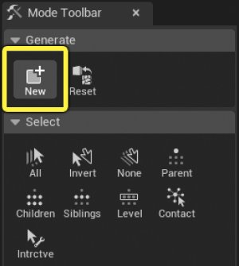
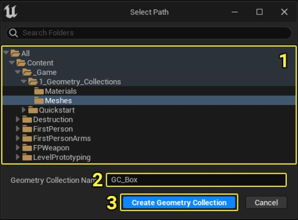
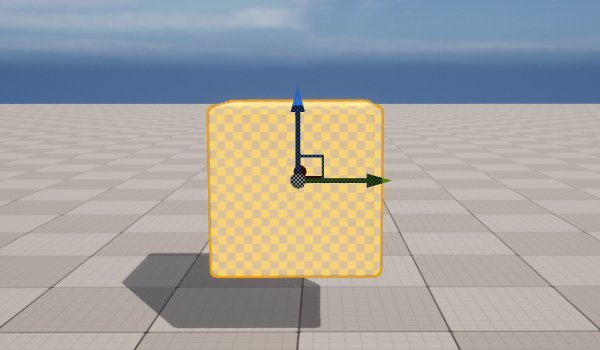
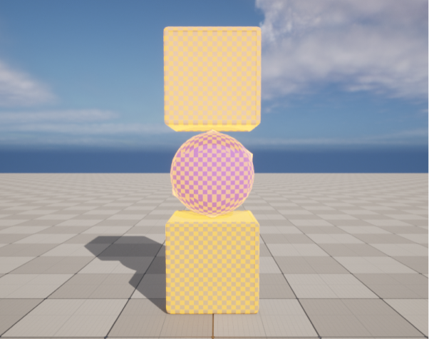

# 几何体集合用户指南

> 路径：虚幻引擎5.7文档 / Gameplay系统 / 物理 / Chaos破坏系统 / Chaos破坏系统核心概念 / 几何体集合用户指南

> 原始页面：https://dev.epicgames.com/documentation/unreal-engine/geometry-collections-user-guide

> [!NOTE]
> 你可以在Epic开发者社区站点上观看[Chaos破坏系统 - 几何体集合](https://dev.epicgames.com/community/learning/tutorials/yrXz/chaos-destruction-geometry-collections)教程，找到视频格式的类似信息。

Chaos系统中的破坏系统从 **几何体集合（Geometry Collection）** 资产开始。这些资产可以从一个或多个静态网格体、带有静态网格体组件的蓝图、甚至是其他几何体集合构建。

拥有几何体集合之后，你可以使用[破裂模式](../../destruction-overview/index.md)将其分开，并定义设置用于确定分开方式。

在本指南中，你将学习如何通过可用于Chaos破坏系统的不同源对象创建几何体集合，以及了解最佳实践来确保最佳模拟结果。

## 创建几何体集合

### 创建几何体集合资产

执行以下步骤，创建几何体集合资产。

1. 在场景中选择兼容的Actor，点击 **模式（Mode）** 下拉菜单并选择 **破裂（Fracture）** 。

   

   这将打开 **破裂模式（Fracture Mode）** 窗口，其中包含用于使网格体破裂的所有工具。你也可以按 **Shift-6** 切换到破裂模式。

   

   点击查看完整视图。
2. 在 **生成（Generate）** 分段中，点击 **新建（New）** 创建新的 **几何体集合（Geometry Collection）** 。

   

   此资产类型将保存在内容浏览器中，并将用于创建你的破裂网格体。

   1.(1) 选择几何体集合将保存到的目录位置。

   1.(2) 输入几何体集合资产的名称。

   1.(3) 点击"创建几何体集合（Create Geometry Collection）"。

   

   1. 在内容浏览器中点击"全部保存（Save All）"，保存新的几何体集合资产。

      
3. 你在场景中选择的Actor将替换为关卡中的几何体集合。

   

这些步骤可用于从任意资产组合创建几何体集合。

### 利用静态网格体创建几何体集合

你可以在关卡中组合任意数量的静态网格体，创建几何体集合。

用单个静态网格体创建几何体集合时，选择静态网格体Actor，并执行上述步骤。所选静态网格体Actor将替换为关卡中的新几何体集合。

几何体集合可以利用任意静态网格体组合创建。选择关卡中的多个静态网格体Actor，并执行"创建几何体集合资产（Create Geometry Collection Assets）"中详述的步骤。

选择多个静态网格体时，第一个所选Actor用于创建几何体集合的枢轴点。

### 利用蓝图Actor创建几何体集合

你可以组合包含一个或多个 **静态网格体组件** 的 **蓝图Actor（Blueprint Actors）** 来创建几何体集合。其静态网格体组件在转换为几何体集合时被视为普通静态网格体。

下方示例是有两个静态网格体组件的蓝图资产。

> 图片已省略：undefined

点击查看完整视图。

你可以将蓝图资产转换为几何体集合，方法是将其拖入关卡中，并执行"创建几何体集合（Creating Geometry Collections）"中的步骤。

> 图片已省略：undefined

点击查看完整视图。

你还可以将蓝图Actor与静态网格体或其他蓝图Actor合并，方法是将其选中，并执行"创建几何体集合资产（Create Geometry Collection Assets）"中的步骤。

> 图片已省略：蓝图和静态网格体将替换为关卡中的几何体集合

### 利用其他几何体集合创建几何体集合

你可以采用相同过程利用其他几何体集合创建新的几何体集合。将一个或多个几何体集合资产拖入关卡中，将其选中，并执行"创建几何体集合资产（Creating Geometry Collection Assets）"中的步骤。

> 图片已省略：undefined

点击查看完整视图。

## 使几何体集合破裂

现在你已拥有几何体集合，可以使用[破裂模式](../../destruction-overview/index.md)将其分开。此模式包含不同类型的破裂方法，以及群集和编辑破裂片段的方法。

在本指南中，你将使用标准 **均匀Voronoi（Uniform Voronoi）** 方法。使用该方法时，你可定义最小和最大数量的站点，以创建单元格体积进行破裂。有关各种可用破裂方法的更多详细信息，请阅读[破裂几何体集合用户指南](../fracturing-geometry-collections-user-guide/index.md)。

执行以下步骤，破裂几何体集合：

1. 在关卡中选择几何体集合，点击 **模式（Mode）** 下拉菜单并选择 **破裂（Fracture）** 。

   > 图片已省略：从

   > 图片已省略：undefined

   点击查看完整视图。
2. 转到 **破裂（Fracture）** 分段，然后点击 **均匀（Uniform）** 破裂按钮。

   > 图片已省略：点击
3. 按所示保留默认设置，并点击 **破裂（Fracture）** 。

   > 图片已省略：点击

   > [!NOTE]
   > 你可以参阅[破裂几何体集合用户指南](../fracturing-geometry-collections-user-guide/index.md)教程，详细了解破裂过程。
4. 选择 **几何体集合（Geometry Collection）** 并将其移至高于地面。点击 **播放模式（Play Mode）** 选项按钮，并选择 **模拟（Simulate）** 或 **所选视口（Selected Viewport）** 查看结果。

   > 图片已省略：从

几何体集合在撞击时破裂。

> 动图已省略：柱子坠落地面并在撞击时破裂

## 更改几何体集合的材质

现在你已知道如何使几何体集合破裂，你可能想更改破裂片段的外部和内部表面的外观。

1. 执行以下步骤，使用原始材质显示几何体集合：

   1.选择几何体集合并使用关卡的 **细节（Details）** 面板。

   1.在 **Chaos物理系统（Chaos Physics）** 分段中，展开 **通用（General）** 选项。

   1.**取消选择** **显示骨骼颜色（Show Bone Colors）** 复选框。

   > 图片已省略：显示骨骼颜色

   > 图片已省略：不显示骨骼颜色

   显示骨骼颜色

   不显示骨骼颜色
2. 在 **材质（Materials）** 分段中，每个原始材质ID都已从源资产复制。

   在下方示例中，**元素1（Element 1）** 和 **元素3（Element 3）** 已从 **元素0（Element 0）** 和 **元素2（Element 2）** 复制，表示创建几何体集合时的内部表面。

   > 图片已省略：在下方示例中，元素1和元素3已分别创建为元素0和元素2的副本
3. 替换 **元素1（Element 1）** 和 **元素3（Element 3）** 中的材质，以影响内部表面的外观。在下方示例中，红色和绿色材质已添加到这些插槽。

   > 图片已省略：替换元素1和元素3中的材质，以影响内部表面的外观
4. 点击 **播放模式（Play Mode）** 选项按钮，并选择 **模拟（Simulate）** 或 **所选视口（Selected Viewport）** 查看结果。

   > 图片已省略：从

   你可以看到内部表面现在使用新添加的材质。

   > 动图已省略：柱子坠落地面并在撞击时破裂

   你还可以直接在几何体集合中更改材质。在 **内容浏览器（Content Browser）** 中，双击打开 **几何体集合（Geometry Collection）** 。

   > 图片已省略：在内容浏览器中，双击打开几何体集合

   1. 向下滚动到 **材质（Materials）** 分段，并替换 **索引[1]（Index [1]）** 和 **索引[3]（Index [3]）** 中的材质。
   2. 保存几何体集合并关闭窗口。

## 创建几何体集合时的最佳实践

创建几何体集合时，请考虑以下事项。

### 几何体集合应该"不漏水"

用于创建几何体集合的Actor应该"不漏水"，即没有开放的面或边。有开放面的对象在模拟时的性能更差，会返回不可预测的结果。

> 图片已省略：有洞的静态网格体

有洞的静态网格体

### 几何体集合不应该有相交几何体

构成几何体集合的对象不应该彼此相交。由于每个几何体集合是可以模拟的单独对象，因此在模拟开始后，Chaos解算器会试图将每个对象彼此推离。这可能导致不规则、不可预测的结果。

> 图片已省略：两个重叠的静态网格体的例子

带有重叠几何体的对象将彼此推离。

> 动图已省略：Objects with overlapping geometry will be pushed away from each other

不带重叠几何体的对象可正确模拟。

> 动图已省略：不带重叠几何体的对象可正确模拟
