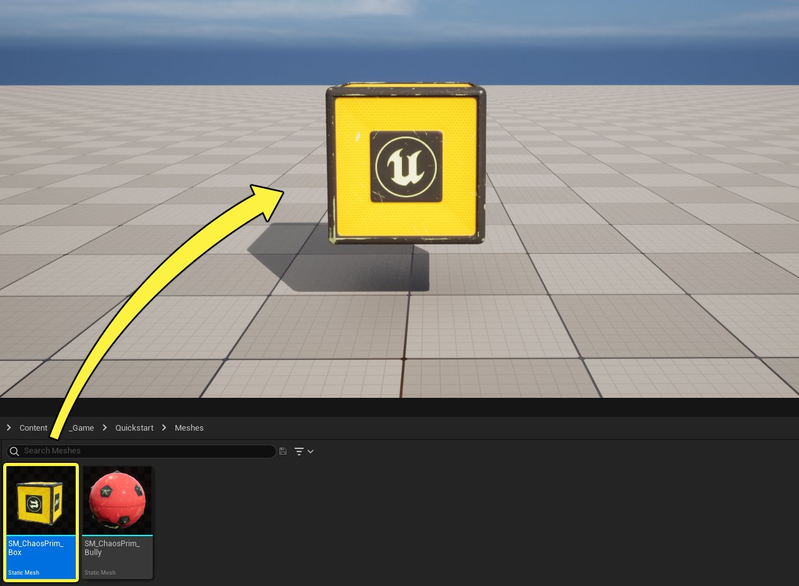
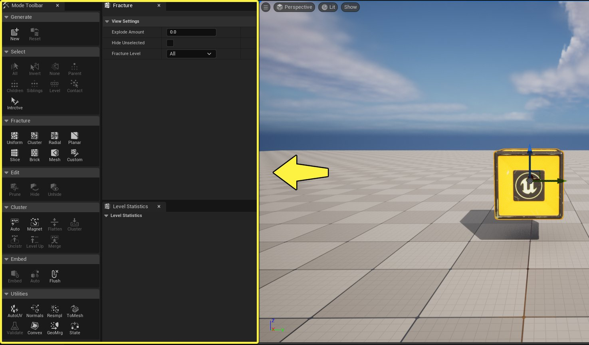
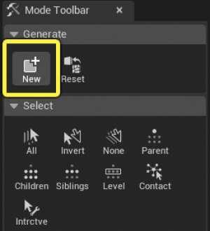
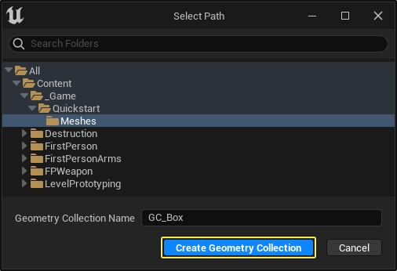
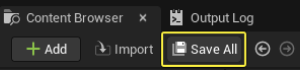

# 破坏快速入门

> 路径：虚幻引擎5.7文档 / Gameplay系统 / 物理 / Chaos破坏系统 / 破坏快速入门

> 原始页面：https://dev.epicgames.com/documentation/unreal-engine/destruction-quick-start

> [!NOTE]
> 你可以观看[Chaos破坏概述](https://dev.epicgames.com/community/learning/tutorials/BbX7/chaos-destruction-overview)教程，在开发人员社区站点中找到视频格式的类似信息。

## 1 - 必要设置

1. 新建项目并选择 **游戏（Games）** 类别和 **第一人称（First Person）** 模板。输入你的项目名称，点击 **创建（Create）** 。

   

   点击查看大图。
2. 在编辑器中，点击 **文件（File）> 新关卡（New Level）** 。选择 **基本（Basic）** 模板并点击 **创建（Create）** 。保存关卡。

   

### 阶段成果

在此分段中，你创建了新项目，并进行了设置，因此你可以添加一个静态网格体，并可按照本指南的下一分段使其破裂。

## 2 - 创建几何体集合

Chaos系统中的破坏开始于称为 **几何体集合（Geometry Collection）** 的一种新资产。这些资产可以利用一个或多个静态网格体构建，包括在蓝图甚至嵌入式蓝图中聚集到一起的那些静态网格体。

有了几何体集合之后，你可以使用 **破裂模式（Fracture Mode）** 将其拆开，并指定设置来确定拆开方式。

在本分段中，你将利用静态网格体Actor创建几何体集合。

1. 将静态网格体添加到关卡中，以用于创建破裂的网格体。在此示例中，我将使用Fab中提供的[内容示例](https://www.fab.com/listings/0281d63e-71f7-4e07-a344-5fa721ac4d35)项目中包含的Chaos图元盒体。

   

   点击查看大图。
2. 点击 **模式（Mode）** 下拉菜单，然后选择 **破裂（Fracture）** 。

   

   这将打开 **破裂模式（Fracture Mode）** 窗口，其中包含用于使网格体破裂的所有工具。你也可以按 **Shift-6** 切换到破裂模式。

   

   点击查看大图。
3. 转至 **生成（Generate）** 分段并点击 **新建（New）** ，创建新的 **几何体集合（Geometry Collection）** 。此新资产类型将保存在 **内容浏览器（Content Browser）** 中，并用于创建破裂的网格体。

   

   1. 选择几何体集合将保存到的 **目录位置** 。
   2. 输入几何体集合资产的名称。
   3. 点击 **创建几何体集合（Create Geometry Collection）** 。

      
   4. 点击 **内容浏览器（Content Browser）** 中的 **全部保存（Save All）** ，保存新的几何体集合资产。

      
4. 静态网格体将替换为关卡中的几何体集合。在 **破裂层级（Fracture Hierarchy）** 窗口中，你会看到几何体集合在层级中有单个节点。

   这意味着，几何体集合仅包含一个片段（单个节点）。随着你使几何体集合破裂，你会看到每个破裂的片段表示为层级中的单独叶（子）节点。此层级表示整个对象是如何破裂的，从单个结实片段到施加张力时会分开的各个片段。

   > 图片已省略：静态网格体将替换为关卡中的几何体集合

   > 图片已省略：undefined

   点击查看大图。

### 阶段成果

在本分段中，你学习了如何利用静态网格体Actor创建几何体集合。你还学习了如何在编辑器中启用破裂模式，并查看几何体集合的破裂层级。

在下一分段中，你将学习如何使几何体集合破裂。

## 3 - 使几何体集合破裂

本文提供了几种不同类型的破裂方法。将不同的技术组合起来，可能带来外观更有趣的破坏。你必须试验不同的选项和设置，以实现所需结果。

在本指南中，你将学习标准 **均匀Voronoi（Uniform Voronoi）** 方法。使用该方法时，你可定义最小和最大数量的站点，以创建单元格体积进行破裂。

1. 转到 **破裂（Fracture）** 分段，然后点击 **均匀（Uniform）** 破裂按钮。

   > 图片已省略：点击
2. 按所示保留默认设置，并点击 **破裂（Fracture）** 。

   > 图片已省略：点击
3. 几何体集合现已破裂，你可以在 **破裂层级（Fracture Hierarchy）** 窗口中看到新创建的节点（破裂的片段）。就本示例而言，你创建了20个节点。

   > 图片已省略：undefined

   点击查看大图。
4. 你可以转至 **关卡统计数据（Level Statistics）** 窗口，查看当前破裂层级。在此示例中，关卡0有1个片段，关卡1有20个片段。如果你继续进一步使几何体集合破裂，此窗口中将反映新结构。

   > 图片已省略：undefined

   点击查看大图。
5. 更改 **破裂（Fracture）** 窗口中的 **爆炸数量（Explode Amount）** 字段的值，可以预览几何体集合将如何破裂。

   > 图片已省略：undefined

   点击查看大图。
6. 在下面的示例中，你可以查看将字段中的值从0更改为1的结果。

   > 动图已省略：更改爆炸数量以预览几何体集合将如何破裂
7. 选择 **几何体集合（Geometry Collection）** 并将其移至高于地面。点击 **播放模式（Play Mode）** 选项按钮，并选择 **模拟（Simulate）** 或 **所选视口（Selected Viewport）** 查看结果。

   > 图片已省略：从
8. 你可以在下面看到所执行步骤的结果。

   > 动图已省略：盒体坠落地面并在撞击时破裂

### 阶段成果

在此分段中，你学习了如何使用 **破裂模式（Fracture Mode）** 通过标准均匀Voronoi方法使几何体集合破裂。

在下一分段中，你将学习如何射击几何体集合来销毁它。

## 4 - 射击几何体集合来销毁它

在本分段中，你将使用模板随附的第一人称步枪蓝图，射击并销毁你创建的几何体集合。

几何体集合的破裂片段会在足够张力施加到其 **连接图表（Connection Graph）** （破裂片段彼此连接的方式）时分开。

施加张力到几何体集合的最常见方式是使用[物理场](../../physics-fields/index.md)。在此示例中，你将使用虚幻引擎默认随附的预构建 **主场（Master Field）** 。你将在发射物的撞击位置生成此场，并且此场将导致几何体集合的片段分开。

1.在 **内容浏览器（Content Browser）** 中，转至 **第一人称（FirstPerson）> 蓝图（Blueprints）** 并将 **BP_Rifle** 拖入关卡中。在Gameplay期间，你可以拾取步枪并使用鼠标左键射击。

> 图片已省略：undefined

点击查看大图。

1. 在相同文件夹中，双击打开 **BP_FirstPersonProjectile** 。在 **事件图表（Event Graph）** 中，选择除了 **Event Hit** 之外的所有节点并将它们删除。

   > 图片已省略：undefined

   点击查看大图。
2. 拖移 **Event Hit** 节点，搜索并选择 **Spawn Actor from Class** 。

   > 图片已省略：拖移Event Hit节点，搜索并选择Spawn Actor from Class

   1. 点击 **Spawn Actor** 节点的 **类（Class）** 下拉菜单，搜索并选择 **FS_MasterField** 。

      > 图片已省略：点击Spawn Actor节点的
   2. 拖移 **Spawn Actor** 节点的 **生成变换（Spawn Transform）** 引脚并选择 **Make Transform** 。

      > 图片已省略：拖移Spawn Actor节点的
   3. 将 **Event Hit** 节点的 **击中位置（Hit Location）** 引脚连接到 **Make Transform** 节点的 **位置（Location）** 引脚。

      > 图片已省略：将Event Hit节点的
3. 拖移 **Spawn Actor** 节点的 **返回值（Return Value）** 引脚，搜索并选择 **Set Activation Type** 。

   > 图片已省略：拖移Spawn Actor节点的

   1. 将 **Spawn Actor** 节点连接到 **Activation Type** 节点。
   2. 点击 **激活类型（Activation Type）** 下拉菜单，然后选择 **触发（Trigger）** 。这会将主场设置为在触发时激活。

      > 图片已省略：点击
4. 拖移 **Spawn Actor** 节点的 **返回值（Return Value）** 引脚，搜索并选择 **CE Trigger** 。

   > 图片已省略：拖移Spawn Actor节点的
5. 将 **Activation Type** 节点连接到 **CE Trigger** 节点。**CE Trigger** 节点会立即激活主场。

   > 图片已省略：undefined

   点击查看大图。
6. 拖移 **CE Trigger** 节点，搜索并选择 **Delay** 。

   > 图片已省略：拖移CE Trigger节点，搜索并选择Delay
7. 拖移 **Delay** 节点，搜索并选择 **Destroy Actor** 。这会在撞击时短暂延迟后销毁发射物。

   > 图片已省略：拖移Delay节点，搜索并选择Destroy Actor
8. 完成的蓝图脚本应该如下所示：

   > 图片已省略：undefined

   点击查看大图。
9. 返回 **破裂模式（Fracture Mode）** 并选择几何体集合。按 **Shift-B** 切换几何体集合的骨骼颜色，以便你可以看到盒体材质。

   > 图片已省略：按shift B切换骨骼颜色
10. 按 **播放（Play）** 并移至步枪来拾取它。使用鼠标左键朝几何体集合中射击发射物并销毁它

    > 动图已省略：使用鼠标左键朝几何体集合射击发射物并销毁它

### 阶段成果

在此分段中，你学习了如何生成物理场来将张力施加到几何体集合，使其裂开。

## 5 - 自行尝试！

现在你知道了如何创建几何体集合并使其破裂了，你可以将所学知识应用于更复杂的例子。

下面还有一些示例可供你尝试：

- 使用多个静态网格体创建更复杂的几何体集合。
- 创建更多破裂级别并使用不同的破裂方法来创建更有趣的破坏模式。
- 通过组合多个几何体集合来构建更复杂的结构，并射击它们来销毁。

> 图片已省略：带有不同类型的破裂方法的几何体集合

## 后续步骤

你可以在开发人员社区站点中阅读"关键概念"文档或观看[Chaos破坏视频教程](../../physics-fields/index.md)，详细了解破裂模式和破坏系统。
