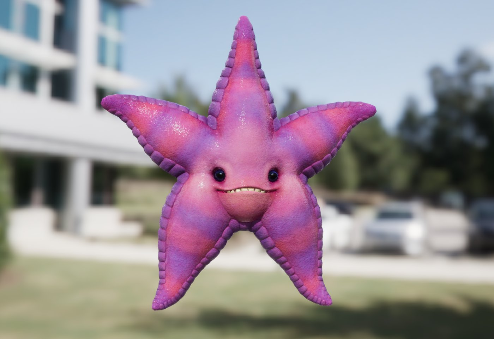
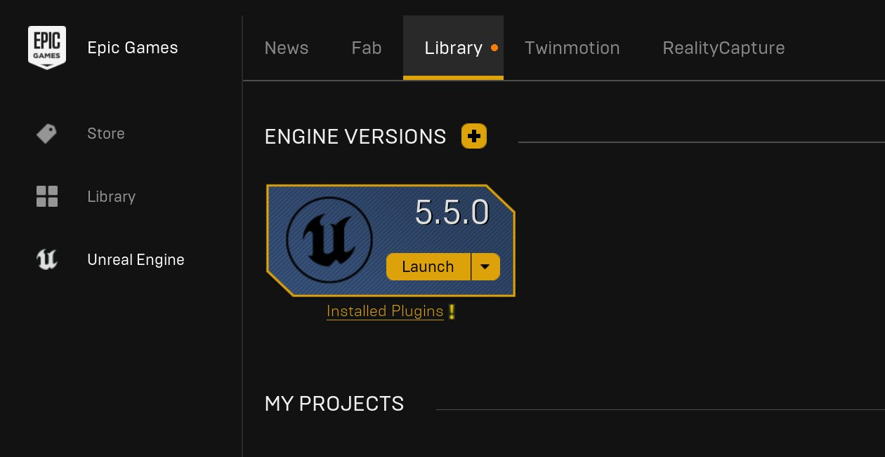
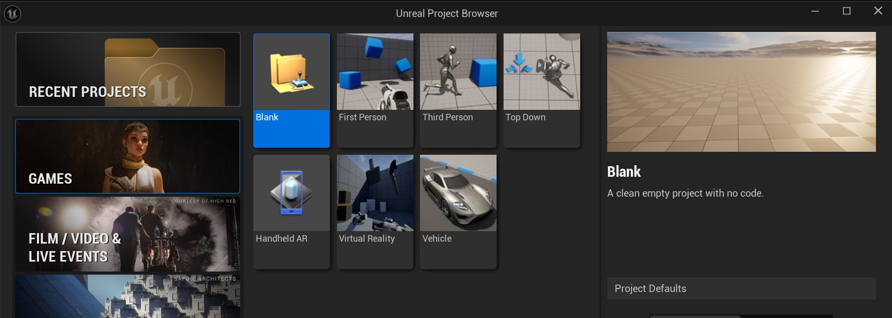
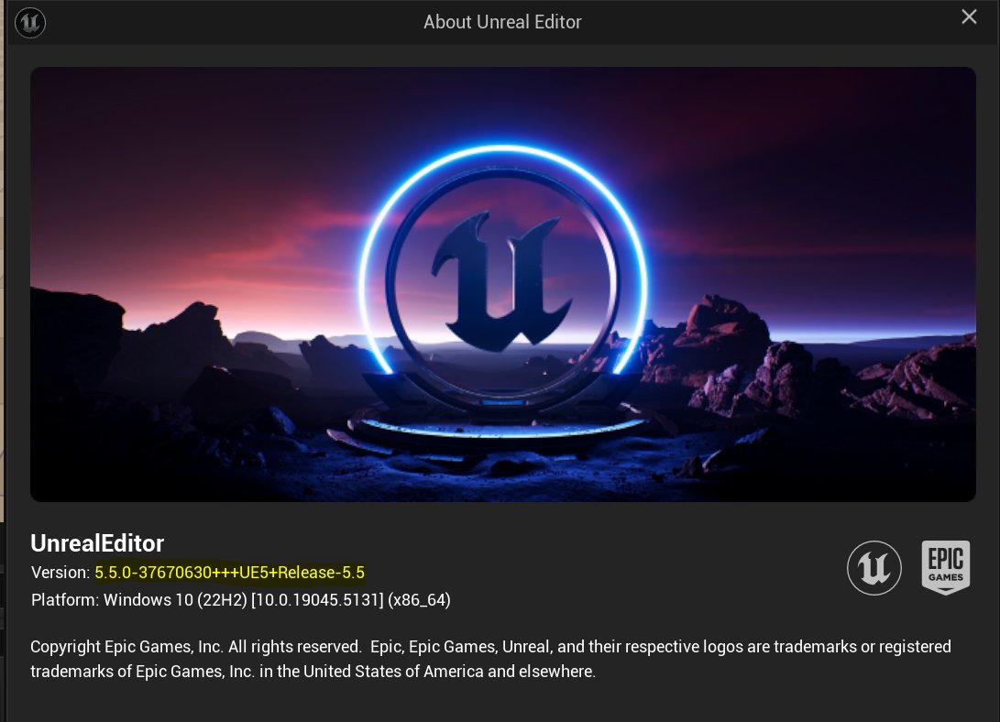
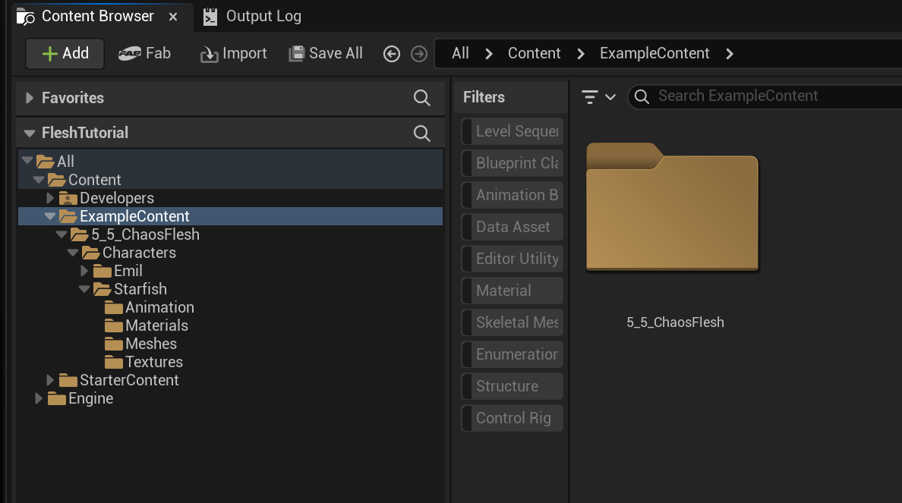
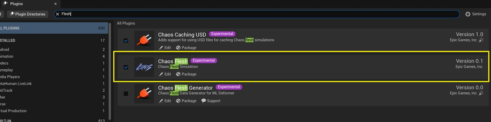
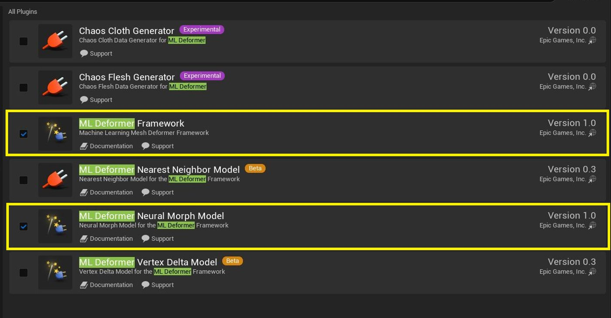

# Chaos Flesh Quickstart

> 路径：虚幻引擎5.7文档 / Gameplay系统 / 物理 / Chaos Flesh / Chaos Flesh Quickstart

> 原始页面：https://dev.epicgames.com/documentation/unreal-engine/chaos-flesh-quickstart

在本指南中，你将学习如何使用提供的海星资产设置 Chaos Flesh 模拟。

## 文件设置

### 示例文件参考

以下信息说明从哪里下载示例文件，以及应将它们放在项目中的什么位置。

### 从 Launcher 创建空白项目

要使用提供的文件，需要从 Launcher 创建一个空白 UE 项目。

### 编辑器版本

请确保使用版本 **5.5.0-37670630+++UE5+Release-5.5** 或更高版本。

### Zip 文件下载

[Download `Fleshtutorials-ExampleContent.7z`](https://d1iv7db44yhgxn.cloudfront.net/post-static-files/Fleshtutorials-ExampleContent.7z).

该文件还包含一个 `.fbx` 文件夹，用于本指南末尾的“Rig Bound Raycasts”小节。

### “Example Content”文件夹

解压 `Fleshtutorials-ExampleContent.zip` 文件。然后手动将解压出的 **ExampleContent** 文件夹移动到你的 **Content** 目录。

如果你已经有一个 **ExampleContent** 文件夹，可能来自此前跟随 Cloth 示例时创建，只需将 **5_5_ChaosFlesh** 文件夹从 `.zip` 文件拖入该 **ExampleContent** 文件夹。

## 加载插件

首先需要启用 **Chaos Flesh** 插件。

然后加载 **ML Deformer Framework** 和 **ML Deformer Neural Morph Model** 插件。

## 海星起步

### 快速设置

Flesh 系统使用四面体支撑结构实现体积弹性模拟。求解器会评估这些四面体，并提供支撑力，以尽量保持体积、防止角色表面在自身重量下塌陷。此示例说明如何从封闭 static mesh（一个简单立方体）创建四面体几何体，然后在虚幻引擎中模拟该资产。

### 导入海星

Flesh 模拟需要由表面几何体创建的四面体网格体。此示例说明如何从 FBX 文件导入几何体，并使用 dataflow 节点创建海星的四面体网格体。

## 约束

### 导入 Flesh Asset 与简单运动学

Kinematic constraint 允许美术通过动画控制顶点。运动学定义在四面体顶点上。当顶点被定义为 kinematic 时，该顶点的质量属性会设为无限质量，并且不会被模拟。Kinematic 顶点可作为动力学的边界条件，与其连接的自由顶点会由运动学运动驱动。此示例说明如何绘制并以运动学方式约束粒子，使其相对于组件位置固定在空间中。

### 顶点属性传递

四面体网格体容易受到变更影响，任何拓扑变化都会使四面体网格体上的绘制进度失效。此示例展示如何在 skeletal mesh 上绘制，并将顶点属性（绘制属性和颜色）传递到四面体网格体上。

### 运动学骨架约束

骨架变换也可用于定义运动学。典型用例是将 Flesh Component 附加到骨架上。当 Flesh Component 与骨架位于同一本地空间时，与骨架（父子线段）相交的四面体顶点会受到运动学约束。此示例展示如何基于共位骨架，在海星资产上自动定义 kinematic 顶点。

### 动画运动学约束

当 kinematic 顶点约束到动画骨架时，四面体几何体会受骨架运动驱动。此示例展示如何设置由动画变换层级驱动的 flesh mesh。

### 弱约束

位置目标，也就是 weak constraint，是将几何体约束到目标位置的另一种方式。weak constraint 与 kinematic constraint 的区别在于，weak constraint 具有刚度，允许相对实际目标产生轻微滑移。向过度约束的环境中引入 weak constraint 后，模拟可以找到平滑且视觉上可接受的合理状态。此示例展示如何使用 weak constraint 将 flesh asset 绑定到 kinematic joint target。

## 碰撞

### 世界碰撞

四面体求解器独立于主世界求解器执行。与 Chaos Cloth 求解器类似，针对四面体几何体的任何碰撞都需要在模拟期间添加。此演示将说明如何使用附加到 Flesh 求解器的碰撞管理器，在模拟开始时添加碰撞体。

### 流式碰撞

针对世界几何体的碰撞目前通过流式系统实现。四面体求解器可以响应有限的一组碰撞类型，这些碰撞应根据与四面体模拟的距离加载和释放。针对四面体求解器的碰撞实现为顶点对刚体体积的碰撞，因此随着四面体分辨率提高，碰撞响应的计算成本也会增加。

目前求解器支持凸形以及少数解析类型（球体、立方体、平面），并且碰撞仅为单向，从刚体作用到四面体。这意味着四面体不会影响刚体状态，而刚体实际上是一个 kinematic、无限质量的交互对象。通常，刚体的位置和速度会由主刚体求解器计算，flesh 只会对刚体运动做出反应。

## Blueprint Asset 与 Mesh Deformer

Flesh asset 可以变形嵌入的 skeletal mesh。使用 flesh asset dataflow graph 中的“GenerateSurfaceBindings”节点，在 skeletal mesh 的渲染表面与四面体网格体之间建立对应数据。然后在 skeletal mesh 上使用“DG_FleshDeformer”，将四面体网格体的变形应用到 skeletal mesh。

如果 deformer 看起来没有工作，请检查日志获取更多信息。一个潜在问题是 actor 拥有多个 flesh component，此时需要告诉 deformer 哪个 skeletal mesh 应由哪个 flesh asset 变形。可通过设置可选的 **TransformSelection** 或 **GeometryGroupGuids** 来消除歧义，这些选项位于 **GenerateSurfaceBindings** 节点中。另一个需要检查的是 flesh asset（rest collection）是否使用以下项绑定到了正确的 skeletal mesh： **GenerateSurfaceBindings**。当然，如果渲染表面或四面体网格体的拓扑发生变化，需要重新生成绑定。没有绑定的渲染点会被蒙皮。如果 deformer 留下了一些点，要么是它们没有绑定，要么是被遮罩掉了（目前仅在没有绑定时会这样做，但未来会提供用于遮罩的 dataflow 节点）。

## 逐粒子属性

四面体求解器使用的许多模拟属性都是逐粒子的。例如，质量可以在整个网格体上变化，并会保存在被模拟四面体的顶点上。这允许均匀性不同的四面体网格体在网格体体积内拥有均匀质量分布。质量只是逐粒子属性的一个例子，它说明存储在粒子上的每个属性都可以在资产设置中配置。此演示将展示如何使用 field 在四面体上设置逐粒子属性。

## 在 Blueprint 中生成与销毁

Flesh asset 也可以在蓝图操作期间生成。Blueprint Actor 的工作方式类似 Skeletal Mesh Actor：创建一个 Flesh component 并将其与 Flesh Asset 关联。随后可以使用 Spawn Actor 和 Destroy Actor 蓝图节点，向模拟中动态添加或移除 blueprint actor。

## 采样模拟结果

虽然 Flesh Component 的渲染显示会展示整个四面体模拟结果，但有时只采样模拟变形的一个子集会很有用。例如，Electric Dreams Demo 中 Nanite 网格体的 world position offset（WPO）渲染，是通过采样轮胎表面附近的位置，并将其映射到一张纹理中，在 GPU 上置换轮胎几何体实现的。此演示将说明如何从变形结果中插值出可在 gameplay 期间访问的采样集。

## 缓存

### Dataflow 缓存与 ML Deformer

Flesh 模拟可能成本很高。低分辨率资产可以在游戏中运行，但要在高分辨率几何体上获得结果，四面体模拟无法实时运行。缓存系统允许美术记录模拟结果，并在 dataflow graph 中回放它们。也可以从缓存生成 Geometry Cache，作为 ML Deformer 的训练数据。此示例说明如何缓存模拟结果、生成 Geometry Cache 并训练 ML Deformer。

## 在编辑器中缓存

也可以在编辑器中缓存，并在 level sequence 中查看回放。此示例说明如何缓存模拟的 flesh asset（或 blueprint），并详细检查模拟结果。

## 模拟属性

Chaos Flesh 系统中的模拟属性分布在多个位置。Tetrahedral Solver 具有影响整个模拟系统的属性，例如允许用户配置时间步进、线程属性以及碰撞控制。Flesh Actor 上的属性用于配置资产的单个实例，而基于 Dataflow 的属性用于配置资产本身。此演示会介绍若干更重要的模拟属性，并概述可以在哪里找到特定类型的控制项。

## 绑定到 Rig 的射线检测

> [!NOTE]
> 请使用 [Zip 文件下载](#zipfiledownload) 中提供的 `.fbx` 文件来跟随本指南此小节操作。

绑定到 rig 的射线检测允许某些类型的对象与环境中的静态几何体交互。射线检测方法不是通用环境碰撞设置，但在特定设置下可让可变形体响应场景几何体。例如，此设置曾用于 [Electric Dreams Demo](https://www.youtube.com/watch?v=teTroOAGZjM&t=8752s) 中，使轮胎能够响应场景几何体。

要使用此方法，需要满足几个要求。raycast 顶点需要相对于模型中的某个变换位置呈凸形，四面体组件需要包含在 skeletal mesh blueprint 中，并且资产需要以运动学方式约束到骨架。由于碰撞响应的实现方式，raycast 原点必须来自模型内部点，碰撞响应会逆着 raycast 方向将顶点平移到内部原点。

## 高级工作流

请参阅 [用于肌肉模拟的 Chaos Flesh](https://dev.epicgames.com/community/learning/tutorials/W4mV/unreal-engine-chaos-flesh-emil-muscle-tutorial-5-5) 了解如何使用 Chaos Flesh 设置肌肉和脂肪模拟。
