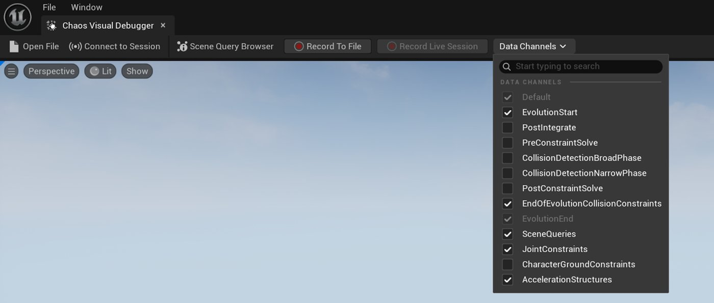
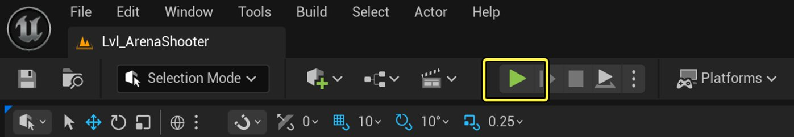
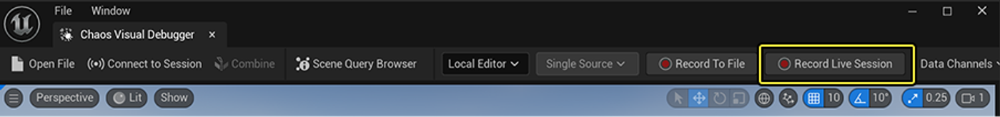
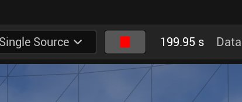
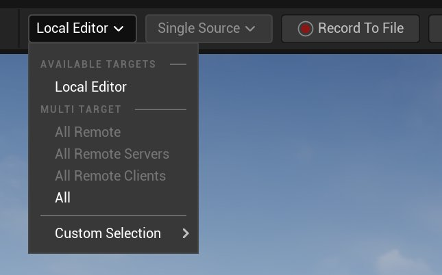

# 录制实时会话

> 路径：虚幻引擎5.7文档 / Gameplay系统 / 物理 / Chaos可视调试器 / 使用Chaos可视调试器捕获数据 / 录制实时会话

> 原始页面：https://dev.epicgames.com/documentation/unreal-engine/live-debugging-with-chaos-visual-debugger

在本教程中，你将学习如何使用**[Chaos可视调试器](../../index.md)**（**CVD**）录制并实时播放应用程序。 与[录制到文件](../recording-to-file/index.md)不同，实时会话录制可以在**本地**（在你的计算机上）或**远程**（通过网络）进行。 这对于随时随地的实时调试而言非常有用，同时还能将录制内容保存为`.utrace`文件，以供之后查看和分享。

> 动图已省略：录制实时会话

## 录制实时会话

本节将为你介绍如何使用本地编辑器目标预设录制PIE会话，以及录制其他所有目标类型的过程。

### 本地编辑器

要在本地或远程机器上录制并播放实时的PIE会话，请执行以下操作：

1. 转到CVD，勾选你想要录制的数据通道。

   
2. 转到虚幻编辑器，点击主工具栏中的**运行**按钮以开始一段PIE会话。 你可以在CVD中开始录制前或之后启动该PIE会话

   
3. 本地编辑器目标默认选中，因此你可以直接点击**录制实时会话（Record Live Session）**以开始录制。 录制时，该按钮将变为红色的录制图标。

   
4. 要停止录制，请高亮录制图标并点击红色方块图标。 此流程将输出一份单独的`.utrace`文件。

   

   > [!TIP]
   > 如果你当前已在录制，可以直接退出当前PIE会话并开始新会话，CVD会直接连接到新会话。

### 所有其他目标

要在本地或远程机器上录制并播放游戏客户端、服务器或已打包构建，请执行以下操作：

1. 检查你的目标应用程序是否正在运行。
2. 勾选你想要录制的数据通道。

   
3. 要选择录制目标，请转到CVD的主工具栏，点击**会话目标（Session Target）**下拉菜单并选择你的目标。

   
4. 要开始录制，请转到CVD主工具栏，点击**录制实时会话（Record Live Session）**。 录制时，该按钮将变为红色的录制图标。

   
5. 要停止录制，请高亮录制图标并点击红色方块图标。 此流程将输出单份或多份`.utrace`文件。

   

> [!TIP]
> 游戏客户端和CVD会争用GPU资源。 如果在CVD中播放困难，你可以限制游戏客户端的帧率，或降低图像质量。

## （旧有）使用命令行界面录制实时会话

推荐使用CVD的UI来开始和结束录制，不过你也可以使用命令行录制PIE会话、游戏客户端和服务器以及已打包构建。 会话可以是本地会话（在同一工作站中，甚至同一PIE实例中），也可以是网络会话。

### 启用数据通道

1. 要修改数据通道，请在目标应用程序中打开命令行。 如果是已打包构建，请按**反引号**（`）。
2. 输入以下控制台命令，确保将`[newstate]`替换为true或false，将`[channelname]`替换为你想要的数据通道：

   `p.Chaos.VD.SetCVDDataChannelEnabled [newstate] [channelname]`

   例如：

   > 图片已省略：实时录制（控制台）
3. 按**Enter**执行命令。

### 启用多个数据通道

列出多个通道（以逗号分隔）即可启用或禁用它们。 下方示例启用了**PostIntegrate**和**Scene Queries**通道：

`p.Chaos.VD.SetCVDDataChannelEnabled true SceneQueries,PostIntegrate`

> 图片已省略：实时录制多个通道（控制台）

### 启用预定义数据通道

如果你想要使用预定义的已启用通道集打开游戏客户端或服务器，请添加下列命令行参数：

`CVDDataChannelsOverride=[ChannelName1,ChannelName2]`

下方示例启用了Integrate和Scene Queries通道：

`CVDDataChannelsOverride=SceneQueries,PostIntegrate`

### 使用命令行开始录制

1. 要开始录制，请打开命令行。
2. 如果你使用的是本地机器，请输入以下命令并按**Enter**执行：

   `p.Chaos.StartVDRecording Server`

   > 图片已省略：开始录制服务器（控制台）

   如果你使用的是远程机器，请输入以下命令并按**Enter**执行：

   `p.Chaos.StartVDRecording Server [YOURWORKSTATIONIP]`
3. 转到CVD的主工具栏，点击**连接到会话（Connect To Session）**。 转到**实时会话浏览器（Live Session Browser）**，找到**已选择实时会话（Selected Live Session）**，选择本地追踪存储中运行的可用实时会话。
4. （可选）如果你连接了多个目标，请从**连接模式（Connection Mode）**下拉菜单中选择**多个源（Multi Source）**。

   > 图片已省略：多源连接模式
5. 在**实时会话浏览器（Live Session Browser）对话框**中点击**连接到会话（Connect to Session）**。 录制开始后，屏幕上会显示字符串**Chaos可视调试器正在录制…（Chaos Visual Debugger recording in progress）**。

   > 图片已省略：录制字符串
6. 要停止录制，请打开命令行。 如果你使用的是本地机器，请输入以下命令并按**Enter**：

   `p.Chaos.StopVDRecording Server`

   > 图片已省略：停止录制服务器（控制台）

   如果你使用的是远程机器，请输入：

   `p.Chaos.StopVDRecording Server [YOURWORKSTATIONIP]`

## 下一步

在接下来的教程中，你将学习如何找到你的`.utrace`文件并播放你的录制内容。

- [在Chaos可视调试器中播放](../playback-in-chaos-visual-debugger/index.md) - 在Chaos可视调试器中播放录制内容。
