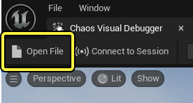
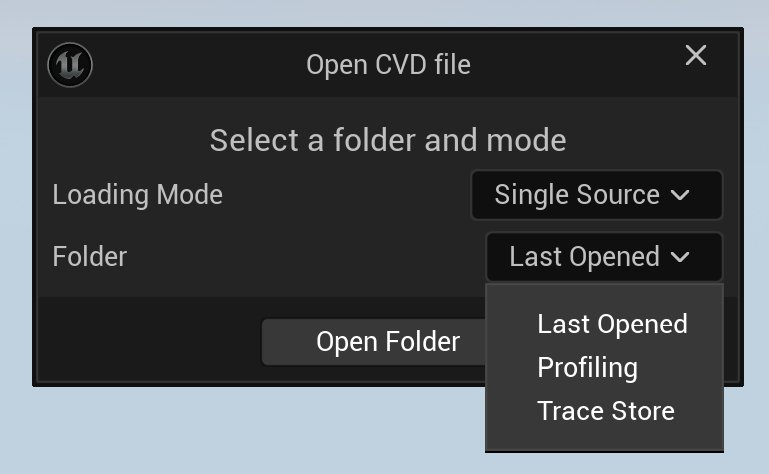
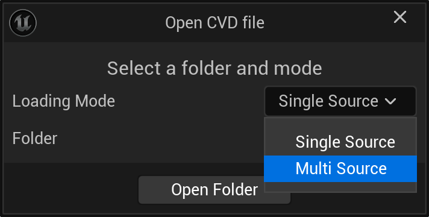
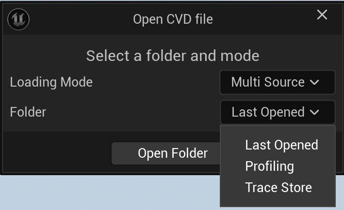
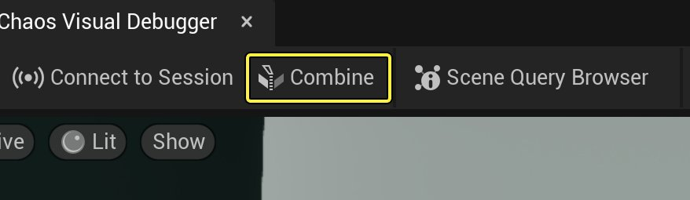
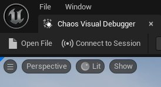

# 在Chaos可视调试器中播放

> 路径：虚幻引擎5.7文档 / Gameplay系统 / 物理 / Chaos可视调试器 / 使用Chaos可视调试器捕获数据 / 在Chaos可视调试器中播放

> 原始页面：https://dev.epicgames.com/documentation/unreal-engine/playback-in-chaos-visual-debugger

**[Chaos可视调试器](../../index.md)**（**CVD**）会将录制内容保存为两种文件：

- `.utrace`（通过保存单源录制内容而生成。）
- `.cvdmulti`（通过合并多个`.utrace`文件而生成）。

本文将介绍如何找到`.utrace`和`.cvdmulti`文件，并将其加载到CVD中，从而进行：

- [单源录制](index.md#single-source-recordings)
- [多源录制](index.md#multi-source-recordings)

## 加载单源录制

> 动图已省略：单源录制

CVD会将`.utrace`文件存储在磁盘上的不同位置，具体取决于文件的录制方式和被录制的应用程序类型：

| 应用程序类型 | 磁盘位置 | 示例 |
| --- | --- | --- |
| PIE会话游戏客户端游戏服务器 | 项目文件夹中。 例如：`[ProjectFolder]/Saved/Profiling` | [PIE会话文件夹路径](https://dev.epicgames.com/community/api/documentation/image/8c2a3159-bd58-4b11-9f93-b946dc86fe6e?resizing_type=fit) |
| 已打包构建 | 项目构建的文件夹中。 例如：`[BuildFolder]/[Platform]/Saved/Profiling` | [已打包构建文件的路径](https://dev.epicgames.com/community/api/documentation/image/bb01d16e-6e9c-455f-aacd-69cde2761287?resizing_type=fit) |
| 实时录制 | 在Unreal Trace文件夹内。 例如：`UnrealEngine/Common/UnrealTrace/Store/001/` | [实时录制文件夹路径](https://dev.epicgames.com/community/api/documentation/image/7ed59313-3d4a-477e-b772-1cf4ab43c95f?resizing_type=fit) |

### 加载UTRACE文件

要加载录制内容，请执行以下操作：

1. 转到CVD的主工具栏，点击**打开文件（Open File）**。

   
2. 在**打开CVD文件（Open CVD File）**对话框中，**加载模式（Loading Mode）**默认为**单源（Single Source）**，因此你无需更改此选项。 打开**文件夹（Folder）**下拉菜单，选择存储录制内容所在的文件夹。 点击**打开文件夹（Open Folder）**。

   
3. 选择你要加载的`.utrace`文件并点击**打开（Open）**。

## 加载多源录制

> 动图已省略：多源录制

### 加载多个UTRACE文件

加载多份单源录制内容是创建CVDMULTI文件的第一步。 此外，这还有助于同时可视化两份单源录制内容，以检查是否存在差异。 要加载多份`.utrace`文件，请执行以下操作：

1. 转到CVD的主工具栏，点击"打开文件（Open File）"。

   
2. 转到**打开CVD文件（Open CVD file）**对话框，找到"加载模式（Loading Mode）"下拉菜单，选择**多源（Multi-Source）**。

   
3. 打开**文件夹（Folder）**下拉菜单，选择包含录制内容的文件夹。 点击**打开文件夹（Open Folder）**。

   
4. 选择你要加载的`.utrace`文件并点击**打开（Open）**。 CVD会同时自动加载两份文件。

### 创建一份CVDMULTI文件

CVD加载了两份`.utrace`文件后，主工具栏上的**合并（Combine）**按钮将可用。 点击**合并（Combine）**并将新的`.cvdmulti`文件保存到合适的位置。

### 加载CVDMULTI文件

要加载`.cdmulti`文件，请执行以下操作：

1. 转到CVD的主工具栏，点击**打开文件（Open File）**。

   
2. 转到**打开CVD文件（Open CVD file）**对话框，确认**加载模式（Loading Mode）**为**单源（Single Source）**。 打开**文件夹（Folder）**下拉菜单，选择包含录制内容的文件夹。点击**打开文件夹（Open Folder）**。

   
3. 选择待加载的`.cvdmulti`文件并点击**打开（Open）**。

> [!NOTE]
> 存在一个已知问题，即文件加载后不会自动播放第一帧。 要点击**游戏帧时间轴**的**播放**图标才会生成几何体。
>
> > 图片已省略：游戏帧时间轴播放
