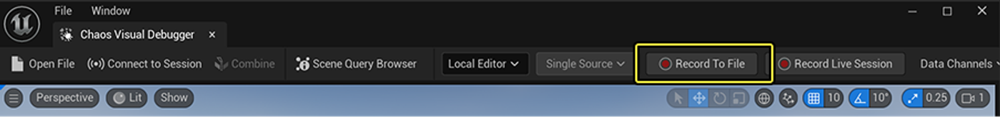

# 录制到文件

> 路径：虚幻引擎5.7文档 / Gameplay系统 / 物理 / Chaos可视调试器 / 使用Chaos可视调试器捕获数据 / 录制到文件

> 原始页面：https://dev.epicgames.com/documentation/unreal-engine/recording-to-file

在本教程中，你将学习如何在**[Chaos可视调试器](../../index.md)**（**CVD**）中录制可视化效果，并将其保存为`.utrace`文件以供日后调试。 录制到文件的做法能帮你避免因实时播放而产生性能开销。

如需详细了解如何实时录制可视化效果，请参阅[录制实时会话](../live-debugging-with-chaos-visual-debugger/index.md)。

## 使用UI开始录制

本节将为你介绍如何使用本地编辑器目标预设录制PIE会话，以及录制其他所有目标类型的过程。

### 本地编辑器

要录制并播放本地PIE会话，请执行以下操作：

1. 在CVD中，转到**数据通道（Data Channels）**菜单，勾选你想要录制的数据通道。

   
2. 转到虚幻编辑器，点击主工具栏中的**运行**按钮以开始一段PIE会话。 你可以选择在CVD中开始录制前或之后启动该PIE会话。

   
3. 目标本地编辑器会默认选中，因此你可以直接点击**录制到文件（Record to File）**以开始录制。 录制时，该按钮将变为红色的录制图标。

   
4. 要停止录制，将鼠标停留在录制图标上并点击红色方块图标即可。

   
5. 此流程将输出一份单独的`.utrace`文件，录制后，点击对话框中的**是（Yes）**即可立刻将其加载。

> [!TIP]
> 如果你当前已在录制，可以直接退出当前PIE会话并开始新会话，CVD会直接连接到新会话。

### 所有其他目标

要录制所有其他目标类型，请执行以下操作：

1. 检查你的目标应用程序是否正在运行。
2. 转到CVD，勾选你想要录制的数据通道。

   
3. 要选择待录制的目标，请点击CVD主工具栏中的**会话目标（Session Target）**下拉菜单，然后选择预设或自定义目标。

   
4. 要开始录制，请转到CVD主工具栏，点击**录制到文件（Record to File）**。 录制时，该按钮将变为红色的录制图标。

   
5. 要停止录制，请高亮录制图标并点击红色方块图标。

   

此流程会输出一份或多份`.utrace`文件，具体取决于你录制的是单一还是多个目标。 如果录制的是多个目标，则提示你加载录制内容的对话框将不会出现。

## （旧有）使用命令行界面录制到文件

推荐使用CVD的UI来开始和结束录制，不过你也可以使用命令行录制PIE会话、游戏客户端和服务器以及已打包构建。

### 启用数据通道

1. 要修改数据通道，请在目标应用程序中打开命令行。 如果是已打包构建，请按**反引号**（`）。
2. 输入以下控制台命令，将`[newstate]`替换为true或false，将`[channelname]`替换为你想要的数据通道：

   `p.Chaos.VD.SetCVDDataChannelEnabled [newstate] [channelname]`

   例如：

   > 图片已省略：旧版录制到文件
3. 按**Enter**执行命令。

### 启用多个数据通道

列出多个通道（以逗号分隔）即可启用或禁用它们。 下方示例启用了**PostIntegrate**和**Scene Queries**通道：

`p.Chaos.VD.SetCVDDataChannelEnabled true SceneQueries,PostIntegrate`

> 图片已省略：旧版多通道

### 启用预定义数据通道

要使用预定义的已启用通道集打开游戏客户端或服务器，请添加下列命令行参数：

`CVDDataChannelsOverride=[ChannelName1,ChannelName2]`

下方示例启用了Integrate和Scene Queries通道：

`CVDDataChannelsOverride=SceneQueries,PostIntegrate`

### 使用命令行开始录制

1. 要开始录制，请在目标应用程序中打开命令行。 如果你运行的是已打包构建，请按**反引号**（`）。
2. 输入以下命令并按**Enter**执行：

   `p.Chaos.StartVDRecording`

   > 图片已省略：开始录制（控制台）

   > 动图已省略：开始录制（旧版）

   录制开始后，屏幕上会显示字符串"Chaos可视调试器正在录制（Chaos Visual Debugger recording in progress）…"。

   > 图片已省略：正在录制字符串
3. 要停止录制，请打开命令行并输入下列命令，然后按Enter执行。

   `p.Chaos.StopVDRecording`

   > 图片已省略：停止录制（控制台）

## 下一步

在接下来的教程中，你将学习如何找到你的`.utrace`文件并播放你的录制内容。

- [录制实时会话](../live-debugging-with-chaos-visual-debugger/index.md) - 使用Chaos可视调试器录制实时会话

- [在Chaos可视调试器中播放](../playback-in-chaos-visual-debugger/index.md) - 在Chaos可视调试器中播放录制内容。
