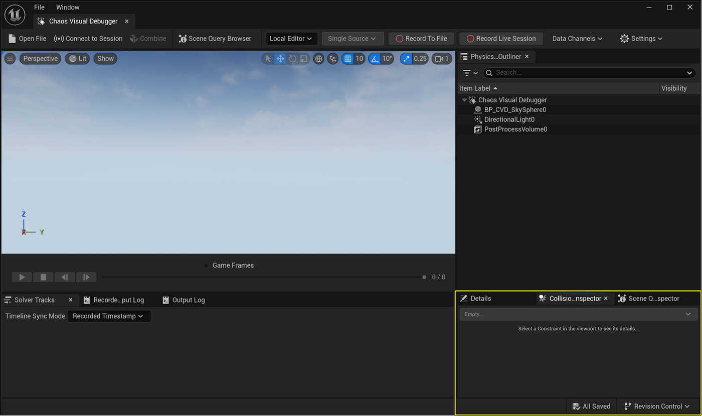
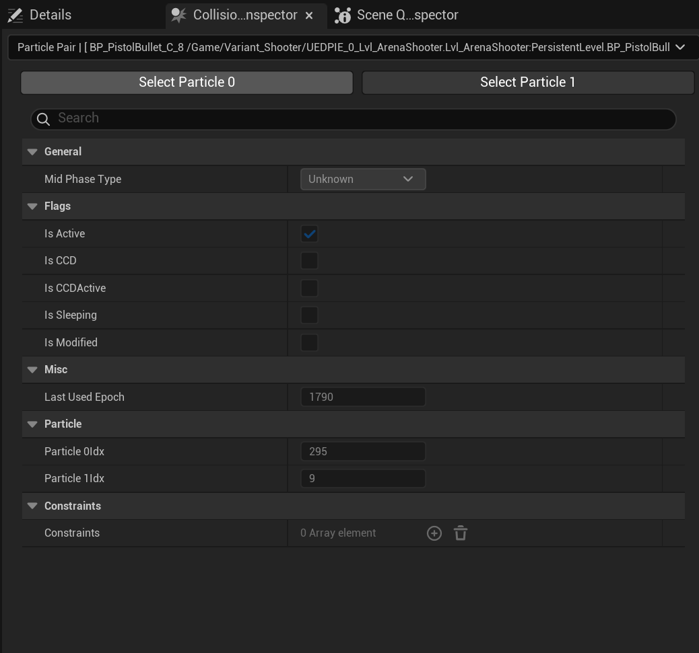
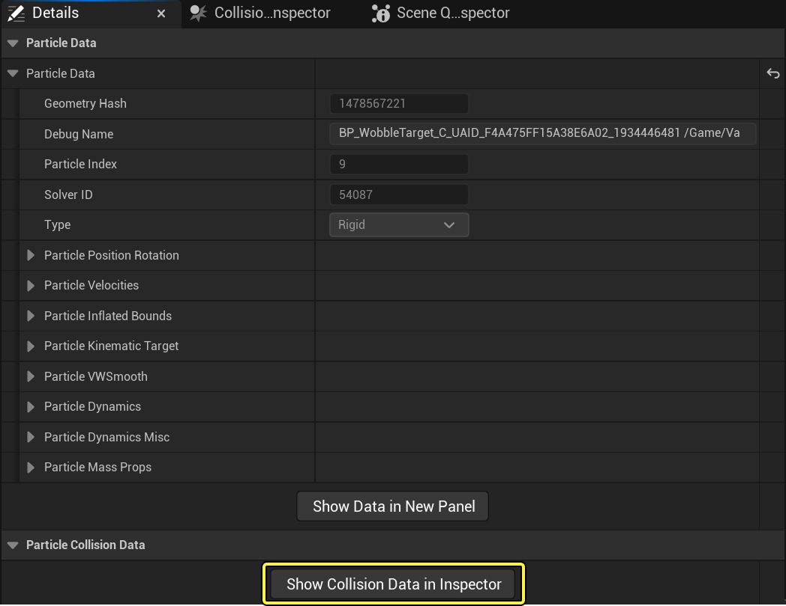
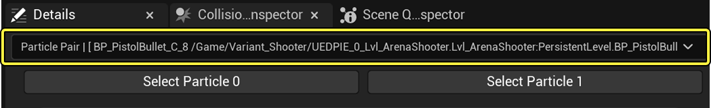
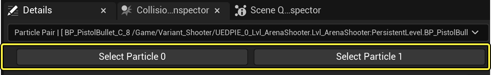
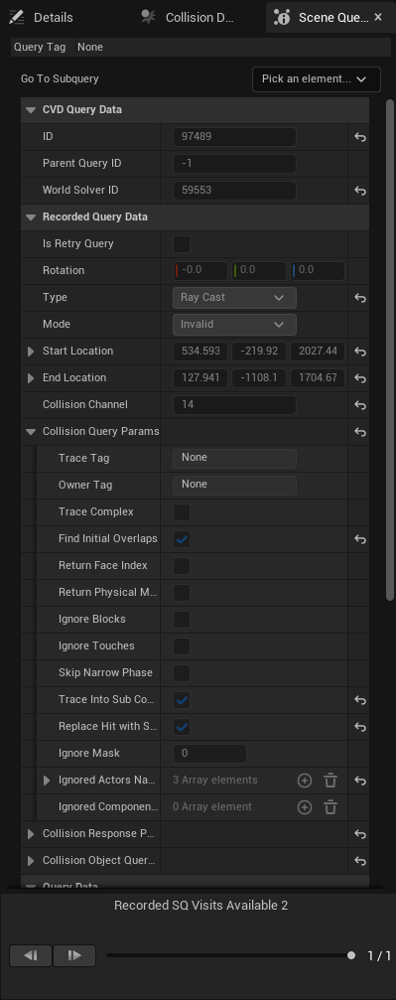
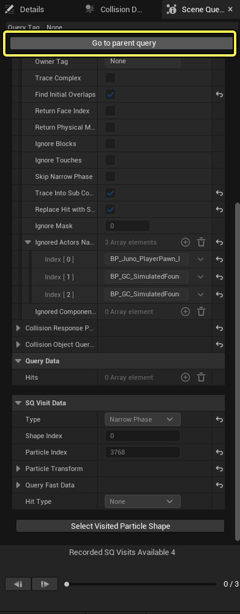
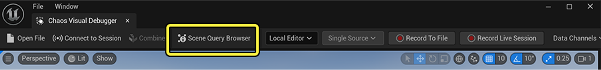

# 数据检视器

> 路径：虚幻引擎5.7文档 / Gameplay系统 / 物理 / Chaos可视调试器 / Chaos可视调试器入门指南 / 数据检视器

> 原始页面：https://dev.epicgames.com/documentation/unreal-engine/data-inspectors-in-chaos-visual-debugger

**[Chaos可视调试器](../../index.md)**（**CVD**）会在CVD界面的右下角显示**细节**面板和**数据检视器**选项卡的数据。

各数据类别都有专用的数据检视器：

- [粒子数据（细节面板）](index.md#particle-data-details-panel)
- [碰撞数据](index.md#collision-data-inspector)
- [场景查询](index.md#scene-query-inspector)
- [关节约束数据](index.md#joint-constraint-data-inspector)

## 粒子数据（细节面板）

**细节（Details）**面板充当了粒子数据的数据检视器。 在CVD的语境中，粒子通常指刚体。

当你在视口或**大纲视图**中选择一个粒子时，细节面板会显示该粒子的所有已录制数据。 与碰撞接触或场景查询不同，当你使用CVD的播放功能按钮时，所选粒子的数据会在检查器中保留。

> [!TIP]
> 若所选粒子包含碰撞数据，细节面板底部会出现**显示碰撞数据检视器（Show Collision Data Inspector）**上下文按钮。 该按钮会将所选粒子的数据填充到碰撞数据检视器中。

|  |  |
| --- | --- |
| [静态粒子数据](https://dev.epicgames.com/community/api/documentation/image/03a3a24c-bdf0-415b-86c9-64c02b1f7782?resizing_type=fit) | [动态粒子数据](https://dev.epicgames.com/community/api/documentation/image/1e78373c-4a23-4852-aa51-62843c1cfa0b?resizing_type=fit) |
| *所选动态粒子的细节面板。* | *所选静态粒子的细节面板。* |

## 碰撞数据检视器

**碰撞数据检视器（Collision Data Inspector）**将显示所选**粒子**、**接触点**（两个碰撞形状重叠的点）或**碰撞对**（两个相互碰撞的粒子）的信息。

由于接触点逐帧生成，当你使用CVD的播放功能按钮时，当前检视的碰撞数据就会过期。 因此，碰撞数据检视器仅显示播放期间最后选择的接触点数据。

要为碰撞数据检视器填充碰撞对信息，请执行以下操作：

1. 转到视口，选择带碰撞数据的粒子。
2. 点击**细节**面板底部的**显示碰撞数据检视器（Show Collision Data Inspector）**上下文按钮。

   

   这将用粒子的数据填充碰撞数据检视器，包括可用碰撞对的下拉菜单。

   
3. 选择你想要检视的碰撞对。
4. 要识别细节面板、大纲视图以及视口中的各粒子，请点击**选择粒子0（Select Particle 0）**或**选择粒子1（Select Particle 1）**按钮。

   

## 场景查询检视器

**场景查询检视器（Scene Query Inspector）**将显示视口中选定的可视化查询的信息。 此检视器拥有自己的时间轴，可依次展示查询过程中求值的对象。

若CVD检测到所选查询已执行（或本身就是）子查询，则显示**转到父查询（Go to parent query）**上下文按钮。 使用此按钮即可前往父查询。

### 场景查询浏览器

**场景查询浏览器（Scene Query Browser）**是一款用于检视场景查询的多功能浏览器。 要访问场景查询浏览器，请点击CVD主工具栏中的**场景查询浏览器（Scene Query Browser）**。

> 图片已省略：场景查询浏览器UI

| 编号 | 说明 |
| --- | --- |
| 1 | 启用场景查询数据标记，即**显示（Show） > 场景查询数据标记（Scene Query Data Flags）**中的那些标记。 |
| 2 | 开关视口调试文本（如果有）。在**世界空间**或**前景**中绘制数据（始终置于其他场景组件之上）。即**显示（Show） > 场景查询可视化设置（Scene Query Visualization Settings）**中的那些选项。 |
| 3 | 按**追踪标签（Trace Tag）**、**追踪拥有者（Trace Owner）**、**查询类型（Query** **Type）**或**解算器名称（Solver Name）**过滤查询。 |
| 4 | **所有启用的查询（All Enabled Queries）**：可视化所有被录制的查询。**每个解算器录制顺序（Per Solver Recording Order）**：将查询逐个可视化并启用"录制场景查询（Recorded Scene Queries）"时间轴（见下图）。 |
| 5 | 在录制的查询之间导航。 若单帧中同一位置发生多个场景查询，此操作将非常有用。 |

## 关节约束数据检视器

关节约束数据检视器（Joint Constraint Data Inspector）将显示视口中所选关节的[关节状态和关节设置](../../../physics-constraints/constraints-user-guide/index.md)数据。 此检视器中的数据会随着你使用CVD的播放控制按钮浏览内容而更新。

> 图片已省略：关节约束检视器

## 下一步

- [使用Chaos可视调试器捕获数据](../../capturing-data-with-chaos-visual-debugger/index.md) - 使用Chaos可视调试器捕获并播放录制内容。
