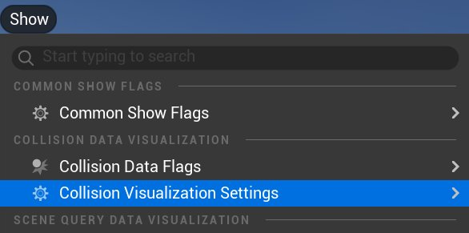
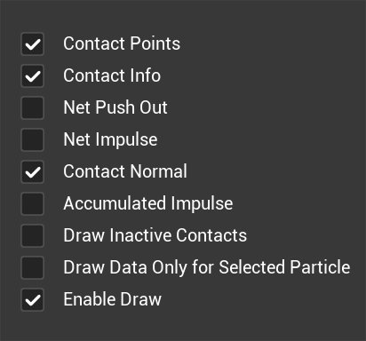
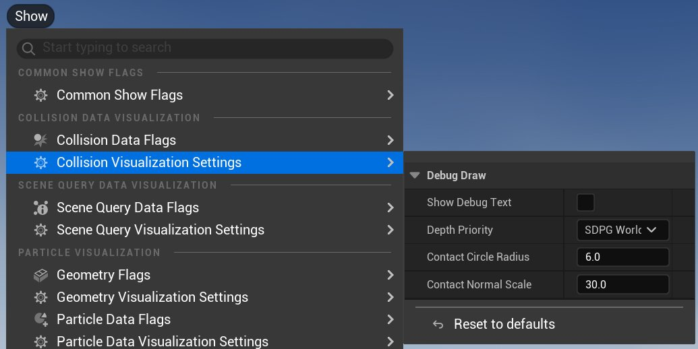
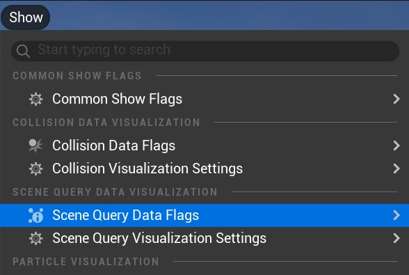
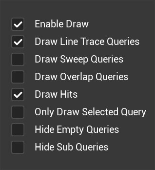
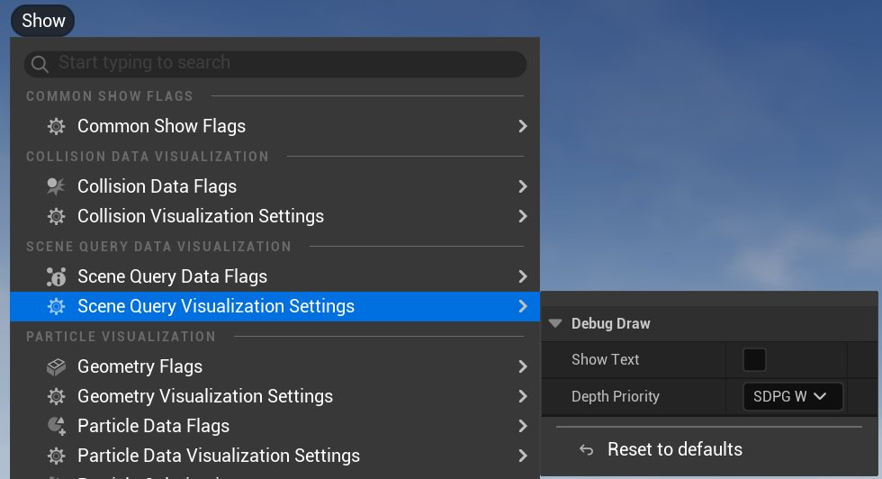
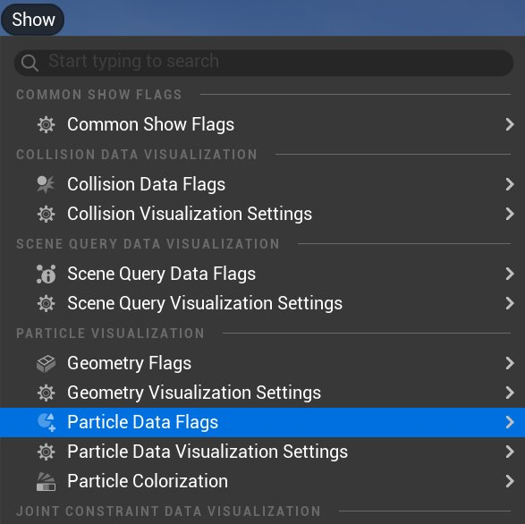
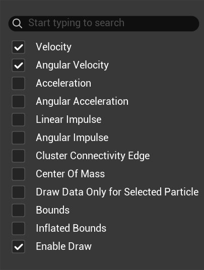

# 数据可视化标记

> 路径：虚幻引擎5.7文档 / Gameplay系统 / 物理 / Chaos可视调试器 / Chaos可视调试器入门指南 / 数据可视化标记

> 原始页面：https://dev.epicgames.com/documentation/unreal-engine/data-visualization-flags-in-chaos-visual-debugger

为帮助你识别异常的物理行为，**[Chaos可视调试器](../../index.md)**（**CVD**）提供了调试绘制工具，以直观显示应用程序在运行时通常不可见的内容。

切换数据标记即可控制视口中会显示哪些调试绘制工具。 数据标记的分类如下：

- [碰撞数据](index.md#collisions)
- [场景查询](index.md#scene-queries)
- [粒子数据](index.md#particle-data)
- [关节约束](index.md#joint-constraints)
- [角色地面约束](index.md#character-ground-constraints)
- [泛型调试绘制数据](index.md#generic-debug-draw-data)
- [加速结构](index.md#acceleration-structures-data)
- [常规显示标记](index.md#common-show-flags)

> [!TIP]
> 某些标记，比如**质心（Center of Mass）**等，可能会影响CVD的性能。 如果达到调试绘制的上限，视口中会显示如下警告：
>
> `已达到调试绘制线上限！ 请尝试选择更少的调试绘制类别，或将摄像机聚焦集中在更狭窄的区域内。（Max Debug Draw lines limit reached! Try selecting fewer debug draw categories or focus the camera in a narrower area.）`

## 碰撞数据

可视化碰撞数据可帮助你识别碰撞行为异常的区域。 例如两个对象发生相交，而不是按预期发生碰撞。 要启用碰撞数据，请执行以下操作：

1. 转到视口工具栏，点击**显示（Show） > 碰撞数据标记（Collision Data Flags） > 启用绘制（Enable Draw）**。 此选项将打开数据标记列表。

   
2. 从列表选择要打开或关闭的数据标记。

   
3. 点击**碰撞数据可视化设置（Collision Data Visualization Settings）**以自定义数据在视口中的绘制方式。

   

可视化设置包括下列选项：

- **显示调试文本（Show Debug Text）**：开关视口调试文本（如果有）。
- **深度优先级（Depth Priority）**：在**世界空间**或**前景**中绘制数据（始终置于其他场景组件之上）。
- **缩放和半径选项**：控制调试绘制元素的大小，使其在视口中更为可见。

> [!NOTE]
> 大部分数据标记的可视化设置都提供了相似的可切换功能。

## 场景查询

可视化 [场景查询](../../../traces-with-raycasts/traces-in-unreal-engine---overview/index.md)（线迹、扫描和重叠）能帮助你调试在运行时执行了查询但未能找到预期对象的情况。

要启用场景查询数据，请执行以下操作：

1. 转到视口工具栏，点击**显示（Show） > 场景查询数据标记（Scene Query Data Flags） > 启用绘制（Enable Draw）**。 此选项将打开数据标记列表。

   
2. 从列表选择要打开或关闭的数据标记。

   
3. 点击**场景查询可视化设置（Scene Query Visualization Settings）**以自定义数据在视口中的绘制方式。

   

## 粒子数据

可视化的粒子数据可以帮助你识别不规律的粒子行为，例如受力后粒子的移动速度超出预期的情况。

要启用粒子数据，请执行以下操作：

1. 转到视口工具栏，点击**显示（Show） > 粒子数据标记（Particle Data Flags） > 启用绘制（Enable Draw）**。 此选项将打开数据标记列表。

   
2. 从列表选择要打开或关闭的数据标记。

   
3. 点击**粒子数据可视化设置（Particle Data Visualization Settings）**以自定义数据在视口中的绘制方式。

   > 图片已省略：粒子可视化设置

> [!NOTE]
> CVD只会录制并可视化**物理线程**粒子数据，而非**游戏线程**粒子数据。 游戏线程粒子数据不会被可视化。

### 几何体

大部分粒子都具有[简单和复杂碰撞几何体](../../../collision/simple-versus-complex-collision/index.md)，但只会将其中一种用于碰撞检测。

用于切换简单和复杂几何体的选项以及其他几何体可视化标记的选项位于视口工具栏的**显示（Show） > 几何体标记（Geometry Flags）**菜单下。

> 图片已省略：几何体可视化标记

> [!TIP]
> **仅查询（Query Only）**几何体使用半透明材质可视化。 按**T**键或点击汉堡菜单中的**允许半透明选择（Allow Translucent Selection）**即可启用或禁用半透明选择。

### 粒子着色

如需增加绘制的可视性，你可以使用如下模式为粒子着色：

- **无（None）**：使用默认灰色绘制粒子。
- **状态（State）**：根据模拟中[物理对象的状态](../../../physics-bodies/physics-bodies-reference/index.md)（动态、休眠、运动或静态）着色。
- **形状类型（Shape Type）**：根据[碰撞几何体类型](../../../collision/simple-versus-complex-collision/index.md)（简单形状、凸包、高度场或三角网格图）着色。
- **客户端服务器（Client Server）**：根据客户端或服务器生成的粒子着色。

> 图片已省略：状态和默认灰色

**状态和默认灰色**

要更改模式和自定义颜色，请执行以下操作：

1. 转到视口工具栏，点击**显示（Show） > 粒子着色（Particle Colorization）**。

   > 图片已省略：粒子着色
2. 打开**颜色模式（Colors Mode）**下拉菜单，点击**粒子颜色模式（Particle Color Mode）**下拉菜单，选择要使用的模式。

   > 图片已省略：粒子颜色模式
3. 点击**颜色按[模式]（Colors by [mode]）**下拉菜单并自定义颜色。 然后点击颜色图块以打开上下文取色器。

   > 图片已省略：取色器

下表描述了上下文取色器的用户界面（UI）。

| 编号 | 说明 |
| --- | --- |
| 1 | 色轮（或切换为色谱）。 |
| 2 | 显示当前和之前选中的颜色。 |
| 3 | 切换sRGB预览。 |
| 4 | 切换色轮和色谱。 |
| 5 | 切换**颜色方案**的可视性。 |
| 6 | 滴管工具。 |
| 7 | RBG/HSV滑块。 |
| 8 | Alpha滑块。 |
| 9 | 显示当前颜色的十六进制代码。 |
| 10 | **颜色方案**：功能类似于Adobe Photoshop和其他设计程序中的色卡。 |

## 关节约束

可视化关节约束可以帮助你调试多余的布娃娃行为，例如关节扭曲等。 CVD会将关节约束数据录制为逐帧的单独数据片段。 因此，目前无法跨游戏帧保持所选项。

要启用关节约束数据，请执行以下操作：

1. 转到视口工具栏，点击**显示（Show） > 关节约束数据标记（Joint Constraint Data Flags） > 启用绘制（Enable Draw）**。 此选项将打开数据标记列表。

   > 图片已省略：启用关节约束标记
2. 从列表选择要打开或关闭的数据标记。

   > 图片已省略：关节约束标记
3. 点击**关节约束可视化设置（Joint Constraint Visualization Settings）**以自定义数据在视口中的绘制方式。

   > 图片已省略：关节约束可视化标记

> [!NOTE]
> 默认情况下，CVD不会录制关节约束。 要将其启用，请点击主工具栏中的**数据通道（Data Channel）**下拉菜单，并勾选**JointConstraints**。
>
> > 图片已省略：启用关节约束

## 角色地面约束

CVD可以录制虚幻引擎角色移动系统（即[Mover 2.0](../../../../mover/index.md)）所使用的角色地面约束的状态。 你可以使用此标记识别并调试异常行为，例如角色漂浮在地面上方或与地面平面穿模。

要启用角色地面约束数据，请执行以下操作：

1. 转到视口工具栏，点击**显示（Show） > 角色地面约束数据标记（Character Ground Constraints Data Flags） > 启用绘制（Enable Draw）**。 此选项将打开数据标记列表。

   > 图片已省略：启用地面约束
2. 从列表选择要打开或关闭的数据标记。

   > 图片已省略：地面约束标记
3. 点击**角色地面约束可视化设置（Character Ground Constraints Visualization Settings）**以自定义数据在视口中的绘制方式。

   > 图片已省略：地面约束可视化标记

> [!NOTE]
> 默认情况下，CVD不会录制角色地面约束。 要将其启用，请点击主工具栏中的**数据通道（Data Channel）**下拉菜单，并勾选**角色地面约束（Character Ground Constraints）**。
>
> > 图片已省略：数据通道地面约束

## 泛型调试绘制数据

以下C++宏和蓝图[节点](../../../../../blueprints-visual-scripting/specialized-blueprint-visual-scripting-node-groups/nodes/index.md)会直接在CVD中录制调试绘制形状。 调试绘制形状可以在调试物理计算时提供上下文。

例如，如果你使用空间中的两个点来计算施加于物理对象的力，CVD仅会显示对象受力前后的状态。 若出现异常，你可以使用泛型调试绘制宏（或蓝图节点）逐帧可视化这两个点和施加的力。 此工作流程可以为你提供力的计算方式的上下文，并帮你进行纠正。

### C++宏

根据你需要绘制的形状，每个宏都有其特定的一组参数 — 各宏使用的下列可选参数除外：

| 宏 | 参数 | 说明 |
| --- | --- | --- |
| **TraceDebugDrawBox** | **InBox** | 你要录制的形状。 |
| 所有宏 | **标记（Tag）** | 充当标记的FName，用于筛选、搜索以及在CVD的视口中作为文本标记而调试绘制。 |
| 所有宏 | **颜色（Color）** | 当形状在CVD中被调试绘制时，该形状应用的颜色。 |
| 所有宏 | **解算器ID（SolverID）** | 该形状应该关联的解算器的ID。 如未提供ID，则该形状将从数据桶中被添加为当前游戏的一部分。 |
| **TraceDebugDrawLine**、**TraceDebugDrawVector** | **内起始点（InStartLocation）** | 线段的起始点。 |
| **TraceDebugDrawLine** | **内结束点（InEndLocation）** | 线段的结束点。 |
| **TraceDebugDrawVector** | **内向量（InVector）** | 你要录制的向量。 |
| **TraceDebugDrawSphere** | **中心（Center）** | 球体的原点。 |
| **TraceDebugDrawSphere** | **半径（Radius）** | 球体的半径。 |
| 所有宏 | **拥有者（Owner）** | 与此调试绘制形状相关的所有UObject。 此属性供内部使用，负责判断形状是从服务器解算器还是客户端解算器录制的。 |

### 蓝图节点

以下泛型调试绘制宏也可以作为蓝图**事件图表**中的函数节点实现：

- CVD Record Debug Draw Sphere
- CVD Record Debug Draw Box
- CVD Record Debug Draw Line

> 图片已省略：事件图表

如需详细了解各节点，请参阅[虚幻引擎蓝图API参考](../../../../../unreal-engine-blueprint-api-reference/index.md)的Chaos可视调试器小节。

#### 启用泛型调试绘制数据

要启用泛型调试绘制数据，请执行以下操作：

1. 转到视口工具栏，点击**显示（Show） > 泛型调试绘制数据标记（Generic Debug Draw Data Flags） > 启用绘制（Enable Draw）**。 此选项将打开数据标记列表。

   > 图片已省略：泛型调试绘制数据标记
2. 从列表选择要打开或关闭的数据标记。

   > 图片已省略：泛型调试绘制选项
3. 点击**泛型调试绘制数据可视化设置（Generic Debug Draw Data Visualization Settings）**以自定义数据在视口中的绘制方式。

   > 图片已省略：启用泛型调试绘制数据

## 加速结构

CVD可以录制并可视化场景查询系统使用的加速结构，该结构目前为AABB（轴对齐边界框）树。 AABB树是一种包围体层级，可用于判断对象之间的潜在重叠。

在CVD中，你可以使用AABB树可视化来查看树的构成以及各对象在被添加到树中时的边界。

若场景查询应该命中的对象未被命中，或者物理引擎甚至未对其求值时，此可视化方法将非常有用。 你可以在CVD中使用AABB树可视化来检查对象的边界并判断错误的原因，例如边界未能在视觉上包围对象，或树内的边界不正确等。

要自定义绘制哪些加速结构数据标记，请执行以下操作：

1. 转到视口，点击**显示（Show） > 加速结构数据标记（Acceleration Structure Data Flags）**，选择想要的数据标记。

   > 图片已省略：加速结构数据标记
2. 点击**加速结构可视化设置（Acceleration Structure Visualization Settings）**以自定义数据在视口中的绘制方式。

   > 图片已省略：加速结构可视化设置

> [!NOTE]
> 默认情况下，CVD不会录制加速结构。 要将其启用，请点击主工具栏中的**数据通道（Data Channel）**下拉菜单，并勾选**加速结构数据（Acceleration Structures Data）**。
>
> > 图片已省略：启用加速结构数据通道

## 常规显示标记

**常规显示标记（Common Show Flags）**菜单包含源自引擎本身的标记，这些标记有助于提高CVD中的可视性。

要自定义启用的标记，请转到视口工具栏，点击**显示（Show） > 常规显示标记（Common Show Flags）**。

> 图片已省略：常规显示标记

## 下一步

- [数据检视器](../data-inspectors-in-chaos-visual-debugger/index.md) - 了解Chaos可视调试器中的数据检视器。

- [使用Chaos可视调试器捕获数据](../../capturing-data-with-chaos-visual-debugger/index.md) - 使用Chaos可视调试器捕获并播放录制内容。
