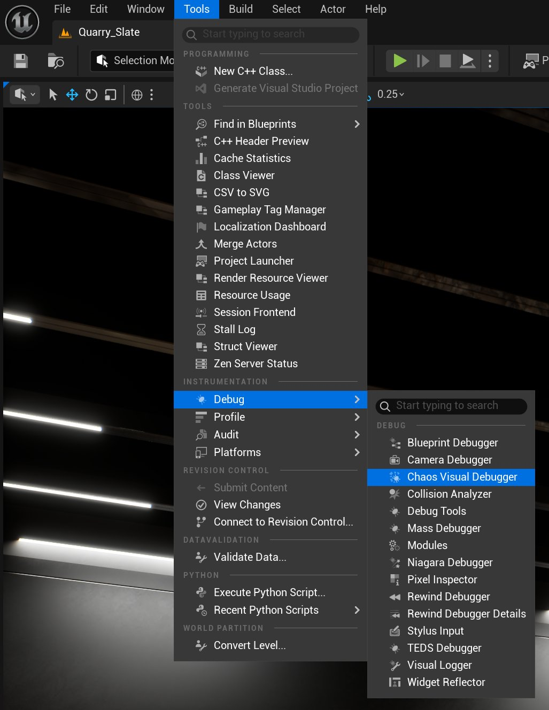
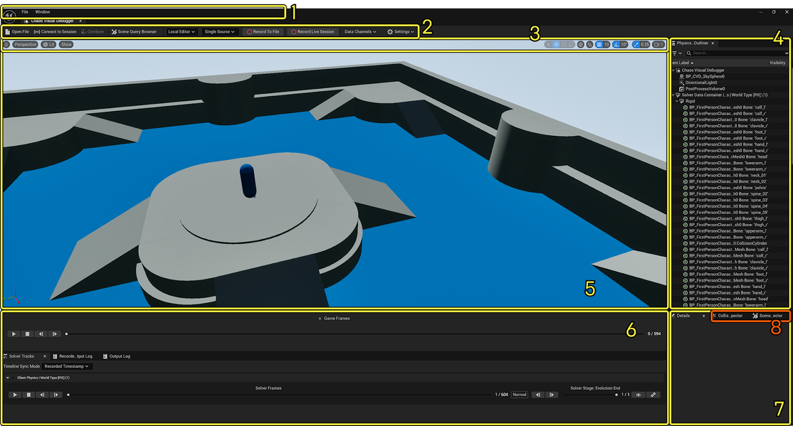
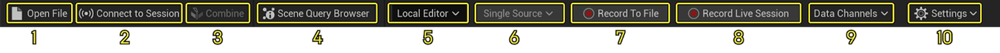
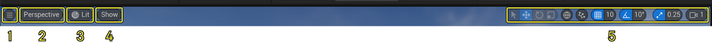
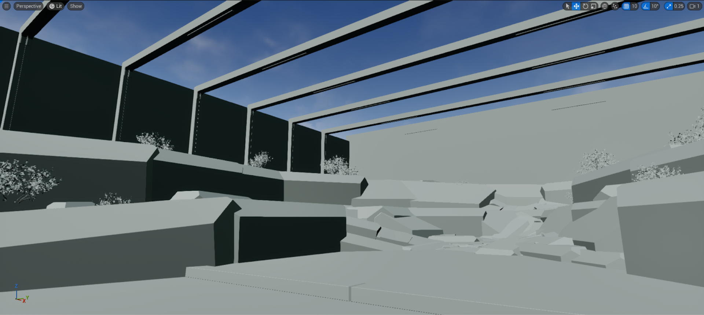
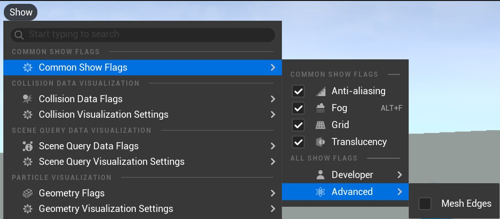
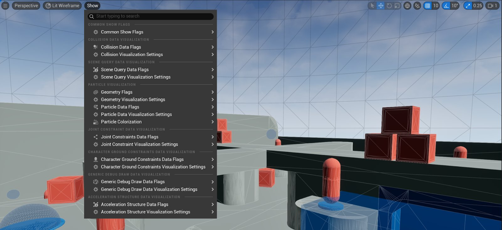
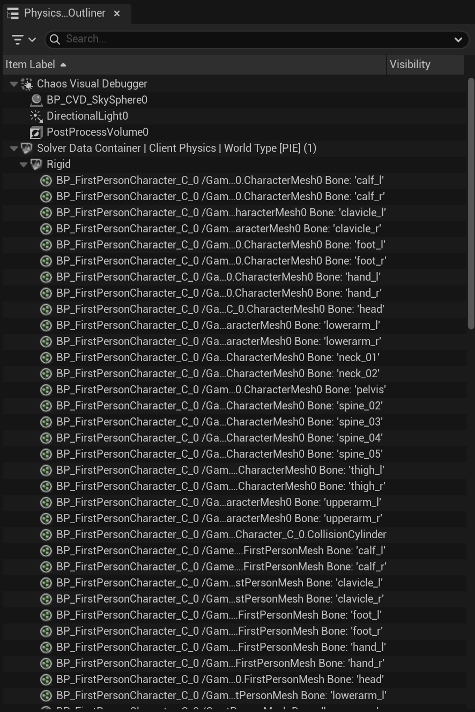

# Chaos可视调试器入门指南

> 路径：虚幻引擎5.7文档 / Gameplay系统 / 物理 / Chaos可视调试器 / Chaos可视调试器入门指南

> 原始页面：https://dev.epicgames.com/documentation/unreal-engine/getting-started-with-chaos-visual-debugger

**[Chaos可视调试器](../index.md)**（**CVD**）是一款用于录制物理模拟的工具。 你可以利用CVD录制在本地机器上运行的游戏和应用程序，也可以从远程机器或连接到本地机器的平台进行录制。

> 动图已省略：3489a2b15710e4d7ecb2c72d098cb1f754136f74ed99ec7d5336b689f2537f6d

你还可以在CVD中播放录制内容，从而检查数据以供调试。 这些录制内容独立于项目，也就是说，即使无法访问虚幻引擎（UE）的项目文件，你也可以加载这些录制内容，从而实现跨团队协作或远程调试。

CVD录制的数据包括：

- **粒子**（包括速度、加速度、质量属性和对象状态）
- **碰撞几何体**（包括碰撞通道）
- **碰撞约束**（接触对及其状态）
- **关节约束**（状态和关节设置）
- **角色地面约束**（基于物理的角色运动）
- **场景查询**（包括线迹、扫描和重叠）
- **刚体动画节点**（RBAN）

> [!TIP]
> 在CVD的语境中，**粒子**通常指刚体。

## 启动Chaos可视调试器

启动CVD的方式有两种：[从编辑器启动](index.md#inside-the-unreal-editor)或[作为独立程序启动](index.md#as-a-standalone-program)。

### 从虚幻编辑器启动

要在虚幻编辑器中打开Chaos可视调试器，请转到菜单栏，点击**工具（Tools） > 调试（Debug） > Chaos可视调试器（Chaos Visual Debugger）**。 选择CVD后，该工具将在新窗口中打开。

### 作为独立程序启动

> [!NOTE]
> 要将CVD作为独立程序运行，你必须使用虚幻引擎的源代码构建。 你可以从[GitHub](https://www.unrealengine.com/en-US/ue-on-github)下载源代码构建。 如需了解详情，请参阅[从源代码编译虚幻引擎](../../../../get-started/install/downloading-source-code/building-unreal-engine-from-source/index.md)。

要将CVD作为独立程序编译并运行，你可以使用可执行文件（不可移植），或者批处理文件（可移植）。 下表介绍了各选项的文件位置和编译步骤。

| 编译流程 | 说明 |
| --- | --- |
| **CVD可执行文件** | 可执行文件的路径如下：`Engine\\Binaries\\Win64\\ChaosVisualDebugger.exe`要编译并运行CVD，请执行以下步骤：使用你所选的集成开发环境（如Visual Studio等）打开CVD可执行文件。编译并运行可执行文件。编译完成后，你可以创建一个指向该可执行文件的快捷方式，然后一键运行该工具。 |
| **CVD批处理文件** | 批处理文件的路径如下： `Engine\\Programs\\ChaosVisualDebugger\\BuildAndCook.bat` 要编译并运行CVD，请执行以下步骤：编译编辑器。运行批处理文件以编译、烘焙并打包CVD。从`Engine\\Programs\\ChaosVisualDebugger\\PackagedBuild`访问输出构建并运行。 |

## 探索CVD的用户界面

本节将介绍Chaos可视调试器中最常用的按钮、面板和工具栏。 其中某些元素与虚幻编辑器的界面类似，但由于CVD与某些虚幻编辑器版本在视觉上存在差异，你还是应该先熟悉CVD。

以下小节分别介绍了各用户界面（UI）元素的位置，并提供了简单的用例。 如需深入了解，请点击本页提供的链接。

| 编号 | 名称 | 概述 |
| --- | --- | --- |
| 1 | **菜单栏** | 加载最近的录制内容和修改CVD布局等一系列选项。 |
| 2 | **主工具栏** | 开始或停止录制、加载录制内容、自定义录制数据的类别等一系列选项。 |
| 3 | **视口工具栏** | 用于修改视口所显示的数据和数据的视觉区分方式的一系列选项。 |
| 4 | **场景大纲视图** | 列出了录制内容中包含的场景组件。 |
| 5 | **视口** | 显示已加载的录制内容或实时录制，类似于虚幻编辑器视口。 这可能包括：虚幻编辑器中打开的关卡。在编辑器中运行（PIE）的会话。在本地机器上运行的已打包构建。在连接到本地机器的平台（例如游戏主机）上运行的应用程序。 |
| 6 | **播放功能按钮** | 显示一系列播放时间轴和日志，包括：[游戏帧时间轴](index.md#game-frames-timeline)[解算器时间轴](index.md#solver-timeline)[解算器阶段时间轴](index.md#solver-stage-timeline)[录制的输出日志](index.md#recorded-output-log)[输出日志](index.md#output-log) |
| 7 | **细节面板** | 显示在视口中没有专用数据检视器的所选项（例如粒子）的信息。 |
| 8 | **数据检视器** | 提供以下项目的详情：[碰撞数据](data-inspectors-in-chaos-visual-debugger/index.md#collision-data-inspector)[场景查询](data-inspectors-in-chaos-visual-debugger/index.md#scene-query-inspector)[关节约束数据](data-inspectors-in-chaos-visual-debugger/index.md#joint-constraint-data-inspector)[粒子数据](data-inspectors-in-chaos-visual-debugger/index.md#particle-data-details-panel) |

### 菜单栏

| 名称 | 说明 | 图像 |
| --- | --- | --- |
| **文件（File）** | 快速打开最近的录制内容。 | [菜单栏文件](https://dev.epicgames.com/community/api/documentation/image/c5f73e96-8a87-4d23-9faf-a449b5bfd341?resizing_type=fit) |
| **窗口（Window）** | 显示或隐藏CVD UI的部件。 | [菜单栏窗口](https://dev.epicgames.com/community/api/documentation/image/7c06fb02-a78d-44c1-98e6-8285b03e6c5d?resizing_type=fit) |

### 主工具栏

| 编号 | 名称 | 说明 |
| --- | --- | --- |
| 1 | **打开文件（Open File）** | 加载现存的`.utrace`录制文件。 |
| 2 | **连接到会话（Connect to Session）** | （旧有）连接远程机器以供远程调试。现仅在通过命令行录制远程会话时使用。 详情请参阅[（旧有）使用命令行界面录制实时会话](../capturing-data-with-chaos-visual-debugger/live-debugging-with-chaos-visual-debugger/index.md#legacy-record-a-live-session-with-the-command-line-interface)。 |
| 3 | **合并（Combine）** | 将CVD中打开的多个录制内容合并为单个`.cvdmulti`文件。 |
| 4 | **场景查询浏览器（Scene Query Browser）** | 检查针对单个帧进行的所有场景查询。 详情请参阅[数据检视器](data-inspectors-in-chaos-visual-debugger/index.md)。 |
| 5 | **会话目标** | 选择要录制的目标。 |
| 6 | **加载模式** | 加载单个或多个录制文件（这将合并数据）。 |
| 7 | **录制到文件（Record to File）** | 开始录制并将其保存到文件。 |
| 8 | **录制实时会话（Record Live Session）** | 开始录制并实时渲染可视化效果。 |
| 9 | **数据通道（Data Channels）** | 自定义录制期间捕获的数据，例如：[数据标记](data-visualization-flags-in-chaos-visual-debugger/index.md)[模拟阶段](index.md#solver-stage-timeline) |
| 10 | **设置（Settings）** | 自定义CVD的UI和性能。 |

### 视口工具栏

1. [汉堡菜单](index.md#hamburger-menu)
2. [视图模式](index.md#view-mode)
3. [光照模式](index.md#lighting-mode)
4. [显示按钮](index.md#show-button)
5. [变换和对齐工具栏](index.md#transform-and-snapping-toolbar)

#### 汉堡菜单

| 名称 | 说明 | 图像 |
| --- | --- | --- |
| **以录制帧率播放（Play at Recorded Framerate）** | 将录制帧率重载为固定帧率。 | [以录制帧率播放](https://dev.epicgames.com/community/api/documentation/image/e0e68448-9b97-46d8-aa12-e0175c92de4f?resizing_type=fit) |
| **对外追踪（Object Tracking）(F8)** | 将摄像机锁定到视口中的对象。 | [对象追踪](https://dev.epicgames.com/community/api/documentation/image/df4175e3-28ad-4aed-ab2a-96dcdca7e595?resizing_type=fit) |
| **视野选项** | 调整视口的视野（FOV）以及最远渲染距离。 | [视野选项](https://dev.epicgames.com/community/api/documentation/image/0ce46ed6-172b-4046-815f-df10ef423b31?resizing_type=fit) |
| **允许选择半透明（Allow Translucent Selection）(T)** | 切换穿过半透明对象进行点击的能力。 | [允许选择半透明](https://dev.epicgames.com/community/api/documentation/image/7d504b7e-51a2-4c7f-b07d-418ff0e8d8c7?resizing_type=fit) |
| **前往位置（Go to Location）** | 将摄像机传送至此字段中输入的指定位置（XYZ格式）。 | [前往位置](https://dev.epicgames.com/community/api/documentation/image/60761176-6420-4d67-820b-56732cf254a8?resizing_type=fit) |

#### 视图模式

视口的视图模式可在**透视（Perspective）**、**顶视图（Top）**、**底视图（Bottom）**、**左视图（Left）**、**右视图（Right）**、**前视图（Front）**以及**后视图（Back）**之间切换。

| 透视 | 顶视图 | 左视图 |
| --- | --- | --- |
| [透视](https://dev.epicgames.com/community/api/documentation/image/8126d2e4-0422-40b8-acf1-73b067fa817f?resizing_type=fit) | [顶视图](https://dev.epicgames.com/community/api/documentation/image/17e21dfc-8823-45bb-b48e-4067b8d5ec89?resizing_type=fit) | [左视图](https://dev.epicgames.com/community/api/documentation/image/9f00833d-631f-499d-9ee9-228808b951d5?resizing_type=fit) |

#### 光照模式

视口的光照模式可在**光照（Lit）**、**无光照（Unlit）**、**光照线框（Lit****Wireframe）**以及**线框（Wireframe）**之间切换。

**光照模式**

> [!TIP]
> 如需提高无光照模式下的可视性，请启用**网格体边缘（Mesh Edges）**。
>
> 

#### 显示按钮

**显示（Show）**按钮可修改现存录制内容的哪些可视化标记和调试文本在视口中可见。 如需详细了解数据标记，请参阅[数据可视化标记](data-visualization-flags-in-chaos-visual-debugger/index.md)。

> [!TIP]
> 除非被重置为默认值，否则此菜单中的设置在CVD会话之间保持不变。

#### 变换和对齐工具栏

变换和对齐工具栏与旧版虚幻编辑器中的视口工具栏类似。 你通常会使用这些工具来操控光源Actor。

| 图标 | 名称 | 说明 |
| --- | --- | --- |
| [图标选择](https://dev.epicgames.com/community/api/documentation/image/ffe69fab-ea6a-4a9f-bf89-0d8217354cc9?resizing_type=fit) | **选择对象** | 选择视口内的对象。 |
| [平移对象](https://dev.epicgames.com/community/api/documentation/image/819e39b0-8f9d-42ec-9c0b-b919a868f335?resizing_type=fit) | **选择并平移对象** | 沿单轴、双轴或三轴在世界中移动光源Actor。 |
| [旋转对象](https://dev.epicgames.com/community/api/documentation/image/242b53d3-a924-4618-8a9e-f0d2d4ad8c73?resizing_type=fit) | **选择并旋转对象** | 沿单轴旋转光源Actor。 |
| [缩放对象](https://dev.epicgames.com/community/api/documentation/image/66dc6d6e-86a5-4d60-b75c-20fa3c29dfab?resizing_type=fit) | **选择并缩放对象** | 使用缩放小工具缩放光源Actor。 使用小工具即可沿单轴、双轴或三轴统一缩放对象。 |
| [坐标系](https://dev.epicgames.com/community/api/documentation/image/cd7666e4-35cc-4f59-9d56-01cbf641771b?resizing_type=fit) | **坐标系** | 在**世界（World）**坐标系和**本地（Local）**坐标系之间循环切换。 |
| [与表面对齐](https://dev.epicgames.com/community/api/documentation/image/2501a188-45cf-48f0-9b8b-c8306ca8e783?resizing_type=fit) | **与表面对齐** | 设置将光源Actor拖拽到另一对象的表面时，该光源Actor的对齐行为。 |
| [与网格对齐](https://dev.epicgames.com/community/api/documentation/image/9cd6cd34-a8e8-40b8-8144-6d47c7d4124f?resizing_type=fit) | **与网格对齐** | 切换光源Actor是否与网格对齐，并设置增量。 |
| [旋转增量](https://dev.epicgames.com/community/api/documentation/image/8b7bd739-a372-44e9-a132-17f4b695c131?resizing_type=fit) | **旋转增量** | 切换光源Actor是否以增量旋转，并设置角度。 |
| [缩放增量](https://dev.epicgames.com/community/api/documentation/image/78367cc2-0992-48cf-9fd2-82839704f5db?resizing_type=fit) | **缩放增量** | 切换光源Actor是否以增量缩放，并设置增量。 |
| [摄像机速度](https://dev.epicgames.com/community/api/documentation/image/929a476e-0afa-4d1b-821a-1238e50d7cab?resizing_type=fit) | **摄像机速度** | 影响摄像机在世界中的移动速度。 |

### 场景大纲视图

**场景大纲视图**列出了录制内容中包含的场景组件。 由于录制内容可能包含多个解算器，因此各解算器的粒子都会被放置在一个文件夹中，该文件夹的名称和ID与其所属的解算器相同。 在该文件夹中，所有粒子都标有其Chaos端的调试名称。

> [!TIP]
> 在CVD中，**物理解算器**是物理模拟（通常来自游戏世界）的一个实例，由[Chaos物理系统引擎](../../index.md)处理。

### 播放功能按钮

Chaos可视调试器包含基于[游戏线程](../../../../designing-visuals-rendering-and-graphics/graphics-programming/threaded-rendering/index.md)帧、物理解算器帧或模拟阶段播放和倒回现有录制内容的功能按钮。 这最大限度地提高了你对使用[网络物理](../../networked-physics/networked-physics-overview/index.md)、异步物理或多个游戏世界（例如多人游戏）的情况进行检查的能力。

#### 游戏帧时间轴

**游戏帧时间轴**代表了录制内容的各个游戏线程帧。

> 图片已省略：游戏帧时间轴

当你使用此时间轴播放录制内容时，你会注意到解算器时间轴也会播放。 这是因为，对于每个播放的**游戏线程**帧，CVD都会搜索该时间戳上可用的最接近的**物理解算器**帧。

> [!NOTE]
> 游戏帧时间轴的帧编号有时可能与解算器时间轴不匹配。 这是因为游戏线程帧可能对应多个物理解算器帧。 访问这两个时间轴意味着你可以检查发生这种情况的场景，例如在使用异步物理时。
>
> > 图片已省略：游戏帧和解算器时间轴
>
> (1)解算器时间轴 (2) 游戏帧时间轴
>
> 如需详细了解CVD如何可视化同步和异步物理、来自多个游戏世界的数据以及重新模拟的帧，请参阅[在虚幻引擎中调试Chaos物理系统的第16:05分钟处](https://youtu.be/_DKKztvMd2o?t=1007)。

#### 解算器时间轴

**解算器时间轴**代表了录制内容的各个物理解算器帧。 每个解算器都有一条专用轨道。 使用此时间轴，你可以播放任何解算器轨道的数据，并查看哪个解算器帧对应特定的游戏线程帧。

> 图片已省略：解算器时间轴

| 设置 | 说明 | 图像 |
| --- | --- | --- |
| **时间轴同步模式（Timeline Sync Mode）** | 控制各个解算器轨道的同步方式。**录制时间戳（Recorded Timestamp）（默认）**：根据录制时间同步所有解算器轨道，无视联网物理时间的偏移。**网络Tick（Network Tick）**：假设客户端预测逻辑正常工作，将所有解算器轨道可视化。 可以帮你精确定位表明客户端和服务器不同步的差异。**手动（Manual）**：完全禁用自动轨道同步。 | [网络Tick](https://dev.epicgames.com/community/api/documentation/image/a4ea64fa-58e4-4658-aae3-46863d75caba?resizing_type=fit) |
| **重新模拟徽章** | 若解算器轨道中包含的帧属于网络不同步校正过程中进行的重新模拟，则此徽章将出现在该轨道上。 | [重新模拟徽章](https://dev.epicgames.com/community/api/documentation/image/346bb6ca-52f9-4d92-9c93-d7dea0312e84?resizing_type=fit) |
| **可视性功能按钮** | 显示或隐藏特定解算器轨道中的可视化数据。 | [可视性功能按钮](https://dev.epicgames.com/community/api/documentation/image/efc95aeb-9fe2-4f94-bb09-f7593ab98b23?resizing_type=fit) |

#### 解算器阶段时间轴

你可以使用**解算器阶段时间轴**跳转到物理模拟的特定**阶段**。 **阶段**是单个物理帧内不同时间点拍摄的模拟快照。

> 图片已省略：解算器阶段时间轴

以粒子模拟为例，你可以将以下阶段可视化：

| 阶段 | 说明 |
| --- | --- |
| **演变开始（Evolution Start）** | 在解算器步骤开始时，对所有粒子拍摄快照。 |
| **合并后（Post-Integrate）** | 对粒子执行`合并`计算后，对所有粒子拍摄快照。 |
| **碰撞检测粗略阶段** | 在运行碰撞检测过程的粗略阶段后，对所有中间阶段（为每个边界重叠的粒子对创建对象）拍摄快照。 |
| **碰撞检测精确阶段** | 在运行碰撞检测过程的精确阶段后，对所有中间阶段拍摄快照。 |
| **约束前解算（Pre Constraint Solve）** | 在解算可用约束之前，对所有粒子拍摄快照。 |
| **约束后解算（Post Constraint Solve）** | 在解算约束之后，对所有粒子拍摄快照。 |
| **演变结束（Evolution End）** | 在解算器步骤结束时，对所有粒子拍摄快照。 |

解算器阶段时间轴适合用于检查单个帧内的异常行为，例如对象在帧开头时出现在正确位置，但在帧结尾时出现在错误位置。

#### 录制的输出日志

**录制的输出日志（Recorded Output Log）**选项卡位于解算器时间轴轨道选项卡的旁边，CVD会在其中录制应用程序的日志流以供追溯检查。

> 图片已省略：录制的输出日志

#### 输出日志

**输出日志（Output Log）**是活动的实时监控日志。 此选项卡会显示当前CVD实例的活动日志，并显示CVD本身的错误或警告。

> 图片已省略：输出日志

## 细节面板

**细节（Details）**面板将显示视口中所选项的信息。

> 图片已省略：细节面板

> [!NOTE]
> 细节面板同时还充当了粒子数据的数据检视器。 详情请参阅[粒子数据（细节面板）](data-inspectors-in-chaos-visual-debugger/index.md#particle-data-details-panel)。

## 下一步

- [数据检视器](data-inspectors-in-chaos-visual-debugger/index.md) - 了解Chaos可视调试器中的数据检视器。

- [数据可视化标记](data-visualization-flags-in-chaos-visual-debugger/index.md) - 了解Chaos可视调试器中的数据可视化标记。

- [使用Chaos可视调试器捕获数据](../capturing-data-with-chaos-visual-debugger/index.md) - 使用Chaos可视调试器捕获并播放录制内容。
