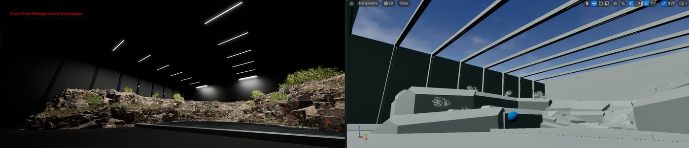

# Chaos可视调试器

> 路径：虚幻引擎5.7文档 / Gameplay系统 / 物理 / Chaos可视调试器

> 原始页面：https://dev.epicgames.com/documentation/unreal-engine/chaos-visual-debugger-in-unreal-engine

**Chaos可视调试器（**CVD**）**既是一款编辑器内置的工具，也是一款独立程序。它可以为你录制[Chaos物理系统](../index.md)的模拟并在运行时收集状态数据。

有了该工具及其提供的数据，你就可以协同他人高效调试本地机器上所运行的应用程序的物理模拟，也可以从远程机器或连接到本地机器的平台进行调试。

> 动图已省略：0d7ba3bc21888e41adf065e2bcfbb00bc83f0e1370717ea22619816141020ce8

## Chaos可视调试器1.2的新内容

Chaos可视调试器1.2包含如下内容：

- [独立的调试器](getting-started-with-chaos-visual-debugger/index.md#as-a-standalone-program)**：** 将CVD编译并打包为独立的虚幻引擎程序。
- **优化了对网络物理调试的支持**：

  - **[多源支持](capturing-data-with-chaos-visual-debugger/playback-in-chaos-visual-debugger/index.md#multi-source-recordings)**： 一次性加载两个或更多的独立录制文件。
  - **[会话发现系统](capturing-data-with-chaos-visual-debugger/live-debugging-with-chaos-visual-debugger/index.md)：** 查找任何本地运行的服务器或客户端，并一键开始录制。
- **性能优化**：为减少资源消耗，我们全面改造了几何体的生成方式以及底层对象的表示方式。

如需全面了解上述新功能，请参阅虚幻引擎5.6版本说明的[CVD小节](https://dev.epicgames.com/documentation/unreal-engine/unreal-engine-5-6-release-notes?application_version=5.6#chaos-visual-debugger)。

## 下一步

- [Chaos可视调试器入门指南](getting-started-with-chaos-visual-debugger/index.md) - 熟悉Chaos可视调试器的用户界面。

- [数据可视化标记](getting-started-with-chaos-visual-debugger/data-visualization-flags-in-chaos-visual-debugger/index.md) - 了解Chaos可视调试器中的数据可视化标记。

- [数据检视器](getting-started-with-chaos-visual-debugger/data-inspectors-in-chaos-visual-debugger/index.md) - 了解Chaos可视调试器中的数据检视器。

- [使用Chaos可视调试器捕获数据](capturing-data-with-chaos-visual-debugger/index.md) - 使用Chaos可视调试器捕获并播放录制内容。

- [录制到文件](capturing-data-with-chaos-visual-debugger/recording-to-file/index.md) - 使用Chaos可视调试器录制到文件

- [录制实时会话](capturing-data-with-chaos-visual-debugger/live-debugging-with-chaos-visual-debugger/index.md) - 使用Chaos可视调试器录制实时会话

- [在Chaos可视调试器中播放](capturing-data-with-chaos-visual-debugger/playback-in-chaos-visual-debugger/index.md) - 在Chaos可视调试器中播放录制内容。
