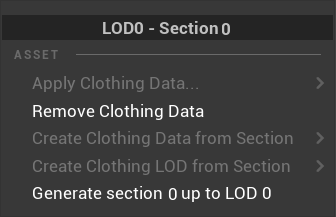
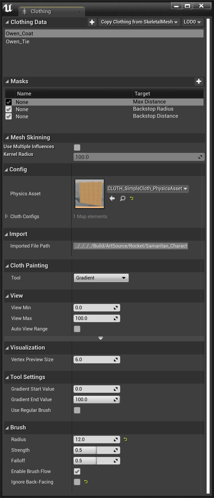
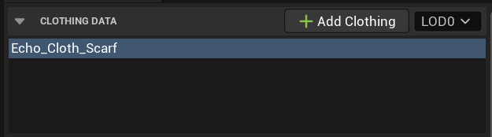
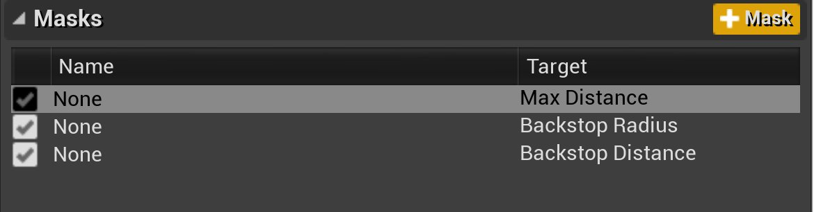
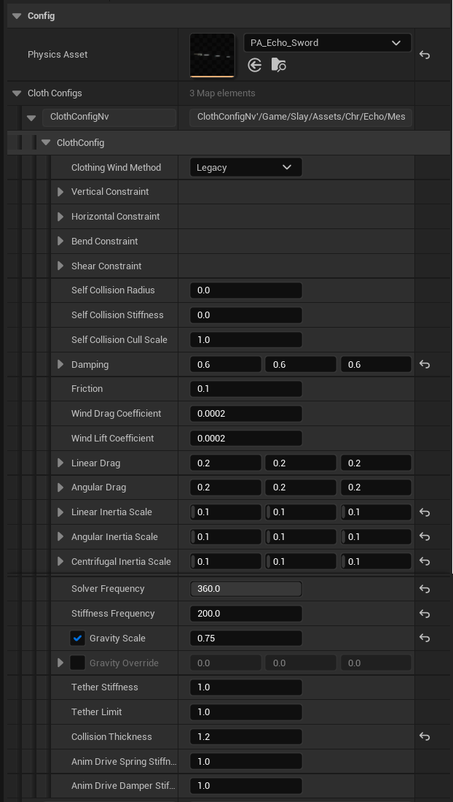
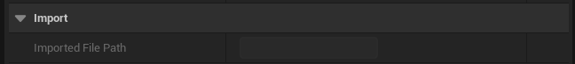
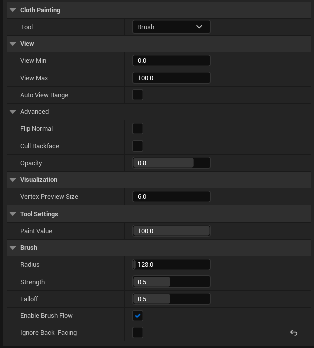

# 布料工具属性参考

> 路径：虚幻引擎5.7文档 / Gameplay系统 / 物理 / 布料模拟 / 布料工具属性参考

> 原始页面：https://dev.epicgames.com/documentation/unreal-engine/clothing-tool-in-unreal-engine---properties-reference

**布料绘制工具（Cloth Paint Tools）** 有很多选项和属性，你可以使用它们进行非常详尽的布料模拟。下文中，你将了解有关创建布料资产时你可使用的菜单选项，以及选择不同绘制工具以便为渲染网格体绘制布料值时你将使用的布料绘制面板的细节。

## 布料资产创建菜单

在本节中，你将了解在创建和应用布料资产到渲染网格体时，你可以使用的属性和设置的细节。

### 分段选择

你可以通过 **分段选择（Section Selection）** 选择渲染网格体的不同材质元素，以便创建并应用布料资产。在本菜单中，你可以确定你所选中网格体的LOD和材质分段，然后为渲染网格体及其LOD创建布料资产，再将布料资产应用到所选分段上，如有必要，可在后续移除它。

| 属性 | 说明 |
| --- | --- |
| **LOD分段选择（LOD Section Selection）** | 所使用LOD关卡的名称以及为其创建布料资产的分段。 |
| **应用布料资产（Apply Clothing Asset）** | 选择应用于所选分段的布料资产。 |
| **移除布料资产（Remove Clothing Asset）** | 移除当前指定的布料资产。 |
| **从分段创建布料资产（Create Clothing Asset from Section）** | 使用所选分段作为模拟网格体创建新布料资产。 Create a new clothing asset using the selected section 基本属性 **资产名称（Asset Name）**：输入的布料分段资产名称。 **从网格体移除（Remove from Mesh）**：是否保留此分段（是否用网格体自身驱动网格体）。启用此选项将使用低精度多边形网格体驱动高精度多边形网格体。 碰撞（Collision） **物理资产（Physics Asset）**：从中提取碰撞的物理资产。请注意，此选项将导出球体和长菱形，但最多支持32个凸面（或5个盒体）。 |
| **从LOD分段创建布料资产（Create Clothing Asset from LOD Section）** | 从所选分段创建布料模拟网格体，并将其LOD添加到现有布料资产。 Create a clothing simulation mesh from the selected section and add its LOD to an existing clothing asset 目标 **重新映射参数（Remap Parameters）**：如果执行重新导入操作，此选项将把原有LOD参数映射到新的LOD网格体。如果添加新的LOD，此选项将从先前的LOD映射参数。 **目标资产（Target Asset）**：指导入LOD时的目标资产。 **LOD索引（LOD Index）** **替换LOD（Replace LOD）** ：使用此分段替换所选布料资产LOD0中的模拟网格体。 **添加LOD（Add LOD）**：使用所选分段添加新的LOD。 基本属性 **从网格体移除（Remove from Mesh）**：是否保留此分段（是否用网格体自身驱动网格体）。如果要用低精度多边形网格体驱动高精度多边形网格体，启用此选项。 |
| **生成#分段直至LOD #（Generate section # up to LOD #）** | 生成的LOD将使用编号为#的分段直至编号为#的LOD，并对质量较低的LOD忽略编号为#的分段G。 |

## 布料面板

**布料（Clothing）** 面板内包含了所有的布料数据、遮罩、决定布料交互方式的配置参数，以及绘制布料值时你将使用的工具。

### 布料数据

**布料数据（Assets）** 类别显示了当前创建并分配给渲染网格体的布料资产，让你可以导入APEX（.apx或.apb）文件，允许你从现有的骨架网格体复制布料数据，或者从网格体的可用LOD中进行选择并复制参数值。

| 属性 | 说明 |
| --- | --- |
| **名称（Name）** | 为物理网格体的LOD分段创建的布料资产的名称。 |
| **从骨骼网格体拷贝布料（Copy Clothing from SkeletalMesh）** | 选择需要拷贝布料数据的骨骼网格体。 |
| **细节层次（LOD）选择（Level of Detail（LOD）Selection）** | 你可以选择细节层次LOD网格体设置参数、绘制值或者向其复制值。 |

### 遮罩

**遮罩（Masks）** 分类显示所有为绘制的布料值创建的参数集。这些集合可以指定目标值，以结合布料资产使用。

| 属性 | 说明 |
| --- | --- |
| **名称（Name）** | 遮罩以及此参数集对应的目标设置的给定名称。 快捷菜单设置 设置目标 **无（None）**：此参数集尚未设置目标。 **最大距离（Max Distance）**：布料模拟粒子从其动画位置可以移动的最大距离。 **逆止距离（Backstop Distance）** ：相对于最大距离的偏移距离，用于限制布料模拟粒子的运动。 **逆止半径（Backstop Radius）**：与最大距离相交时，可防止任何布料模拟粒子进入该区域的半径。 操作 **上移（Move Up）**：将遮罩在列表中上移一格。 **下移（Move Down）**：将遮罩在列表中下移一格。 **删除（Delete）**： 从列表中删除遮罩。 **应用（Apply）**：将遮罩应用到物理网格体上。 |
| **添加（Plus (+)）** | 添加新遮罩到可用遮罩参数列表中。 |

### 配置

你可以通过 **配置（Config）** 中的属性调整布料的交互方式，以便布料模拟出各种不同类型的材质，如粗麻布、橡胶、皮革等。

| 属性 | 说明 |
| --- | --- |
| **物理资产（Physics Asset）** | 构建模拟时从中提取碰撞的物理资产。 |
| **风方法（Wind Method）** | 决定如何处理风，精确调节阻力和升力来让布料做出不同的反应。旧有系统使用类似的力作用于所有布料上，但没有阻力和升力（类似APEX）。 **旧版（Legacy）**：使用旧版风模式，将通过模拟直接修改加速度值，无视阻力或升力。 |
| **垂直约束配置（Vertical Constraint Config）** | 垂直约束所用的约束数据。 **刚度（Stiffness）**：节点间该约束的刚度。此属性值影响与目标位置的接近度。 **刚度乘数（Stiffness Multiplier）**：影响所使用 **刚度（Stiffness）** 值的乘数。 **拉伸限制（Stretch Limit）**：有关此约束伸展距离的硬性限制。 **压缩限制（Compression Limit）**：有关此约束压缩距离的硬性限制。 |
| **水平约束配置（Horizontal Constraint Config）** | 水平约束所用的约束数据。 **刚度（Stiffness）**：节点间该约束的刚度。此属性值影响与目标位置的接近度。 **刚度乘数（Stiffness Multiplier）**：影响所使用 **刚度（Stiffness）** 值的乘数。 **拉伸限制（Stretch Limit）**：有关此约束伸展距离的硬性限制。 **压缩限制（Compression Limit）**：有关此约束压缩距离的硬性限制。 |
| **弯曲约束配置（Bend Constraint Config）** | 弯曲约束所用的约束数据。 **刚度（Stiffness）**：节点间该约束的刚度。此属性值影响与目标位置的接近度。 **刚度乘数（Stiffness Multiplier）**：影响所使用 **刚度（Stiffness）** 值的乘数。 **拉伸限制（Stretch Limit）**：有关此约束伸展距离的硬性限制。 **压缩限制（Compression Limit）**：有关此约束压缩距离的硬性限制。 |
| **剪切约束配置（Shear Constraint Config）** | 剪切约束所用的约束数据。 **刚度（Stiffness）**：节点间该约束的刚度。此属性值影响与目标位置的接近度。 **刚度乘数（Stiffness Multiplier）**：影响所使用 **刚度（Stiffness）** 值的乘数。 **拉伸限制（Stretch Limit）**：有关此约束伸展距离的硬性限制。 **压缩限制（Compression Limit）**：有关此约束压缩距离的硬性限制。 |
| **自碰撞半径（Self Collision Radius）** | 以每个顶点为中心的自碰撞球体的大小。 |
| **自碰撞刚度（Self Collision Stiffness）** | 用于解算自碰撞的弹簧力的刚度。 |
| **自碰撞剔除状态（Self Collision Cull State）** | 自碰撞剔除检测所用的半径比例。在此检测半径内的任何其他自碰撞体都将被剔除。此属性通过降低布料中的碰撞体数量来提升高分辨率网格体的性能。降低该值将对性能带来负面影响。 |
| **衰减（Damping）** | 每轴向上粒子运动的衰减值。 |
| **摩擦力（Friction）** | 碰撞时的表面摩擦力。 |
| **风阻力系数（Wind Drag Coefficient）** | 用于风计算风的阻力系数，值越高意味着风对布料产生的侧向效果越明显。 |
| **风升力系数（Wind Lift Coefficient）** | 用于风计算的升力系数，值越大则布料越容易在风中上扬。 |
| **线性阻力（Linear Drag）** | 应用到每轴向上线性粒子运动上的阻力。 |
| **角阻力（Angular Drag）** | 粒子角运动的阻力，值越大，则材质越不容易弯曲（每轴向）。 |
| **线性惯性比例（Linear Inertia Scale）** | 线性粒子惯性的比例值，或者说有多少运动应该转化为线性运动（每轴向）。 |
| **角惯性比例（Angular Inertia Scale）** | 角粒子惯性的比例值，或者说多少运动应该转化为角向运动（每轴向）。 |
| **离心惯性比例（Centrifugal Inertia Scale）** | 离心粒子惯性的比例值，或者说多少运动应转化为离心运动（每轴向）。 |
| **解算器频率（Solver Frequency）** | 位置解算器的频率，值越低，则布料越容易伸展和活动。 |
| **刚度频率（Stiffness Frequency）** | 刚度计算的频率，值越低，则越容易降低约束的刚度。 |
| **重力比例（Gravity Scale）** | 布料粒子模拟重力效果的比例值。 |
| **重力重载（Gravity Override）** | The direct gravity override value |
| **系链刚度（Tether Stiffness）** | 粒子彼此之间的系链刚度比例值。 |
| **系链限制（Tether Limit）** | 粒子系链限制比例值（粒子的最远分离距离）。 |
| **碰撞厚度（Collision Thickness）** | 所模拟布料的"厚度"，用于调整碰撞。 |
| **动画驱动弹簧厚度（Anim Drive Spring Thickness）** | 使用动画驱动后，默认的弹簧厚度。 |
| **动画驱动阻尼厚度（Anim Drive Damper Thickness）** | 使用动画驱动后，默认的阻尼厚度。 |

### 导入

**导入（Import）** 选项会显示所有[已导入APEX文件](#clothingdata)的文件路径。

| 属性 | 说明 |
| --- | --- |
| **导入文件路径（Imported File Path）** | 如果该资产从文件导入，此属性为文件的原始路径。 |

### 布料绘制

你可以通过 **布料绘制（Cloth Painting）** 分段选择不同的工具，如笔刷、梯度、平滑和填充。

在使用这些属性前，必须首先从[布料数据](#clothingdata)窗口中选择布料资产，然后在工具栏中点击 **启用绘制工具（Enable Paint Tools）** 按钮。

绘制布料值时使用的工具类型。

- 笔刷
- 渐变
- 平滑
- 填充

#### 笔刷

利用 **笔刷（Brush）** 工具，你在布料资产上拖动即可在布料上绘制出半径和强度值。

| 属性 | 说明 |
| --- | --- |
| 视图（View） |  |
| **视图最小值（View Min）** | 当绘制浮点/1D数值时，该值被视为0或绘制值黑点。 |
| **视图最大值（View Max）** | 当绘制浮点/1D数值时，该值被视为1或绘制值白点。 |
| **自动视图范围（Autoview Range）** | 设置后，视图最小值和视图最大值将通过当前的可编辑遮罩中的数值计算出来。 |
| 高级显示（Advanced Rollout） |  |
| **翻转法线（Flip Normal）** | 是否在预览网格体时翻转法线。 |
| **剔除背面（Cull Backface）** | 当渲染网格体预览时是否剔除背面三角形。 |
| **不透明度（Opacity）** | 网格体预览的不透明度值，可以让你穿过网格体看到后方物体。 |
| 可视化 |  |
| **顶点预览尺寸（Vertex Preview Size）** | 网格绘制激活后，绘制的顶点大小。 |
| 工具设置（Tool Settings） |  |
| **绘制值（Paint Value）** | 要为此参数绘制到网格体上的值。 |
| 笔刷（Brush） |  |
| **半径（Radius）** | 用于绘制的笔刷半径。 |
| **强度（Strength）** | 笔刷强度(0.0 - 1.0)。 |
| **衰减（Falloff）** | 将要应用的衰减值(0.0 - 1.0)。 |
| **启用笔刷流（Enable Brush Flow）** | 启用"流"绘制，绘制将随着笔刷每次更新函数而持续应用。 |
| **忽略背面（Ignore back-facing）** | 绘制时是否忽略背面的三角形。 |

#### 梯度

利用 **梯度（Gradient）** 工具，你可以在选择的一组布料值之间绘制出渐变混合。

> 图片已省略：布料绘制的渐变属性

| 属性 | 说明 |
| --- | --- |
| 视图（View） |  |
| **视图最小值（View Min）** | 当绘制浮点/1D数值时，该值被视为0或绘制值黑点。 |
| **视图最大值（View Max）** | 当绘制浮点/1D数值时，该值被视为1或绘制值白点。 |
| **自动视图范围（Autoview Range）** | 设置后，视图最小值和视图最大值将通过当前的可编辑遮罩中的数值计算出来。 |
| 高级显示（Advanced Rollout） |  |
| **翻转法线（Flip Normal）** | 是否在预览网格体时翻转法线。 |
| **剔除背面（Cull Backface）** | 当渲染网格体预览时是否剔除背面三角形。 |
| **不透明度（Opacity）** | 网格体预览的不透明度值，可以让你穿过网格体看到后方物体。 |
| 可视化 |  |
| **顶点预览大小（Vertex Preview Size）** | 网格绘制激活后，绘制的顶点大小。 |
| 工具设置（Tool Settings） |  |
| **梯度起始值（Gradient Start Value）** | 梯度起点位置的值。 |
| **梯度终止值（Gradient End Value）** | 梯度终点位置的值。 |
| **使用常规笔刷（Use Regular Brush）** | 使用笔刷而不是点绘制选择的点。 |
| 笔刷（Brush） |  |
| **半径（Radius）** | 用于绘制的笔刷半径。 |
| **强度（Strength）** | 笔刷强度(0.0 - 1.0)。 |
| **衰减（Falloff）** | 所应用的衰减值(0.0 - 1.0)。 |
| **启用笔刷流（Enable Brush Flow）** | 启用"流"绘制，绘制将随着笔刷每次更新函数而持续应用。 |
| **忽略后向（Ignore back-facing）** | 绘制时是否忽略背面的三角形。 |

#### 平滑

利用 **平滑（Smooth）** 工具，你可以模糊或柔化绘制布料值之间的对比度。

> 图片已省略：布料绘制的平滑属性

| 属性 | 说明 |
| --- | --- |
| 视图（View） |  |
| **视图最小值（View Min）** | 当绘制浮点/1D（float/1D）数值时，该值被视为0或绘制值黑点。 |
| **视图最大值（View Max）** | 当绘制浮点/1D（float/1D）数值时，该值被视为1或绘制值白点。 |
| **自动视图范围（Autoview Range）** | 设置后，视图最小值和视图最大值将通过当前的可编辑遮罩中的数值计算出来。 |
| 高级显示（Advanced Rollout） |  |
| **翻转法线（Flip Normal）** | 是否在预览网格体时翻转法线。 |
| **剔除背面（Cull Backface）** | 当渲染网格体预览时是否剔除背面三角形。 |
| **不透明度（Opacity）** | 网格体预览的不透明度值，可以让你穿过网格体看到后方物体。 |
| 可视化 |  |
| **顶点预览大小（Vertex Preview Size）** | 网格绘制激活后，绘制的顶点大小。 |
| 工具设置（Tool Settings） |  |
| **强度（Strength）** | 绘制时平滑（模糊）效果的强度。 |
| 笔刷（Brush） |  |
| **半径（Radius）** | 用于绘制的笔刷半径。 |
| **强度（Strength）** | 笔刷强度(0.0 - 1.0)。 |
| **衰减（Falloff）** | 所应用的衰减值(0.0 - 1.0)。 |
| **启用笔刷流（Enable Brush Flow）** | 启用"流"绘制，绘制将随着笔刷每次更新函数而持续应用。 |
| **忽略背后（Ignore back-facing）** | 绘制时是否忽略背面的三角形。 |

#### 填充

利用 **填充（Fill）** 工具，你可以使用其他数值替代数值相似的区域。

> 图片已省略：布料绘制的填充属性

| 属性 | 说明 |
| --- | --- |
| 视图（View） |  |
| **视图最小值（View Min）** | 当绘制浮点/1D数值时，该值被视为0或绘制值黑点。 |
| **视图最大值（View Max）** | 当绘制浮点/1D数值时，该值被视为1或绘制值白点。 |
| **自动视图范围（Autoview Range）** | 设置后，视图最小值和视图最大值将通过当前的可编辑遮罩中的数值计算出来。 |
| 高级显示（Advanced Rollout） |  |
| **翻转法线（Flip Normal）** | 是否在预览网格体时翻转法线。 |
| **剔除背面（Cull Backface）** | 当渲染网格体预览时是否剔除背面三角形。 |
| **不透明度（Opacity）** | 网格体预览的不透明度值，可以让你穿过网格体看到后方物体。 |
| 可视化 |  |
| **顶点预览大小（Vertex Preview Size）** | 网格绘制激活后，绘制的顶点大小。 |
| 工具设置（Tool Settings） |  |
| **阈值（Threshold）** | 填充操作阈值，持续填充直到采样顶点超过原始顶点的阈值范围。 |
| **填充值（Fill Value）** | 填充所有选择顶点的值。 |
| 笔刷（Brush） |  |
| **半径（Radius）** | 用于绘制的笔刷半径。 |
| **强度（Strength）** | 笔刷强度(0.0 - 1.0)。 |
| **衰减（Falloff）** | 所应用的衰减值(0.0 - 1.0)。 |
| **启用笔刷流（Enable Brush Flow）** | 启用"流"绘制，绘制将随着笔刷每次更新函数而持续应用。 |
| **忽略背面（Ignore back-facing）** | 绘制时是否忽略背面的三角形。 |
