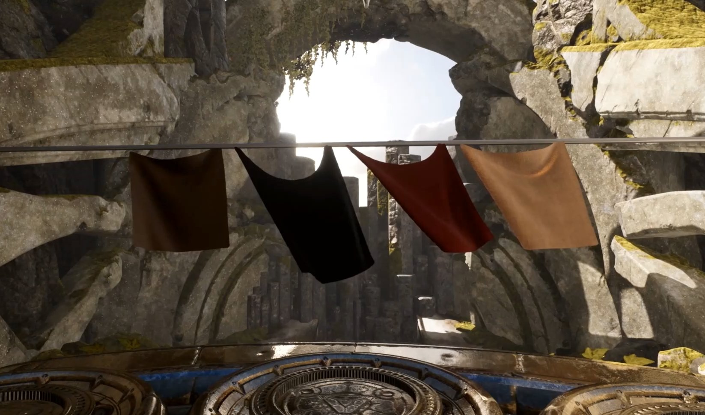
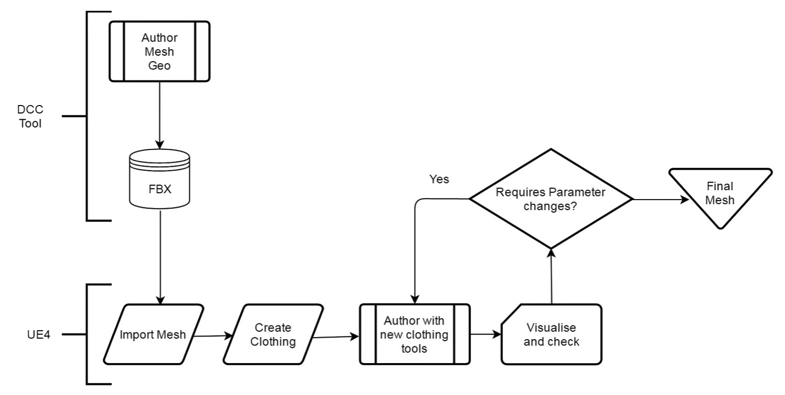
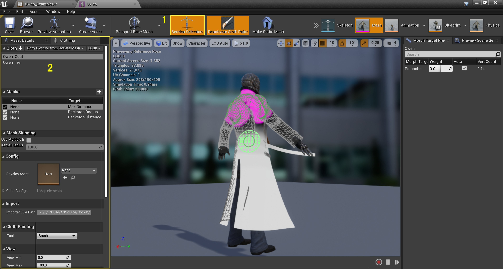
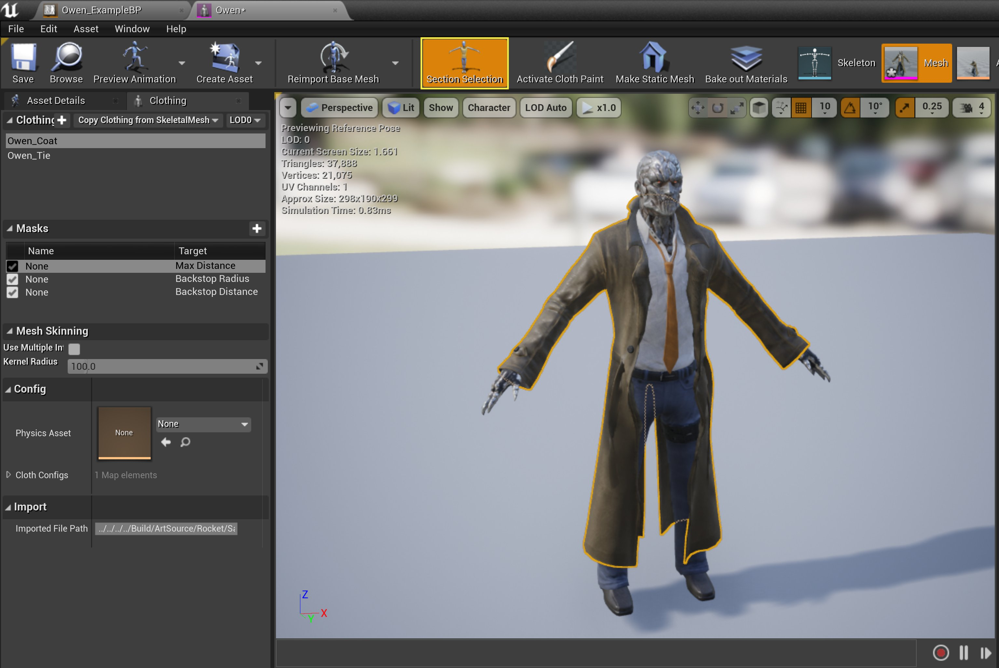
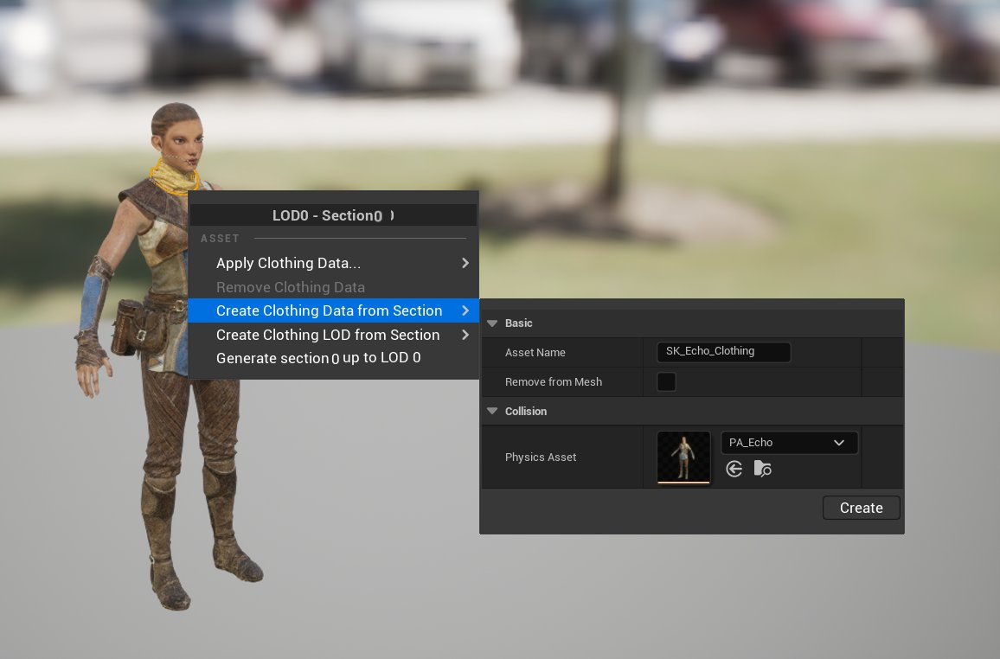
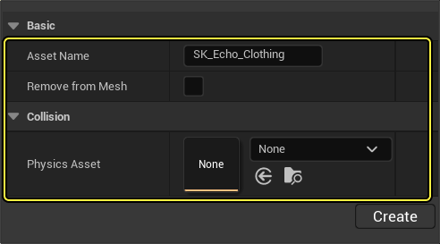
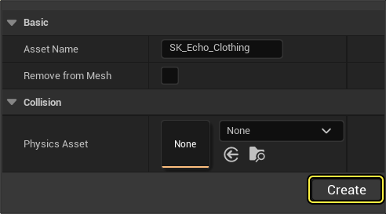
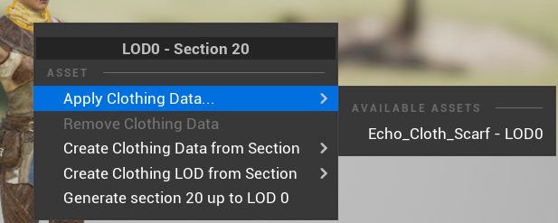

# 布料工具

> 路径：虚幻引擎5.7文档 / Gameplay系统 / 物理 / 布料模拟 / 布料工具

> 原始页面：https://dev.epicgames.com/documentation/unreal-engine/clothing-tool-in-unreal-engine

虚幻引擎采用Chaos的布料解算器，它是一种底层布料解算器，负责实现布料的粒子模拟。由于我们现在能够直接访问模拟数据，因此此布料解算器可实现轻量化集成，并极具扩展性。

布料工具在编辑器中可用后，开发人员将能直接使用虚幻引擎来编写内容，而不需要外部依赖项。

虚幻引擎布料工作流程。点击查看大图。

在这个流程中，你只需一次创建内容，之后的所有编辑工作都可以在虚幻引擎中直接完成。这使得内容的测试和迭代变得更加快速，还能避免因为内容创建和内容使用场景不同而导致的不便，因为你可以在游戏中实时查看布料模拟编辑后的效果。

## 布料绘制流程

当你在编辑器中创建布料时，布料绘制工具允许你快速为角色创建布料并使用骨架网格体现有任意材质元素。

点击查看大图。

1. **分段选择（Section Selection）-** 选择用于绘制布料的材质ID。
2. **布料绘制面板（Cloth Paint Panel）-** 包含绘制布料需要的所有必要工具和属性。

根据以下步骤学习创建布料资产并将其指定给角色的过程，以及在渲染网格体上绘制的基础知识。

### 创建并指定布料资产

要开始使用布料，首先需要在细节级别（LOD）部分中创建布料资产，并将其指定至渲染网格体，以便在其上进行绘制。

根据以下步骤进行学习：

1. 在骨架网格体编辑器中，单击主工具栏上的 **分段选择（Section Selection）** 按钮。你可选择已指定自身材质元素的骨架网格体的不同部分。

   

   点击查看大图。
2. 单击鼠标左键选择要用作布料的网格体部分。然后右键单击打开快捷菜单来创建布料资产。

   

   点击查看大图。
3. 在快捷菜单中选择 **在选项中创建布料资产（Create Cloth Asset from Selection）**，然后填写以下菜单区域：

   

   - **资产名称（Asset Name）** - 为资产命名，便于之后查找。
   - **从网格体移除（Remove from Mesh）** - 若要将几何体的一个单独网格关联为布料，则可启用此项。若不需要，则无需勾选。
   - **物理资产（Physics Asset）** - 若此布料资产用于角色，请使用此处的物理资产以确保布料模拟产生适当的碰撞。

   等你对设置满意后，点击 **创建（Create）** 按钮。

   
4. 对部分再次右键单击以打开快捷菜单，将光标悬停在 **应用布料资产（Apply Clothing Asset）** 上，然后在可用布料资产中选择需要应用的对象。它会与所选部分创建的布料资产进行关联。

   

### 在布料上绘制

当你准备好在布料上进行绘制后，你可以使用以下选项开始在所选布料资产上绘制：

- 绘制（Paint）- **鼠标左键**
- 擦除（Erase）- **Shift + 鼠标左键**
- 布料预览（Cloth Preview）- **H**

> [!NOTE]
> 若你使用过NVIDIA的PhysX DCC插件或其他程序的类似绘制工具，进行3DS Max或Maya的布料创建，那便不会对此操作中的功能按钮感到陌生。

1. 在骨架网格体编辑器中，前往文件菜单并选择 **窗口（Window）**，然后在列表中选择 **布料（Clothing）**。

   > 图片已省略：Selecting clothing in the main window's menu

   此操作将打开 **布料（Clothing）** 面板。

   > 图片已省略：The clothing panel with main parameter categories expanded
2. 在 **布料（Clothing）** 面板中，从 **布料数据（Clothing Data）** 列表中选择指定的 **布料资产（Cloth Asset）**。

   > 图片已省略：Highlighting the activate cloth paint button in the toolbar
3. 在 **布料（Clothing）** 面板中，在 **布料数据（Clothing Data）** 面板中选择你指定的 **布料资产（Cloth Asset）**。

   > 图片已省略：Selecting a cloth asset from the clothing data list
4. 在 **布料绘制（Cloth Painting）** 部分选择要使用的[绘制工具](#%E7%BB%98%E5%88%B6%E5%B7%A5%E5%85%B7)类型，然后设置 **绘制值（Paint Value）**（默认使用笔刷绘制工具）。然后单击鼠标左键并在网格体表面拖动以开始绘制。

   > [!TIP]
   > 按住 **H** 键盘快捷键以预览你绘制的布料。

## 绘制工具

> 图片已省略：The paint tool selection dropdown menu highlighted

利用 **工具（Tool）** 选项，选择可用的笔刷来绘制布料。

- [笔刷](#%E7%AC%94%E5%88%B7)
- [梯度](#%E6%A2%AF%E5%BA%A6)
- [平滑](#%E5%B9%B3%E6%BB%91)
- [填充](#%E5%A1%AB%E5%85%85)

### 笔刷

利用 **笔刷（Brush）** 工具在布料资产上进行拖动即可在布料上绘制出半径和强度值。

> 图片已省略：The lower part of the clothing panel with a brush selected in the cloth painting section

绘制布料时，使用 **绘制值（Paint Value）** 控制笔刷的强度。此数值控制绘制区域近似于布料响应的程度。数值为0时蒙皮顶点无法移动，而数值为100时蒙皮顶点可从原始位置移动1米。

> 图片已省略：Painting cloth with the brush

> [!NOTE]
> 有关该工具及其属性的更多详情，请参阅此处的[笔刷属性](https://dev.epicgames.com/documentation/404)参考。

### 梯度

利用 **梯度（Gradient）** 工具，你可以在选中的一组布料值之间绘制出渐变混合效果。

> 图片已省略：The lower part of the clothing panel with gradient selected in the cloth painting section

绘制梯度需要执行以下步骤：

1. 使用 **鼠标左键** 绘制 **梯度起始值（Gradient Start Value）**。它由已绘制顶点上的 **绿** 点来表示。
2. 按住 **Ctrl + 鼠标左键** 绘制 **梯度结束值（Gradient End Value）**。它由已绘制顶点上的 **红** 点来表示。
3. 完成绘制后按下 **回车** 键绘制梯度。

> 图片已省略：An example of a cloth gradient

> [!NOTE]
> 有关该工具及其属性的更多详情，请参阅此处的[梯度属性](https://dev.epicgames.com/documentation/404)参考。

### 平滑

利用 **平滑（Smooth）** 工具，可模糊或柔化绘制布料值之间的对比度。

> 图片已省略：布料面板的下半部分（布料绘制分段中选中了平滑）

使用 **强度（Strength）** 值可调整模糊效果的强弱，用于在绘制区域之间创建柔化梯度。

> 图片已省略：Using the smooth tool to create a soft gradient between painted areas

> [!NOTE]
> 有关该工具及其属性的更多详情，请参阅此处的[平滑属性](https://dev.epicgames.com/documentation/404)参考。

### 填充

利用 **填充（Fill）** 工具，可使用其他数值替代数值相似的区域。

> 图片已省略：布料面板的下半部分（布料绘制分段中选中了填充）

使用 **填充值（Fill Value）** 设置填充区域顶点的数值。采样用于替换的顶点时，使用 **阈值（Threshold）** 设置填充操作所用的数值。

> 图片已省略：绘制区域（白色）

> 图片已省略：绘制区域 | 填充值1.0

绘制区域（白色）

绘制区域 | 填充值1.0

> [!NOTE]
> 有关该工具及其属性的更多详情，请参阅此处的[填充属性](https://dev.epicgames.com/documentation/404)参考。

## 布料属性

利用 **布料配置（Cloth Config）** 属性可调整布料以模拟不同类型的材质，如粗麻布、橡胶，或是其他类型的布料材质。

> 图片已省略：布料面板中的布料配置属性

> [!NOTE]
> 有关布料配置属性的更多详情，请参阅此处的[布料配置属性](https://dev.epicgames.com/documentation/404)参考。

## 遮罩

**遮罩（Mask）** 是一类参数集，可用于交换布料资产。

> 图片已省略：布料面板的遮罩参数

该参数集代表以下 **目标**（或参数集）：

- **最大距离（Max Distance）**：布料上的点从其动画位置移动的最远距离。
- **逆止距离（Backstop Distance）**：布料上的点所用偏移，以限制最大距离（Max Distance）内的移动。
- **逆止半径（Backstop Radius）**：与最大距离（Max Distance）相交时，可防止布料上已绘制的点进入该区域的球体半径。
- **动画驱动乘数（Anim Drive Multiplier）**：用于驱动弹簧朝动画设置的位置拉伸布料，使动画师能够控制过场或动画驱动的场景。

  - 也可在运行时使用Actor之间的对象来驱动，蓝图可以在骨架网格组件上访问该对象。
  - 运行时设置的值与绘制的值相乘组合，得到最终的弹簧和阻尼强度。

你可以同时含有多个 **目标**，但一次仅能指定一个。此操作可以非破坏性方式快速测试不同配置。

要创建遮罩并将其指定至目标，请按照以下步骤操作：

1. 点击 **加号** (+)按钮新建空白遮罩。

   > 图片已省略：Create a new mask by clicking the plus button
2. 右键单击新遮罩，将光标悬停在 **设置目标（Set Target）** 上，从可用的 **目标（Targets）** 列表中进行选择。

   > 图片已省略：Setting a target for a new mask
3. 在遮罩（Mask）窗口中，可看到所选目标已被列为布料资产的活动目标。

   > 图片已省略：Active target selected for cloth asset
4. 也可单击窗口中的默认名称并输入新名称，以重命名该遮罩。

   > 图片已省略：Renaming a mask by clicking the default name

你还可通过快捷菜单将骨架网格体顶点颜色复制到选定的布料参数遮罩：

> 图片已省略：Selecting a vertex color to copy

> [!NOTE]
> 有关遮罩的更多详情，请参阅此处的[遮罩属性](https://dev.epicgames.com/documentation/404)参考。

## 从骨架网格体复制布料

如果有多个相似类型的骨架网格体，例如角色的斗篷，可以使用 **从骨架网格体复制布料（Copy Clothing from SkeletalMesh）** 选项将已经定义好的布料设置复制并导入到另一个骨架网格体，无需重新设置全部参数，节省时间。

> 图片已省略：Selecting clothing data to copy using a dropdown menu

要进行此操作，只需找到 **布料数据（Clothing Data）**，点击 **从骨架网格体复制布料（Copy Clothing from SkeletalMesh）** 并选择要复制器布料数据的骨架网格体即可。
