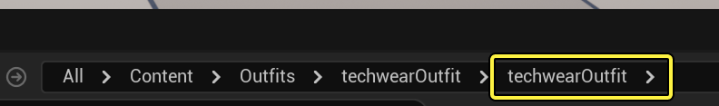
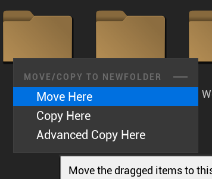
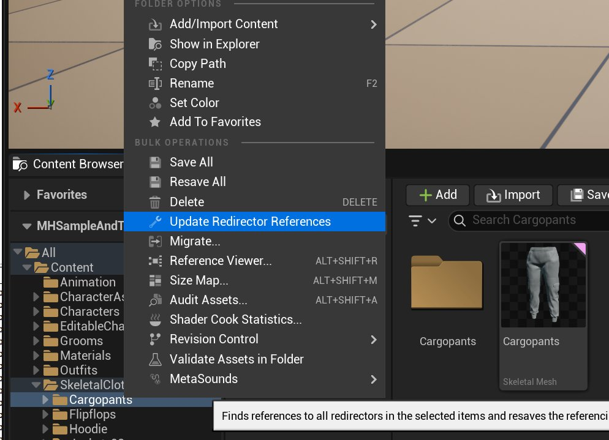
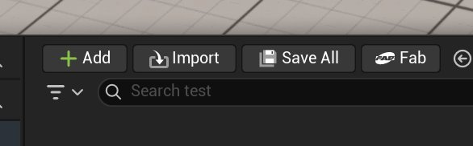
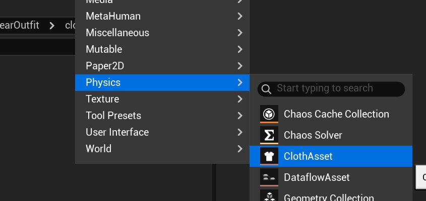
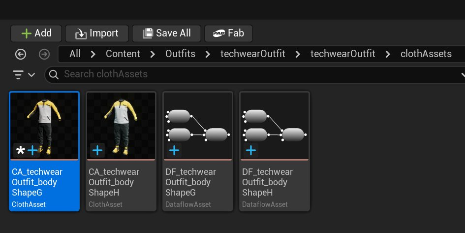
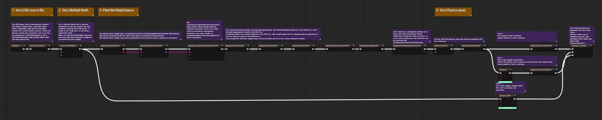
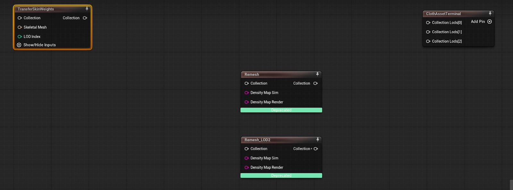

# 编译服装资产

> 路径：虚幻引擎5.7文档 / Gameplay系统 / 物理 / 布料模拟 / 为FAB创建参数化布料 / 编译服装资产

> 原始页面：https://dev.epicgames.com/documentation/unreal-engine/building-an-outfit-asset-in-unreal-engine

## 开始之前

你必须准备好布料模型（FBX或USD），以导入到**虚幻编辑器（Unreal Editor）**中。 本教程使用**内容浏览器（Content Browser）**中以下路径的**techwearOutfit**工作文件夹：

`All/Content/Outfits/techwearOutfit/techwearOutfit`

同时使用在[创建你的MetaHuman](../creating-your-metahuman/index.md)中生成的骨架网格体：

`bodyShapeG_CombinedSkelMesh`

> [!WARNING]
> 如果你的模型已被导入且依赖项位于编辑器内的其他位置，必须将所有依赖项（如骨架和父材质等共享资产）移动到模型所在的同一工作文件夹中。

> [!NOTE]
> 本教程需要特定的虚幻引擎插件来创建布料资产。 如需了解设置插件的信息，请参阅[参数化资产设置](../parametric-asset-setup/index.md)。

要移动共享资产，请执行以下步骤：

1. 在**内容浏览器（Content Browser）**中，将共享资产拖至工作文件夹，然后在上下文对话框中选择**移至此处（Move Here）**。

   
2. 要更新资产引用，右键点击工作文件夹，选择**更新重定向器引用（Update Redirector References）**。

   

   > [!NOTE]
   > **移至此处（Move Here）**选项会更新资产引用。 **复制至此处（Copy Here）**不会更新资产引用。

## 选择工作流程路径

根据开发需求不同，创建LOD的流程可能有所差异。 在本教程中，请选择最符合需求的工作流程路径：

- [路径A](index.md#path-a)：模型为FBX格式，仅包含渲染网格体。 如果你需要将现有**MetaHuman**布料转换为参数化资产，请选择此路径。
- [路径B](index.md#path-b)：模型为从Marvelous Designer或Clo导出的USD格式，包含模拟网格体和渲染网格体。
- [路径C](index.md#path-c)：模型为渲染网格体，并且你已手动创建模拟网格体。

## 路径A

### 导入FBX

1. 将你的FBX拖至**内容浏览器（Content Browser）**中的工作文件夹。 也可点击**导入（Import）**。

   
2. 在**导入内容（Import Content）**对话框中，保持所有选项为默认值，然后点击**导入（Import）**。 你的资产将作为静态网格体导入（如果你的FBX包含骨架，则会作为骨架网格体导入）。
3. 将此静态网格体命名为`techwear_bodyShapeG_LOD0`。

> [!NOTE]
> 虽然可将包含绑定或蒙皮信息的FBX作为骨架网格体（而非静态网格体）导入，但由于数据流编辑器中存在可视化问题，因此不推荐此操作。

### 创建布料资产

1. 要创建布料资产，在工作文件夹内，右键点击内容浏览器，选择**物理（Physics）> 布料资产（Cloth Asset）**。

   
2. 将新布料资产命名为`CA_techwearOutfit_bodyShapeG`。 此操作将创建新的数据流资产。

   
3. 右键点击布料资产，选择**在数据流编辑器中打开（试验性）（Open in Dataflow Editor (Experimental)）**，以在**数据流编辑器（Dataflow Editor）**中打开资产。

   

   如果仅有一个LOD，在**图表（Graph）**选项卡中，选择并删除所有节点，仅保留以下4个节点：

   - **TransferSkinWeights**
   - **Remesh**
   - **Remesh_LOD2**
   - **ClothAssetTerminal**

   你的图表现在应该如下所示：

   

   如果你手动创建了LOD，删除所有节点，仅保留以下两个节点：

   - **TransferSkinWeights**
   - **ClothAssetTerminal**

   你的图表现在应该如下所示：

   > 图片已省略：路径A - 手动清理图表

### 在数据流编辑器中设置网格体

1. 在数据流编辑器的"图表（Graph）"选项卡中，右键点击并搜索**StaticMeshImport**。 点击或拖动以将StaticMeshImport节点添加到图表。
2. 在编辑器右侧的**节点细节（Node Details）**面板中，取消勾选**导入模拟网格体（Import Sim Mesh）**。
3. 在**静态网格体（Static Mesh）**旁的下拉菜单中，选择你的模型的静态网格体。 在本例中，其名称为`techwear_bodyShapeG_LOD0`。 或者，你可以在内容浏览器（Content Browser）中选择静态网格体，然后点击**使用来自内容浏览器的选定资产（Use Selected Asset From Content Browser）**按钮。

   > 图片已省略：路径A - 节点细节面板
4. 在"图表（Graph）"选项卡中，将**StaticMeshImport**节点上的**集合（Collection）**引脚连接到**TransferSkinWeights**节点上的集合（Collection）引脚。
5. 选中TransferSkinWeights节点后，返回"节点细节（Node Details）"面板：

   - 在**目标网格体（Target Mesh (es)）**下拉菜单下，选择**渲染网格体（Render Mesh）**。
   - 在**渲染网格体传输源（Render Mesh Transfer Source）**下拉菜单下，选择**骨架网格体（Skeletal Mesh）**。
   - 在**骨架网格体（Skeletal Mesh）**下，选择在[创建你的MetaHuman](../creating-your-metahuman/index.md)中创建的`bodyShapeG_CombinedSkelMesh`。
   - 在**传输方法（Transfer Method）**下拉菜单下，选择**表面上的最近点（Closest Point on Surface）**。
6. 在"图表（Graph）"选项卡中，将TransferSkinWeights节点上的**集合（Collection）**（输出）引脚连接到ClothAssetTerminal节点上的**集合细节级别[0]（Collection Lods[0]）**引脚。

   > 图片已省略：路径A - 连接SkinTransferWeights

如果你不想添加或生成LOD，右键点击**ClothAssetTerminal**，选择**移除选项****引脚（Remove Option Pin）**以移除剩余引脚（使其不再需要更多LOD）。 然后，继续[创建服装资产](index.md#creating-an-outfit-asset)。

如果你需要添加手动生成的LOD或自动生成的LOD，请继续执行[路径A：设置LOD](index.md#path-a-setting-up-lo-ds)。

### 路径A：设置LOD

本教程涵盖手动生成的LOD和自动生成的LOD。

#### 手动生成的LOD

1. 在"图表（Graph）"选项卡中，右键点击ClothAssetTerminal节点，选择**添加引脚（Add Pin）**以添加第四个引脚。
2. 将**StaticMeshImport**和**TransferSkinWeights**节点复制三次。 按升序顺序操作，在每个新**TransferSkinWeights**节点的"节点详情（Nodes Details）"面板中，选择与此LOD关联的新静态网格体和骨架网格体。

   > 图片已省略：路径A - 手动生成的LOD

> [!NOTE]
> MetaHuman需要四个身体LOD：0、1、2、3。

#### 自动生成的LOD

1. 在"图表（Graph）"选项卡中，右键点击并搜索**Remesh**。将Remesh节点拖入图表中。
2. 将TransferSkinWeights节点的**集合（Collection）**（输出）引脚连接到Remesh节点的**集合（Collection）**（输入）引脚。 请勿断开TransferSkinWeights与ClothAssetTerminal的连接。

   > 图片已省略：路径A - 连接Remesh
3. 选中Remesh节点后，在"细节（Details）"面板中，取消勾选**重新网格化模拟（Remesh Sim）**复选框。 勾选**重新网格化渲染（Remesh Render）**。

   > 图片已省略：Remesh节点细节
4. 要直观地查看你在Remesh节点设置中所做的更改，你可以启用**构造视口（Construction Viewport）**。 在数据流编辑器的"构造视口（Construction Viewport）"选项卡中，点击右上角的下拉菜单并选择**渲染（Render）**。

   > 图片已省略：路径A - 构造视口

   > [!TIP]
   > 你还可以将"构造视口"的显示从"光照（Lit）"更改为"线框（Wireframe）"等多种选项。

   > [!TIP]
   > 如果在"构造视口"中看不到资产，请务必检查是否已选择"渲染（Render）"。 此选项很容易被取消选择。
5. 将Remesh节点的**集合（Collection）**（输出）引脚连接到ClothAssetTerminal。

   > 图片已省略：路径A - 将Remesh连接到ClothAssetTerminal
6. 为每个LOD重复第1、2、3、5步。 在本教程中，你需要在"节点细节（Node Details）"面板中调整每个Remesh节点的**目标渲染百分比（Target Percent Render）**。 实际上，这些参数可根据需要进行调整：

   - **LOD[1]**的Remesh节点：将目标渲染百分比（Target Percent Render）设置为50。
   - **LOD[2]**的Remesh节点：将目标渲染百分比（Target Percent Render）设置为30。
   - **LOD[3]**的Remesh节点：将目标渲染百分比（Target Percent Render）设置为10。

   > 图片已省略：路径A - 最终图表

继续[创建服装资产](index.md#creating-an-outfit-asset)。

## 路径B

### 创建布料资产

1. 要创建布料资产，在工作文件夹内，右键点击内容浏览器，选择**物理（Physics）> 布料资产（Cloth Asset）**。

   > 图片已省略：创建布料资产
2. 将新布料资产命名为`CA_techwearOutfit_bodyShapeG`。 此操作将创建新的数据流资产。

   > 图片已省略：命名布料资产
3. 右键点击`CA_techwearOutfit_bodyShapeG`，选择**在数据流编辑器中打开（试验性）（Open in Dataflow Editor (Experimental)）**，以在数据流编辑器（Dataflow Editor）中打开资产。

   > 图片已省略：数据流节点
4. 在"图表（Graph）"面板中，删除所有节点，仅保留以下节点：

   - **USDimport**
   - **TransferSkinWeights**
   - **Remesh**
   - **Remesh_LOD2**
   - **ClothAssetTerminal**

   你的图表现在应该如下所示：

   > 图片已省略：路径B - 清理图表

### 在数据流编辑器中设置网格体

1. 在"图表（Graph）"面板中，选择**USDImport**节点。 在"节点细节（Node Details）"面板中，点击**USD文件（USD File）**旁的三点号，导入USD。

   > 图片已省略：路径B - 节点细节面板

   导入后，你的资产应在数据流编辑器的构造视口（Construction Viewport）中显示。

   在内容浏览器中，工作文件夹中会出现一个新文件夹，其中包含你的USD文件、材质、静态网格体和纹理。
2. 将USDImport节点上的**集合（Collection）**引脚连接到TransferSkinWeights节点上的**集合（Collection）**（输入）引脚。

   > 图片已省略：路径B - 连接TransferSkinWeights
3. 选择TransferSkinWeights节点。 在"节点细节（Node Details）"面板的**骨架网格体（Skeletal Mesh）**下，选择`bodyShapeG_CombinedSkelMesh`。 这是在[创建Metahuman](../creating-your-metahuman/index.md)中创建的资产。
4. 在"图表（Graph）"面板中，将TransferSkinWeights节点上的**集合（Collection）**（输出）引脚连接到ClothAssetTerminal节点上的**集合细节级别[0]（Collection LOD[0]）**引脚。

   你的图表现在应该如下所示：

   > 图片已省略：路径B - 最终清理图表

如果你不想添加或生成更多LOD，右键点击**ClothAssetTerminal**，选择**移除选项引脚（Remove Option Pin）**以移除剩余引脚（使其不再需要更多LOD）。 然后，继续[创建服装资产](index.md#creating-an-outfit-asset)。

如果你需要生成更多LOD，请继续执行[路径B：设置LOD](index.md#path-b-setting-up-lo-ds)。

### 路径B：设置LOD

1. 在"图表（Graph）"选项卡中，右键点击并搜索Remesh。 将Remesh节点拖入图表中。
2. 在"图表（Graph）"选项卡中，将TransferSkinWeights节点上的**集合（Collection）**（输出）引脚连接到Remesh节点的**集合（Collection）**（输入）引脚。 请勿断开TransferSkinWeights与ClothAssetTerminal的连接。

   > 图片已省略：路径B - 连接Remesh
3. 要直观地查看你在Remesh节点设置中所做的更改，你可以启用**构造视口（Construction Viewport）**。 在数据流编辑器的"构造视口（Construction Viewport）"选项卡中，点击右上角的下拉菜单并选择**渲染（Render）**。

   > 图片已省略：路径B - 构造视口

   > [!TIP]
   > 你还可以将"构造视口"的显示从"光照（Lit）"更改为"线框（Wireframe）"等多种选项。

   > [!TIP]
   > 如果在"构造视口"中看不到资产，请务必检查是否已选择"渲染（Render）"。 此选项很容易被取消选择。
4. 将Remesh节点的**集合（Collection）**（输出）引脚连接到ClothAssetTerminal。
5. 为每个LOD重复第1、2、4步。 在本教程中，需要在"节点细节（Node Details）"面板中调整每个Remesh节点的**目标渲染百分比（Target Percent Render）**：

   - **LOD[1]**的Remesh节点：将目标渲染百分比（Target Percent Render）设置为50。
   - **LOD[2]**的Remesh节点：将目标渲染百分比（Target Percent Render）设置为30。
   - **LOD[3]**的Remesh节点：将目标渲染百分比（Target Percent Render）设置为10。

   > 图片已省略：路径B - 最终图表

继续[创建服装资产](index.md#creating-an-outfit-asset)。

## 路径C

### 导入你的渲染网格体和模拟网格体

1. 将你的模拟网格体和渲染网格体拖至**内容浏览器（Content Browser）**中的工作文件夹。 也可点击**导入（Import）**。

   > 图片已省略：内容浏览器导入
2. 在**导入内容（Import Content）**对话框中，保持所有选项为默认值，然后点击**导入（Import）**。 将此静态网格体命名为`techwear_bodyShapeG_LOD0`。

### 创建布料资产

1. 要创建布料资产，在工作文件夹内，右键点击内容浏览器，选择**物理（Physics）> 布料资产（Cloth Asset）**。

   > 图片已省略：创建布料资产
2. 将新布料资产命名为`CA_techwearOutfit_bodyShapeG`。 此操作将创建新的数据流资产。

   > 图片已省略：命名布料资产
3. 右键点击`CA_techwearOutfit_bodyShapeG`，选择**在数据流编辑器中打开（试验性）（Open in Dataflow Editor (Experimental)）**，以在**数据流编辑器（Dataflow Editor）**中打开资产。

   > 图片已省略：数据流节点

   如果仅有一个LOD，在**图表（Graph）**选项卡中，选择并删除所有节点，仅保留以下4个节点：

   - **TransferSkinWeights**
   - **Remesh**
   - **Remesh_LOD2**
   - **ClothAssetTerminal**

   你的图表现在应该如下所示：

   > 图片已省略：路径C - 清理图表 - 一个LOD

   如果你手动创建了LOD，删除所有节点，仅保留以下两个节点：

   - **TransferSkinWeights**
   - **ClothAssetTerminal**

   你的图表现在应该如下所示：

   > 图片已省略：路径C - 清理图表 - 手动生成的LOD

### 在数据流编辑器中设置网格体

1. 在数据流编辑器的"图表（Graph）"选项卡中，右键点击并搜索**StaticMeshImport**。 点击或拖动以将其添加到图表。
2. 在编辑器右侧的**节点细节（Node Details）**面板中，确认已勾选**导入模拟网格体（Import Sim Mesh）**，并已取消勾选**导入渲染网格体（Import Render Mesh）**。

   > 图片已省略：路径C - 节点细节面板
3. 在**静态网格体（Static Mesh）**旁的下拉菜单中，选择你的模型的模拟网格体。 或者，你可以在内容浏览器（Content Browser）中选择静态网格体，然后点击**使用来自内容浏览器的选定资产（Use Selected Asset From Content Browser）**按钮。
4. 在"图表（Graph）"中创建第二个StaticMeshImport节点。 在"节点细节（Node Details）"面板中，取消勾选**导入模拟网格体（Import Sim Mesh）**，勾选**导入渲染网格体（Import Render Mesh）**。

   > 图片已省略：路径C - 节点细节面板 - 渲染网格体
5. 在**静态网格体（Static Mesh）**旁的下拉菜单中，选择你的模型的渲染网格体。
6. 在"图表（Graph）"中创建一个**MergeClothCollections**节点。 将StaticMeshImport节点的**集合（Collection）**引脚连接到MergeClothCollections节点上的**集合（Collection）**（输入）引脚。

   > 图片已省略：路径C - 连接MergeClothCollections
7. 将MergeClothCollections节点上的**集合（Collection）**（输出）引脚连接到TransferSkinWeights节点上的**集合（Collection）**（输入）引脚。

   > 图片已省略：路径C - 连接TransferSkinWeights
8. 选择TransferSkinWeights节点。 在"节点细节（Node Details）"面板的**骨架网格体（Skeletal Mesh）**下，选择`bodyShapeG_CombinedSkelMesh`。
9. 在"图表（Graph）"面板中，将TransferSkinWeights节点上的**集合（Collection）**（输出）引脚连接到ClothAssetTerminal节点上的**集合细节级别[0]（Collection LOD[0]）**引脚。

   你的图表现在应该如下所示：

   > 图片已省略：路径C - 最终图表

如果你不想添加或生成更多LOD，右键点击**ClothAssetTerminal**，选择**移除选项引脚（Remove Option Pin）**以移除剩余引脚（使其不再需要更多LOD）。 然后，继续[创建服装资产](index.md#creating-an-outfit-asset)。

如果你需要生成更多LOD，请继续执行[路径C：设置LOD](index.md#path-c-setting-up-lo-ds)。

### 路径C：设置LOD

本教程涵盖手动生成LOD和自动生成LOD。

#### 自动生成的LOD

1. 在"图表（Graph）"选项卡中，右键点击并搜索**Remesh**。 将Remesh节点拖入图表中。
2. 将TransferSkinWeights节点的**集合（Collection）**（输出）引脚连接到Remesh节点的**集合（Collection）**（输入）引脚。 请勿断开TransferSkinWeights与ClothAssetTerminal的连接。

   > 图片已省略：路径C - 连接Remesh
3. 要直观地查看你在Remesh节点设置中所做的更改，你可以启用**构造视口（Construction Viewport）**。 在数据流编辑器的"构造视口（Construction Viewport）"选项卡中，点击右上角的下拉菜单并选择**渲染（Render）**。

   > 图片已省略：路径C - 构造视口

   > [!TIP]
   > 你还可以将"构造视口"的显示从"光照（Lit）"更改为"线框（Wireframe）"等多种选项。

   > [!TIP]
   > 如果在"构造视口"中看不到资产，请务必检查是否已选择"渲染（Render）"。 此选项很容易被取消选择。
4. 将Remesh节点的**集合（Collection）**（输出）引脚连接到ClothAssetTerminal。
5. 为每个LOD重复第1、2、4步。 在本教程中，你需要在"节点细节（Node Details）"面板中调整每个Remesh节点的**目标渲染百分比（Target Percent Render）**：

   - **LOD[1]**的Remesh节点：将目标渲染百分比（Target Percent Render）设置为50。
   - **LOD[2]**的Remesh节点：将目标渲染百分比（Target Percent Render）设置为30。
   - **LOD[3]**的Remesh节点：将目标渲染百分比（Target Percent Render）设置为10。

   > 图片已省略：路径C - 自动生成的LOD

#### 手动生成的LOD

1. 在"图表（Graph）"选项卡中，右键点击ClothAssetTerminal节点，选择**添加选项引脚（Add Option Pin）**以添加第四个引脚。
2. 将**StaticMeshImport**和**TransferSkinWeights**节点复制三次。 按升序顺序操作，在每个新**TransferSkinWeights**节点的"节点详情（Nodes Details）"面板中，选择与此LOD关联的新静态网格体和骨架网格体。

   > 图片已省略：路径C - 手动生成的LOD

   > [!NOTE]
   > MetaHuman需要四个身体LOD：0、1、2、3。

继续[创建服装资产](index.md#creating-an-outfit-asset)。

## 创建服装资产

1. 在内容浏览器（Content Browser）中，找到**techwearOutfit**文件夹。 右键点击，选择**物理（Physics）> 服装资产（Outfit Asset）**以创建服装资产。
2. 将资产命名为`OA_techwearOutfit`。

   > 图片已省略：创建服装资产

   > [!WARNING]
   > 服装资产的名称必须与其所在文件夹的名称一致。
3. 在**选择服装资产模板（Select an Outfit Asset Template）**对话框中，选择**可调整尺寸的服装（Resizable Outfit）**。

   > 图片已省略：选择一个服装资产模板
4. （可选）这将创建`DF_techwearOutfit`。 如果要为FAB打包，点击它并将其拖入工作文件夹中，并在上下文弹出窗口中选择**移至此处（Move Here）**。

   > 图片已省略：移至此处
5. 双击服装资产，打开数据流编辑器。
6. 要加快求值速度，在数据流编辑器中，点击**对数据流图表求值（Evaluate Dataflow Graph）**旁的三点号，然后选择**手动图表求值（Manual Graph Evaluation）**。

   > 图片已省略：手动图表求值
7. 在**数据流成员（Dataflow Members）**面板中，勾选**已调整尺寸的服装源（Sized Outfit Source）**复选框。 点击加号（**+**）图标，为每个与身体对应的布料资产创建一个索引。 在本例中，我们有两个索引：

   > 图片已省略：已调整尺寸的服装源
8. 展开**索引（Index）**旁的下拉菜单。在**尺寸名称（Size Name）**中，输入你的服装资产名称。 在本例中为bodyShapeG。

   > 图片已省略：尺码名称
9. 展开**索引（Index）**旁的下拉菜单，将你的布料资产指定给**源资产（Source Asset）**。 你的布料资产为`CA_techwear_bodyShapeG`。 在**源身体部位（Source Body Parts）**下，指定你的骨架网格体。 你的骨架网格体为`bodyShapeG_combinedSkelMesh`。

   > [!NOTE]
   > 身体与布料资产应相互匹配；如果你为bodyShapeG制作了布料，则你的布料资产也应分配到相同的索引。

   > 图片已省略：源资产
10. （可选）**尺寸调整插值点数（Num Resizing Interpolation Points）**是指在尺寸调整过程中对身体进行采样的点数。 使用的点数越多，服装就越贴合身体形态，但会影响运算速度。 建议保持在约1000到2500之间，但你可以自由尝试此设置。

    在本教程中，保持默认值1500即可。
11. 在数据流编辑器中，点击**对数据流图表求值（Evaluate Dataflow Graph）**，然后重新启用**自动图表求值（Automatic Graph Evaluation）**。 进度条会显示求值是否成功，有时这可能需要几分钟时间。

    > 图片已省略：手动图表求值

    > [!NOTE]
    > 如果你修改了服装资产所依赖的资产，必须点击"对数据流图表求值（Evaluate Dataflow Graph）"以对你的服装资产重新求值。

## 下一步

下一步，你需要将服装资产上传至**MetaHuman Creator**。

- [在MetaHuman Creator中测试和设置](../testing-and-setup-in-metahuman-creator/index.md) - 在MetaHuman Creator中测试你的服装资产。
