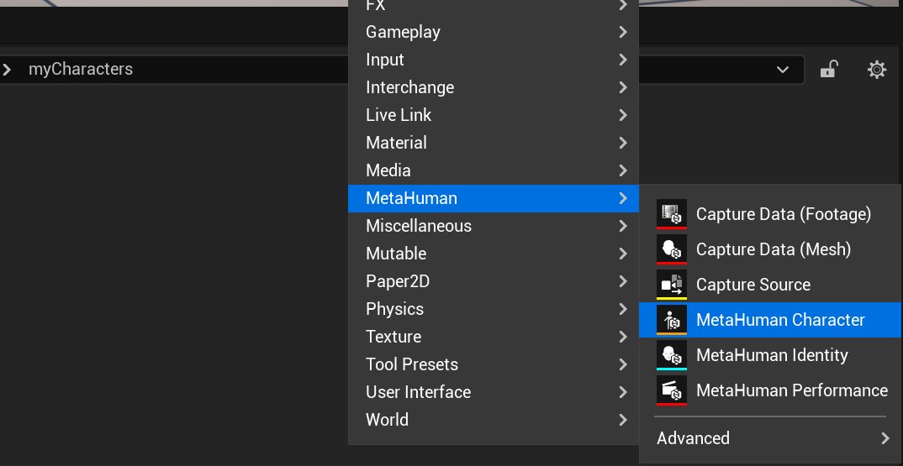
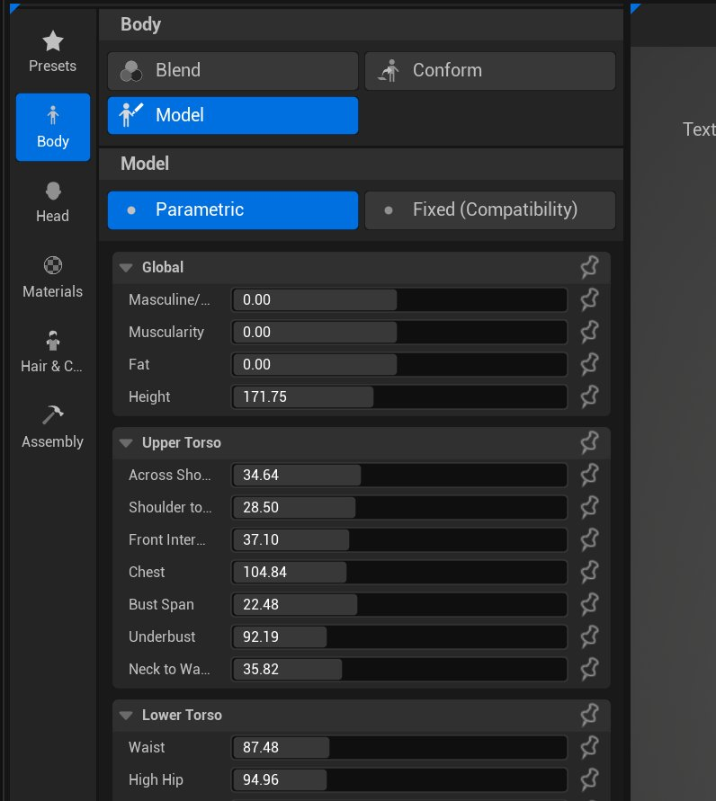
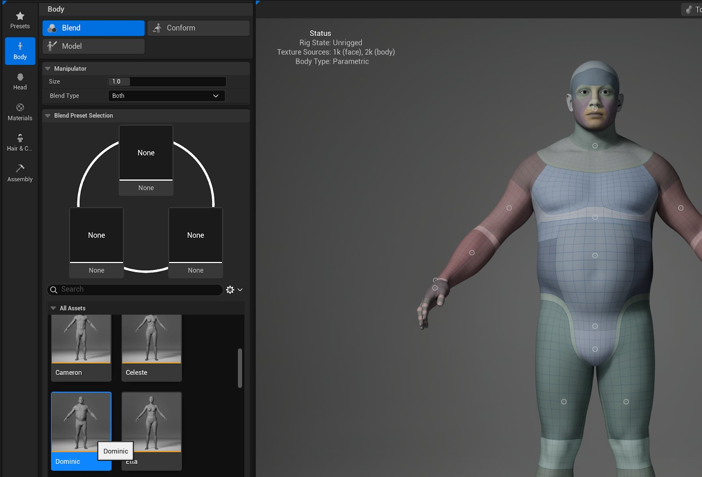
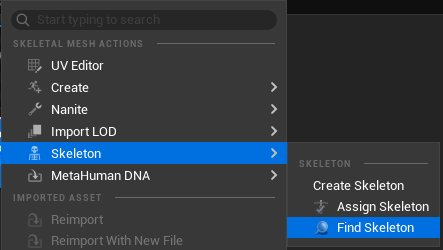
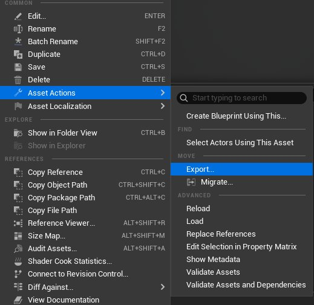

# 创建MetaHuman

> 路径：虚幻引擎5.7文档 / Gameplay系统 / 物理 / 布料模拟 / 为FAB创建参数化布料 / 创建MetaHuman

> 原始页面：https://dev.epicgames.com/documentation/unreal-engine/creating-your-metahuman-in-unreal-engine

虽然这并非强制要求，但我们建议你在工作文件夹内创建**MetaHuman角色**。 这样一来，你创建的所有资产都会保存在同一个位置。 当你导出包时，MetaHuman角色将不会出现在导出内容中。

1. 在**内容浏览器**中，找到你想创建MetaHuman的文件夹。 右键点击**内容浏览器（Content Browser）**，选择**MetaHuman> MetaHuman角色（MetaHuman Character）**。

   

   为你的MetaHuman命名，然后点击回车键保存。 保存后双击，在虚幻引擎中打开**MetaHuman Creator**。 用于自定义角色的选项有很多，但我们仅关注调整身体形态。

   - **身体（Body）> 模型（Model）**：关于这些滑块的深度信息，请参阅[身体功能按钮](https://dev.epicgames.com/documentation/metahuman/body-controls?application_version=5.6)。

     

     > [!NOTE]
     > 如果要将现有布料转换为参数化布料，需启用**固定（兼容性）（Fixed (Compatibility)）**选项：
     >
     > 1. 在虚幻引擎中，选择**编辑（Edit）> 项目设置（Project Settings）**。
     > 2. 在"项目设置（Project Settings）"窗口的左侧菜单中，找到**插件（Plugins）**类别并点击**MetaHuman角色（MetaHuman Character）**。
     > 3. 启用**显示兼容模式身体（Show Compatibility Mode Bodies）**。
     >
     > 这将使你能够访问旧版MetaHuman Creator（Web应用）中的18种固定身体类型。 无需将全部18种身体用作源身体；我们建议使用6种（所有身体均为单一身高）或4种（不包括"unw"身体）。
   - **身体（Body）> 混合（Blend）**：可以在最多3个选定预设之间进行混合，以更改角色身体特征的形状。

     

     或者，你可以使用预设或现有MetaHuman角色中的身体形态，同时保留你之前做出的所有选择：

     1. 将所需的Metahuman角色拖入预设列表。 如果它已在你的预设列表中，请跳过此步骤。
     2. 点击**身体（Body）**选项卡，然后点击**混合（Blend）**选项卡。 在**所有资产（All Assets）**下，选择所需的预设。

     如需了解使用此选项的更多信息，请参阅[身体混合功能按钮](https://dev.epicgames.com/documentation/metahuman/body-blend-controls?application_version=5.6)页面。
   - **身体（Body）> 适配（Conform）**：也可以将身体适配到现有DNA文件或者静态或骨架网格体模板。 此设置在MetaHuman文档的[身体适配控制点](https://dev.epicgames.com/documentation/metahuman/body-conform-controls?application_version=5.6)分段有详细说明。

   > [!WARNING]
   > 确保腋下和大腿间隙留有一定余量。 若这些部位相互穿模，可能会导致尺寸调整出现问题。 可尝试调整此区域的参数（例如二头肌、大腿和胸部尺寸）以修复此类问题。
2. 准备好要使用的身体后，找到**MetaHuman角色（MetaHuman Character）**菜单，选择**导出组合骨架网格体（Export Combined Skel Mesh）**。

   > [!NOTE]
   > 如果你想为FAB打包，找到工作文件夹或其中的子文件夹。 在此示例中，我们按以下路径保存，但**Meshes**文件夹并非必需。
   >
   > `/All/Content/Outfits/techwearOutfit/techwearOutfit/Meshes`

   如果计划使用多个身体，创建有助于识别主要工作身体的命名规范，确保在末尾添加`_CombinedSkelMesh`后缀。

   在本教程中，我们将身体命名为`bodyShapeG_CombinedSkelMesh`，因为项目中已包含现有身体A-F。

   > [!NOTE]
   > 在此阶段，头部纹理可能看起来异常，但这是正常现象。 由于此资产仅用作工具网格体，头部纹理并非必需。 它不会出现在最终结果中。
3. 如果你要制作多个源身体的服装资产，**仅第一个身体**需执行以下操作：

   右键点击骨架网格体，找到**骨架（Skeleton）> 查找骨架（Find Skeleton）**。 这将引导你找到骨架网格体正在使用的骨架。 将此骨架复制（不要移动）到身体所在的目录中。

   
4. 再次右键点击身体，转至**骨架（Skeleton）> 分配骨架（Assign Skeleton）**，以选择刚才复制到文件夹中的骨架。

   从列表中搜索骨架，点击选中后点击**应用（Apply）**。

   > [!NOTE]
   > 如果为同一个资产创建多个身体，无需重复复制骨架，但需为每个新身体模型分配同一骨架。
   >
   > 骨架是骨架网格体的依赖项。 为确保此流程正常运行，必须确保所有骨架网格体均未链接至工作文件夹外的骨架。
5. 准备好所有身体后，可将其导出至所选DCC工具以创建布料。 右键点击组合的骨架网格体，找到**资产操作（Asset Actions）> 导出（Export）**。 点击**导出（Export）**，并保存为FBX格式。

   

## 下一步

- [编译服装资产](../building-an-outfit-asset/index.md) - 在虚幻引擎中编译服装资产。
