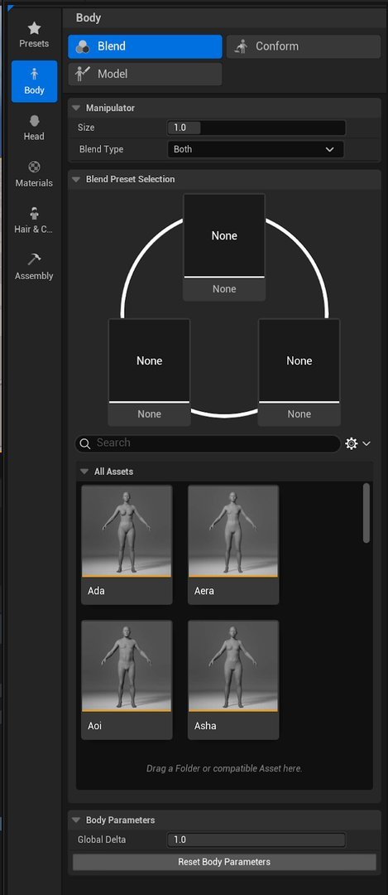

# 入门指南

> 路径：虚幻引擎5.7文档 / Gameplay系统 / 物理 / 布料模拟 / 为FAB创建参数化布料 / 入门指南

> 原始页面：https://dev.epicgames.com/documentation/unreal-engine/getting-started-with-parametric-clothing

## 基本术语

**参数化和固定**

- **参数化（Parametric）**：指可随角色调整尺寸的布料资产。
- **固定（Fixed）**：为特定身体形态制作的布料（如旧版资产）。

> [!TIP]
> 在布料语境中，**可调整尺寸**有时与"参数化"同义。

**骨架网格体和服装资产**

- **骨架网格体布料（Skeletal Mesh Clothing）**（固定尺寸、不可调整尺寸）：这是布料创作者以前制作布料的方式，即创建布料模型并将其蒙皮到身体上。
- **服装资产（Outfit Asset）**：一种新资产类型。 服装资产支持处理多块独立布料的复杂组合。 其在被创建时已集成尺寸调整功能。 如果你接触过Chaos布料系统，可能对布料资产较为熟悉，服装资产类似布料资产，但具备更多功能，且必须包含一个或多个布料资产。

**渲染网格体和模拟网格体（Render Meshes and Sim Meshes）**

- **渲染网格体（Render Meshes）**：当你在构想布料资产模型时，通常会想到这些资产。
- **模拟网格体（Sim Meshes）****：**模拟网格体是一种简化的单面网格体。 它用于模拟布料，驱动更复杂渲染网格体的变形。 其分辨率也可能低于渲染网格体。

| 渲染网格体 | 模拟网格体 |
| --- | --- |
| 渲染网格体：被渲染的网格体可包含厚度可包含细节始终存在 | 模拟网格体：驱动渲染网格体不会被渲染用于模拟，同时也支持尺寸调整和蒙皮功能（本次讨论将围绕此情况）非必备组件，并非在所有资产中都存在 |

**预设**

- 预设是我们互相分享MetaHuman信息的方式。 **MetaHuman Creator**（MHC）附带内置预设，但你可以创建并共享（或出售）自定义预设。

  - 所有MetaHuman角色均可作为预设，只需将角色或文件夹拖入预设窗口即可。
  - 预设可用于复制所有设置，例如面部特征、肤色、毛发等。
  - 它们还可仅用于传输身体形态。 这使你能够创建自定义MetaHuman，并仅从预设传输身体形态信息。
  - 预设的身体形态（不含头部信息、肤色等）可从任意预设传输，双击**身体（Body）> 混合（Blend）**中**所有资产（All Assets）**分段内任意预设的图像即可。

    

## 开始之前

需重点关注资产是否包含模拟网格体。 除非已创建一个模拟网格体，或通过[Clo](https://www.clo3d.com/en/)或[Marvelous Designer](https://www.marvelousdesigner.com/)完成USD导出，否则仅能使用渲染网格体。

根据资产复杂度，你可能仍倾向于创建骨架网格体布料，而非参数化布料。 在**虚幻引擎**（UE）5.6中，可调整尺寸的布料不支持自定义蒙皮、控制绑定或布料上的**刚体动画注意事项**（RBAN）。 你可以在布料上实现所有这些功能，但当布料调整尺寸时，会从身体进行简单的蒙皮权重转移，并覆盖所有现有设置。

骨架网格体布料无法调整尺寸，但与旧版MetaHuman的一个重要区别在于，由于现在采用参数化身体，你可针对任意身体形态创建布料，而非仅基于18种基础原型。 现在可通过预设分发身体形态，甚至可将其作为销售包的一部分。

这也意味着无需为参数化布料进行蒙皮。 仅需模型即可，且功能完全相同。

### 参数化服装资产

由于此工作流程仅涵盖虚幻引擎内的流程，不包括在你所选DCC工具中创建资产，你将需要了解新的参数化服装资产。

服装资产是一种新型Chaos布料资产类型，可包含参数化布料。 服装资产将布料及其适合的身体（源身体）相关联。 随后，它会根据源身体与具有不同尺寸的新身体（目标身体）之间的差异对布料进行变形。

在某些情况下，源身体与目标身体差异过大，可能导致变形。 这尤其适用于更写实、细节化（非风格化或简化的）布料。 因此，我们建议你为多个源身体创建多套服装。 目标身体与原始源身体越接近，产生的变形及后续瑕疵就越少。

你可酌情决定要投入的额外工作量，以确保布料满足要求。 你也可以从一个开始测试，然后按需添加更多。 系统会自动检测最符合各个新目标身体的源身体，并选择合适的源布料进行尺寸调整。

## 下一步

- [参数化资产设置](../parametric-asset-setup/index.md) - 创建参数化服装资产的初步步骤。
