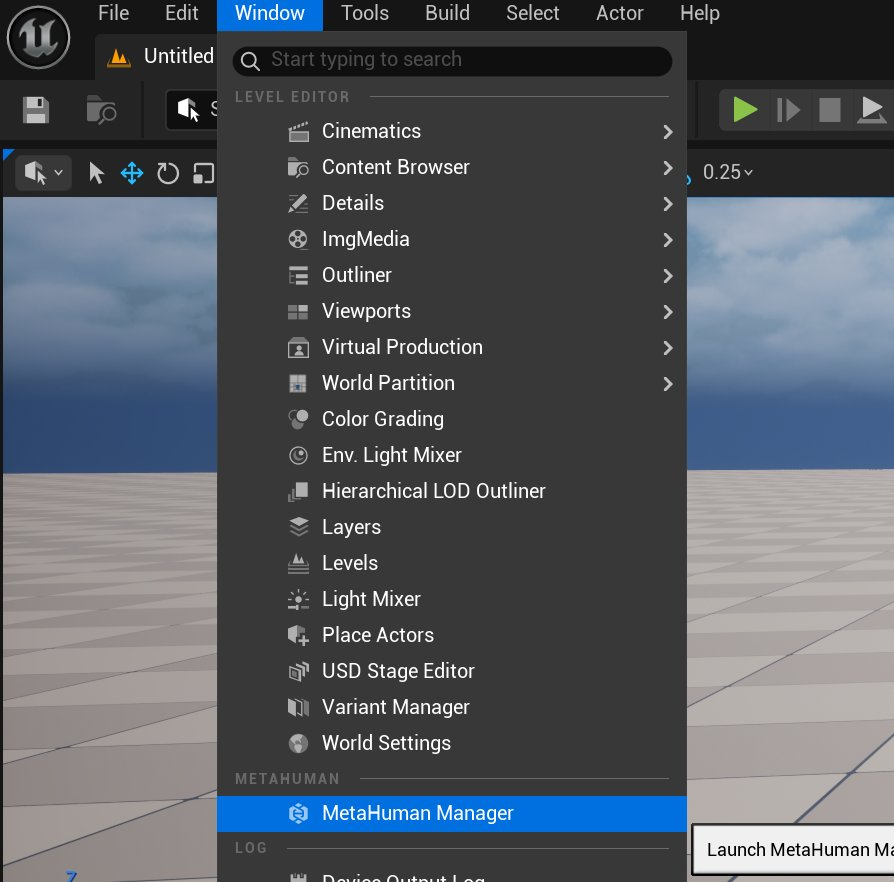
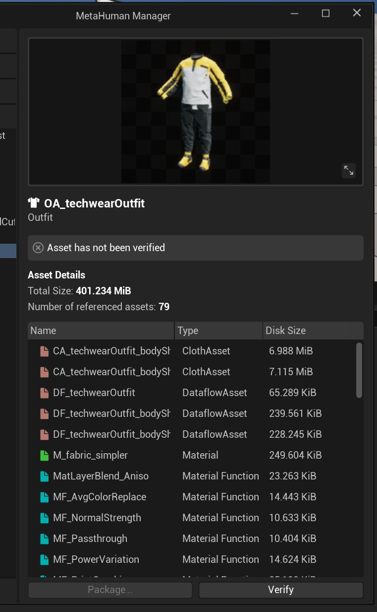

# 打包服装资产

> 路径：虚幻引擎5.7文档 / Gameplay系统 / 物理 / 布料模拟 / 为FAB创建参数化布料 / 打包服装资产

> 原始页面：https://dev.epicgames.com/documentation/unreal-engine/packaging-your-outfit-asset

**MetaHuman管理器**是一个用户界面，用于验证资产是否与MetaHuman兼容，并生成 `.mhpkg` 文件。 Mhpkg是我们在FAB上上传和销售MetaHuman兼容资产时使用的格式。 在以新的MetaHuman格式创建上架商品时，FAB仅接受来自MetaHuman管理器的mhpkg文件类型。 然后，可以使用标准的FAB导入流程将包导入到**虚幻引擎**（UE）中。

## 打包服装

1. 要打包服装，在虚幻编辑器中，找到**窗口（Window）> MetaHuman管理器（MetaHuman** **Manager）**。

   

   MetaHuman管理器将扫描MetaHuman打包路径（MetaHuman Packaging Paths）设置中的文件夹，并查找有效资产。
2. 你的服装应显示在**布料（服装）（Clothing (Outfit)）**分段。 点击窗口底部的**验证（Verify）**。

   

   可能会出现错误和警告。 如果资产存在错误，则无法打包。 如果存在警告，仍可打包，但资产可能非最佳状态。

   建议修复这些问题并重新验证。
3. 通过验证后，可使用旁边的**打包（Package）**按钮。 点击**打包（Package）**，选择包的保存位置并记录此位置。

   > [!NOTE]
   > 包的总大小不得超过6 GB，估算值将显示在上方图片的**磁盘大小（Disk Size）**下方。 超过此大小都无法上传至FAB。 理想情况下，建议将包大小保持在1.5 GB左右，再大一些也行，但不能超过6 GB。
4. 要测试你的资产，在虚幻编辑器中创建一个空白项目。 必须将你的服装资产放置在与创建时完全一致的文件夹结构中。

   在本教程中，创建以下结构：

   `Content/Outfits/techwearOutfit`

   > [!WARNING]
   > 除非创建与资产创建时完全一致的文件夹结构，否则资产中的材质将会失效。
5. 将你的打包文件拖放到techwearOutfit文件夹中。 现在可测试服装资产。

## 下一步

- [上传至FAB商城](../uploading-to-fab-marketplace/index.md) - 将MetaHuman上传至FAB商城。
