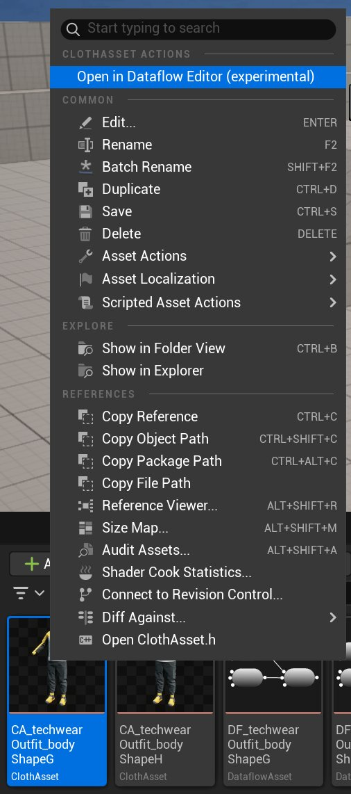
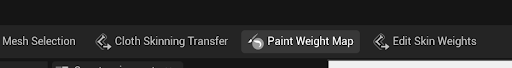
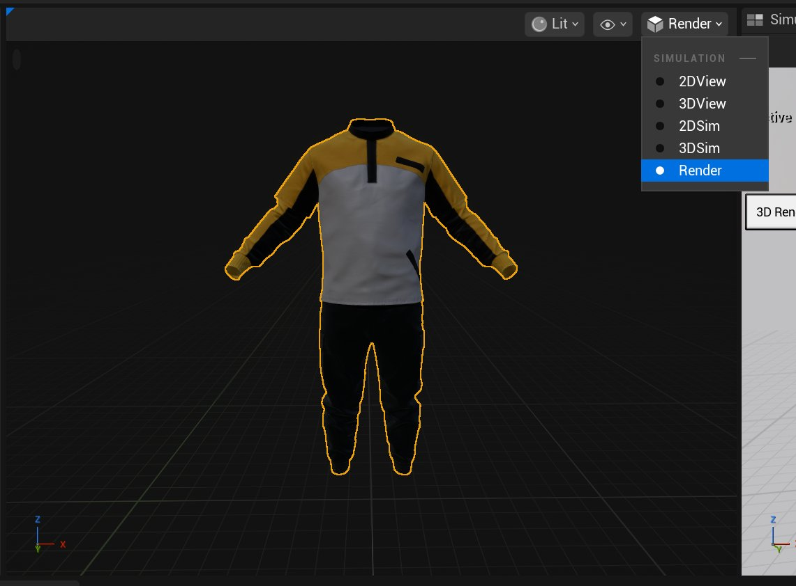
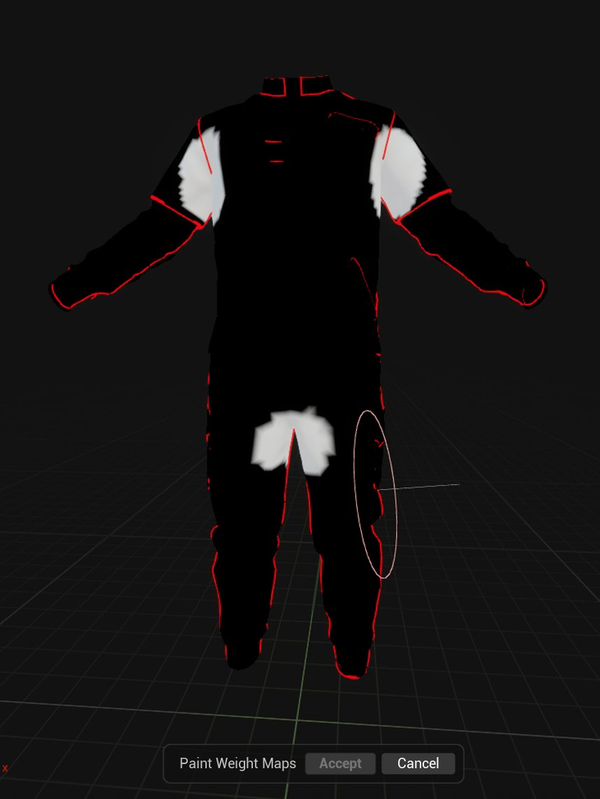
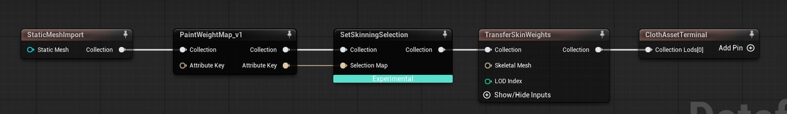
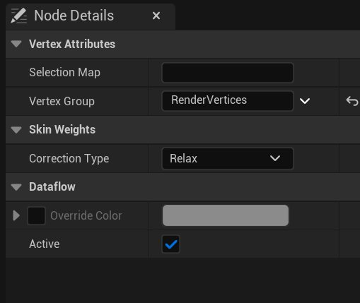
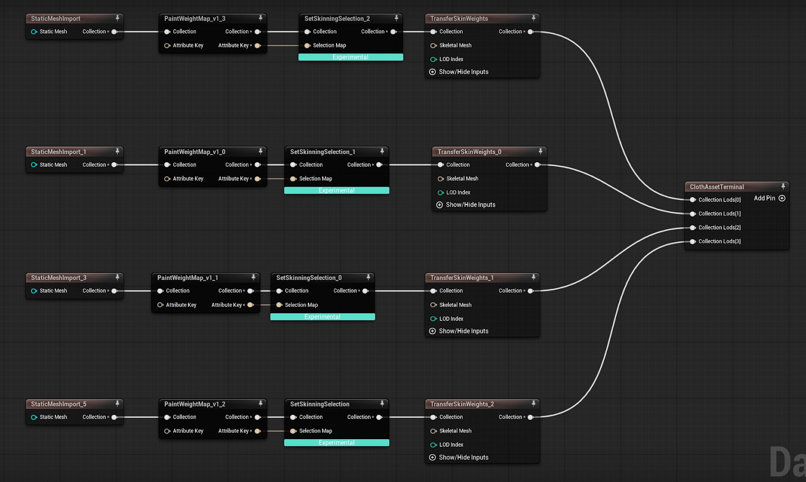
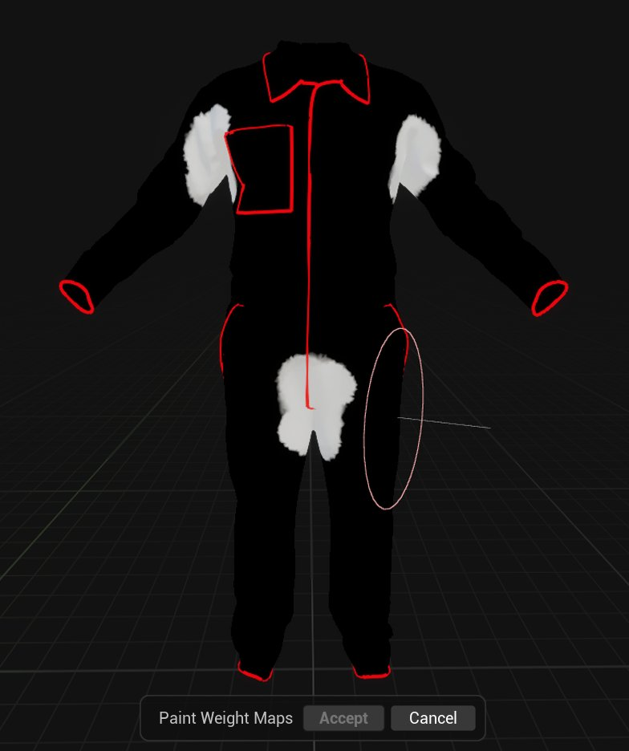

# 绘制权重贴图

> 路径：虚幻引擎5.7文档 / Gameplay系统 / 物理 / 布料模拟 / 为FAB创建参数化布料 / 绘制权重贴图

> 原始页面：https://dev.epicgames.com/documentation/unreal-engine/painting-weight-maps

本文档提供可提升参数化服装资产质量的额外设置。

由于从身体进行蒙皮权重转移存在局限性，偶尔可能会遇到在腋下、大腿上部等部位出现撕裂等外观怪异的瑕疵。 如果在动画序列过程中发现此类问题，这意味着需要预先绘制能够控制蒙皮操作的贴图。 可在服装上绘制用于控制以下操作的贴图：**放松（Relax）**、**修剪（Prune）**、**锤击（Hammer）**、**限制（Clamp）**和**规格化（Normalize）**。

## 绘制权重贴图

右键点击布料资产并选择**在数据流编辑器中打开（Open in Dataflow Editor）**，即可打开布料资产。 请勿双击。

使用与[编译服装资产](../building-an-outfit-asset/index.md)相同的路径：

- **[路径A](index.md#path-a)**：模型为FBX格式，仅包含渲染网格体。 如果你需要将现有MetaHuman布料转换为参数化资产，请选择此路径。
- **[路径B](index.md#path-b)**：模型为从Marvelous Designer或Clo导出的USD格式，包含模拟网格体和渲染网格体。
- **[路径C](index.md#path-c)**：模型为渲染网格体，并且你已手动创建模拟网格体。

### 路径A

点击**StaticMeshImport**节点，然后点击屏幕顶部的**绘制权重贴图（Paint Weight Map）**按钮。

此操作将在网格体上创建贴图。 但在"构造视口（Construction Viewport）"中不显示。 要查看并绘制贴图，请执行以下步骤：

1. 要仅在渲染网格体上绘制，在**节点细节（Node Details）**面板中，将**顶点组（Vertex Group）**更改为**RenderVertices**。
2. 双击**绘制权重贴图（Paint Weight Map）**，贴图将在"构造视口（Construction Viewport）"中显示。 如果未显示，检查是否选择**渲染（Render）**选项。

   

   为此贴图指定一个直观易懂的名称。 在本例中，此贴图对应`LOD_0`网格体，用于控制"放松（relax）"，因此我们将其命名为`LOD0_relaxMap`。
3. 将希望受所选操作影响的区域绘制为白色，其余区域则保持黑色。 当你完成后，点击**接受（Accept）**。

   
4. 此时，此静态网格体已准备好附加一张贴图。 右键点击数据流图表，输入**SetSkinningSelection**并在弹出时进行选中。

   - 将**PaintWeightMap**的**集合（Collection）**（输出）引脚连接至**SetSkinningSelection**节点的**集合（Collection）**（输入）引脚。
   - 将**PaintWeightMap**上的**特性键（Attribute Key）**引脚连接至**SetSkinningSelection**节点的**选择贴图（Selection Map）**引脚。
   - 将**SetSkinningSelection**节点上的**集合（Collection）**（输出）引脚连接至**TransferSkinWeights**节点中的**集合（Collection）**（输入）引脚。

   
5. 点击**SetSkinningSelection**节点，在**节点细节（Node Details）**面板中将**顶点组（Vertex Group）**更改为**RenderVertices**。

   
6. 将**校正类型（Correction Type）**设置为所需类型。

   可将**选择贴图（Selection Map）**留空，因为它已通过**特性键（Attribute Key）**和**选择贴图（Selection Map）**连接，连接至**PaintWeightMap**节点。

   > [!NOTE]
   > 如果希望使用同一贴图，可将其连接至多个**SetSkinningSelection**节点。
7. 现在，对需要创建贴图的每个资产重复此过程。 如果手动创建了LOD，则还需要为它们绘制贴图。

   > [!NOTE]
   > 完成后，必须重新求值并保存布料资产。 然后，打开服装资产（如果已创建），重新求值并保存。

   下面是手动创建的LOD的资产示例：

   

### 路径B

点击**USDImport**节点，然后选择屏幕顶部的**绘制权重贴图（Paint Weight Map）**按钮。

1. 要在模拟网格体上绘制，在**节点细节（Node Details）**面板中，将**顶点组（Vertex Group）**更改为**SimVertices3d**。
2. 双击**绘制权重贴图（Paint Weight Map）**，贴图将在"构造视口（Construction Viewport）"中显示。 如果未显示，检查是否选择**3dSim**选项。

   为贴图命名，体现内容信息。 在本例中，此贴图对应`LOD_0`网格体，用于控制"放松（relax）"，因此我们将其命名为`LOD0_relaxMap`。
3. 将希望受所选操作影响的区域绘制为白色，其余区域则保持黑色。 当你完成后，点击**接受（Accept）**。

   
4. 此时，此静态网格体已准备好附加一张贴图。 右键点击数据流图表，输入`SetSkinningSelection`并在弹出时进行选中。

   1. 将**PaintWeightMap**节点的**集合（Collection）**（输出）引脚连接到**SetSkinningSelection**节点的**集合（Collection）**（输入）引脚。
   2. 将**PaintWeightMap**上的**特性键（Attribute Key）**引脚连接至**SetSkinning****Selection**节点的**选择贴图（Selection Map）**引脚。
   3. 将**SetSkinningSelection**节点上的**集合（Collection）**（输出）引脚连接至**TransferSkinWeights**节点上的**集合（Collection）**（输入）引脚。

   > 图片已省略：权重绘制节点
5. 点击**SetSkinningSelection**节点，在**节点细节（Node Details）**面板中。 将**顶点组（Vertex Group）**更改为**SimVertices3D**。

   将**校正类型（Correction Type）**设置为所需选项。

   可将**选择贴图（Selection Map）**留空，因为它已通过**特性键（Attribute Key）**或**选择贴图（Selection Map）**连接，连接至**PaintWeightMap**节点。

   > [!NOTE]
   > 如果希望使用同一贴图，可将其连接至多个**SetSkinningSelection**节点。
6. 现在，对需要创建贴图的每个资产重复此过程。 如果手动创建了LOD，则还需要为它们绘制贴图。

   > [!NOTE]
   > 完成后，必须重新求值并保存布料资产。 然后，打开服装资产（如果已创建），重新求值并保存。

### 路径C

遵循[路径B](index.md#path-b)的操作，但不在**USDImport**节点上创建贴图，而是在**MergeClothCollections**节点上创建贴图：

> 图片已省略：集合节点

## 其他可选设置

其他可选设置包括：

- **调整UV尺寸（Resize UVs）**：允许在存在重复纹理的区域设置UV尺寸调整。
- **自定义区域尺寸调整（Custom Region Resizing）**：允许控制**尺寸调整（Resizing）**，使服装特定部分保持均匀缩放，避免随身体变形。 此设置适用于硬表面物体或不希望随身体变形的服装部位。
