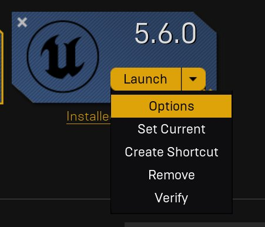
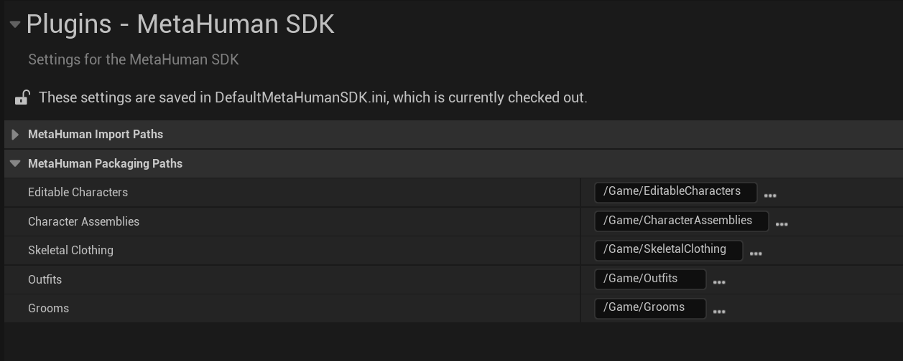

# 参数化资产设置

> 路径：虚幻引擎5.7文档 / Gameplay系统 / 物理 / 布料模拟 / 为FAB创建参数化布料 / 参数化资产设置

> 原始页面：https://dev.epicgames.com/documentation/unreal-engine/parametric-asset-setup

在开始创建资产之前，需完成一些设置。 首先，启用**MetaHuman**和**Chaos Cloth**插件：

1. 在**虚幻引擎**（UE）5.6或更高版本中，点击菜单栏的**编辑（Edit） > 插件（Plugins）**。
2. 在**所有插件（All Plugins）**列表的**内置（Built-In）**分段下：

   1. 点击**MetaHuman**并启用**MetaHuman Creator**插件。
   2. 点击**物理（Physics）**，启用**Chaos布料资产（Chaos Cloth Asset）**和**Chaos布料资产编辑器（Chaos Cloth Asset Editor）**。

   必须重启虚幻引擎以应用此更改。

   > [!NOTE]
   > 建议完全关闭虚幻引擎而非仅重启，以便继续执行下一步。 否则可能需要再次重启。
3. 在**Epic Games启动器**的**库（Library）**选项卡中，点击你想要使用的引擎版本的**启动（Launch）**按钮旁的下拉菜单。 选择**选项（Options）**。

   
4. 勾选**MetaHuman Creator核心数据（MetaHuman Creator Core Data）**旁的复选框，然后点击**应用（Apply）**。 这将下载MetaHuman Creator的必要内容。
5. 在虚幻引擎中，点击**编辑（Edit）> 项目设置（Project Settings）**。 在"项目设置（Project Settings）"窗口的左侧菜单中，滚动到**插件（Plugins）**分段，点击**MetaHuman SDK**。 在这些设置中有**MetaHuman打包路径（MetaHuman Packaging Paths）**。

   

   记下服装的存储位置。 默认情况下，此路径为`/Game/Outfits`，在内容浏览器（Content Browser）中显示为**All > Content > Outfits**。

   > [!WARNING]
   > 暂勿更改此文件夹的名称。
   >
   > 如果计划打包资产以上传至FAB，需在此目录中创建和处理服装资产。
   >
   > [MetaHuman管理器](https://dev.epicgames.com/documentation/metahuman/selling-metahumans-on-fab?application_version=5.6)用于验证和打包资产，要求服装资产及其所有依赖项位于刚才指定文件夹内的单个文件夹中。 否则，它将无法通过验证，因此也无法被打包。

   在此示例中，我们将使用默认目录**Outfits**，并创建一个名为"techwearOutfit"的资产（可从[FAB](https://www.fab.com/listings/9e04c752-1979-4723-b78f-6d24afc532bc)下载）。
6. 在内容浏览器的Outfits文件夹内，创建一个与你的资产同名的文件夹。 在本例中为"techwearOutfit"。然后，在第一个文件夹内创建另一个同名的文件夹，并将其嵌套其中。 最终你会得到如下文件夹结构：

   

   > [!NOTE]
   > 本教程中，这个第二个文件夹将被称为你的**工作文件夹**。

   在此工作文件夹内，你可以按任意方式排列内容：可以为不同类型的资产创建子文件夹，如网格体、布料资产、材质和纹理，也可以将所有内容放在此文件夹中。

### 下一步

- [创建MetaHuman](../creating-your-metahuman/index.md) - 在虚幻引擎中创建MetaHuman。
