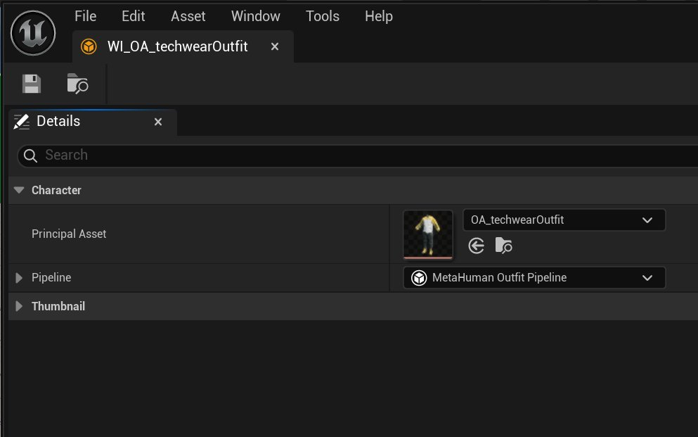
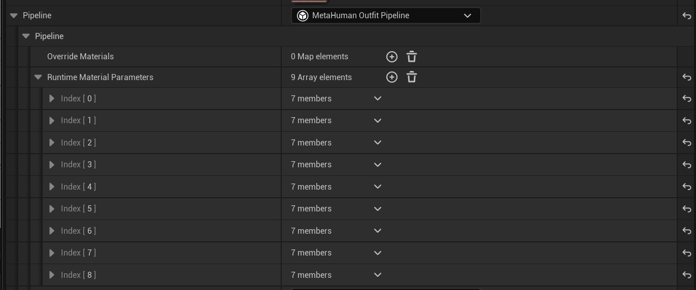
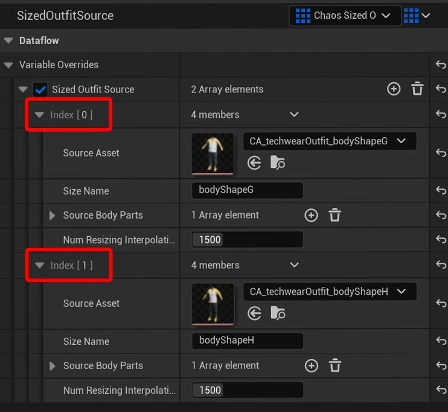
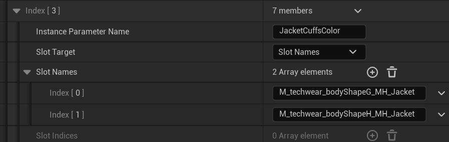
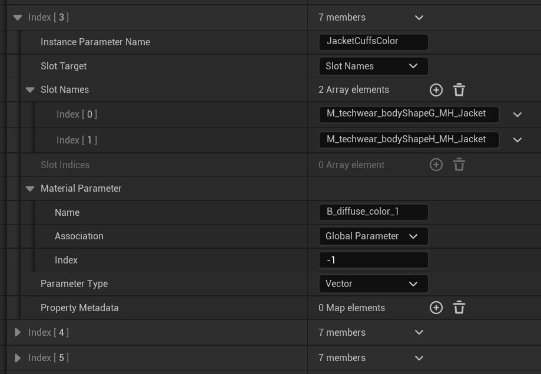
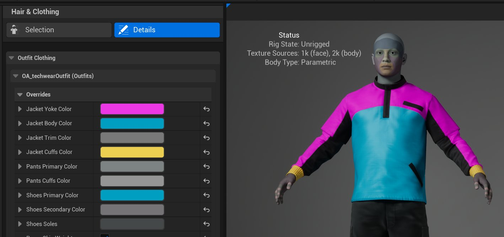

# 在MetaHuman Creator中测试和设置

> 路径：虚幻引擎5.7文档 / Gameplay系统 / 物理 / 布料模拟 / 为FAB创建参数化布料 / 在MetaHuman Creator中测试和设置

> 原始页面：https://dev.epicgames.com/documentation/unreal-engine/testing-and-setup-in-metahuman-creator

完成服装创建后，该对其进行测试。 要在**MetaHuman Creator**（MHC）中测试服装资产，请执行以下步骤：

1. 在**虚幻编辑器中，**右键点击**内容浏览器（Content Browser）**。 选择**MetaHuman > MetaHuman 角色（MetaHuman Character）**以创建新角色。 为其命名，然后按回车键保存。
2. 双击角色以打开**MetaHuman Creator**。
3. 点击**毛发和布料（Hair & Clothing）**工具，向下滚动至底部。 在此处你将看到一个名为**服装布料（Outfit Clothing）**的分段。 将服装资产从**内容浏览器（Content Browser）**拖至此分段。

   服装资产传输完成后，双击或点击**穿戴（Wear）**按钮将其应用于角色。 你将看到资产会自动调整尺寸。

   要移除物品，再次双击或点击**移除（Remove）**按钮。

   > [!NOTE]
   > 首次穿戴物品时，由于要准备供使用的基础资产，可能会有短暂延迟。

   > [!WARNING]
   > 角色可同时穿戴每个插槽中的多块布料物品。 为避免这种情况，双击或点击**移除（Remove）**按钮可移除角色不再需要穿戴的物品。
4. 选择**身体（Body）**工具，调整滑块或应用身体预设，观察服装如何调整尺寸。 如果服装未准确贴合特定的身体类型，需导出此身体类型并为其创建新尺寸。

   更改身体形态时，服装资产应在源资产之间切换，选择最贴合身体的资产。
5. 回到**内容浏览器（Content Browser）**。 此时已添加名为`WI_[yourAssetName]`的新衣柜资产。

   如果资产材质已设置为支持颜色更改，此资产允许你在MHC中更改布料颜色。

   双击资产打开详情。 **主资产（Principal Asset）**应该已经选好服装资产。

   
6. 接下来，对于**管线（Pipeline）**，从下拉菜单中选择**MetaHuman服装管线（MetaHuman Outfit Pipeline）**。

   "管线（Pipeline）"子菜单用于添加材质参数。 对于每种需要自定义的颜色，点击**运行时材质参数（Runtime Material Parameters）**旁的**+**按钮。
7. 展开**运行时材质参数（Runtime Material Parameters）**分段。 每次点击**+**按钮进行添加时，都会添加一个索引项。 在本例中，科技服饰服装有9个索引项。

   

   每个索引对应一个颜色分段。 展开索引菜单后，可输入说明以帮助识别布料上受颜色影响的区域。 例如，一个索引用于更改外套袖口的颜色，因此将其命名为`JacketCuffsColor`。
8. （可选）如果服装资产有多个尺寸，或网格体共享同一材质，请再次打开服装资产。 否则，请跳过此步骤。

   验证服装资产中各个尺寸对应的索引编号，以及你拥有的索引数量。 此值表示已制作的尺寸数量。 科技服饰服装示例有两个索引。

   
9. 接下来需要定义**插槽名称（Slot Names）**。 根据服装资产的尺码数量（或索引数），点击"插槽名称（Slot Names）"旁的**+**按钮相应次数。

   
10. 展开**材质参数（Material Parameters）**分段。

    在材质中找到与目标控制颜色相关联的参数，并在**名称（Name）**字段中输入此参数。

    > [!NOTE]
    > 此参数必须在所有尺寸的所有材质中保持一致。 设置首个材质，然后将其复制到其他尺寸，并相应更改贴图或其他特性。

    以外套袖口为例，此参数被命名为`B_diffuse_color_1`。

    
11. 接下来，将**参数类型（Parameter Type）**设置为**向量（Vector）**。 针对你拥有的每种不同颜色，重复此过程。
12. 在**编辑器管线（Editor Pipeline）> 服装（Outfit）**中添加**身体隐藏面贴图（Body Hidden Face Map）**。

    此贴图用于向MHC表明身体哪些部位的表面会始终被布料覆盖，并在组装过程中移除这些部位。 这不仅能通过减少穿模来提升服装的呈现效果，同时还能让MetaHuman的运行更高效。

    必须先创建此贴图，即从所选DCC中的MetaHuman身体获取UV贴图。 然后，将身体上需要显示的部位绘制为白色，并将需要隐藏部位绘制为黑色。

    以下是用于`techwearOutfit`的贴图示例。 科技服饰服装覆盖了身体的大部分部位，因此贴图以黑色为主。

    > [!NOTE]
    > 尽管我们使用组合的头部和身体来创建布料，但实际MetaHuman具有独立的头部网格体和身体网格体。 目前无法隐藏头部网格体上的面。

    要添加此贴图，需要先将贴图拖入内容浏览器，然后再将其添加到**身体隐藏面贴图（Body Hidden Face Map）**中。
13. 如对结果满意，保存此贴图。
14. 最后，要将物品添加到衣柜中，需将衣柜物品（`WI_`）拖入**毛发和布料（Hair & Clothing）**工具的**服装布料（Outfit Clothing）**分段。

> [!WARNING]
> 请务必拖入**衣柜物品****资产**而非服装资产，因为拖入服装资产会导致MHC覆盖你现有的衣柜物品资产。

现在，在MHC中，你（或购买你服装的用户）可以使用"毛发和布料（Hair & Clothing）"工具的"细节（Details）"面板自定义服装颜色。

## 下一步

- [打包服装资产](../packaging-your-outfit-asset/index.md) - 在虚幻引擎中打包MetaHuman服装资产。
