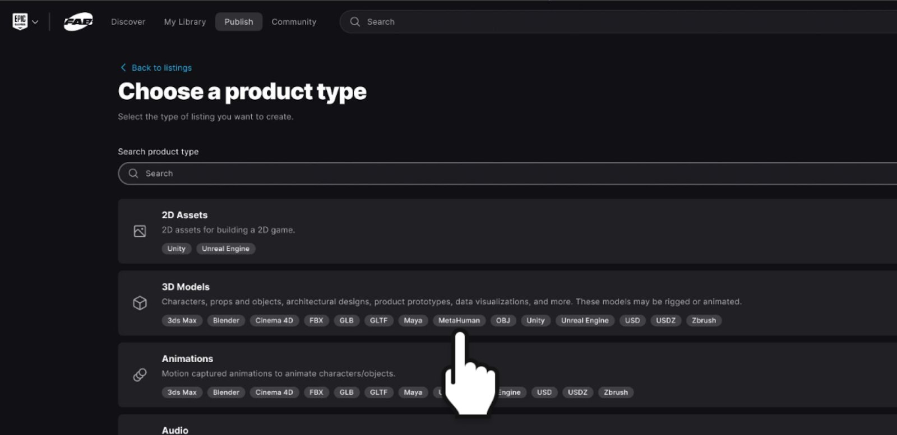
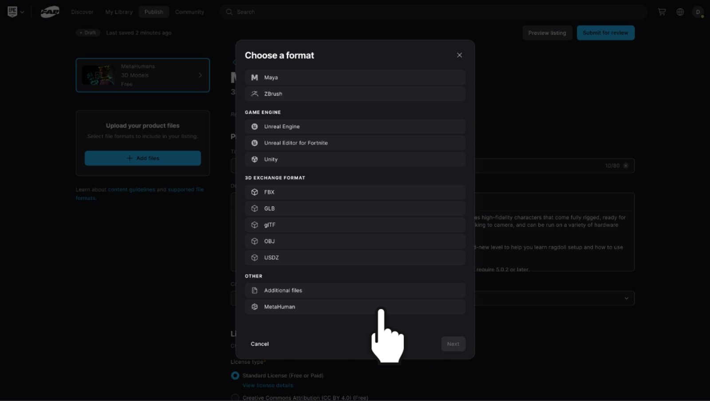
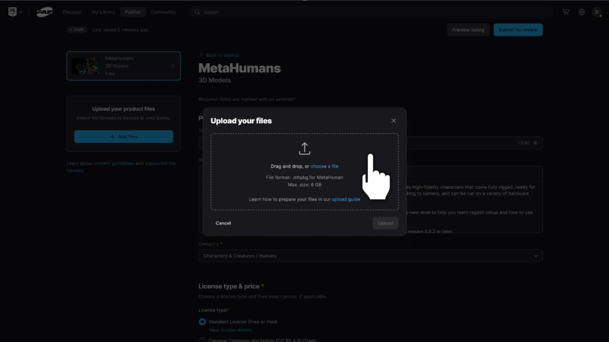

# 上传至FAB商城

> 路径：虚幻引擎5.7文档 / Gameplay系统 / 物理 / 布料模拟 / 为FAB创建参数化布料 / 上传至FAB商城

> 原始页面：https://dev.epicgames.com/documentation/unreal-engine/uploading-to-fab-marketplace

如果要从现有**FAB**上架商品转换资产，请保留现有上架商品，并向其添加额外的**MetaHuman**格式。 无需创建新上架商品，如此一来，此前购买过该商品的买家将自动获得资产的新MetaHuman格式版本。 如果此商品尚未在FAB上发布，可创建新上架商品。

## 在FAB上创建新上架商品

1. 在列表中添加MetaHuman格式。

   

   

   
2. 填写上架商品时，为商品添加 `parametric` 标签。

   如果你希望在上架商品中包含其他格式（例如Maya源文件）或附加文件（例如DNA文件或未特别列为选项的其他文件类型），可选择性添加。

   MetaHuman管理器将仅打包主资产所依赖的文件夹内的项目。 如果要包含其他项目（例如备用纹理或材质），必须手动压缩并作为**格式（Format）> 其他（Other）> 附加文件（Additional Files）**上传。

   > [!NOTE]
   > MetaHuman兼容内容的上架商品需添加 `NoAI` 标签，在上架商品中添加此格式后将自动应用此标签。
   >
   > 包含MetaHuman兼容内容的资产不得采用CC BY 4.0许可进行分发，因此这些上架商品将禁用此许可选项。
3. 当你对上架商品满意后，点击**发布（Publish）**。 经过标准审核流程后，该资产将在FAB上架并被添加至FAB MetaHuman频道。

## 下一步

- [绘制权重贴图](../painting-weight-maps/index.md) - 为参数化服装资产绘制权重贴图。
