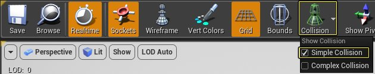
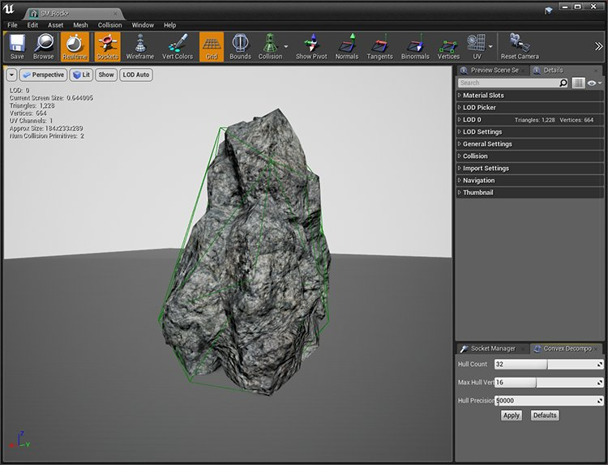
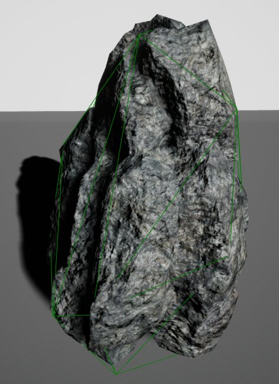

# 使用自动凸包碰撞工具将碰撞凸包添加至静态网格体

> 路径：虚幻引擎5.7文档 / Gameplay系统 / 物理 / 碰撞 / 碰撞使用教程 / 使用自动凸包碰撞工具将碰撞凸包添加至静态网格体

> 原始页面：https://dev.epicgames.com/documentation/unreal-engine/add-a-collision-hull-to-a-static-mesh-using-the-auto-convex-collision-tool-in-unreal-engine

在下面的教程中，我们将介绍如何使用自动凸包碰撞工具自动为静态网格体创建碰撞。

> [!NOTE]
> 自动凸包工具还使用新版本的[V-HACD库](https://github.com/kmammou/v-hacd)，该版本会提供更准确的结果。

## 步骤

1. 首先，在静态网格体编辑器中打开要添加碰撞的静态网格体。在本例中，我们将使用 **SM_Rock Mesh**，它随初学者内容包一起提供。 HT_AddConvexHulls_01.png
2. 然后，转到 **碰撞（Collision）** \> **自动凸包碰撞（Auto Convex Collision）**，打开自动凸包碰撞工具。这将在静态网格体右下角打开自动凸包碰撞。 HT_AddConvexHulls_02.png
3. 在自动凸包碰撞工具中，利用以下设置设置以下参数： HT_AddConvexHulls_03.png

   | 属性名称 | 值 |
   | --- | --- |
   | **凸包数量（Hull Count）** | 32 |
   | **凸包最大顶点数（Max Hull Verts）** | 16 |
   | **凸包精确度（Hull Precision）** | 50,000 |
4. 输入上述所有设置后，单击 **应用（Apply）** 按钮开始创建碰撞过程。 HT_AddConvexHulls_07.png

   > [!NOTE]
   > 现在，碰撞的计算将作为后台任务在静态网格体编辑器中运行。碰撞创建进度将显示于以下进度窗口中。 HT_AddConvexHulls_06.png

## 最终结果

完成后，可以单击碰撞（Collision）图标，然后从下拉列表中选择简单碰撞（Simple Collision）选项，查看新的碰撞（如果尚未启用）。

下面图像序列显示了，将自动凸包碰撞的值从默认设置增大为允许的最大设置时，会得到什么类型的结果。

自动凸包碰撞设置的结果
