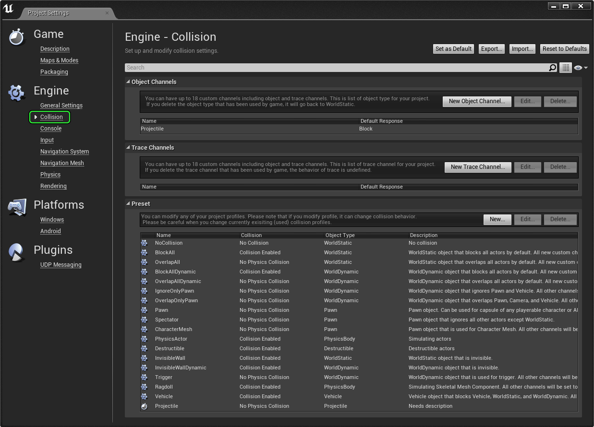

# 为项目添加自定义物体类型

> 路径：虚幻引擎5.7文档 / Gameplay系统 / 物理 / 碰撞 / 碰撞使用教程 / 为项目添加自定义物体类型

> 原始页面：https://dev.epicgames.com/documentation/unreal-engine/add-a-custom-object-type-to-your-project-in-unreal-engine

事实上存在这样的情况：6 个物体响应通道和 2 个轨迹响应通道的粒度不足，无法创建所需的效果。这时 Project Settings 中的碰撞编辑器就可以大显身手了。从 **Edit Menu** -> **Project Settings** -> **Collision** 菜单中进行访问：

在此处可新添加物体响应通道和轨迹响应通道。点击 **New Object Channel...** 或 **New Trace Channel...** 按钮，完成命名，选择 **Default Response**，然后点击 **Accept**。

最多可设 18 个自定义物体响应通道或轨迹响应通道。

### 预设

打开 **Preset** 类目点击 **New...** 按钮可进行自定义预设。

在此可为预设命名、启用或禁用碰撞、选择预设的物体类型、最后为选中的物体类型定义每个响应通道的行为。
