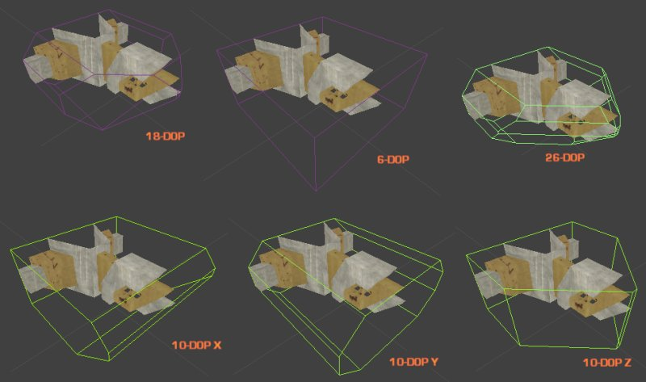

# 为静态网格体添加一个 K-DOP 碰撞凸包

> 路径：虚幻引擎5.7文档 / Gameplay系统 / 物理 / 碰撞 / 碰撞使用教程 / 为静态网格体添加一个 K-DOP 碰撞凸包

> 原始页面：https://dev.epicgames.com/documentation/unreal-engine/add-a-k-dop-collision-hull-to-a-static-mesh-in-unreal-engine

### 步骤

**Static Mesh Editor** 的 **Collision** 菜单下有一系列选项，名为 *##DOP*，它们是 **K-DOP** 简单碰撞生成器。**K-DOP** 是包围体的一种，是 *K 离散导向多面体（K discrete oriented polytope）* 的缩写（K 是轴对齐平面的数字）。它抓取轴对齐的平面，将其尽力推向离网格体最近的位置。结果形态用作碰撞凸包。在 **Static Mesh Editor** 中，K 可为：

- 10

  - 方块有 4 条边形成斜角 - 可选择 X、Y 或 Z 轴对齐的边。
- 18

  -方块中所有边均形成斜角。
- 26

  - 方块中所有边和角均形成斜角。

请参考下图实例。此工具操作装满管状物、圆柱体和栏杆的包裹时十分实用。

