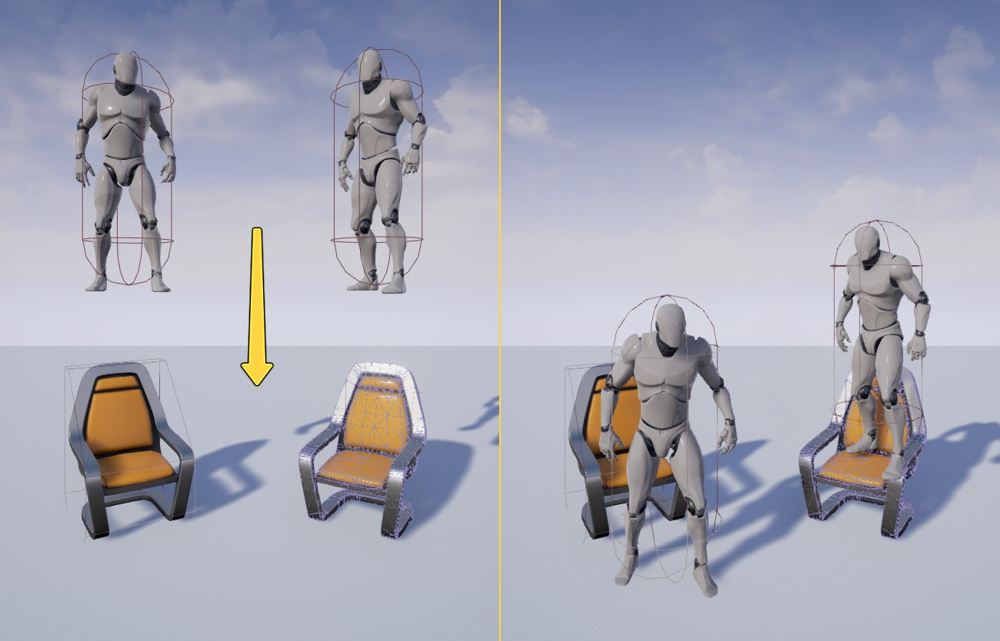

# 简单碰撞对比复杂碰撞

> 路径：虚幻引擎5.7文档 / Gameplay系统 / 物理 / 碰撞 / 简单碰撞对比复杂碰撞

> 原始页面：https://dev.epicgames.com/documentation/unreal-engine/simple-versus-complex-collision-in-unreal-engine

虚幻引擎中有简单和复杂碰撞形态。**简单碰撞** 是基础，如盒体、球体、胶囊体和凸包。**复杂碰撞** 是给定对象的三角网格图。虚幻引擎会默认创建简单和复杂两种形态，然后基于用户需要（复杂查询 vs 简单查询），物理解算器会使用相应形态来进行场景查询和碰撞检测。

## 用法

在静态网格体编辑器（Static Mesh Editor）的 **细节** 面板中，你可以在 **碰撞（Collision）** 分类中找到 **碰撞复杂度（Collision Complexity）** 的设置。

| **设置** | **描述** |
| --- | --- |
| **Project Default** | 此设置"默认"使简单碰撞请求使用简单碰撞，复杂请求使用复杂碰撞。 |
| **Simple And Complex** | 此选项允许创建简单形状和复杂形状。简单形状用于常规场景查询和碰撞检测，复杂（逐多边形）形状用于复杂场景查询。 |
| **Use Simple Collision As Complex** | 如请求复杂查询，引擎仍将查询简单形态，无视三角网格图。这有助于节约内存，因为我们不需要烘焙三角网格图。如果碰撞几何体更简单，则可增强性能。 |
| **Use Complex Collision As Simple** | 如请求简单查询，引擎将查询复杂形态，无视简单碰撞。该设置可将三角网格图用作物理模拟碰撞。注意：如果您使用的是 **UseComplexAsSimple**，则无法模拟物体；但可将其和其他模拟（简单）物体进行碰撞。 |

例如，下图左边的椅子拥有简单碰撞。上方的 Pawn 落下时，将沿坐垫上方的大角度表面滑落。然而，右边的椅子使用的是 **Use Complex Collision As Simple**。上方的 Pawn 落下时，将落在椅子的坐垫上，不会滑落。

