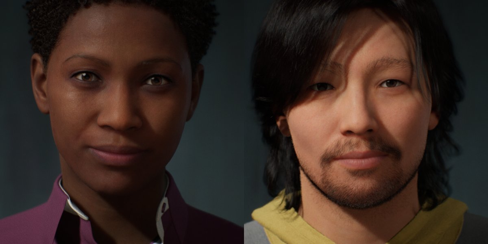
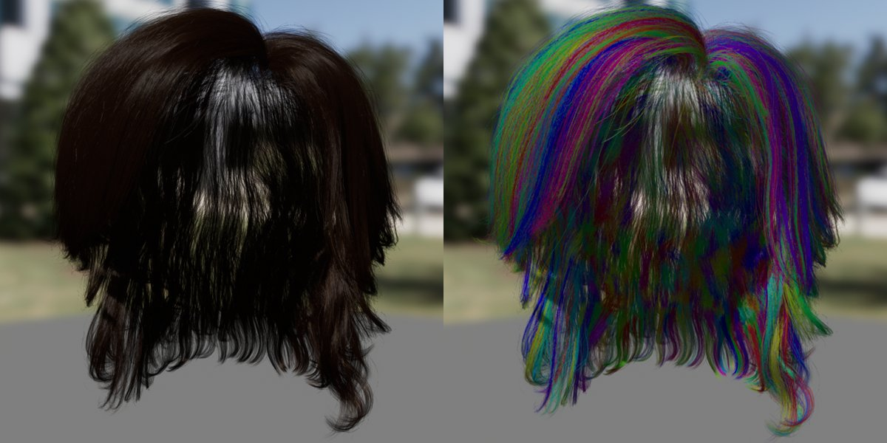

# 毛发物理概述

> 路径：虚幻引擎5.7文档 / Gameplay系统 / 物理 / 毛发物理 / 毛发物理概述

> 原始页面：https://dev.epicgames.com/documentation/unreal-engine/hair-physics-in-unreal-engine---overview

虚幻引擎的毛发渲染和模拟系统使用基于发束的工作流程，以物理准确的运动渲染每一束毛发。它支持美术师针对DDC包中创建的groom实时模拟和渲染数十万根甚至更多逼真的毛发。 真实的毛发在对头部和身躯移动、风力、重力和其他力做出反应时会以特定方式移动。逼真的毛发动画通常是使用基于物理的模拟来实现的。在运行时运行这种复杂模拟的计算成本可能非常高。

毛发模拟起来很困难，因为它们数量庞大，而且运动复杂，既与物体发生碰撞，也会互相发生碰撞。

毛发动态情形需要依靠复杂的互相依赖性。对于动物皮毛的情况，肌肉和血肉模拟负责皮毛运动和毛发模拟本身的很大一部分。

渲染和模拟逼真毛发时，系统使用特定"导线"以降低模拟的计算成本。导线是发束总数中用于变形的子集。在模拟期间，导线发束会变形，这种变形用于内插所有发束的移动。

虚幻引擎使用两种类型的导线，即 **渲染导线（rendering guides）** 和 **模拟导线（simulation guides）** 。渲染导线通常为groom提供结构，例如聚集、方向变化和流动。这些导线代表总发束的很小百分比（通常在5-10%之间）。相较于发束的随机取样，手动选择最佳导线将显著提高变形质量。

模拟导线在物理模拟期间驱动关联发束的形状和运动。这些导线的创建方式是对渲染导线重新取样，并减少每个发束的顶点（点）数。你可以根据需要将每个发束的点数设置为4、8、16或32。

导线可以在外部DCC包中或虚幻引擎编辑器内创建。要自动生成导线，请在 **导入选项（Import Options）** 窗口中选择相应的选项，并选择将用于该导线的发束百分比。

> [!NOTE]
> 虚幻引擎在自动生成渲染导线时将从发束总数中选择随机取样。手动创建导线可以显著提高变形质量。

虚幻引擎中的毛发模拟实现为Niagara视觉效果系统的一部分。模拟在GPU上执行，并且解算器基于XPBD（基于位置的兼容动态模拟）方法。

### 解算约束

要针对所有不同的约束进行解算，你需要提供分步和解算器迭代的数量，以及发束、碰撞和本构模型参数。解算器将以重力作用下的原始网格体（休息姿势）为目标，使最终样式尽量接近原始样式。

### 处理碰撞

物理资产添加到骨骼网格体时，模拟解算器会针对该物理资产的Primitive处理形体碰撞。

自碰撞的计算基于从粒子速度到常规体素网格的光栅化构建的平均速度场。

系统使用数学模型，从而在应用外部力时能以最佳方式近似模拟毛发发束的逼真行为。最大的挑战是找到一个好的模型来使发束表现得逼真，同时使用较少的解算器迭代次数。

这些模型在模拟期间控制发束以何种方式拉伸、混合和扭曲。Cosserat Rod和角形弹簧方法在groom资产物理属性中可用。

> [!NOTE]
> 要详细了解毛发模拟，请转至[毛发渲染和模拟](../../../../working-with-content/hair-rendering-and-simulation/index.md)文档页面。
