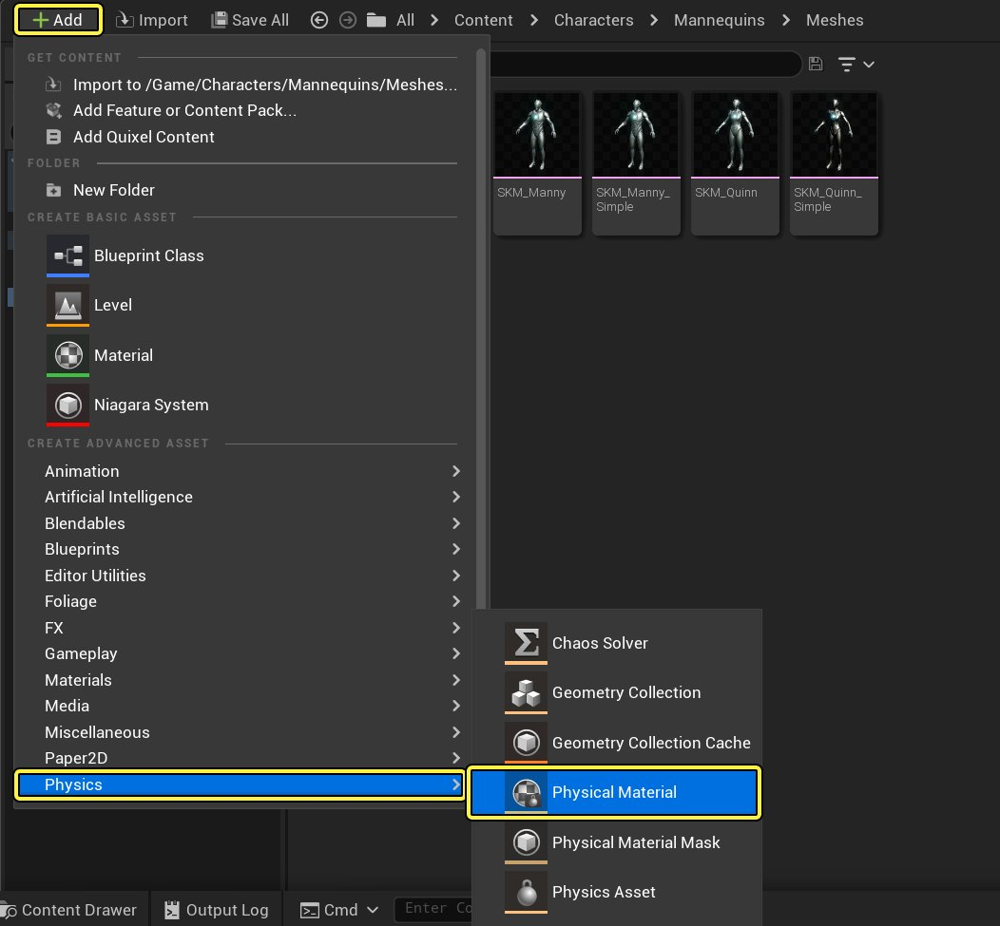
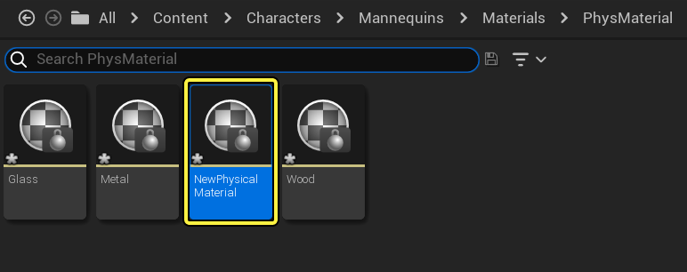
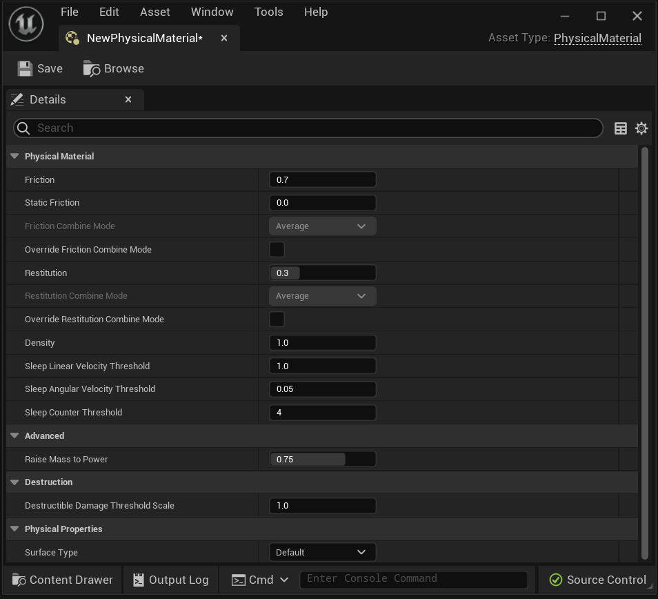
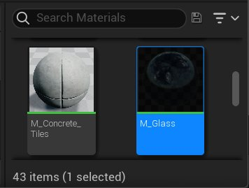
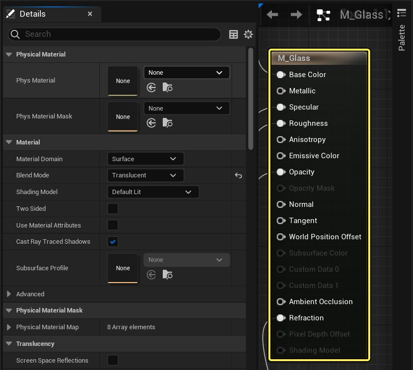
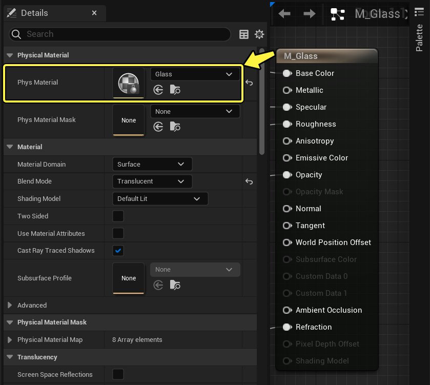
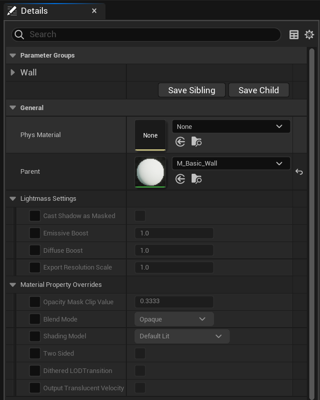

# 物理材质用户指南

> 路径：虚幻引擎5.7文档 / Gameplay系统 / 物理 / 物理材质 / 物理材质用户指南

> 原始页面：https://dev.epicgames.com/documentation/unreal-engine/physical-materials-user-guide-for-unreal-engine

此文档包括 **物理材质（Physical Materials）** 的创建和使用，以及为项目启用或编辑 **表面类型（SurfaceTypes）**。

## 创建

1. 打开 Content Drawer。**点击**添加 > 物理 > 物理材质（Add > Physics > Physical Material）**，或在**Content Drawer**中**单击右键 -> 物理 -> 物理材质**。

   
2. 双击 **NewPhysicalMaterial** 对其属性进行编辑。

   
3. **调整属性**。

   
4. **点击保存**

   

如需了解物理材质中属性的相关内容，请查阅 [物理材质参考](../physical-materials-reference/index.md)。

### 表面类型

虚幻引擎5默认支持 62 种表面类型，可根据需求任意对其进行标记。它们保存在项目的 `DefaultEngine.ini` 文件中，此文件的存放路径为 `YourProjectRoot\Config\DefaultEngine.ini`。

## 用法

### 材质

1. **打开** 或 **创建** 一个新材质。

   
2. **选择** 主材质节点。

   
3. **变更** 物理材质。

   

### 材质实例

1. 打开或创建一个新 **材质实例**。

   
2. **变更** 物理材质。

   > 图片已省略：Change the Physical Material

### 物理资产（骨架网格体）

调整 **物理资产** 的 **物理材质** 时，最佳方法是将最常用的物理材质指定到物理资产中的所有 **物理形体** 上。

1. 在 **内容浏览器** 中双击物理资产，用 **物理资产编辑器** 打开物理资产。

   > 图片已省略：Double-click a Physics Asset in the Content Drawer to open it in the Physics Asset Editor
2. 在物理资产编辑器中，打开 **物理材质** 下拉菜单**，选择要应用的物理材质。 Select a Physical Material from the Physical Material dropdown in the toolbar in the Physics Asset Editor

如特定的物理形体需要不同的物理材质，可对它们进行单独调整。

1. 在

   Content Drawer

   中双击

   物理资产

   ，用

   物理资产编辑器

   打开物理资产。
2. 选择一个

   物理形体

   。
3. 在细节面板中，在物理分类中，找到

   简单碰撞物理材质（Simple Collision Physical Material）

   。

> 图片已省略：Physical Material Physics Asset

骨架网格体的物理交互默认行为是只和与其相关的物理资产进行交互，因此将不使用 其材质的物理材质。

> [!NOTE]
> 利用 Physics Assets 对 Simple Collision Physical Material 属性进行设置。追踪物理资产时需要执行复杂追踪， 此后复杂追踪将返回命中物理形体的 Simple Collision Physical Material 属性中所排列的物理材质。

### 静态网格体

**静态网格体** 包含 **简单碰撞**（用 3D 美术软件或 静态网格体编辑器创建的物理实体）和 **复杂碰撞**（碰撞体和模型形状一样）两种碰撞类型。这些碰撞可由多种不同材质组成，每种材质均包含其自身独有的物理材质。

| 碰撞 | 物理材质排序 |
| --- | --- |
| **Simple** | 碰撞或追踪使用简单碰撞时，它将引用 StaticMesh Editor 中设置的静态网格体物理材质。如静态网格体 Actor 的 *Phys Material Override* 未被设为 `None`，它将使用列于该属性中的物理材质。 |
| **Complex** | 碰撞或追踪使用复杂碰撞时，它将引用材质上的物理材质或应用至静态网格体 Actor 的材质实例。如静态网格体 Actor 的 Phys Material Override 未被设为 `None`，它将使用列于该属性中的物理材质。 |

为静态网格体设置简单碰撞物理材质的步骤：

1. 在内容浏览器中 **双击** 一个 **静态网格体**，打开 **静态网格体编辑器**。

   > 图片已省略：Double Click a Static Mesh in the Content Drawer to bring up the Static Mesh Editor
2. 将 **静态网格体编辑器** 中的 **简单碰撞物理材质（Simple Collision Physical Material）** 属性改为所需的物理材质。

   > 图片已省略：Change the Simple Collision Physical Material property in the Static Mesh Settings category to the desired Physical Material
3. **点击保存**

   > 图片已省略：Click Save

### 杂项

> 图片已省略：The Phys Material Override property exists on everything with a Physics category

*Phys Material Override* 属性广泛存在于 **Collision** 类目下。它可利用选中的物理材质在 Actor 或组件上完全覆盖简单碰撞物理材质。

- 覆盖一个静态网格体的简单碰撞物理材质。
- 因为骨架网格体物理资产固定返回简单碰撞，可利用它覆盖放置好的骨架网格体 Actor 上的所有物理材质。

此操作在复杂碰撞追踪上无效。
