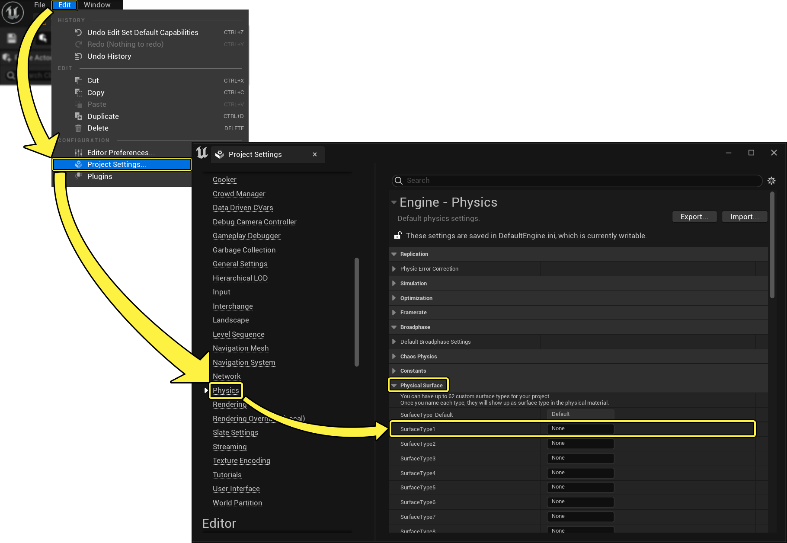

# 添加表面类型

> 路径：虚幻引擎5.7文档 / Gameplay系统 / 物理 / 物理材质 / 物理材质教程 / 添加表面类型

> 原始页面：https://dev.epicgames.com/documentation/unreal-engine/add-a-surface-type-in-unreal-engine

下列步骤将介绍如何在项目中添加 **物理表面类型（Physical Surface Type）**。

1. 在主菜单中，点击

   编辑（Edit） -> 项目设置（Project Settings）...-> 物理（Physics） -> 物理表面类别（Physical Surface Category）

   。
2. 在

   名称（Name）

   字段中，将

   SurfaceType#

   旁的

   无（None）

   改为该表面需要描述的物质类型（混凝土、皮肉、木头，等等）

