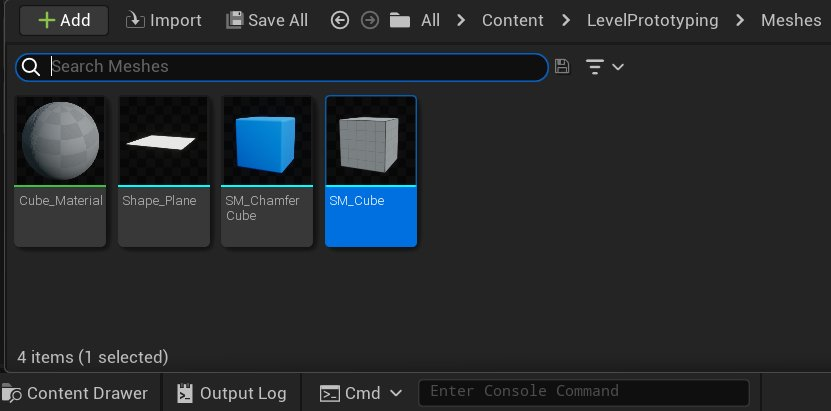
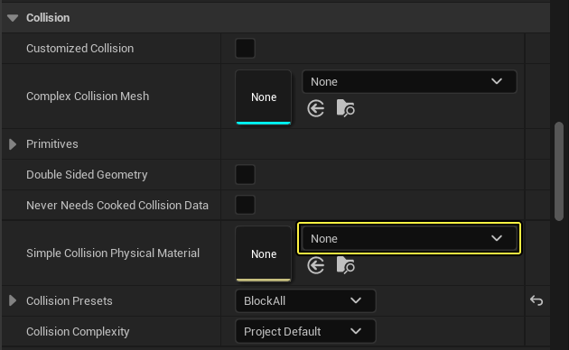

# 在静态网格体编辑器中分配物理材质

> 路径：虚幻引擎5.7文档 / Gameplay系统 / 物理 / 物理材质 / 物理材质教程 / 在静态网格体编辑器中分配物理材质

> 原始页面：https://dev.epicgames.com/documentation/unreal-engine/assign-a-physical-material-in-the-static-mesh-editor-in-unreal-engine

**静态网格体** 既可以使用 **简单碰撞体**（你在 3D 美术软件或静态网格体编辑器中创建的物理形状），也可以使用 **复杂碰撞体**（碰撞体形同网格体本身），网格体可以包含多种不同材质，每种材质都可以有其物理材质。要设置复杂碰撞物理材质，请参见：[将物理材质指定给材质](../assign-a-physical-material-to-a-material/index.md)。

要设置静态网格体的简单碰撞物理材质：

1. 在 **内容侧滑菜单** 中双击 **静态网格体**，调出 **静态网格体编辑器**。

   
2. 在 **碰撞（Collision）** 类别中使用 **简单碰撞物理材质**（Simple Collision Physical Material），选择所需的物理材质。

   
3. 点击 **保存**。
