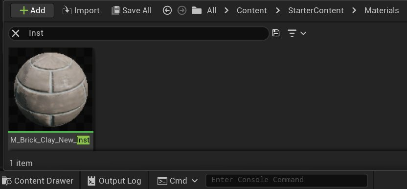
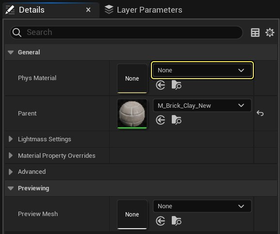

# 将物理材质指定给材质实例

> 路径：虚幻引擎5.7文档 / Gameplay系统 / 物理 / 物理材质 / 物理材质教程 / 将物理材质指定给材质实例

> 原始页面：https://dev.epicgames.com/documentation/unreal-engine/assign-a-physical-material-to-a-material-instance-in-unreal-engine

1. 打开或新建一个 **材质实例**。

   
2. 在 **细节** 面板中，使用物理材质下拉菜单来选择物理材质，或者创建一个物理材质。

   
3. 单击 **保存（Save）**。
