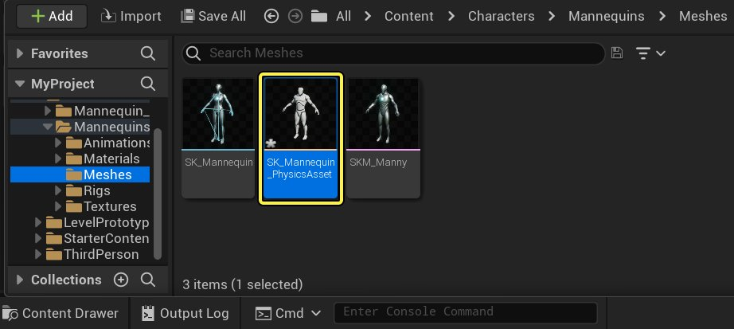

# 将物理材质分配到物理资产形体

> 路径：虚幻引擎5.7文档 / Gameplay系统 / 物理 / 物理材质 / 物理材质教程 / 将物理材质分配到物理资产形体

> 原始页面：https://dev.epicgames.com/documentation/unreal-engine/assign-a-physical-material-to-a-physics-asset-body-in-unreal-engine

如果特定 **物理形体（Physics Bodies）** 需要不同的 **物理材质**，你可以分别对它们进行调整。

1. 在 **内容侧滑菜单** 中双击物理资产，用 **物理资产编辑器** 打开物理资产。

   
2. 选择

   一个物理形体。
3. 在 **细节（Details）** 面板的 **物理（Physics）** 类别中，更改 **简单碰撞物理材质（Simple Collision Physical Material）**。

   
4. **单击保存**

   
