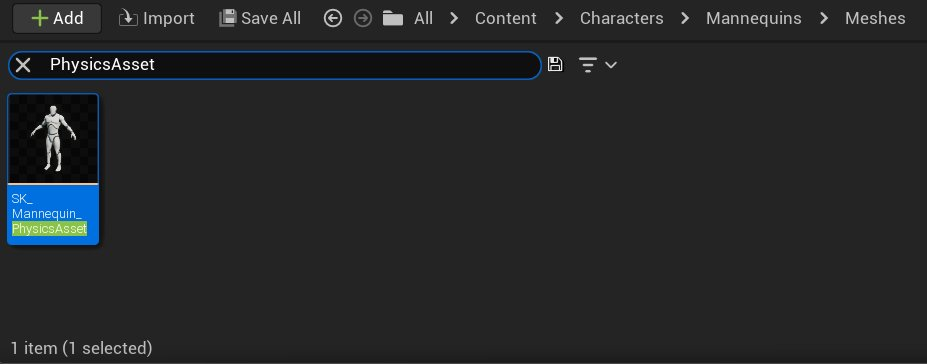
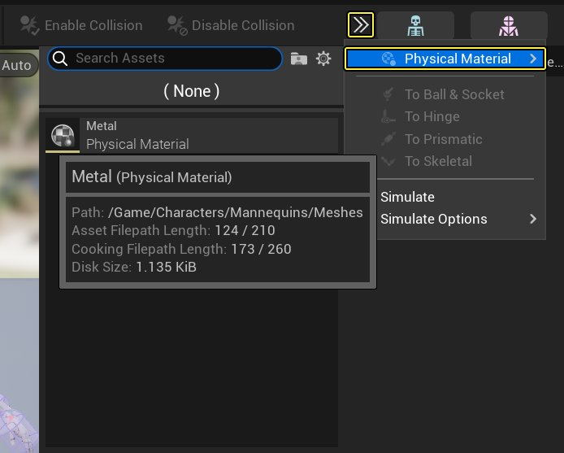

# 将物理材质指定给物理资产

> 路径：虚幻引擎5.7文档 / Gameplay系统 / 物理 / 物理材质 / 物理材质教程 / 将物理材质指定给物理资产

> 原始页面：https://dev.epicgames.com/documentation/unreal-engine/assign-a-physical-material-to-a-physics-asset-in-unreal-engine

SEO-介绍如何用物理资产编辑工具将物理材质同时指定给所有物理资产。 Version: 5.0 Parent: making-interactive-experiences/Physics/physical-materials/tutorials Type: Tutorial Engine-concept: Making Interactive Experiences Tags: Physics Skill-Family: Foundation Track: GameDev tags:Physics tags: physical materials

下列步骤详细说明如何为 **物理资产** 中的所有 **物理形体（Physics Bodies）** 同时设置 **物理材质**。

1. 在 **内容侧滑菜单** 中双击物理资产，用 **物理资产编辑器** 打开物理资产。

   
2. 在物理资产编辑器中，点击 **工具栏**，展开 **下拉菜单**，选择要应用的 **物理材质**。

   
3. 单击 **保存（Save）** 。
