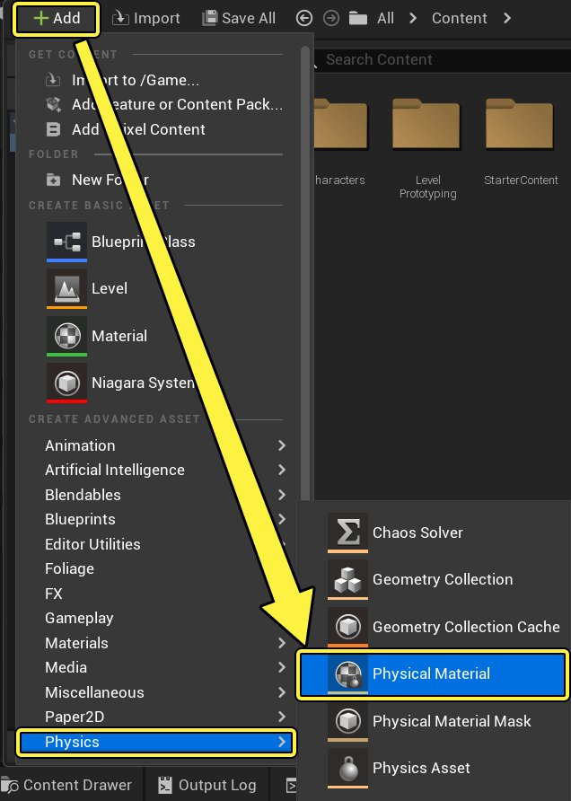
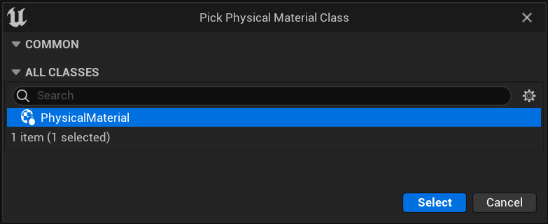
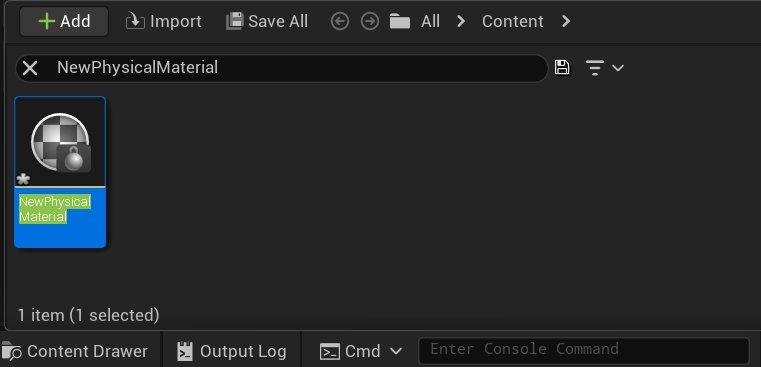
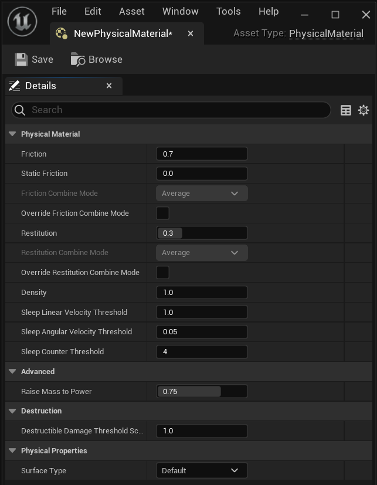

# 创建物理材质

> 路径：虚幻引擎5.7文档 / Gameplay系统 / 物理 / 物理材质 / 物理材质教程 / 创建物理材质

> 原始页面：https://dev.epicgames.com/documentation/unreal-engine/create-a-physical-material-in-unreal-engine

1. 在内容浏览器中，点击 **添加/导入（Add/Import）** -> **物理（Physics）** -> **物理材质（Physical Material）**，或在 **内容浏览器** 中右键点击，然后点击 **物理（Physics）** -> **物理材质（Physical Material）**。

   
2. 选择 **物理材质类（Physical Material Class）**。

   
3. **双击** 新物理材质以编辑其属性。

   
4. 调整 **属性**。

   
5. 点击 **保存** 。

请参见[**物理材质参考**](../../physical-materials-reference/index.md)，了解物理材质属性的相关信息。
