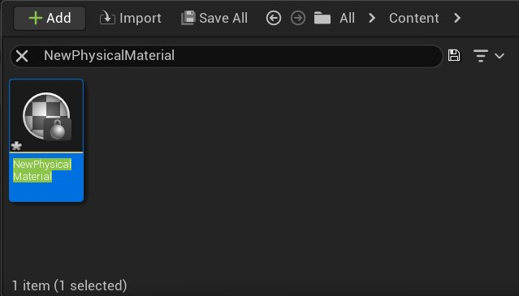

# 编辑物理材质

> 路径：虚幻引擎5.7文档 / Gameplay系统 / 物理 / 物理材质 / 物理材质教程 / 编辑物理材质

> 原始页面：https://dev.epicgames.com/documentation/unreal-engine/edit-a-physical-material-in-unreal-engine

下列步骤详细说明如何编辑现有的物理材质。

1. **双击** 新物理材质以编辑其属性。

   
2. **调整属性**。

   
3. **单击保存**。

请参见 **[物理材质](../../physical-materials-reference/index.md)** 了解物理材质中属性的相关信息。
