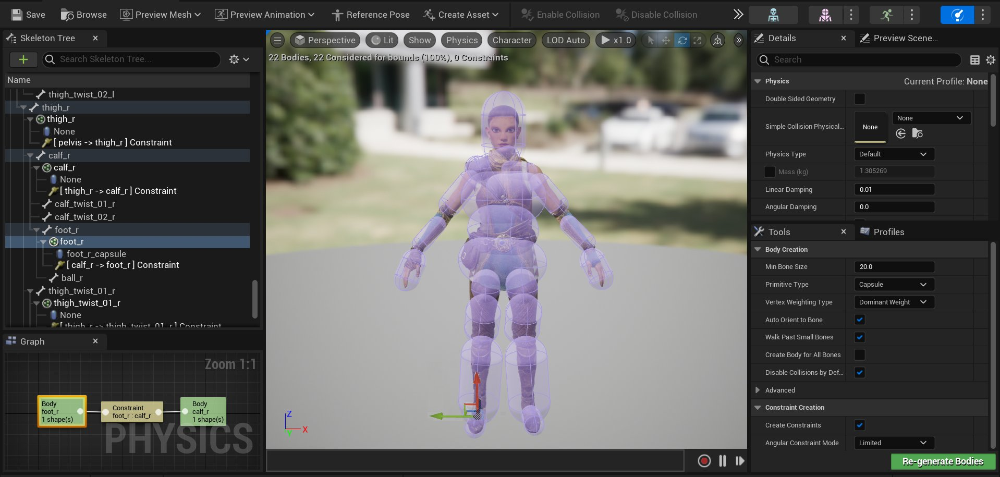
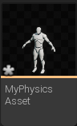
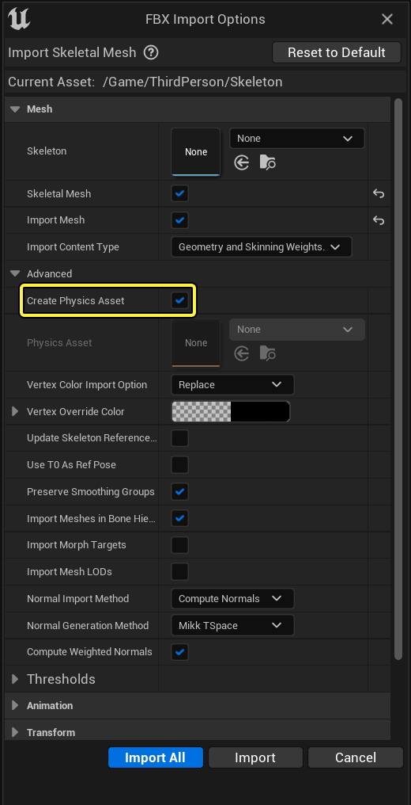
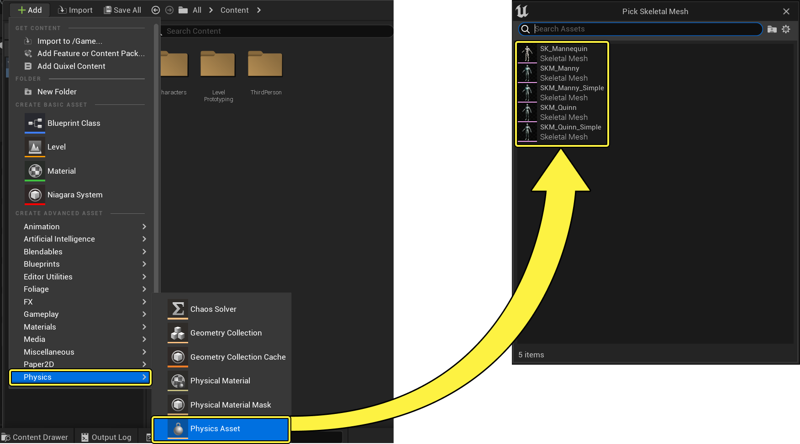
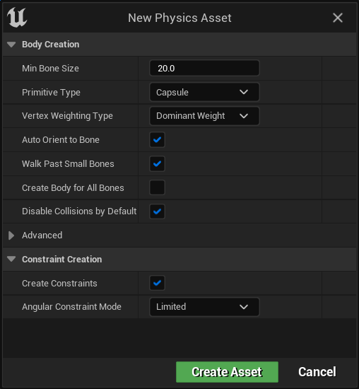
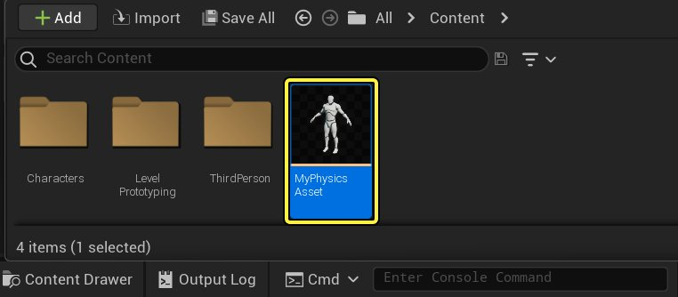
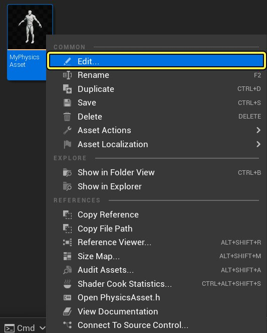

# 物理资产编辑器

> 路径：虚幻引擎5.7文档 / Gameplay系统 / 物理 / 物理资产编辑器

> 原始页面：https://dev.epicgames.com/documentation/unreal-engine/physics-asset-editor-in-unreal-engine

**物理资产编辑器** 是一个集成编辑器，它是虚幻引擎中[动画编辑器](../../../animating-characters-and-objects/skeletal-mesh-animation-system/animation-editors/index.md)的一部分。它专门设计用于操纵 **骨架网格体** 的 **物理资产**。

**物理资产** 用于定义骨架网格体使用的物理和碰撞。它们包含一组刚体和约束，这些构成一个布偶，而布偶并不 局限于人形布偶。它们可以用于任何使用形体和约束的物理模拟。因为一个骨架网格体只允许一个物理资产， 所以可以为许多骨架网格体打开或关闭它们。

| 人型角色 | 演示中的越野车 |
| --- | --- |
| 角色物理资产 | 载具物理资产 |

可以为任何骨架网格体设置物理资产进行模拟。上面是使用它们的两个示例；一个是人形角色，另一个是Epic的演示版载具游戏的车辆。

## 创建物理资产

为骨架网格体创建物理资产的方法有两种：

- 在导入时启用 **创建物理资产（Create Physics Asset）**。

  

  点击查看大图
- 使用 **内容侧滑菜单** 创建物理资产并选择要使用的骨架网格体。

  

  点击查看大图

  第一次选择物理资产时，将打开一个窗口来设置应该如何生成形体和约束：

  

## 打开物理资产编辑器

可以使用几种不同的方式打开 **物理资产编辑器**：

- 双击 **内容侧滑菜单** 中的 **物理资产**。

  
- 使用右键快捷菜单并选择 **编辑...（Edit...）**。

  
- 或者，在[动画编辑器](../../../animating-characters-and-objects/skeletal-mesh-animation-system/animation-editors/index.md)选择选项卡中选中 **物理（Physics）** 选项卡。

  

  可以使用 **物理（Physics）** 选项卡旁边的下拉菜单，从 **内容侧滑菜单** 中选择正在使用当前已打开骨架网格体的物理资产。

  > 图片已省略：下拉菜单可用于选择任何物理资产

## 基础

- [物理对象](../physics-bodies/index.md)

- [物理约束](../physics-constraints/index.md) - 在物理对象相互之间和世界场景之间设置约束

## 教程

- [物理资产编辑器教程](physics-asset-editor-tutorial-directory/index.md)
