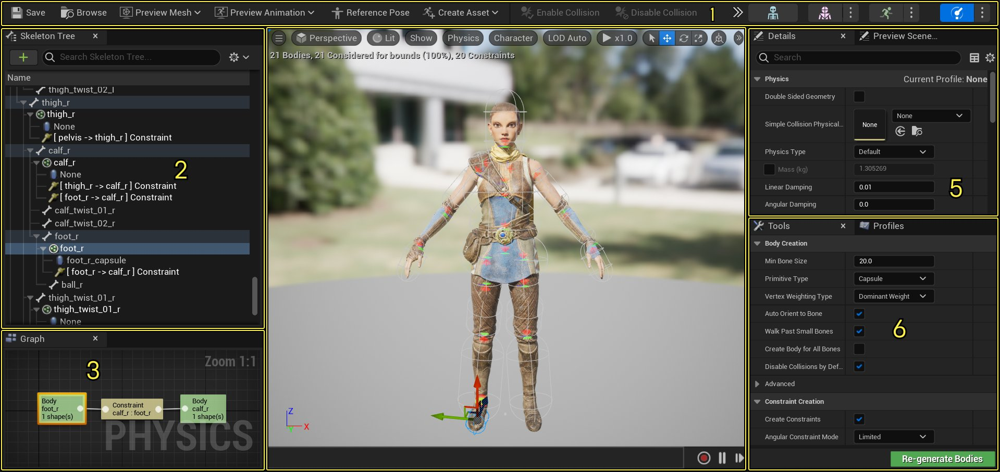

# 物理资产编辑器界面

> 路径：虚幻引擎5.7文档 / Gameplay系统 / 物理 / 物理资产编辑器 / 物理资产编辑器界面

> 原始页面：https://dev.epicgames.com/documentation/unreal-engine/physics-asset-editor-interface-in-unreal-engine

**物理资产编辑器（Physics Asset Editor）** 是在虚幻引擎中处理[物理资产](../index.md)的工具。该编辑器使你能够实现可视化并控制形体和与骨架网格体关联的约束层级。 在该编辑器中，你可以创建[形体](../../physics-bodies/index.md)和[约束](../../physics-constraints/physics-constraint-reference/index.md)，以将其用于碰撞和骨架网格体布偶模拟。

请参阅以下各个部分来详细了解"物理资产编辑器（Physics Asset Editor）"用户界面：

## 1.工具栏

物理资产编辑器（Physics Asset Editor）中的[工具栏](../../../../animating-characters-and-objects/skeletal-mesh-animation-system/animation-editors/index.md)提供用于保存对物理资产所做的任何更改或在"内容浏览器（Content Browser）"中找到物理资产的选项。你可以为该特定物理资产设置 **预览网格体（Preview Mesh）**，为所选形体 **启用/禁用碰撞**，以及进行 **模拟** 设置以测试物理资产布偶。位于工具栏最右侧的是 **编辑器工具栏**，它使你能够在虚幻引擎4中的不同[动画工具](../../../../animating-characters-and-objects/skeletal-mesh-animation-system/animation-editors/index.md)间进行切换。

## 2.骨架树

[骨架树](physics-asset-editor-in-unreal-engine---skeleton-tree/index.md)显示当前骨架资源的骨骼层级，是你创建形体和约束的地方。

## 3.约束图

[约束图](physics-asset-editor-in-unreal-engine---constra-2e690f0f/index.md)使你能够实现约束到另一个形体的骨骼层级形体的视觉表示。在该图中，你可以创建自己的约束，方法是从主形体节点（左侧）连出引线并选择要约束到的新形体，甚至通过双击目标形体以从树上向下跳转至下一套形体和约束，从而操控骨架树。你也可以查看指定了哪个[物理动画配置文件和约束配置文件](physics-asset-editor-in-unreal-engine---tools-a-3b3e9bbb/index.md)（基于在"配置文件（Profiles）"面板中选择的当前配置文件）。

## 4.视口

[视口](../../../../animating-characters-and-objects/skeletal-mesh-animation-system/animation-editors/index.md)使你能够预览所做的更改，比如物理形体的放置。你也可以预览形体作为物理布偶的模拟。从视口中，你可以更改照明模式，显示或隐藏骨架的骨骼、形体和约束，甚至将骨架网格体设置为在转盘上自动旋转，以便从各个角度查看它。

## 5.资源细节/预览场景设置

[细节](../../../../building-virtual-worlds/level-editor/level-editor-details-panel/index.md)选项卡与主编辑器相似，主要用于修改已添加的形体或约束等元素的属性。例如，当向骨架添加形体或约束时，在骨架树或视口中单击它会填充"细节"选项卡中与形体或约束的运行方式有关的选项。

[预览场景设置](../../../../animating-characters-and-objects/skeletal-mesh-animation-system/animation-editors/index.md)选项卡使你能够快速评估资源在多个环境和光照情景下的效果，而无需在关卡中设置这些场景。可以从骨架网格体定义和应用多种不同的设置，也可指定与照明和[后期处理效果](../../../../designing-visuals-rendering-and-graphics/post-process-effects/index.md)一起播放的动画，这一切都可在编辑器中的每个[动画工具](../../../../animating-characters-and-objects/skeletal-mesh-animation-system/animation-editors/index.md)中进行。

## 6.工具和配置文件

[工具](physics-asset-editor-in-unreal-engine---tools-a-3b3e9bbb/index.md#%E5%B7%A5%E5%85%B7%E9%80%89%E9%A1%B9%E5%8D%A1)选项卡显示生成或选择重新生成所选物理形体时的可用选项。这些选项与从"内容侧滑菜单（Content Drawer）"创建物理资产时可用的选项相同。此外则为导入骨架网格体和启用 **创建物理资产** 时将使用同样的默认设置。

[配置文件](physics-asset-editor-in-unreal-engine---tools-a-3b3e9bbb/index.md#%E9%85%8D%E7%BD%AE%E6%96%87%E4%BB%B6%E9%80%89%E9%A1%B9%E5%8D%A1)选项卡使你能够创建可复用于 **物理动画** 和 **约束** 的配置文件。这些配置文件使你能够设置可快速指定给其他形体和约束的默认设置。
