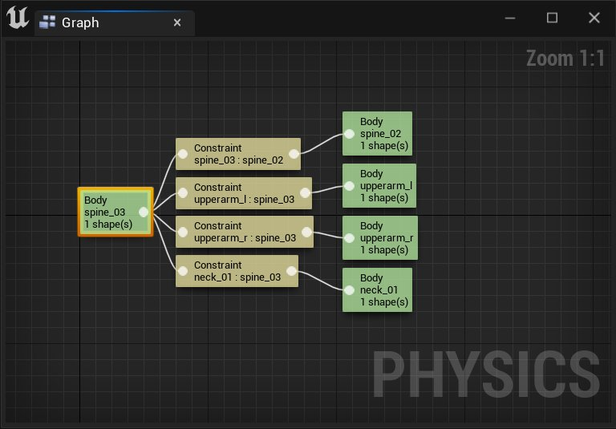
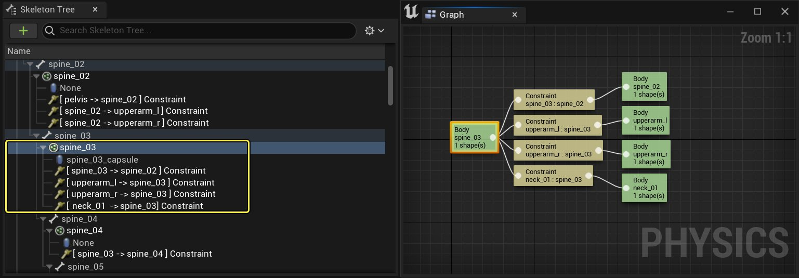
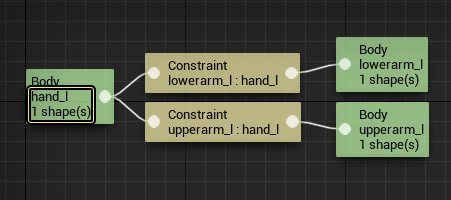
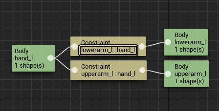
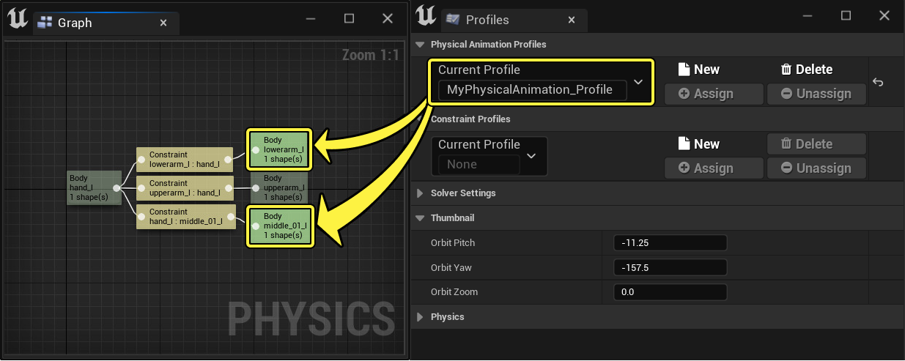
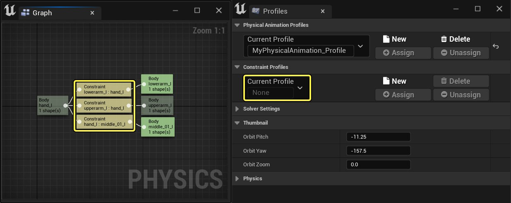

# 物理资产编辑器 - 约束图

> 路径：虚幻引擎5.7文档 / Gameplay系统 / 物理 / 物理资产编辑器 / 物理资产编辑器界面 / 物理资产编辑器 - 约束图

> 原始页面：https://dev.epicgames.com/documentation/unreal-engine/physics-asset-editor-in-unreal-engine---constraints-graph

**约束图** 显示物理资产中所选形体间的约束的连接。在其中，你可以执行以下操作：

- 选择并查看骨骼层级中的形体和约束。
- 使用

  右击快捷菜单

  创建和编辑形体和约束。
- 使用引脚拖动选项创建约束连接。
- 为物理动画和约束指定/取消指定配置文件。

## 约束图中显示的骨骼层级选项

当在[骨架树](../physics-asset-editor-in-unreal-engine---skeleton-tree/index.md)中选中形体或约束时，约束图中会显示当前选中的形体或约束及其连接。

在骨架树中选中了形体"spine_03"，约束图中显示了它们连接到的约束和形体。

### 形体

选中[形体](../../../physics-bodies/index.md)时，约束图中会显示以下信息：

- 骨骼名称
- 使用的基本形状的数量

在本示例中，骨骼名称是 **hand_l**，只有一个基本形状。

> [!NOTE]
> 你可以双击最右端的任何形体节点，从而在层级列表中移动到该形体及其约束。

#### 约束图引脚拖动连接

约束图中基于节点的显示方法使你能够从主形体（最左端 **hand_l**）的输出引脚拖出引线并使用选择菜单来选择形体以创建约束。 也可以通过[骨架树](../physics-asset-editor-in-unreal-engine---skeleton-tree/index.md#%E9%80%89%E6%8B%A9%E5%BF%AB%E6%8D%B7%E8%8F%9C%E5%8D%95)中的右击情境菜单来实现相同的工作流。

| The node-based display in the graph enables you to drag from the output pin of the main Body and use the selection menu to select a body to create a constraint | The resulting Constraint |
| --- | --- |
| 从形体输出引脚拖出引线并从列表中选择一个形体。 | 产生的约束。 |

> [!NOTE]
> 如果在创建或删除约束后约束图没有更新，请单击其他地方，然后再回到原处以查看更新。

### 约束

选中[约束](../../../physics-constraints/physics-constraint-reference/index.md)时，约束图中会显示以下信息：

- 连接的骨骼名称

在本示例中，名称为 **lowerarm_l** 的骨骼约束到了 **hand_l**。

## 配置文件指定

在约束图中，你将能够查看为选中的形体和约束指定的[配置文件](../physics-asset-editor-in-unreal-engine---tools-a-3b3e9bbb/index.md#%E5%BD%93%E5%89%8D%E9%85%8D%E7%BD%AE%E6%96%87%E4%BB%B6%E6%8C%87%E5%AE%9A)。

可以创建和指定两种类型的配置文件：可指定给形体的 **物理动画** 配置文件和可指定给约束的约束配置文件。配置文件包含一系列形体和约束属性的默认值。如果在 **配置文件（Profiles）** 选项卡中设置了 **当前配置文件（Current Profile）**，约束图中的节点会指示显示的形体和约束的配置文件指定状态。

节点可处于两种状态中（通过其颜色指示）：

- 指定了

  配置文件
- 未指定

  配置文件或未选择

如果将 **当前配置文件（Current Profile）** 指定给选中的形体或约束，或未选择配置文件，会使用节点填充颜色（形体为绿色，约束为米黄色）。如果所选形体或约束未指定到当前配置文件（Current Profile）未指定，节点将会变暗。

在本示例中，为形体 **lowerarm_l** 和 **middle_01_l** 指定了配置文件 **MyPhysicalAnimation_Profile**， 但没有为其余的形体节点指定该特定配置文件，从其颜色为深色可以看出来。

对于约束，由于其"当前配置文件（Current Profile）"设置为 **None**，在任何选中的约束指定所选配置文件前，填充颜色不会变暗。

> [!NOTE]
> 有关使用配置文件和将它们指定给形体和约束的更多信息，请参阅[工具（Tools）和配置文件（Profiles）](../physics-asset-editor-in-unreal-engine---tools-a-3b3e9bbb/index.md#%E5%BD%93%E5%89%8D%E9%85%8D%E7%BD%AE%E6%96%87%E4%BB%B6%E6%8C%87%E5%AE%9A)页面。
