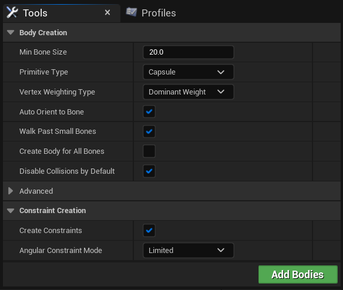
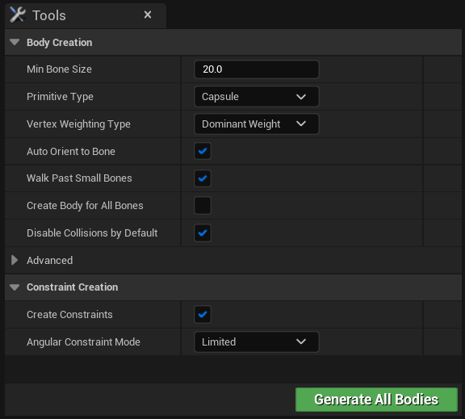
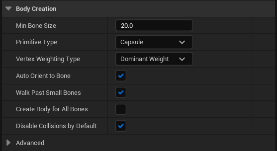
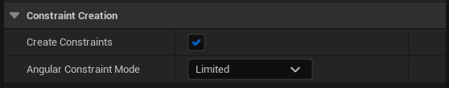
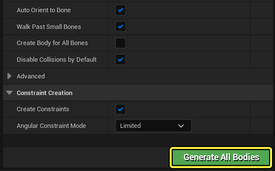
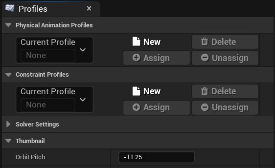
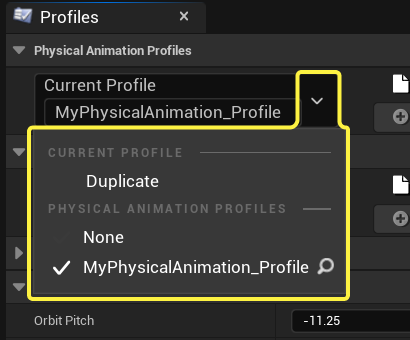

# 物理资产编辑器：工具与配置文件

> 路径：虚幻引擎5.7文档 / Gameplay系统 / 物理 / 物理资产编辑器 / 物理资产编辑器界面 / 物理资产编辑器：工具与配置文件

> 原始页面：https://dev.epicgames.com/documentation/unreal-engine/physics-asset-editor-in-unreal-engine---tools-and-profiles

**工具（Tools）** 和 **配置文件（Profiles）** 选项卡使你能够选择[形体](../../../physics-bodies/index.md)生成方式和 为指定的形体和约束的默认属性设置自定义配置文件。

## 工具选项卡

**工具（Tools）** 选项卡使你能够对物理资产进行批量编辑。 包括为整个骨架或[骨架树](../physics-asset-editor-in-unreal-engine---skeleton-tree/index.md)中的所选形体添加、生成或重新生成形体。

### 形体创建设置

为形体创建或编辑基本形状、大小和执行更多操作时的可用选项如下：

| 属性 | 说明 |
| --- | --- |
| **最小骨骼尺寸（Min Bone Size）** | 创建形体时，短于该值的骨骼将被忽略。 |
| **图元类型（Primitive Type）** | 创建形体时应使用的几何体类型。 盒体 胶囊体 球体 锥形胶囊体（仅限布料） 单个凸包 多个凸包 |
| **顶点加权类型（Vertex Weighting Type）** | 针对形体估算顶点时顶点映射到骨骼的方式。 任意加权 最高权 |
| **自动定向到骨骼（Auto Orient to Bone）** | 是否自动调整已创建形体的方向使其朝向相应的骨骼。 |
| **跳过较小的骨骼（Walk Past Small Bones）** | 是否完全跳过较小的骨骼（而非将它们与相邻的骨骼合并）。 |
| **为所有骨骼创建形体（Create Body for All Bones）** | 强制为每个骨骼创建形体。 |
| **默认禁用碰撞（Disable Collisions by Default）** | 是否在创建后禁用形体与其他形体的碰撞。 |
| 高级属性 |  |
| **最小焊接尺寸（Min Weld Size）** | 小于该值的骨骼将会被合并起来以进行形体创建。 |
| **外壳精度（Hull Accuracy）** | 创建凸包时，所创建凸包的目标精确度。 |
| **最大外壳顶点数（Max Hull Verts）** | 创建凸包时，应创建的最大顶点数。 |

### 约束创建设置

创建或编辑形体的约束时的可用选项如下：

| 属性 | 说明 |
| --- | --- |
| **创建关节（Create Joints）** | 是否在相邻的已创建形体间创建约束。 |
| **角度约束模式（Angular Constraint Mode）** | 要在形体间创建的角度约束的类型。 **自由（Free）**：对该轴没有约束。 **受限（Limited）**：沿该轴自由度受限。 **锁定（Locked）**：该轴完全受约束。 |

#### 形体生成选项

为 **形体创建（Body Creation）** 和 **约束创建（Constraint Creation）** 类别设置好属性后， 任何选中的形体、约束或骨骼都将显示添加、生成或重新生成形体的操作。

| 按钮 |  |
| --- | --- |
| ![All physics bodies and constraints will be re-created] (all-bodies.png) | 所有物理形体和约束都将重新创建。 |
| This button will enable all bodies and constraints to be recreated using the new settings | 选择约束后，通过此按钮可以使用新设置重新创建所有形体和约束。 |
| Selected bodies will be replaced along with their constraints using the new settings | 选定形体及其约束将使用新设置加以替换。 |

## 配置文件选项卡

物理资产 **配置文件（Profiles）** 选项卡使你能够查看、选择和编辑 **物理动画** 和 **约束** 的一系列设置，这些设置可以保存到配置文件中， 然后指定给[骨架树](../physics-asset-editor-in-unreal-engine---skeleton-tree/index.md)中的选中形体或约束。

> [!NOTE]
> 要了解更多信息，请参阅[为形体和约束使用配置文件](../../physics-asset-editor-tutorial-directory/using-profiles-for-bodies-and-constraints/index.md)页面。

### 当前配置文件

在 **当前配置文件（Current Profile）** 下拉菜单中你可以查找任何已创建的新配置文件或现有配置文件。 选择好配置文件后，从配置文件列表中将其删除和为选中的形体或约束指定或取消指定配置文件的选项都将变为可用状态。

| 选项 | 说明 |
| --- | --- |
| **新建（New）** | 创建属性已设置并且能够指定给形体或约束的新配置文件。 |
| **删除（Delete）** | 删除已设置为 **当前配置文件（Current Profile）** 选择的自定义配置文件。 |
| **指定（Assign）** | 将选中形体或约束指定给 **当前配置文件（Current Profile）** 选择。 |
| **取消指定（Unassign）** | 从 **当前配置文件（Current Profile）** 选择将选中形体或约束取消指定。 |

可通过单击 **箭头** 下拉菜单来使用部分当前配置文件（Current Profile）选项。

| 选项 | 说明 |
| --- | --- |
| **复制（Duplicate）** | 复制当前设置的配置文件。 |
| **设置当前约束配置文件（Set Current Constraint Profile）** | 从当前已创建的配置文件中选择要用作"当前配置文件（Current Profile）"以指定、取消指定或删除的配置文件。 |

#### 当前配置文件指定

为形体或约束指定配置文件后，你可以在几个地方查看指定的状态：

- 从"细节（Details）"面板
- 从

  约束图

在 **细节（Details）** 面板中，为选中形体使用的 **当前配置文件（Current Profile）** 将会被列示出来。当未指定配置文件时，"当前配置文件（Current Profile）"处将列示 **None**。

> 图片已省略：Current Profile Assignment

|  |  |
| --- | --- |
| Unassigned Profile | Assigned Profile |
| 未指定配置文件 | 已指定配置文件 |

在[约束图](../physics-asset-editor-in-unreal-engine---constra-2e690f0f/index.md)中，将显示选中的形体及其约束。 形体和约束的着色取决于被选中作为 **当前配置文件（Current Profile）** 的配置文件。

> 图片已省略：The shading of the bodies and constraints will be based on which profile is selected as the Current Profile

例如，约束图中显示了选中的形体和约束，"配置文件（Profiles）"选项卡显示了物理动画的"当前配置文件（Current Profile）"设置为 **MyPhysicalAnimation_Profile**，该配置文件指定给了约束图的四个形体中的两个形体。 当将选择的"当前配置文件（Current Profile）"指定给节点时，节点的填充颜色为浅色，当未将该配置文件指定给节点时，它将显示为深色。 显示的约束都使用了填充颜色，因为约束的"当前配置文件（Current Profile）"设置为了 **None**。

> [!NOTE]
> 有关约束图中的节点的更多信息，请参阅[约束图](../physics-asset-editor-in-unreal-engine---constra-2e690f0f/index.md)页面。

#### 物理动画配置文件

当选中了形体并指定了"物理动画（Physical Animation）"配置文件时，以下选项将变为可用状态：

> 图片已省略：Physical Animation Profiles

| 属性 | 说明 |
| --- | --- |
| **是局部模拟（Is Local Simulation）** | 驱动目标是全局空间还是局部空间。 |
| **方向强度（Orientation Strength）** | 用于更正方向误差的力。 |
| **角速度强度（Angular Velocity Strength）** | 用于更正角速度误差的力。 |
| **位置强度（Position Strength）** | 用于更正线性位置误差的力。仅可用于非局部模拟。 |
| **速度强度（Velocity Strength）** | 用于更正线性速度的力。仅可用于非局部模拟。 |
| **最大线性力（Max Linear Force）** | 用于更正线性误差的最大力。 |
| **最大角向力（Max Angular Force）** | 用于更正角度误差的最大力。 |

#### 约束配置文件

当选中了约束并指定了"约束配置文件（Constraints Profile）"时，以下选项将变为可用状态：

> 图片已省略：undefined

单击图片可查看大图。

> [!NOTE]
> 有关更多信息，请访问[约束参考](../../../physics-constraints/physics-constraint-reference/index.md)页面。

### 缩略图

控制物理资产的缩略图像在 **内容浏览器（Content Browser）** 中的显示方式。你可以控制缩略图的Pitch、Yaw和缩放。

> 图片已省略：Control how the thumbnail image for the Physics Asset should appear in the Content Drawer

当调整缩略图Pitch、Yaw和缩放数值时，在 **内容浏览器（Content Browser）** 中缩略图会实时更新。

> 图片已省略：When the Thumbnail pitch yaw and zoom values are adjusted the thumbnail in the Content Drawer will update in real time

### 物理

以下选项将变为可用状态并将应用到所有已指定的配置文件。

> 图片已省略：The following options are available that will apply to all assigned profiles

| 属性 | 说明 |
| --- | --- |
| **不适用于专用服务器（Not for Dedicated Server）** | 如为true，则跳过专用服务器上PhysicsAsset的形体实例化。 |
