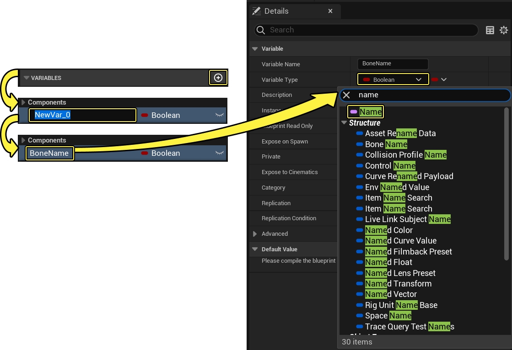
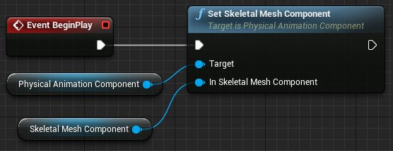

# 应用物理动画配置文件

> 路径：虚幻引擎5.7文档 / Gameplay系统 / 物理 / 物理资产编辑器 / 物理资产编辑器教程 / 应用物理动画配置文件

> 原始页面：https://dev.epicgames.com/documentation/unreal-engine/applying-a-physical-animation-profile-in-unreal-engine

下面介绍了创建简单图以在 **Pawn** 的 **骨架网格体组件** 上启用 **物理动画配置文件** 的步骤。

## 步骤

1. 打开或创建带有

   骨架网格体组件

   的蓝图。

   - 或者，如果你的蓝图不包含

     骨架网格体组件

     ，请使用

     组件面板

     添加一个。

   
2. 调整

   骨架网格体组件

   碰撞设置。

   - 需要更改 **碰撞预设（Collision Preset）**，以便 **骨架网格体组件** **启用碰撞**，但不会与Pawn互动：

     

     > [!NOTE]
     > 在我们的示例中，你会注意到 **对象类型（Object Type）** 设置为 **Pawn**，并且我们在碰撞通道中忽略了 **Pawn**。这就解决了 **骨架网格体** 试图从碰撞胶囊体 中弹出自己的问题。但是，如果你希望 **骨架网格体** 与其他 **Pawn** 碰撞，将需要调整 **骨架网格体** 的 **对象类型**，然后更改 **胶囊体** 与该 **对象类型** 的互动方式。请参见：**[为项目添加自定义物体类型](../../../collision/collision-tutorials/add-a-custom-object-type-to-your-project/index.md)** 以了解有关创建 **自定义碰撞通道** 的更多信息。
3. 使用 **组件面板** 向蓝图添加 **物理动画组件**。

   
4. 添加名称变量并将其命名为 **骨骼名称（Bone Name）**。

   
5. 进行编译，以便设置 **骨骼名称（Bone Name）** 变量的值。

   
6. 将 **骨骼名称（Bone Name）** 的默认值设置为所需目标 **骨骼**，在本例中为`spine_01`。

   
7. 切换到

   事件图表

   。
8. 找到或创建 **事件开始播放（Event BeginPlay）** 事件节点。

   
9. 为你的 **骨架网格体组件** 添加一个引用。
10. 添加一个

    设置骨架网格体组件（Set Skeletal Mesh Component）

    节点，连上

    开始播放事件（Event Begin Play）

    。

    - "目标（Target）"是你在上面添加的

      物理动画组件（Physical Animation Component）

      。
    - 骨架网格体组件

      可以是蓝图中的那个，或者是你在上面添加的那个。

    
11. 添加与

    设置骨架网格体组件（Set Skeletal Mesh Component）

    节点相连的

    应用下面的物理动画配置文件（Apply Physcial Animation Profile Below）

    节点。

    - 目标（Target）

      是

      物理动画组件（Physical Animation Component）

      。
    - 形体名称（Body Name）

      将以

      骨骼名称（Bone Name）

      变量为输入。在"物理资源（Physics Assets）"中，物理形体将根据骨骼命名。
    - 配置文件名称（Profile Name）

      是你想应用给

      骨架网格体

      的

      物理动画配置文件

      。
    - 由于我们使用`spine_01'作为所需骨骼，因此只有上半身有动画，应该选中

      包含自身（Include Self）

      。
    - 清除未找到项（Clear Not Found）

      是可选的，但我们将它设置为

      True

      来清除未在配置文件中找到的任何骨骼。

    > 图片已省略：Add a Apply Physical Animation Profile Below node connecting to the Set Skeletal Mesh Component node
12. 将

    在模拟物理下设置所有形体（Set All Bodies Below Simulate Physics）

    节点连到

    应用下面的物理动画配置文件（Apply Physcial Animation Profile Below）

    节点。这是最后一个步骤。

    - 目标（Target）

      是你的

      骨架网格体组件

      。
    - 在骨骼名称中（In Bone Name）

      以

      骨骼名称（Bone Name）

      为输入变量。
    - 新模拟（New Simulate）

      应设置为

      True

      。
    - 同样，由于我们使用

      spine_01

      作为目标骨骼，因此应启用

      包含自身（Include Self）

      。

    **隐藏图信息**

    | 变量 | 值 | 说明 |
    | --- | --- | --- |
    | **骨骼名称（Bone Name）** | `spine_01` | 骨架网格体中要开始应用物理动画配置文件的 **骨骼**。我们还会在 "在模拟物理下设置所有形体（Set All Bodies Below Simulate Physics）" 中使用它。 |

    | 组件 | 说明 |  |
    | --- | --- | --- |
    | **物理动画组件（Physical Animation Component）** |  | 这是实际负责处理 **骨架网格体** 物理动画的组件。 |
    | **骨架网格体组件（Skeletal Mesh Component）** |  | 将使用配置文件进行物理动画的组件。如果用的是继承自 **角色（Character）** 的现有蓝图，它会被命名为`网格体（Mesh）`。 |

## 结果

完成后，**骨架网格体组件** 将使用 **物理动画组件** 在运行时模拟物理。

> 图片已省略：Your Skeletal Mesh Component will be simulating physics using the Physical Animation Component while in runtime

## 其他资源
