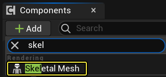
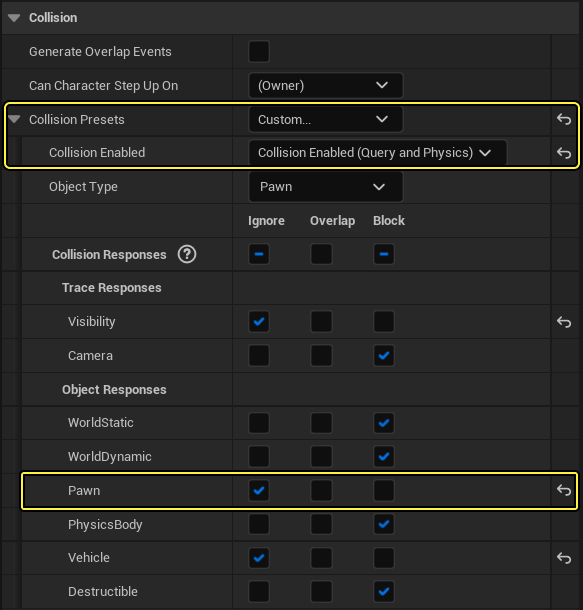
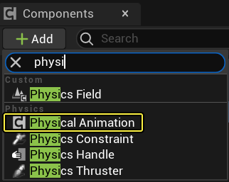
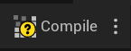
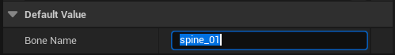
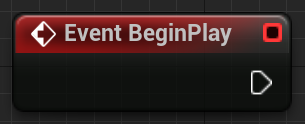
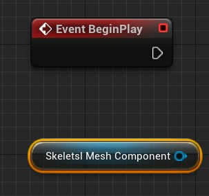
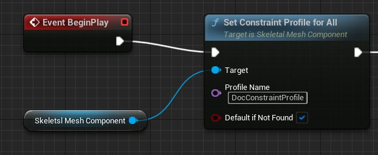

# 应用物理约束配置文件

> 路径：虚幻引擎5.7文档 / Gameplay系统 / 物理 / 物理资产编辑器 / 物理资产编辑器教程 / 应用物理约束配置文件

> 原始页面：https://dev.epicgames.com/documentation/unreal-engine/applying-a-physics-constraint-profile-in-unreal-engine

下面介绍了创建简单图以在 **Pawn** 的 **骨架网格体组件** 上启用 **约束配置文件** 的步骤。

## 步骤

1. 打开或创建带有

   骨架网格体组件

   的蓝图。

   - 如果你的蓝图不包含

     骨架网格体组件

     ，请使用

     组件面板

     添加一个。

   
2. 调整

   骨架网格体组件

   碰撞设置。

   - 需要更改 **碰撞预设（Collision Preset）**，以便 **骨架网格体组件** **启用碰撞**，如果 **Pawn** 胶囊体（或其他几何结构）存在，确保碰撞设置兼容。例如，对于 **Pawn** 胶囊体，确保忽略 **Pawn** 碰撞：

     

     > [!NOTE]
     > 在我们的示例中，你会注意到 **对象类型（Object Type）** 设置为 **Pawn**，并且我们在碰撞通道中忽略了 **Pawn**。这就解决了 **骨架网格体** 试图从碰撞胶囊体 中弹出自己的问题。但是，如果你希望骨架网格体与其他Pawn碰撞，将需要调整骨架网格体的对象类型，然后更改 **胶囊体** 与该 **对象类型** 的互动方式。请参见：**[为项目添加自定义物体类型](../../../collision/collision-tutorials/add-a-custom-object-type-to-your-project/index.md)** 以了解有关创建 **自定义碰撞通道** 的更多信息。
3. 使用 **组件面板** 向蓝图添加 **物理动画组件**。

   
4. 添加一个 **名称** 变量并将其命名为 **骨骼名称（Bone Name）**。
5. 进行编译，以便设置 **骨骼名称（Bone Name）** 变量的值。

   
6. 将 **骨骼名称（Bone Name）** 的默认值设置为所需目标 **骨骼**，在本例中为`spine_01`。

   
7. 切换到

   事件图表

   。
8. 找到或创建 **事件开始播放（Event BeginPlay）** 事件节点。

   
9. 添加对 **骨架网格体组件** 的引用。

   
10. 添加一个

    全局设置约束配置文件（Set Constraint Profile for All）

    节点。

    - 目标（Target）

      是你的

      骨架网格体组件

      。
    - 配置文件名称（Profile Name）

      是你在

      物理资源工具（Physics Asset Tool）

      中已经创建（或将要创建）的

      约束配置文件（Constraint Profile）

      。
    - 找不到则默认（Default if Not Found）

      是一个可选项，如果启用了，则假如配置文件中不存在某个骨骼，将保持当前设置。

    
11. 添加一个

    在模拟物理下设置所有形体（Set All Bodies Below Simulate Physics）

    节点，将它连接到

    应用下面的物理动画配置文件（Apply Physcial Animation Profile Below）

    节点。

    - 目标（Target）

      是你的

      骨架网格体组件

      。
    - 在骨骼名称中（In Bone Name）

      将以

      骨骼名称（Bone Name）

      变量为输入。
    - 新模拟（New Simulate）

      应设置为

      True

      。
    - 同样，由于我们使用

      spine_01

      作为目标骨骼，因此应选中

      包含自身（Include Self）

      。
12. 蓝图最终效果：

    **隐藏图信息**

    | 变量 | 值 | 说明 |
    | --- | --- | --- |
    | **骨骼名称（Bone Name）** | `spine_01` | **在模拟物理下设置所有形体（Set All Bodies Below Simulate Physics）** 用它来定义骨架网格体正在模拟的是哪个部位。 |

    | 组件 | 说明 |  |
    | --- | --- | --- |
    | **骨架网格体组件（Skeletal Mesh Component）** |  | 作为 **约束配置文件** 应用目标的 **骨架网格体组件**。假如你所用的蓝图继承自角色类，则该组件就会被命名为`网格体（Mesh）`。 |

## 结果

现在，在运行游戏时，**约束配置文件** 将发挥作用。根据设置，这可能表示角色会四分五裂，或者加入马达以使手臂甩出去进行攻击。

> 图片已省略：Result

要实现这种效果，可以将上臂约束的 **线性限制（Linear Limits）** 设置为 **自由（Free）**。

> 图片已省略：This effect was achieved by setting the Linear Limits on the upper arm constraints to Free

## 其他资源
